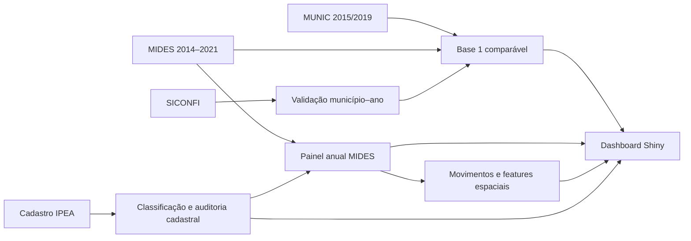

# Consórcios MG: Dados e Território

[](https://www.r-project.org/)
[](https://shiny.posit.co/)
[](#estado-atual)
[](https://kl5ug0-adriano-pires.shinyapps.io/base1-mides-munic-siconfi/)

Projeto de pesquisa para organizar, auditar e analisar evidências sobre consórcios intermunicipais em Minas Gerais. O repositório combina dados declaratórios, fiscais e cadastrais em painéis reproduzíveis, documenta as decisões metodológicas e disponibiliza um dashboard para exploração dos resultados.

> **Escopo institucional:** este é um projeto de pesquisa em desenvolvimento. O conteúdo do repositório não deve ser interpretado como posição ou produto institucional oficial do IPEA.

## Acesso rápido

| Recurso | Link |
|---|---|
| Dashboard publicado | [Abrir aplicação](https://kl5ug0-adriano-pires.shinyapps.io/base1-mides-munic-siconfi/) |
| Estado consolidado | [`docs/MEMORIA_ideiaMides.md`](docs/MEMORIA_ideiaMides.md) |
| Próximas decisões | [`docs/PROXIMOS_PASSOS.md`](docs/PROXIMOS_PASSOS.md) |
| Metodologia da Base 1 | [`analises/base_1_2015_2019/METODOLOGIA.md`](analises/base_1_2015_2019/METODOLOGIA.md) |
| Movimentos espaciais | [`analises/movimentos_espaciais/README.md`](analises/movimentos_espaciais/README.md) |
| Classificação de políticas | [`docs/METODOLOGIA_CLASSIFICACAO_ATUAL.md`](docs/METODOLOGIA_CLASSIFICACAO_ATUAL.md) |
| Diário técnico | [`docs/DIARIO_DE_TRABALHO.md`](docs/DIARIO_DE_TRABALHO.md) |

## Finalidade

O projeto foi estruturado para responder quatro perguntas principais:

1. Quais pares `município × consórcio` aparecem em cada fonte e em quais anos?
2. Quanto as fontes MIDES e MUNIC convergem no recorte comparável de 2015 e 2019?
3. Quais entradas, retornos, permanências e saídas de pagamentos são observadas no MIDES entre 2014 e 2021?
4. A vizinhança territorial está associada à probabilidade de entrada ou saída observada?

## Fontes e papel analítico

| Fonte | Papel no projeto | Limite central |
|---|---|---|
| **MIDES** | Pagamentos observados por município, CNPJ de consórcio e ano | Pagamento não prova adesão jurídica |
| **MUNIC/IBGE** | Vínculos declarados e setores em 2015 e 2019 | Não oferece série anual completa |
| **SICONFI/STN** | Validação financeira agregada por município e ano | Não identifica o CNPJ destinatário |
| **Cadastro IPEA** | Universo cadastral, nomes, situação e evidências setoriais | Exige auditoria de duplicidades e filiais |
| **CNM** | Evidência complementar no painel universal histórico | Não integra a Base 1 comparável |

## Estado atual

O piloto cobre os **853 municípios de Minas Gerais** e contém:

- **2.835 pares** município–CNPJ observados no MIDES completo;
- **22.680 linhas** no painel anual balanceado de 2014 a 2021;
- **161 CNPJs** observados na consulta MIDES completa;
- **2.375 fronteiras municipais** compartilhadas na malha geográfica usada nas features espaciais;
- classificação v0.5 por área de política pública, macrogrupo e perfil institucional;
- modelos exploratórios de entrada e saída com exposição espacial em `t-1`;
- mapas interativos, exportação cartográfica e trajetória longitudinal por consórcio.

### Produtos

| Produto | Unidade | Conteúdo |
|---|---|---|
| **Painel universal MG v2** | município × consórcio | Integração histórica de MIDES, MUNIC, SICONFI e CNM |
| **Base 1 – 2015/2019** | município × consórcio × ano | Comparação MIDES–MUNIC com validação SICONFI |
| **MIDES completo** | município × CNPJ × ano | Pagamentos, movimentos, recorrência e trajetória 2014–2021 |
| **Camada espacial** | município × CNPJ × ano | Vizinhança, borda, isolamento e universos de risco |
| **Dashboard Shiny** | consulta interativa | Tabelas, filtros, mapas, auditorias e documentação |

## Arquitetura



```text
consorcios-mg-dados-territorio/
|-- analises/
|   |-- base_1_2015_2019/        # Recorte comparável e validação SICONFI
|   |-- classificacao_politicas/ # Taxonomia, auditorias e decisões versionadas
|   `-- movimentos_espaciais/    # Painel anual, vizinhança e modelos de risco
|-- dashboards/base1_shiny/      # Aplicação, documentação incorporada e testes
|-- docs/                         # Memória, atas, diário e decisões metodológicas
|-- scripts/                      # Pipeline histórico do painel universal MG
`-- slides/                       # Fontes das apresentações e visualizações
```

Detalhes: [`docs/ESTRUTURA_REPOSITORIO.md`](docs/ESTRUTURA_REPOSITORIO.md).

## Dashboard

O dashboard reúne seis áreas:

- visão executiva do projeto;
- recorte comparável MIDES–MUNIC de 2015/2019;
- MIDES completo de 2014–2021;
- comparação territorial entre 2015 e 2019;
- auditoria cadastral de CNPJs e nomes;
- documentação metodológica incorporada.

Na tela MIDES completo, a trajetória longitudinal apresenta os oito anos por consórcio e carrega sob demanda a tabela anual e a matriz `município × ano`.

## Execução local

### Pré-requisitos

- R 4.3 ou superior;
- pacotes `shiny`, `bslib`, `DT`, `dplyr`, `readr`, `stringr`, `scales`, `ggplot2`, `ggiraph`, `sf` e `classInt`;
- arquivos locais em `dashboards/base1_shiny/data/` ou nos caminhos de processamento esperados pelo app.

As bases pesadas não são distribuídas pelo Git. Sem esses arquivos, os scripts e o dashboard não são integralmente executáveis.

```r
source("dashboards/base1_shiny/start_app.R")
```

### Testes principais

```powershell
Rscript dashboards/base1_shiny/tests/test_classificacao_v0_5.R
Rscript dashboards/base1_shiny/tests/test_movimentos_mapas_export.R
Rscript dashboards/base1_shiny/tests/test_trajetoria_longitudinal.R

Push-Location dashboards/base1_shiny
Rscript tests/test_documentacao_movimentos.R
Pop-Location
```

## Regras metodológicas essenciais

- Presença no MIDES significa **pagamento positivo observado**, não filiação jurídica.
- Entrada e saída representam mudança de presença financeira entre anos consecutivos.
- O SICONFI valida o total municipal anual; ele não identifica o consórcio de destino.
- CNPJ matriz e filiais continuam separados em valores e movimentos até decisão metodológica formal.
- Os modelos espaciais atuais são associativos e exploratórios, não causais.
- Toda inferência setorial deve preservar fonte, regra, status e justificativa.

## Dados e versionamento

O Git contém código, documentação, testes e pequenos insumos decisórios. Dados brutos, RDS/CSV derivados, planilhas de saída, logs e bundles de deploy permanecem fora do histórico por tamanho, sensibilidade e custo de reprodução.

Consulte [`CONTRIBUTING.md`](CONTRIBUTING.md) antes de alterar código ou metodologia.

## Limitações e decisões pendentes

- consolidar ou não matriz e filiais pela raiz do CNPJ;
- ampliar os modelos com controles municipais, fiscais, políticos e setoriais;
- incorporar o primeiro recorte territorial externo, com prioridade para regiões de saúde;
- definir ambiente reprodutível de dependências, por exemplo com `renv`;
- definir formalmente o licenciamento do código e da documentação.

## Autoria e contexto

Desenvolvimento e organização: **Adriano Pires**, no contexto de pesquisa sobre consórcios intermunicipais. Referências institucionais e fontes oficiais permanecem identificadas nas metodologias específicas.
