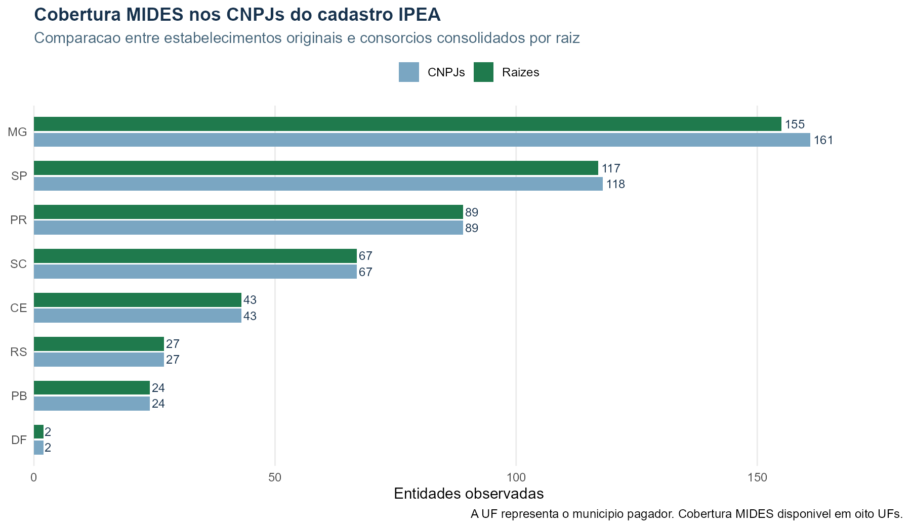

# Validacao Da Base Nacional Consolidada v0.1

**Data da extracao:** 20/08/2026
**Escopo:** cadastro IPEA nacional e pagamentos MIDES correspondentes
**Situacao:** aprovada nos testes automatizados; aguardando validacao substantiva da equipe

## Resultado Executivo

| Verificacao | Resultado |
|---|---:|
| CNPJs no cadastro IPEA | 1.194 |
| Entidades apos consolidar matriz e filiais | 1.159 |
| Raizes com filiais | 23 |
| Filiais incorporadas | 35 |
| UFs pagadoras encontradas no MIDES | 8 |
| Transacoes MIDES baixadas | 1.300.862 |
| CNPJs observados no MIDES | 512 |
| Raizes observadas no MIDES | 505 |
| Pares municipio-consorcio, antes | 7.587 |
| Pares municipio-consorcio, depois | 7.560 |
| Linhas anuais, antes | 40.535 |
| Linhas anuais, depois | 40.486 |
| Colisoes matriz-filial somadas no mesmo municipio-ano | 49 |
| Valor municipal preservado | R$ 15.168.694.503,38 |

O valor total e o numero de transacoes foram preservados. A reducao de linhas
representa apenas a unificacao de estabelecimentos pertencentes a mesma raiz,
e nao exclusao de pagamentos.

## Exemplo Real De Consolidacao

Para a raiz `00079634`, do Consorcio Intermunicipal de Saude dos Municipios da
Microrregiao do Alto Rio Grande, o municipio `3111903` registrou em 2014
pagamentos para dois estabelecimentos:

```text
00079634000181 (matriz) + 00079634000262 (filial)
                         = R$ 59.250,00 na entidade canonica 00079634000181
```

Os dois CNPJs continuam registrados em `cnpjs_originais_observados`. A nova
linha apenas impede que matriz e filial sejam tratadas como dois consorcios.

## Raizes Efetivamente Afetadas No MIDES

Seis entidades tiveram mais de um estabelecimento observado nos pagamentos:

| Raiz | Entidade canonica | UF sede | CNPJs observados |
|---|---|---:|---:|
| `05802877` | ICISMEP / CISMEP | MG | 2 |
| `01203485` | ACISPES | MG | 2 |
| `01014332` | CIS/EVMJ | MG | 2 |
| `04903422` | CIVAP/SAUDE | SP | 2 |
| `00079634` | Alto Rio Grande | MG | 2 |
| `64486822` | Alto Sao Francisco | MG | 3 |

## Excecao Territorial Preservada

Foram encontradas 681 transacoes de Santa Catarina sem `id_municipio`, no valor
de R$ 11.145.961,39. Elas nao foram descartadas: permanecem em arquivo separado,
mas nao entram no painel municipal por falta de chave territorial auditavel.

## Testes Executados

- uma e somente uma matriz `0001` em cada raiz;
- nenhuma raiz com estabelecimentos cadastrados em UFs diferentes;
- ausencia de duplicidade nas chaves das camadas original e consolidada;
- conservacao de valores, transacoes e decomposicao financeira;
- correspondencia dos 1.194 CNPJs consultados com o cadastro;
- reproducao exata das 15.135 linhas anuais do painel MG anterior;
- igualdade integral dos valores corrente, restos, total e numero de transacoes
  no recorte mineiro anterior a consolidacao.

## Pontos Para Validacao Humana

1. Confirmar que a raiz de oito digitos e a matriz `0001` devem ser a identidade
   institucional adotada em todos os produtos futuros.
2. Revisar substantivamente as seis entidades afetadas no MIDES, sobretudo os
   aliases e nomes de filiais exibidos no crosswalk.
3. Decidir se os registros catarinenses sem municipio permanecem apenas em
   anexo ou se devem ser investigados na fonte antes da analise nacional.
4. Definir uma janela temporal comparavel, pois as oito UFs possuem periodos
   MIDES diferentes.


