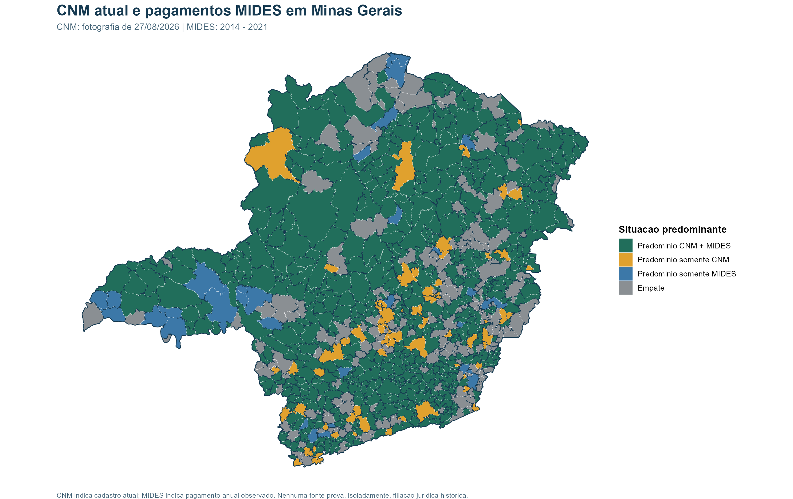
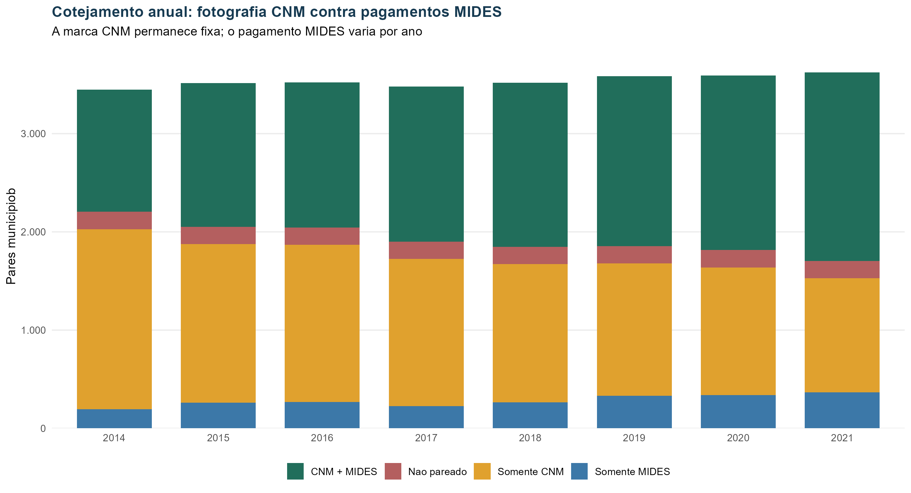

# Atualização CNM e cotejamento com o MIDES

**Data de referência:** 27/08/2026
**Escopo:** atualização da CNM, identidade CNM x cadastro IPEA e piloto CNM x MIDES em Minas Gerais.

## 1. O que foi entregue

1. Nova fotografia integral da plataforma CNM, sem sobrescrever a coleta de maio.
2. Comparação reproduzível entre as fotografias de 14/05 e 27/08.
3. Crosswalk institucional entre CNM e cadastro IPEA por CNPJ.
4. Piloto MG de cotejamento entre composição atual da CNM e pagamentos MIDES de 2014 a 2021.
5. Tabelas, mapa, linha do tempo, relatórios de auditoria e testes automatizados.

Os snapshots brutos ficam em `C:\IPEA\dados cnm\snapshots`. O Git mantém scripts, documentação, checks e produtos analíticos compatíveis com o limite do repositório.

## 2. Atualização da CNM

| Indicador | Maio | Agosto | Diferença |
|---|---:|---:|---:|
| Consórcios | 728 | 727 | -1 |
| Municípios únicos | 4.814 | 4.816 | +2 |
| Vínculos brutos | 13.119 | 13.133 | +14 |
| Pares únicos CNM | 13.095 | 13.109 | +14 |

Principais mudanças observadas:

- **CODEMA/MT** deixou de constar na listagem atual: um consórcio e nove vínculos removidos.
- **CINCATARINA/SC** mudou a denominação e recebeu 21 vínculos novos.
- **CIDS FLORESTA/PR** recebeu dois vínculos novos; as 42 áreas que estavam no JSON de maio passaram a uma lista vazia no JSON atual. A mudança está na resposta da própria plataforma e deve ser validada com a CNM antes de ser interpretada como alteração substantiva.
- Há um CNPJ com dígitos verificadores inválidos: `07.224.277/2000-18`, do Consórcio Intermunicipal de Serviços do Vale do Taquari. O nome aponta para possível erro de digitação, mas nenhuma correção foi aplicada automaticamente.

Auditorias:

| Verificação | Resultado |
|---|---:|
| CNPJs repetidos entre consórcios | 0 |
| CNPJs inválidos | 1 |
| Códigos IBGE municipais inválidos | 0 |
| Chaves de vínculo duplicadas | 24 chaves / 48 linhas |

As 24 duplicidades são repetições idênticas de `UUID do consórcio + código IBGE`; os produtos analíticos preservam o bruto e deduplicam essa chave.

## 3. Identidade CNM x cadastro IPEA

Fluxo:

```text
CNPJ informado pela CNM
        |
        v
padronização para 14 dígitos
        |
        v
comparação exata -> raiz de 8 dígitos -> sugestão nominal auditável
        |
        v
CNPJ canônico do cadastro IPEA
```

| Situação | Consórcios | Percentual | Uso automático |
|---|---:|---:|---|
| CNPJ exato | 655 | 90,1% | Sim |
| Sugestão por nome | 3 | 0,4% | Não |
| Não encontrado | 69 | 9,5% | Não |

Não houve correspondência adicional apenas pela raiz: os casos localizados no cadastro IPEA já coincidiam pelo CNPJ completo. As três sugestões nominais são somente filas de revisão; uma delas produz falso candidato por semelhança textual e confirma por que nome não deve unificar instituições sozinho.

## 4. Piloto CNM x MIDES em Minas Gerais

### Unidade de análise

O produto anual usa `município x identidade canônica do consórcio x ano`. No resumo do período, o ano deixa de fazer parte da chave e os anos com pagamento são listados.

### Regras

| Situação | Regra |
|---|---|
| CNM + MIDES | Vínculo aparece na fotografia CNM de 27/08/2026 e houve pagamento MIDES no ano |
| Somente CNM | Vínculo aparece na fotografia CNM, sem pagamento MIDES no ano |
| Somente MIDES | Houve pagamento no MIDES, mas o vínculo não aparece na fotografia CNM |
| Não pareado | Vínculo CNM cujo consórcio ainda não recebeu identidade IPEA validada |

### Resultados do período

| Situação do par em 2014-2021 | Pares |
|---|---:|
| CNM + MIDES | 2.163 |
| Somente CNM | 914 |
| Somente MIDES | 658 |
| Não pareado | 177 |
| **Total** | **3.912** |

Outros controles:

- 28.283 observações anuais únicas.
- 853 municípios de Minas Gerais.
- 180 identidades de consórcio na união das fontes.
- R$ 3,801 bilhões em pagamentos MIDES conservados após o cotejamento.
- 3.254 pares presentes na fotografia CNM e 2.821 pares com pagamento MIDES em pelo menos um ano.

### Exemplo real: Abaeté x COMASF

| Campo | Resultado |
|---|---|
| Município | Abaeté (`310020`) |
| Consórcio | COMASF |
| CNPJ CNM/canônico | `09.108.857/0001-02` |
| Pareamento institucional | CNPJ exato |
| Fotografia CNM atual | Presente |
| Anos MIDES com pagamento | 2014 a 2021 |
| Valor MIDES no período | aproximadamente R$ 890,8 mil |
| Classificação | CNM + MIDES |

O exemplo confirma simultaneamente cadastro atual e evidência financeira nos oito anos. Ele não prova, sem ata ou cadastro histórico, a data jurídica de entrada de Abaeté no COMASF.

## 5. Leitura dos gráficos

- O mapa colore cada município pela situação mais frequente entre seus pares. Empate significa que duas ou mais situações têm a mesma contagem máxima.
- A linha do tempo mantém a fotografia CNM fixa e varia apenas a evidência anual do MIDES. Ela serve para cotejar fontes, não para reconstruir a composição histórica da CNM.





## 6. Limitações e decisões pendentes

1. A CNM é uma fotografia atual. `data_constituicao` data o consórcio, não cada vínculo municipal.
2. Ausência no MIDES significa ausência de pagamento observado segundo a regra da base, não ausência jurídica do vínculo.
3. Sugestões por nome e os 69 não encontrados exigem revisão ou ampliação do cadastro, sem unificação automática.
4. A mudança de áreas do CIDS FLORESTA precisa de confirmação documental.
5. O piloto deve ser validado em MG antes da expansão aos oito estados cobertos pelo MIDES.

## 7. Validação executada

`tests/testar_produtos.py` verifica contagens dos snapshots, códigos IBGE, duplicidades, cobertura do crosswalk, unicidade das chaves anuais, conservação estrutural, o exemplo Abaeté x COMASF e integridade das imagens. O teste foi executado com sucesso em 27/08/2026.
