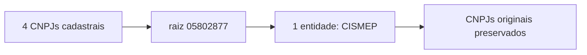
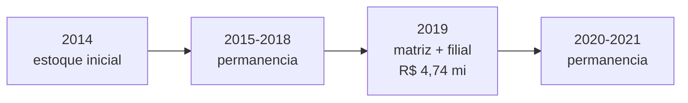
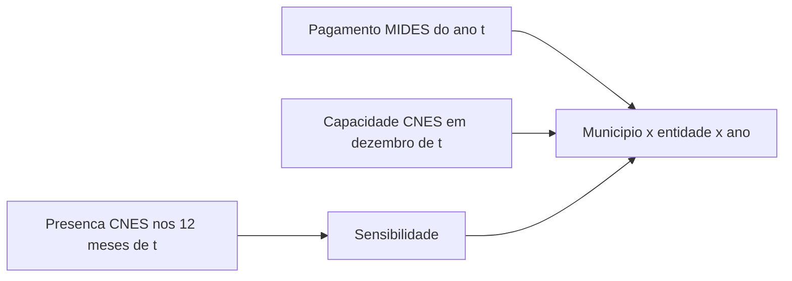

# Linha Do Tempo Dos Passos - Modelo Gravitacional De Saude

> Revisao de 16/09/2026: passo 3 fechado com filtro funcional e decisoes
> documentais. Das 670 unidades atuais, 63 sao clinicas fixas, 20 fixas nao
> clinicas e 587 moveis. As contagens anteriores abaixo descrevem as camadas
> produzidas em cada momento; o proximo marco e o painel final do passo 6.

## Visao Geral

O trabalho avancou da decisao de escopo para uma observacao anual em preparacao
para a EDA final. Cada entrega resolveu uma pergunta necessaria para o modelo.

```mermaid
flowchart LR
  P0["Marco 0<br/>MG + saude + MIDES"] --> P1["1. Quem e saude?<br/>84 entidades"]
  P1 --> P2["2. Que evidencia liga<br/>municipio e entidade?"]
  P2 --> P3["3. Onde esta a oferta?<br/>polo, rede ou ausente"]
  P3 --> P4["4. Qual capacidade<br/>esta registrada?"]
  P4 --> P5["5. Qual a impedancia<br/>rodoviaria?"]
  P5 --> P6["6. O que ocorreu<br/>em cada ano?"]
  P6 --> C3["Complemento do 3<br/>cobertura e alertas"]
  C3 --> C4["Complemento do 4<br/>CNES historico"]
  C4 --> N3["16/09<br/>filtro clinico e decisoes fechados"]
  N3 --> N6["Agora<br/>concluir passo 6"]
  N6 --> N7["Entao<br/>passo 7: EDA final"]
```

## Evolucao Do Projeto

| Passo | Pergunta | Antes | Entrega | Resultado central |
|---:|---|---|---|---|
| Marco 0 | qual fenomeno e recorte estudar? | havia fontes e modelos exploratorios, mas nao uma especificacao gravitacional setorial | reuniao de 27/08/2026 definiu MG, saude, MIDES e tres blocos analiticos | entrada, intensidade e interrupcao serao estudadas separadamente |
| 1 | quais CNPJs representam consorcios de saude? | matriz e filiais podiam contar separadamente | universo por CNPJ original e por raiz | 100 CNPJs em 84 entidades; 66 observadas no MIDES |
| 2 | pagamento e declaracao contam a mesma historia? | MIDES e MUNIC podiam ser lidos como vinculo equivalente | cotejamento e revisao documental | 1.311 pares: 630 comuns, 658 somente MIDES e 23 somente MUNIC |
| 3 | sede administrativa e destino assistencial? | distancia poderia apontar para um escritorio | unidades CNES e decisao de polo/rede | 670 unidades; 21 entidades sem unidade direta |
| 4 | como medir poder de atracao? | leitos eram uma hipotese ainda nao testada | capacidade por unidade e entidade | 82 fixas, 586 moveis e 2 casos pendentes; apenas uma entidade com leitos SUS diretos |
| 5 | como medir a resistencia espacial? | nao havia impedancia integrada | tempo por destino, unidade e entidade | 363.378 pares MG completos; 61 entidades com tempo |
| 6 | como representar a trajetoria anual? | pagamentos, tempo e capacidade estavam separados | grade anual com eventos e defasagens | 573.216 linhas; 426 primeiros pagamentos, 252 retornos e 533 interrupcoes |
| Complemento do 3 | o que realmente existe nos 38 casos pendentes? | falsos negativos, redes moveis e inativos estavam misturados | busca por CNPJ proprio e auditoria documental | 15 recuperados; 23 sem estrutura fixa; 7 alertas decididos |
| Complemento do 4 | a oferta atual existia em 2014-2021? | a fotografia de 2026 era repetida nos oito anos | ST mensal e LT/SR/PF de dezembro | 672 entidades-ano; 1.868 unidades-ano; 120 fontes auditadas |

## Exemplo Real Continuo: Igarape x CISMEP

O caso usa a entidade de raiz `05802877` e o municipio de Igarape
(`id_municipio = 3130101`). Ele foi escolhido porque atravessa as entregas
concluidas ate aqui sem preencher lacunas por inferencia.

### Passo 1 - Da Lista De CNPJs Para Uma Entidade

Antes, os CNPJs poderiam ser tratados como consorcios diferentes. A raiz
`05802877` possui:

- matriz `05802877000110`;
- filiais `05802877000209`, `05802877000381` e `05802877000462`;
- quatro estabelecimentos cadastrais, sendo tres filiais;
- dois CNPJs observados no MIDES: matriz e filial `0002`.

Depois do passo 1, todos continuam auditaveis, mas a unidade analitica passa a
ser uma entidade: **CISMEP**, classificada como saude setorial e incluida no
nucleo principal preliminar. No periodo completo, a raiz aparece com 58
municipios e R$ 1.056.809.423,16 no MIDES.

### Passo 2 - Duas Evidencias Mantidas Separadas

Em 2019, `Igarape x CISMEP` aparece nas duas fontes:

| Evidencia | Resultado |
|---|---|
| MIDES | R$ 4.740.790,51 pagos a matriz e filial `0002` |
| MUNIC | declaracao na area de saude para a matriz |
| Grupo | `MIDES+MUNIC` |

O passo nao transformou pagamento em prova juridica. Ele mostrou que, nesse
ano, ha concordancia entre evidencia financeira e declarada. Como o par nao e
divergente, ele nao precisou entrar na amostra documental dos 50 casos.

### Passo 3 - Sede Nao Virou Hospital Automaticamente

A ancora administrativa do CISMEP e Sao Joaquim de Bicas. A consulta dos CNPJs
no CNES retornou 15 unidades diretamente vinculadas. O resultado nao foi
"hospital da sede", mas **rede vinculada sem polo unico**.

Isso muda a pergunta de distancia. Em vez de calcular apenas
`Igarape -> sede administrativa`, o projeto preserva os destinos assistenciais
diretamente documentados.

### Passo 4 - A Rede Recebe Medidas De Capacidade

A consulta detalhada mostrou:

| Componente atual do CISMEP | Valor |
|---|---:|
| unidades vinculadas | 15 |
| unidades moveis/itinerantes | 11 |
| unidades fixas | 4 |
| municipios com oferta fixa | 4: Betim, Brumadinho, Igarape e Sao Joaquim de Bicas |
| unidades com ambulatorio SUS | 4 |
| unidades com SADT SUS | 4 |
| unidades com internacao SUS | 1 |
| leitos SUS diretos | 32 |
| vinculos medicos SUS ativos | 130 |
| CBOs medicos SUS somados por unidade | 22 |

O CISMEP possui leitos, mas e excecao: somente uma das 61 entidades com oferta
fixa direta registra leitos SUS. Por isso o caso nao autoriza usar leitos como
massa unica para todos os consorcios.

### Passo 5 - O Tempo E Calculado Ate A Rede

Para Igarape, a camada municipio-entidade registra:

| Medida | Resultado |
|---|---:|
| menor tempo ate oferta fixa CISMEP | 0 minuto |
| tempo mediano entre os quatro destinos | 11,75 minutos |
| maior tempo | 25,8 minutos |
| distancia mediana | 12,607 km |
| destino mais proximo | Igarape |

O zero nao significa viagem instantanea de um paciente. Significa que origem e
uma unidade fixa estao no mesmo municipio e a fonte usa sedes municipais como
pontos de referencia. Os outros destinos sao Sao Joaquim de Bicas, Betim e
Brumadinho, o que preserva a amplitude da rede.

### Passo 6 - A Observacao Vira Uma Trajetoria Anual

| Ano | Valor MIDES | CNPJs no ano | Evento |
|---:|---:|---:|---|
| 2014 | R$ 722.807,02 | 1 | estoque inicial de 2014 |
| 2015 | R$ 450.192,57 | 1 | permanencia |
| 2016 | R$ 490.080,31 | 1 | permanencia |
| 2017 | R$ 485.363,10 | 1 | permanencia |
| 2018 | R$ 4.096.281,81 | 1 | permanencia |
| 2019 | R$ 4.740.790,51 | 2 | permanencia; matriz e filial consolidadas |
| 2020 | R$ 5.539.460,17 | 1 | permanencia |
| 2021 | R$ 6.586.529,43 | 1 | permanencia |

O pagamento de 2014 e `estoque_inicial_2014`, nao entrada, porque o inicio real
pode ter ocorrido antes da janela. De 2015 a 2021 o par e classificado como
permanencia financeira. Em 2019 os dois CNPJs sao somados antes de classificar
o movimento, evitando duplicar o par.

### Complemento - As Lacunas Foram Reabertas Sem Inventar Polos

A consulta inicial usava o CNPJ como mantenedor. A API atual do CNES tambem
permite buscar o CNPJ proprio do estabelecimento. A segunda rota mudou casos
reais:

| Caso | Antes | Depois | Consequencia |
|---|---|---|---|
| CISARP | sem unidade direta | clinica CNES 7918747 em Taiobeiras | entra na cobertura fixa atual; a estrutura nao e retroagida automaticamente |
| CONSONORTE | sem unidade direta | clinica CNES 0975397 e dois vacimoveis | tempo da clinica e oferta movel ficam separados |
| CIS/CEN | exclusao atual por mobilidade e ficha sem tipo | CNES historico 7609868 em Guanhaes, 2014-2021 | possui candidato fixo historico; prestadores externos ainda exigem prova anual |
| CIS/UBA | pagamento historico e matriz inapta | nenhuma unidade atual confirmada | permanece no MIDES historico, mas nao como alternativa atual |

Assim, “auditoria concluida” nao significa que todos ganharam um polo. Significa
que cada ausencia recebeu uma leitura rastreavel e que `NA` foi preservado
quando a estrutura nao podia ser localizada com seguranca.

### Complemento Temporal Do Passo 4 - A Oferta Tambem Vira Uma Trajetoria

A fotografia atual do CISMEP tem 15 unidades, sendo quatro fixas e 11 moveis.
Essa estrutura nao foi repetida no passado. O CNES historico mostra:

| Ano | Fixas em dezembro | Fixas em algum mes | Servicos SUS diretos | Profissionais SUS diretos |
|---:|---:|---:|---:|---:|
| 2014 | 2 | 2 | 18 | 106 |
| 2015 | 2 | 2 | 18 | 105 |
| 2016 | 2 | 2 | 17 | 109 |
| 2017 | 2 | 2 | 18 | 126 |
| 2018 | 2 | 2 | 14 | 99 |
| 2019 | 2 | 2 | 15 | 101 |
| 2020 | 2 | 2 | 15 | 116 |
| 2021 | 1 | 2 | 14 | 107 |

Na montagem final, a linha `Igarape x CISMEP x 2019` devera combinar o pagamento
MIDES de 2019 com a capacidade CNES de dezembro de 2019. As camadas ainda
estao separadas; a grade preliminar continua contendo o retrato atual. Em
2021, dezembro mostra uma fixa, enquanto a sensibilidade registra duas em
algum momento do ano; a diferenca permanece visivel em vez de ser imputada.

## O Que O Exemplo Demonstra

1. entidade e raiz de CNPJ, nao uma linha isolada de estabelecimento;
2. MIDES e MUNIC podem concordar, mas continuam evidencias diferentes;
3. sede administrativa, polo e rede nao sao sinonimos;
4. capacidade possui varios componentes e uma trajetoria historica propria;
5. tempo deve respeitar a rede documentada;
6. movimento anual descreve pagamento, nao ato juridico;
7. capacidade de 2026 nao pode ser retroagida para explicar 2014-2021.

## Onde O Exemplo Nao Pode Ser Generalizado

- CISMEP e a unica entidade com leitos SUS diretamente registrados; os 32
  leitos nao representam a cobertura das demais.
- Igarape possui unidade no proprio municipio; muitos pares tem tempo positivo.
- Vinte e uma entidades nao possuem unidade direta e duas permanecem sem fixa confirmada por mobilidade/conflito
  cadastral; elas permanecem com tempo `NA`.
- A camada historica cobre apenas unidades diretamente vinculadas. Prestadores
  indiretos e contratados continuam ausentes quando nao ha identificacao anual.
- Dezembro e a medida principal; presenca em outro mes e sensibilidade, nao
  capacidade imputada para o ano inteiro.
- `MIDES+MUNIC` em 2019 fortalece a evidencia, mas nao fornece sozinho a data
  juridica de entrada.

## Retomada De 10/09/2026

A revisao corrigiu 307 unidades de tipo movel que escapavam pelo nome e
materializou os 91 casos em 28 entidades. Foram registrados 56 tratamentos
anuais para sete prioritarias. CIS/CEN e CIMES ja tinham fixa no CNES
historico em todos os anos: nao pertencem aos 91.

Outro exemplo real explicita a mudanca de oferta: a raiz `64486822` tinha o
CNES `2143674` em Moema, com 26 leitos SUS nos dezembros de 2014, 2015 e 2016.
Em 2017, o vinculo aparece em parte dos meses, mas nao em dezembro. Nos anos
seguintes, nao se atribui esse hospital ao consorcio sem nova evidencia.
Pagamento que continua nao autoriza carregar a mesma capacidade para a frente.

## Fechamento De 16/09/2026

1. As 18 sem MIDES foram comparadas com as 66 observadas: quinze estao hoje
   inativas/inaptas, duas abriram depois de 2021 e uma, CIMESMI, permanece
   ativa sem evidencia assistencial direta suficiente.
2. As 670 unidades receberam filtro funcional: 63 clinicas, 20 estruturas
   fixas de outras funcoes e 587 moveis. A serie historica tem 398 unidades-ano
   clinicas e 74 fixas nao clinicas, alem de 1.396 moveis.
3. A rodada documental cobriu as 21 entidades nao prioritarias. Exemplo:
   CIS-URG Oeste recebeu pagamentos em 2014-2015, mas iniciou SAMU em 2017.
   O pagamento de implantacao nao recebe capacidade operacional posterior.
4. CISREC e CONVALES tiveram o escopo multiárea corroborado; CIMBAJE tambem
   possui evidencia desde 2014. CISPARA ganhou alerta estatutario desde 2017,
   sem concluir que todos os seus pagamentos misturam politicas.
5. Dois mapas mostram sedes cadastrais e unidades por funcao. Sao pontos
   municipais, sem inferir area de cobertura ou trajeto porta a porta.

O passo 3 esta fechado por decisao documentada, inclusive exclusoes. Ainda
existem prestadores e vigencias desconhecidos; eles nao bloqueiam o modelo
restrito a destinos comprovados e permanecem limites da cobertura.

## Proximo Marco

O painel preliminar e as camadas historica e funcional existem separadamente.
O passo 6 deve:

1. ligar destinos clinicos e capacidade de cada ano a matriz rodoviaria;
2. comparar alternativas estaduais, por tempo e por regiao de saude;
3. integrar populacao, RCL, regiao de saude, bacia e mandato e construir os
   universos sob risco;
4. permitir a EDA final do passo 7 e, depois, os modelos gravitacionais de
   entrada, intensidade e interrupcao.
