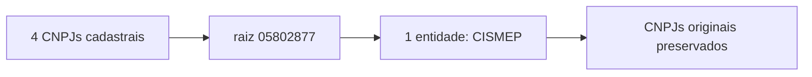
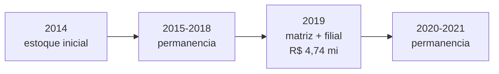
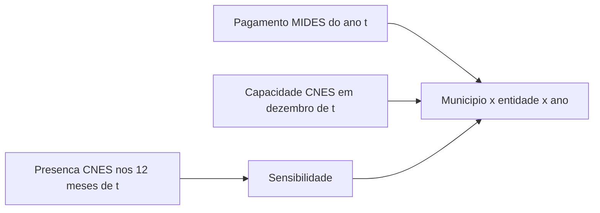

# Linha Do Tempo Dos Passos - Modelo Gravitacional De Saude

## 25/09: Conferir O Portal E Explicar Melhor Os Modelos

**Alertas anteriores → consultas municipais → valores e objetos →
limites registrados → apresentação dos cenários.**

Antes, Conselheiro Pena tinha um conflito entre nome e CNPJ. Agora sabemos
que o próprio portal repete o conflito. Primeiro lemos dois objetos;
na continuação, terminamos os 14: R$ 11.468,66 em DCTF, ITR e radiodifusão,
com multas e juros. A decisão derivada rejeita a atribuição ao CISVI
em 2019, sem inventar pagamento zero. O original e os ajustes anteriores
permanecem identificados; o beneficiário bancário correto não foi comprovado.

Piedade–CISMIRECAR/2021 passou a ter uma conferência independente de
R$ 779.355,34. A diferença de Ipatinga/2018 foi explicada no MIDES original:
R$ 567.152,67 sem restos, iguais ao portal, mais R$ 137.077,88 com restos.
Ainda falta a conferência externa dos restos. Não usamos anos vizinhos
para preencher 2019. Neves/2014 não aparece na consulta atual. O portal de
São Francisco de Paula passou a abrir, mas 2019 retorna vazio até sem
filtros; 2026 tem registros. Foram preparados cinco pedidos de documentos
históricos, sem envio externo.

Na aba Modelo, o percurso ficou explícito: 73 consórcios financeiros,
54 com clínica e rota, 53 com horas positivas; a ampliação chega a 62.
Os resultados existentes ganharam gráficos de erro e calibração, exemplos
e a conta do Igarapé–CISMEP: 1.651 horas, duas clínicas e 96,67% na
validação municipal. Esse percentual é probabilidade de pagamento.
Nenhuma base ou estimativa mudou nesta revisão.

Imagens e números conferidos. A política do navegador bloqueou o HTML
local; a nova navegação/layout completo ainda precisa ser visto pelo usuário.

> Atualizacao de 25/09: a auditoria chegou a v1 e aos mapas. O estado atual
> e a v1 revisada, 21/32 colunas, com conflitos sinalizados; as contagens
> anteriores abaixo pertencem a cada marco historico. A aba Modelo abre
> agora adesao financeira, com o piloto antigo em secao recolhida.

> Fechamento v1 de 24/09/2026: passo 7 concluido para duas bases delimitadas,
> financeira e clinica direta. Pendencias mensais/indiretas ficam documentadas.
> As contagens abaixo conservam os marcos historicos de cada entrega. A
> proposta de um ano foi recebida e um piloto de participacoes foi autorizado
> e estimado depois. Bacias ficaram para analise posterior.

## 25/09: Dos Alertas Aos Documentos

Depois de propagar a correcao CNES para a v1, foram investigados seis zeros
de 2019 e tres pares com nome de credor conflitante. Sete casos ganharam
contexto; dois seguem sem documento conciliador. Foram reunidas 17
referencias, 15 com copia local, e reconstruidas 72 observacoes anuais.
Isso ainda nao encerrou a causa financeira dos zeros nem corrigiu credores.

Exemplo: **Ipatinga–CONSAUDE** aparece no MIDES com R$ 704.230,55 em
2018 e zero em 2019. Ipatinga tambem consta do rol institucional do contrato
CEGED 005/2019. O documento ajuda a investigar o vinculo, mas nao comprova
que a prefeitura transferiu recursos naquele ano. Por isso o zero permanece,
com prioridade para conferir pagamento municipal e recebimento consorcial.

Outro cuidado: contrato Uberlandia/2015 guardado na pasta AMVAP e do
CISTRI, outro CNPJ. Fonte foi identificada e preservada, sem usar a pasta
como prova de identidade. V1, mapa e resultados ficaram exatamente iguais.
O proximo trabalho e buscar os comprovantes especificados na tabela
`evidencias/auditoria_nove_pares_2026_09_25.csv`, nao reconstruir a base.

## Visao Geral

O trabalho avancou da decisao de escopo ate duas bases anuais verificadas e
uma EDA de capacidade. Cada entrega resolveu uma pergunta necessaria ao modelo.

```mermaid
flowchart LR
  P0["Marco 0<br/>MG + saude + MIDES"] --> P1["1. Quem e saude?<br/>84 entidades"]
  P1 --> P2["2. Que evidencia liga<br/>municipio e entidade?"]
  P2 --> P3["3. Onde esta a oferta?<br/>polo, rede ou ausente"]
  P3 --> P4["4. Qual capacidade<br/>esta registrada?"]
  P4 --> P5["5. Qual a impedancia<br/>rodoviaria?"]
  P5 --> P6["6. O que ocorreu<br/>em cada ano?"]
  P6 --> C3["Complemento do 3<br/>cobertura e alertas"]
  C3 --> C4["Complemento do 4<br/>CNES historico"]
  C4 --> N3["16/09<br/>filtro clinico e decisoes fechados"]
  N3 --> N6["23/09<br/>painel anual + 13 candidatas"]
  N6 --> N7["24/09<br/>EDA e auditoria de dados"]
  N7 --> N8["V1 entregue<br/>financeira + clinica direta"]
  N8 --> N9["Proposta recebida<br/>diagnostico de viabilidade, script 29"]
  N9 --> N10["Piloto autorizado<br/>participacoes 2019 + nova aba, script 30"]
  N10 --> N11["Proximo<br/>alternativas institucionais + temporalidade"]
```

## Evolucao Do Projeto

| Passo | Pergunta | Antes | Entrega | Resultado central |
|---:|---|---|---|---|
| Marco 0 | qual fenomeno e recorte estudar? | havia fontes e modelos exploratorios, mas nao uma especificacao gravitacional setorial | reuniao de 27/08/2026 definiu MG, saude, MIDES e tres blocos analiticos | entrada, intensidade e interrupcao serao estudadas separadamente |
| 1 | quais CNPJs representam consorcios de saude? | matriz e filiais podiam contar separadamente | universo por CNPJ original e por raiz | 100 CNPJs em 84 entidades; 66 observadas no MIDES |
| 2 | pagamento e declaracao contam a mesma historia? | MIDES e MUNIC podiam ser lidos como vinculo equivalente | cotejamento e revisao documental | 1.311 pares: 630 comuns, 658 somente MIDES e 23 somente MUNIC |
| 3 | sede administrativa e destino assistencial? | distancia poderia apontar para um escritorio | unidades CNES e decisao de polo/rede | 670 unidades; 21 entidades sem unidade direta |
| 4 | como medir poder de atracao? | leitos eram uma hipotese ainda nao testada | capacidade por unidade e entidade | 82 fixas, 586 moveis e 2 casos pendentes; apenas uma entidade com leitos SUS diretos |
| 5 | como medir a resistencia espacial? | nao havia impedancia integrada | tempo por destino, unidade e entidade | 363.378 pares MG completos; 61 entidades com tempo |
| 6 | como representar a trajetoria anual? | pagamentos, tempo e capacidade estavam separados | grade anual com eventos e defasagens | 573.216 linhas; 426 primeiros pagamentos, 252 retornos e 533 interrupcoes |
| Complemento do 3 | o que realmente existe nos 38 casos pendentes? | falsos negativos, redes moveis e inativos estavam misturados | busca por CNPJ proprio e auditoria documental | 15 recuperados; 23 sem estrutura fixa; 7 alertas decididos |
| Complemento do 4 | a oferta atual existia em 2014-2021? | a fotografia de 2026 era repetida nos oito anos | ST mensal e LT/SR/PF de dezembro | 672 entidades-ano; 1.868 unidades-ano; 120 fontes auditadas |

## Exemplo Real Continuo: Igarape x CISMEP

O caso usa a entidade de raiz `05802877` e o municipio de Igarape
(`id_municipio = 3130101`). Ele foi escolhido porque atravessa as entregas
concluidas ate aqui sem preencher lacunas por inferencia.

### Passo 1 - Da Lista De CNPJs Para Uma Entidade

Antes, os CNPJs poderiam ser tratados como consorcios diferentes. A raiz
`05802877` possui:

- matriz `05802877000110`;
- filiais `05802877000209`, `05802877000381` e `05802877000462`;
- quatro estabelecimentos cadastrais, sendo tres filiais;
- dois CNPJs observados no MIDES: matriz e filial `0002`.

Depois do passo 1, todos continuam auditaveis, mas a unidade analitica passa a
ser uma entidade: **CISMEP**, classificada como saude setorial e incluida no
nucleo principal preliminar. No periodo completo, a raiz aparece com 58
municipios e R$ 1.056.809.423,16 no MIDES.

### Passo 2 - Duas Evidencias Mantidas Separadas

Em 2019, `Igarape x CISMEP` aparece nas duas fontes:

| Evidencia | Resultado |
|---|---|
| MIDES | R$ 4.740.790,51 pagos a matriz e filial `0002` |
| MUNIC | declaracao na area de saude para a matriz |
| Grupo | `MIDES+MUNIC` |

O passo nao transformou pagamento em prova juridica. Ele mostrou que, nesse
ano, ha concordancia entre evidencia financeira e declarada. Como o par nao e
divergente, ele nao precisou entrar na amostra documental dos 50 casos.

### Passo 3 - Sede Nao Virou Hospital Automaticamente

A ancora administrativa do CISMEP e Sao Joaquim de Bicas. A consulta dos CNPJs
no CNES retornou 15 unidades diretamente vinculadas. O resultado nao foi
"hospital da sede", mas **rede vinculada sem polo unico**.

Isso muda a pergunta de distancia. Em vez de calcular apenas
`Igarape -> sede administrativa`, o projeto preserva os destinos assistenciais
diretamente documentados.

### Passo 4 - A Rede Recebe Medidas De Capacidade

A consulta detalhada mostrou:

| Componente atual do CISMEP | Valor |
|---|---:|
| unidades vinculadas | 15 |
| unidades moveis/itinerantes | 11 |
| unidades fixas | 4 |
| municipios com oferta fixa | 4: Betim, Brumadinho, Igarape e Sao Joaquim de Bicas |
| unidades com ambulatorio SUS | 4 |
| unidades com SADT SUS | 4 |
| unidades com internacao SUS | 1 |
| leitos SUS diretos | 32 |
| vinculos medicos SUS ativos | 130 |
| CBOs medicos SUS somados por unidade | 22 |

O CISMEP possui leitos, mas e excecao: somente uma das 61 entidades com oferta
fixa direta registra leitos SUS. Por isso o caso nao autoriza usar leitos como
massa unica para todos os consorcios.

### Passo 5 - O Tempo E Calculado Ate A Rede

Para Igarape, a camada municipio-entidade registra:

| Medida | Resultado |
|---|---:|
| menor tempo ate oferta fixa CISMEP | 0 minuto |
| tempo mediano entre os quatro destinos | 11,75 minutos |
| maior tempo | 25,8 minutos |
| distancia mediana | 12,607 km |
| destino mais proximo | Igarape |

O zero nao significa viagem instantanea de um paciente. Significa que origem e
uma unidade fixa estao no mesmo municipio e a fonte usa sedes municipais como
pontos de referencia. Os outros destinos sao Sao Joaquim de Bicas, Betim e
Brumadinho, o que preserva a amplitude da rede.

### Passo 6 - A Observacao Vira Uma Trajetoria Anual

| Ano | Valor MIDES | CNPJs no ano | Evento |
|---:|---:|---:|---|
| 2014 | R$ 722.807,02 | 1 | estoque inicial de 2014 |
| 2015 | R$ 450.192,57 | 1 | permanencia |
| 2016 | R$ 490.080,31 | 1 | permanencia |
| 2017 | R$ 485.363,10 | 1 | permanencia |
| 2018 | R$ 4.096.281,81 | 1 | permanencia |
| 2019 | R$ 4.740.790,51 | 2 | permanencia; matriz e filial consolidadas |
| 2020 | R$ 5.539.460,17 | 1 | permanencia |
| 2021 | R$ 6.586.529,43 | 1 | permanencia |

O pagamento de 2014 e `estoque_inicial_2014`, nao entrada, porque o inicio real
pode ter ocorrido antes da janela. De 2015 a 2021 o par e classificado como
permanencia financeira. Em 2019 os dois CNPJs sao somados antes de classificar
o movimento, evitando duplicar o par.

### Complemento - As Lacunas Foram Reabertas Sem Inventar Polos

A consulta inicial usava o CNPJ como mantenedor. A API atual do CNES tambem
permite buscar o CNPJ proprio do estabelecimento. A segunda rota mudou casos
reais:

| Caso | Antes | Depois | Consequencia |
|---|---|---|---|
| CISARP | sem unidade direta | clinica CNES 7918747 em Taiobeiras | entra na cobertura fixa atual; a estrutura nao e retroagida automaticamente |
| CONSONORTE | sem unidade direta | clinica CNES 0975397 e dois vacimoveis | tempo da clinica e oferta movel ficam separados |
| CIS/CEN | exclusao atual por mobilidade e ficha sem tipo | CNES historico 7609868 em Guanhaes, 2014-2021 | possui candidato fixo historico; prestadores externos ainda exigem prova anual |
| CIS/UBA | pagamento historico e matriz inapta | nenhuma unidade atual confirmada | permanece no MIDES historico, mas nao como alternativa atual |

Assim, “auditoria concluida” nao significa que todos ganharam um polo. Significa
que cada ausencia recebeu uma leitura rastreavel e que `NA` foi preservado
quando a estrutura nao podia ser localizada com seguranca.

### Complemento Temporal Do Passo 4 - A Oferta Tambem Vira Uma Trajetoria

A fotografia atual do CISMEP tem 15 unidades, sendo quatro fixas e 11 moveis.
Essa estrutura nao foi repetida no passado. O CNES historico mostra:

| Ano | Fixas em dezembro | Fixas em algum mes | Servicos SUS diretos | Profissionais SUS diretos |
|---:|---:|---:|---:|---:|
| 2014 | 2 | 2 | 18 | 106 |
| 2015 | 2 | 2 | 18 | 105 |
| 2016 | 2 | 2 | 17 | 109 |
| 2017 | 2 | 2 | 18 | 126 |
| 2018 | 2 | 2 | 14 | 99 |
| 2019 | 2 | 2 | 15 | 101 |
| 2020 | 2 | 2 | 15 | 116 |
| 2021 | 1 | 2 | 14 | 107 |

Na montagem final, a linha `Igarape x CISMEP x 2019` devera combinar o pagamento
MIDES de 2019 com a capacidade CNES de dezembro de 2019. As camadas ainda
estao separadas; a grade preliminar continua contendo o retrato atual. Em
2021, dezembro mostra uma fixa, enquanto a sensibilidade registra duas em
algum momento do ano; a diferenca permanece visivel em vez de ser imputada.

## O Que O Exemplo Demonstra

1. entidade e raiz de CNPJ, nao uma linha isolada de estabelecimento;
2. MIDES e MUNIC podem concordar, mas continuam evidencias diferentes;
3. sede administrativa, polo e rede nao sao sinonimos;
4. capacidade possui varios componentes e uma trajetoria historica propria;
5. tempo deve respeitar a rede documentada;
6. movimento anual descreve pagamento, nao ato juridico;
7. capacidade de 2026 nao pode ser retroagida para explicar 2014-2021.

## Onde O Exemplo Nao Pode Ser Generalizado

- CISMEP e a unica entidade com leitos SUS diretamente registrados; os 32
  leitos nao representam a cobertura das demais.
- Igarape possui unidade no proprio municipio; muitos pares tem tempo positivo.
- Vinte e uma entidades nao possuem unidade direta e duas permanecem sem fixa confirmada por mobilidade/conflito
  cadastral; elas permanecem com tempo `NA`.
- A camada historica cobre apenas unidades diretamente vinculadas. Prestadores
  indiretos e contratados continuam ausentes quando nao ha identificacao anual.
- Dezembro e a medida principal; presenca em outro mes e sensibilidade, nao
  capacidade imputada para o ano inteiro.
- `MIDES+MUNIC` em 2019 fortalece a evidencia, mas nao fornece sozinho a data
  juridica de entrada.

## Retomada De 10/09/2026

A revisao corrigiu 307 unidades de tipo movel que escapavam pelo nome e
materializou os 91 casos em 28 entidades. Foram registrados 56 tratamentos
anuais para sete prioritarias. CIS/CEN e CIMES ja tinham fixa no CNES
historico em todos os anos: nao pertencem aos 91.

Outro exemplo real explicita a mudanca de oferta: a raiz `64486822` tinha o
CNES `2143674` em Moema, com 26 leitos SUS nos dezembros de 2014, 2015 e 2016.
Em 2017, o vinculo aparece em parte dos meses, mas nao em dezembro. Nos anos
seguintes, nao se atribui esse hospital ao consorcio sem nova evidencia.
Pagamento que continua nao autoriza carregar a mesma capacidade para a frente.

## Fechamento De 16/09/2026

1. As 18 sem MIDES foram comparadas com as 66 observadas: quinze estao hoje
   inativas/inaptas, duas abriram depois de 2021 e uma, CIMESMI, permanece
   ativa sem evidencia assistencial direta suficiente.
2. As 670 unidades receberam filtro funcional: 63 clinicas, 20 estruturas
   fixas de outras funcoes e 587 moveis. A serie historica tem 398 unidades-ano
   clinicas e 74 fixas nao clinicas, alem de 1.396 moveis.
3. A rodada documental cobriu as 21 entidades nao prioritarias. Exemplo:
   CIS-URG Oeste recebeu pagamentos em 2014-2015, mas iniciou SAMU em 2017.
   O pagamento de implantacao nao recebe capacidade operacional posterior.
4. CISREC e CONVALES tiveram o escopo multiárea corroborado; CIMBAJE tambem
   possui evidencia desde 2014. CISPARA ganhou alerta estatutario desde 2017,
   sem concluir que todos os seus pagamentos misturam politicas.
5. Dois mapas mostram sedes cadastrais e unidades por funcao. Sao pontos
   municipais, sem inferir area de cobertura ou trajeto porta a porta.

O passo 3 esta fechado por decisao documentada, inclusive exclusoes. Ainda
existem prestadores e vigencias desconhecidos; eles nao bloqueiam o modelo
restrito a destinos comprovados e permanecem limites da cobertura.

## Proximo Marco

Antes deste marco, a sequencia reafirmada por Adriano foi **revisar fora das
84 -> detalhar mapas por consorcio**. Esse complemento foi concluido em 16/09:

1. A reuniao de 10/09 levantou possiveis omissoes de saude e pediu mapas por
   consorcio/tipo. O foco em MG foi confirmado; expansao para outros estados
   ficou adiada. Formula e massa gravitacional estavam abertas naquela
   reuniao; a definicao posterior da equipe sera enviada por Adriano.
2. Cadastro + CNM produziram 137 raizes fora das 84. Vinte e oito receberam
   pesquisa documental; 109 tiveram triagem sistematica sem sinal selecionado.
3. Dez candidatas possuem saude historica documentada; outras tres exigem
   segregacao de escopo. Nove candidatas nao constavam do cadastro usado na
   consulta original MIDES. A consulta complementar recuperou R$ 258,36 milhoes
   para elas, nos oito anos. Isso nao altera retrospectivamente o significado
   de 84/66: eram numeros do recorte inicial, nao um censo completo de MG.
4. Os ST de dezembro acrescentaram 74 unidades-ano externas: 71 clinicas e
   tres centrais de gestao. Faltam os modulos de capacidade e a presenca mensal
   dessas candidatas, a serem harmonizados com o painel final.
5. O atlas individual permite comparar periodos, funcoes e tipos, municipios
   pagadores e CNM atual. Nenhuma dessas camadas e chamada de fluxo de pacientes
   ou cobertura comprovada. O inventario tem 221 entidades de varias areas,
   sem converter todas em alternativas de saude.

**Continuidade do exemplo Igarape x CISMEP:** a raiz `05802877` permanece no
recorte original e seus R$ 4.740.790,51 de 2019 estao preservados. No atlas,
selecionar CISMEP/2019 mostra duas clinicas, em Betim e Brumadinho; selecionar
o retrato atual mostra quatro clinicas, alem das moveis. Portanto, os tempos
atuais de Igarape e Sao Joaquim de Bicas nao podem ser carregados para 2019.
A integracao de 23/09 passou a usar destinos e capacidade de 2019; a revisao
externa acrescentou alternativas candidatas, sem mudar artificialmente o
pagamento ou a oferta historica deste par.

O painel preliminar e as camadas historica e funcional existem separadamente.
O plano anterior pedia que o passo 6:

1. harmonizar os candidatos externos e completar suas medidas; ligar destinos
   clinicos e capacidade de cada ano a matriz rodoviaria;
2. comparar alternativas estaduais, por tempo e por regiao de saude;
3. integrar populacao, RCL, regiao de saude e mandato e construir os
   universos sob risco;
4. permitir a EDA final do passo 7 e, depois, os modelos gravitacionais de
   entrada, intensidade e interrupcao.

## Integracao De 23/09/2026

O painel anual ampliou a grade original de 853 x 84 x 8 para 853 x 97 x 8
= 661.928 linhas, sem alterar o painel anterior. As 13 candidatas externas
foram acrescentadas separadamente, com capacidade clinica e destinos de cada
ano quando o CNES historico os comprova. A populacao cobre todos os municipios
e anos; a RCL consultada no RREO/Anexo 03 permanece ausente em grande parte
da base. O PDR/2019 so informa regiao de saude de 2019 a 2021.

No exemplo Igarape x CISMEP, o pagamento de 2019 segue em R$ 4.740.790,51.
As duas clinicas daquele dezembro estavam em Betim e Brumadinho: a menor
impedancia desde a sede de Igarape e **15,1 minutos ate Betim**, a mediana e
20,45 e o maximo e 25,8 minutos. O zero minuto obtido com uma clinica atual
em Igarape nao descreve 2019. Esse par entra na intensidade restrita com o
tempo de 2019; numa analise de entrada, as covariaveis seriam defasadas.

As regras de alternativas foram comparadas. Em 2019, dos 1.513 pares com
pagamento, 781 tem clinica direta e tempo conhecido, representando 82,8% do
valor; um limite de 90 minutos deixaria 630 pares. O recorte direto sem limite
e o recorte direto candidato. Redes sem unidade propria nao sao
declaradas inexistentes: seguem no painel descritivo e em sensibilidade.
Adriano decidiu reservar bacias hidrograficas para analise territorial
posterior. O passo 7 verificou perdas, extremos e selecao antes dos modelos.

## Auditoria Dos Dados Em 24/09/2026

Em 2019, as 46.062 alternativas com clinica direta e tempo se dividem em
45.281 linhas sem pagamento e 781 com pagamento. Dos outros pares pagantes,
595 sao de saude sem polo clinico direto e 137 ficam fora do recorte restrito.
Um corte de 90 minutos conservaria 630 dos 781 pagadores e deixaria 151
municipios sem opcao. RCL existe para apenas 241 dos 781; os municipios dos
pares com RCL tem populacao mediana maior que os sem RCL.

Os 19 registros acima de 300 minutos representam seis pares municipio-
consorcio ao longo dos anos, 0,037% do valor pago no recorte direto. Os
extratos MIDES e a matriz rodoviaria conferem; isso valida a ligacao das
bases, nao demonstra uma viagem ate a unidade. Nenhum par foi retirado.

A memoria ja registrava que **leitos SUS nao servem como massa unica**:
CISMEP tem 32 no retrato atual, e a raiz Alto Sao Francisco tinha 26 nos
dezembros de 2014-2016. Em 2019, nenhuma das 54 entidades diretas pagas
registra leitos SUS. A auditoria nova examinou outra pergunta: a unidade
clinica cadastrada registra algum marcador SUS? Em 2019, o CISVAS recebeu
R$ 1.465.922,21 de dez municipios, mas sua clinica nao tinha vinculo,
leitos, servicos ou profissionais SUS registrados. Isso nao apaga o pagamento
nem prova que nao houve atendimento. No CISMARG, tres unidades nao tinham
marcador, mas outra tinha; para seis pares pagantes o tempo ate esta ultima
e maior. Essas diferencas ficaram documentadas como sensibilidade.

O inventario das 60 variaveis encontrou, em oito anos, 5.123 pares pagos de
saude sem polo clinico direto, espalhados por 181 entidades-ano. Apenas 84
dessas entidades-ano tem classificacao documental anual transportada ao
painel; as outras 97 exigem confronto com os dossies antes de decidir se ha
lacuna de evidencia. Em 2019, RCL existe para 270/853 municipios. Os 595
pares pagos de saude sem polo direto desse ano tem capacidade e tempo CNES
diretos ausentes por definicao do recorte, sem que isso prove ausencia de
atendimento. Adriano pediu manter o foco nos dados; os modelos gravitacionais
ainda nao foram estimados.

### Depois Do Inventario: Conciliacao Em 24/09

O proximo movimento foi explicar as lacunas sem repetir toda a coleta:
181 entidades-ano da EDA -> dossies anteriores + CNES mensal/dezembro +
marcos oficiais de operacao -> tabela anual com classificacao, fonte e limite.
Os 97 casos sem classificacao transportada ao painel agora estao classificados
nessa tabela complementar; os 5.123 pares e R$ 450,47 milhoes foram preservados.
Nenhum novo destino clinico anual foi imputado.

Exemplo: o **CISMAS em 2016** recebeu pagamentos, mas nao tem polo clinico no
dezembro utilizado pelo painel. A consulta dos 12 arquivos mensais mostrou que
a unidade CNES 6776434 estava classificada como clinica especializada (36) de
janeiro a junho e central de regulacao (64) de julho a dezembro. Portanto,
temos uma mudanca cadastral dentro do ano, que o retrato de dezembro sozinho
nao revela. Isso nao comprova fechamento nem permite inventar capacidade mensal.

Outro exemplo: o CISSUL iniciou a operacao regional SAMU em 31/01/2015,
segundo seu relato institucional. Seus pagamentos em 2014 ficam identificados
como anteriores a esse servico especifico, sem concluir inatividade do consorcio.
As referencias estao no catalogo de fontes da conciliacao.

Os 59 extremos financeiros distintos e o caso zerado CISNORTE foram
conferidos nos extratos: todos reproduzem valor e transacoes. Betim-CISMEP/2014
mantem R$ 72.822.301,96 em 186 transacoes. Cinco raizes sem sigla ganharam
nomes completos de exibicao. Produtos e fontes receberam indices e hashes.
O passo 7 segue aberto: explicar por que falta um destino nao equivale a
recuperar o prestador, a vigencia e a capacidade necessarios para medi-lo.

### Continuidade: O Que Foi Recuperado Depois Da Conciliacao

Ainda em 24/09, a sequencia foi **priorizar tres casos -> ler contratos e
datas -> examinar meses do CNES -> medir o alcance de cada recorte**.
Nao houve nova etapa cientifica nem estimacao de modelos.

1. **CIAS/2016-2020:** o contrato de SAMU de Ouro Preto e seus aditivos
   documentam servico movel. Em 2019 ha tambem regulacao para sete municipios,
   com prazo excepcional menor para Ouro Preto e Mariana. A sede da central
   nao virou hospital; ainda faltam destinos dos pacientes e nexo dos outros repasses.
2. **Circuito/2017:** foi corrigida uma leitura incompleta da Fhemig. O documento
   tambem descreve instrumentos de 2017-2019. A noticia municipal identifica
   o Centro Viva Vida, mas informa restricao ao acesso externo em maio/2017.
   O CNES municipal associado e 6019463; nao e a unidade propria 7919204.
3. **CONSARDOCE/2014-2021:** foi localizado chamamento para clinica em 2018,
   sem resultado que nomeie contratado. A clinica atual 5941954 nao apareceu
   nos oito dezembros historicos e nao foi retroagida.
4. **Temporalidade:** 53 entidades-ano merecem aprofundamento mensal. Foram
   coletadas seis fotografias para cinco unidades, sem transforma-las em media
   anual. No CISMAS, junho/2016 tem tres profissionais SUS; dezembro classifica
   a unidade como central. Os pagamentos de julho-dezembro continuam na base.
5. **Suficiencia:** dos 10.735 pares-ano pagos do nucleo saude, 5.612 tem clinica
   direta e tempo. Exigir RCL reduz para 1.052; exigir tambem PDR deixa 510,
   apenas em 2019-2021. Cada recorte agora tem contagem, valor e limites explicitos.

Exemplo completo desta revisao: **Circuito das Aguas em 2017** tinha 18 pares
pagos, R$ 16.603.678,41 e nenhum polo clinico direto no painel. Os documentos
levaram ao Centro Viva Vida de Sao Lourenco; o ST confirmou a mantenedora
municipal, e os modulos CNES trouxeram 35 profissionais SUS em abril e 22
em dezembro. Entretanto, a restricao ao acesso externo e a falta de cotas
impedem entregar automaticamente essa capacidade a todos os municipios do
CIS. O ganho e uma unidade associada, duas fotografias e uma pendencia precisa;
o valor financeiro e a classificacao do recorte direto permanecem preservados.

O painel segue com 661.928 linhas e 60 variaveis. Nenhum pagamento foi eliminado,
RCL nao foi preenchida e MIDES nao precisou ser baixado novamente. As referencias
estao na metodologia e no catalogo de fontes prioritarias. O proximo trabalho
e completar os meses clinicos prioritarios e obter contratos/acesso municipal
das redes ainda incompletas; o passo 7 continua aberto nos dados.

### Fechamento V1: Uma Entrega Delimitada

Depois da consulta sobre complexidade, Adriano autorizou priorizar MIDES e
entregar com os dados existentes. RCL deixou de integrar as tabelas principais;
documentos viraram apoio. Nao foi exigido recuperar todo prestador indireto
ou mes antes da entrega. Essa decisao substitui a prioridade imediatamente acima.

O painel de 661.928 linhas foi preservado e gerou duas tabelas: financeira
(491.328 linhas, 73 entidades, 10.735 pares pagos) e gravitacional direta
(323.287 linhas, 58 entidades, 5.612 pares pagos). As alternativas sem
pagamento permanecem. O registro de 776 entidades-ano explica cada inclusao
e exclusao. O passo 7 foi fechado para essa v1, sem estimar modelo.

No exemplo continuo Igarape-CISMEP, o pagamento de 2019 permanece
R$ 4.740.790,51; as duas clinicas historicas somam 105 profissionais, 17
servicos/classificacoes e 1.651 horas cadastrais. Tempo minimo: 15,1 minutos.
As horas ja estavam coletadas e agora entram como coluna separada. A tabela
`outputs/base_v1/exemplo_igarape_cismep.csv` mostra os oito anos reais.

A EDA de 2019 encontrou correlacao de 0,808 entre profissionais e horas e
0,701 entre profissionais e servicos. Recomendadas medidas separadas e
interpretaveis; nenhum indice PCA escolhido. Leitos SUS continuam zero nas
54 entidades diretas desse ano, limitacao ja conhecida. Testes 13, 15 e 16
confirmam a conservacao e as regras. A proxima decisao depende da formula
da equipe, inclusive para combinar capacidade, tempo e valores monetarios.

## Complemento Visual Da V1

Depois da revisao dos produtos de 16/09, Adriano pediu os graficos antes de
enviar a formula da equipe. A primeira previa foi rejeitada. A leitura
integral do vault de design orientou uma segunda proposta, aprovada, que
foi ampliada para a entrega em `outputs/visuais_v1/index.html`.

Agora o mesmo exemplo Igarape-CISMEP/2019 pode ser consultado no atlas:
selecionar CISMEP, 2019 e clinica fixa mostra duas unidades; selecionar
Igarape informa R$ 4.740.790,51 e 81 registros financeiros. Ao trocar
para 2021, aparecem uma clinica e 54 municipios pagadores. O retrato
atual de 2026 fica separado e nao exibe pagamentos de 2026, que nao foram
coletados nesta serie.

As 20 figuras cobrem pagamentos, perfis CNES, tempos e cobertura. Seus CSVs
permitem conferir os numeros e suas imagens servem para reuniao ou relatorio.
A etapa visual nao escolheu massa, indice ou amostra final do modelo.
O proximo passo e receber a formula e verificar sua compatibilidade com a v1.

### Revisao Da Apresentacao Para Explicar A V1

Ainda em 24/09, Adriano considerou a entrega ampla demais e pediu foco na
base que sera discutida com a equipe. A entrada passou a ter seis abas:
a base v1, como foi construida, pagamentos, CNES, tempos/mapa e consultar
bases. Cinco figuras principais acompanham a explicacao; o inventario
externo, CNM e o retrato 2026 sairam dessa interface. Os produtos anteriores
continuam preservados, sem alterar a v1 ou a ordem do trabalho.

O exemplo Igarape-CISMEP/2019 agora aparece desde a primeira aba: a linha
combina os 43.045 habitantes de Igarape com R$ 4.740.790,51 pagos ao
consorcio. Na tabela direta, acrescenta duas clinicas, 105 profissionais,
17 servicos/classificacoes, 1.651 horas e menor tempo de 15,1 minutos.
O fluxo explica como CNPJ, codigo CNES, municipio e ano fizeram essas
ligacoes. Capacidade e do consorcio; o pagamento e do par; populacao e
do municipio. A consulta completa permite localizar essa mesma linha
e ler suas 30 colunas, sem exigir abrir o arquivo em outro programa.

Todas as 814.615 linhas das duas tabelas estao consultaveis, com filtros
e paginacao; todas as celulas foram comparadas aos CSVs originais.
Essa revisao mudou a apresentacao e a consulta, sem nova coleta ou modelo.

## Proposta De Piloto Logit Recebida Depois Da Entrega Visual

Adriano apresentou uma mensagem propondo logit multinomial em um ano,
saude/MG, com capacidade de atracao e impedancia espacial. A alternativa
sugerida para massa foi populacao do municipio sede. A imagem antecede
um separador de 17/09; a data exata da mensagem nao foi confirmada.
O registro e a avaliacao ocorreram em 24/09. Trata-se de proposta, nao
de autorizacao para escolher silenciosamente desfecho ou amostra.

O script 29 verificou os dados: em 2019, 497 dos 808 municipios pagadores
do nucleo financeiro pagam a varios consorcios. No direto, 75 dos 703
pagadores fazem o mesmo. Conceicao do Para paga ao CISVI, CISPARA, CISMEP
e CIS-URG Oeste. Um unico escolhido mudaria a pergunta para principal
destino financeiro; participacoes preservariam a divisao do gasto.

O exemplo Igarape-CISMEP continua valido: R$ 4.740.790,51, duas clinicas,
105 profissionais SUS e tempo minimo de 15,1 minutos. A sede cadastral
disponivel e Sao Joaquim de Bicas, mas as clinicas de 2019 sao Betim e
Brumadinho. Portanto, populacao da sede e capacidade/destino clinico
precisam ser distinguidos. Nenhum coeficiente foi estimado; agora falta
alinhar o desfecho e o conjunto de alternativas do piloto.

### Piloto Autorizado E Executado Depois Do Diagnostico

O pedido seguinte autorizou testar participacoes em uma aba nova, seguindo
a consulta v1. Acrescentou a exigencia de explicar a selecao e as variaveis:
97 investigadas -> 73 financeiras em 2019 -> 54 com clinica/tempo;
853 municipios -> 703 com total direto positivo -> 37.962 linhas.
Os 37.181 zeros entre alternativas permanecem; v1 e fontes nao mudaram.

O script 30 estimou profissionais + tempo, com duas particoes de validacao,
comparacao com tempo sozinho e sensibilidades de horas/mediana. Na validacao
municipal, principal correto 78,38% e erro de distribuicao 34,08%; tempo
sozinho: 75,96% e 34,98%. Ganho de capacidade pequeno, sem conclusao causal.

Exemplo adicional para enxergar a divisao: Conceicao do Para paga R$ 261.089,73
a CISVI, CISPARA e CISMEP no direto. CISMEP recebeu 38,20%; o modelo previu
14,71% fora do treino. A aba conserva esse erro e permite acompanhar a conta
e todos os destinos. Igarape-CISMEP continua consultavel como caso de um destino.

A entrega local tem agora sete abas. Passo 8 parcial; seguintes desafios:
alternativas institucionais e capacidade anterior ao pagamento. Os modelos
longitudinais originais e deploy no dashboard nao foram executados por esse piloto.

### Depois Da Reuniao De 24/09

A equipe pediu comecar por horas SUS e comparar tres localizacoes da oferta:
unidades, sede municipal do consorcio e misto. Adriano confirmou depois que
adesao sera pagamento positivo, permitindo varios vinculos. Isso orienta um
novo desfecho binario por par; nao muda o significado do piloto de participacoes.
O cenario estadual de candidatos foi aceito como exercicio, sem prova juridica
de acesso. Novas adesoes ao longo do tempo e comparacao com Bahia ficaram
como extensoes. Nao foi autorizado retroagir 2026 para completar o historico.

No exemplo CISMEP/2019, ja temos as horas por unidade: Betim 1.417 e
Brumadinho 234. No cenario de sedes, a referencia cadastral disponivel seria
Sao Joaquim de Bicas, cuja vigencia historica precisa de verificacao. No misto,
o CISMEP manteria as unidades; sede serviria aos casos sem destino clinico.
Essa comparacao ainda precisa fixar a agregacao das unidades e a impedancia.

Em paralelo, organizar documentos do acervo/radar para os consorcios em geral:
protocolo/contrato de consorcio, rateio e estatuto. A base desejada tem quatro
eixos, incluindo recursos, producao e governanca alem dos documentos.
Leitura registrada e dados existentes conferidos; novos modelos nao executados.

### Preparacao Dos Tres Cenarios Depois Da Reuniao

O script 31 preparou 2019 com todos os 853 municipios, inclusive sem pagamento.
Antes havia a orientacao dos tres cenarios; agora ha inventario nominal,
horas por modalidade, destinos, rotas e grades com perdas explicitas.
S1 tem 54 consorcios com horas conhecidas; S2/S3, 63. Um desses casos,
CISVAS, tem horas zero: a proposta com log(H) usa 53/62/62, mantendo os
demais na grade e registrando log(1+H) como sensibilidade. Dez nao possuem
capacidade identificada, apesar de ter sede. Os nove adicionais sao de
modalidades moveis/nao clinicas, nao clinicas fixas que foram recuperadas.

Igarape-CISMEP continua com 1.651 horas e R$ 4.740.790,51. Pelas clinicas,
o menor trajeto e 17,748 km/15,1 minutos; pela sede cadastral de Sao Joaquim
de Bicas, 7,466 km/8,4 minutos. Proposta: usar horas de cada unidade para
ponderar a impedancia e estimar vinculo binario, sem repartir um unico
positivo entre consorcios. Nenhum coeficiente novo foi ajustado.

Na amostra comum, S3 repete S1. A ampliacao so aparece nos nove casos de
sede. Teste 19 conciliou 186.807 linhas com a v1; fontes preservadas.
A serie mensal ja coletada explica Brumadinho: a unidade aparece de janeiro
a junho de 2021, mas nao em dezembro. A causa cadastral ainda nao foi provada.
Preparacao encerrada; naquele marco o proximo passo era estimar a proposta.

### Primeiro Exercicio De Vinculo Financeiro Executado

Adriano autorizou continuar. Script 32 estima pagamento positivo em 2019,
permitindo varios vinculos e conservando os 853 municipios. Compara clinicas
e sedes nos mesmos 53 consorcios; depois sedes/misto em 62. Foram executadas
sensibilidades de horas zero, alertas, distancia/tempo e agregacao, com
grupos municipais retidos para validacao. Tambem se testaram blocos geograficos.

Distancia apresentou associacao negativa forte. Horas acrescentaram pouco
entre clinicas; populacao teve sinal negativo condicional, sem explicacao
causal estabelecida. Sede nao trouxe vantagem relevante na amostra comum.
A ampliacao de modalidades alterou a associacao das horas e permanece
exploratoria. Nao se escolheu formula apenas por maior cobertura financeira.

Igarape-CISMEP preservou pagamento R$ 4.740.790,51 e 1.651 horas. No ajuste
clinico, a probabilidade financeira estimada foi 95,94%; fora do treino,
96,67%. Isso nao mede a chance de uma futura filiacao juridica. Como
contraponto, Uberaba-CISVALEGRAN tinha pagamento zero e distancia municipal
zero, mas o modelo estimou perto de 100%. A proximidade sozinha nao basta.

Um decimo segundo ajuste distinguiu coincidencia municipal, sem inventar
quilometragem; corrigiu a media desse grupo, mas sem ganho consistente na
validacao. Problema documentado, nao declarado resolvido. Resultados completos,
exemplos e limites na metodologia e em outputs/adesao_financeira. A aba visual
continua com o piloto fracional e deve receber essa nova leitura em seguida.

### Auditoria Dos Erros E Das Alternativas Em 24/09

Depois de estimar, voltamos aos registros que mais contradiziam o modelo.
O caso Uberaba-CISVALEGRAN ganhou explicacao documental: o relatorio de
contas de 2019 confirma que nao houve pagamento e registra mudanca na
participacao no rateio desde 2018. A clinica estar no municipio nao bastava
para prever o vinculo financeiro. O zero foi mantido.

Ja Conselheiro Pena-CISVI exigiu outra leitura. Os 14 registros de 2019
somam R$ 11.468,66, mas dizem MINISTERIO DA FAZENDA no nome do credor.
Ampliamos a verificacao dos nomes: tres pares apresentam campos conflitantes
em 17 registros-ano, R$ 1.352.846,55 entre 2014 e 2021. Nao foi possivel
decidir apenas com o MIDES qual campo estava errado. Marcar o conflito e
testar sem o par e diferente de apagar um pagamento ou troca-lo por zero.

A revisao CNES encontrou dois consultorios PF atribuidos indevidamente ao
CISMARG. CPF com zeros a esquerda coincidia com a raiz do CNPJ. O extrator
foi corrigido e 1.942 unidades-ano foram conferidas no ST bruto: 16 falsos
vinculos removidos do insumo novo. Em 2019, 64 clinicas viraram 62; 54
consorcios continuam com horas conhecidas e 53 com horas positivas.
Os dois consultorios tinham zero horas SUS: os quatro modelos principais
mantiveram os coeficientes. Contagens e algumas rotas minimas mudaram.
Uma unidade legitima do CISMARG em Oliveira foi mantida pela mantenedora.

Em seguida testamos sete regras geograficas nos quatro ajustes principais,
mais retirada dos dois pares de credor conflitante de 2019. Os 320 treinos
foram conferidos com municipios separados entre treino e teste. Duas horas
retêm 699 dos 771 pagos clinicos; tres horas, 752; mesma microrregiao, 548;
cinco proximos, 759. Isso mostra por que um mapa regional nao pode virar
filtro definitivo sem medir os pagamentos que ficariam de fora.

Igarape-CISMEP continua com R$ 4.740.790,51 e 1.651 horas; nenhuma dessas
correcoes muda seu registro. Outro exemplo, Lagoa da Prata-CISMEP, paga
R$ 2.107.821,15 e tem 149,7 min ate a clinica mais proxima: um corte de duas
horas excluiria o vinculo. MIDES confirma o pagamento ao consorcio, sem
identificar a unidade que efetivamente entregou o servico.

Os resultados continuam exploratorios. Antes da proxima apresentacao,
precisamos propagar as correcoes para a v1 e suas visualizacoes e manter
os conflitos visiveis. Esta entrega atualizou cenarios/modelos e documentacao;
a v1/atlas/piloto antigos foram preservados. Fontes, tabelas e testes estao
localizados no dicionario. A proxima coleta deve ser dirigida aos casos
pendentes, sem reiniciar a construcao de toda a base.

## 25/09: Da Auditoria Aos Dados Que Aparecem Na Tela

**Auditoria CNES e MIDES -> v1 revisada -> mapas e figuras -> modelos
regenerados -> consulta com alertas -> verificacao visual.**

Antes, as correcoes estavam nos cenarios do modelo, mas a tela ainda lia
a v1 original. Preservamos uma copia completa daquela entrega e ligamos
os geradores ao CNES corrigido. Em 2019 sao 62 clinicas, em vez de 64.
No historico completo, retiramos 16 registros-ano de dois consultorios PF
que nao pertenciam ao CISMARG. A unidade legitima de Oliveira foi mantida.

Exemplo: CISMARG em 2019 aparece agora com duas unidades, Oliveira e
Santo Antonio do Amparo, 25 profissionais SUS e 352 horas SUS cadastradas.
Os dois consultorios de Uberlandia deixaram de aparecer. Mudaram 927
minimos de viagem na grade 2014-2021, todos em alternativas sem pagamento.
Por isso as barras de cobertura seguem em 52,3% das relacoes e 86,4% do valor.

Na mesma tela, selecionar Sao Francisco de Paula-CISMARG/2019 mostra
R$ 188.969,82 e um alerta: o nome do credor consta como Sometal no MIDES.
O dinheiro nao foi apagado nem convertido em zero. O filtro de auditoria
encontra os 17 pares-ano conhecidos; dois sao de 2019.

Igarape-CISMEP conserva R$ 4.740.790,51, duas clinicas, 1.651 horas SUS
e menor tempo de 15,1 minutos. A aba do modelo mostra agora a probabilidade
de pagamento desse par, 96,67% na validacao municipal do S1, e a compara
com erros reais, como Uberaba-CISVALEGRAN. O piloto de participacoes fica
guardado para consulta, com seus resultados atualizados pela correcao.

O encaminhamento deste marco foi buscar evidencia documental para os
conflitos e zeros; a rodada seguinte esta registrada em "25/09: Dos Alertas
Aos Documentos". Esta propagacao melhora a consistencia entre dado,
modelo e tela; nao resolve sozinha elegibilidade institucional ou sedes
historicas, nem elimina o excesso de confianca em distancia municipal zero.
