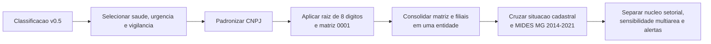
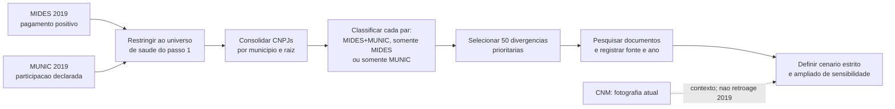
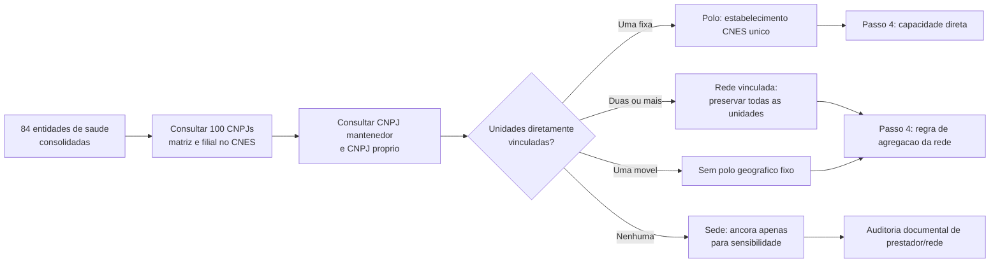
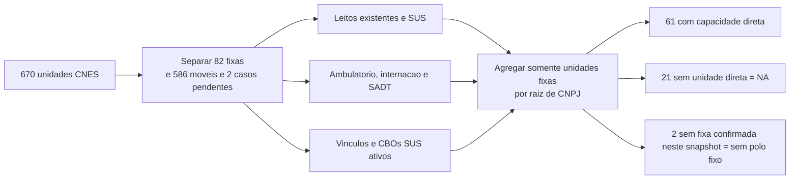
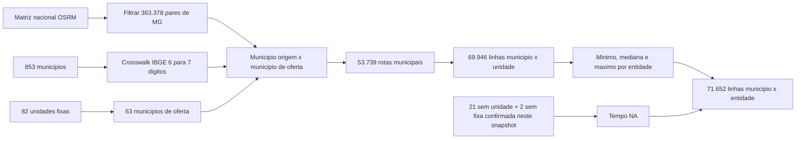
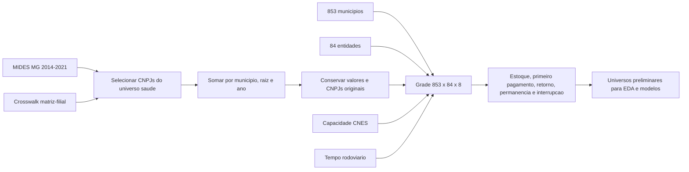
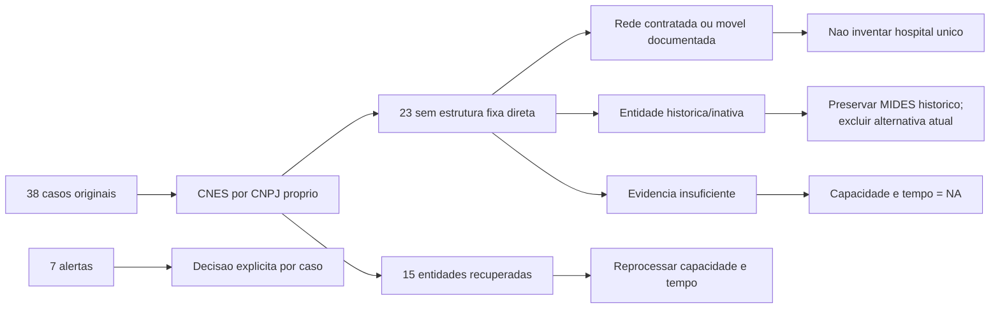
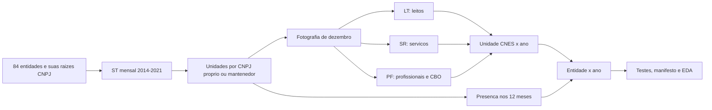

# Metodologia Geral - Modelo Gravitacional De Saude

> Estado vigente em 16/09/2026: filtro funcional concluido, com 63 destinos
> clinicos fixos, 20 estruturas fixas nao clinicas e 587 moveis nas 670 unidades.
> Historico: 398 unidades-ano clinicas, 74 nao clinicas e 1.396 moveis.
> As secoes datadas preservam a evolucao das camadas anteriores; para preparar
> o painel final, usar a elegibilidade do script 11 descrita ao final.

## Objetivo

Preparar uma base defensavel para o futuro modelo gravitacional de consorcios
de saude em Minas Gerais. Antes de estimar distancia, capacidade assistencial
ou probabilidade de entrada, foi necessario responder perguntas operacionais
que aprofundam os primeiros passos do plano:

- quais instituicoes de saude existem no universo analitico?
- que tipo de evidencia existe para cada vinculo municipio-consorcio em 2019?
- qual estabelecimento, rede ou ancora administrativa pode representar a
   oferta assistencial de cada entidade?
- quais componentes de capacidade estao registrados diretamente sob os CNPJs
   dos consorcios e podem ser usados sem inventar oferta?
- qual a impedancia rodoviaria entre cada municipio e a oferta fixa
   documentada, sem reduzir redes a uma sede administrativa?
- como organizar pagamentos, ausencias e movimentos em um painel anual
   completo sem confundir evidencia financeira com adesao juridica?
- como reconstruir a oferta CNES de 2014-2021 sem repetir a fotografia atual
   em todos os anos?

A ordem e o estado dos dez passos cientificos estao exclusivamente em
[`PLANO_DE_TRABALHO.md`](PLANO_DE_TRABALHO.md). Este documento registra a
metodologia das entregas executadas; sua numeracao interna nao cria outro plano.

O MIDES continua significando **pagamento observado** e a MUNIC,
**participacao declarada**. Nenhuma das duas fontes e alterada por esta
preparacao.

## Entregas Documentadas

Esta tabela resume produtos tecnicos. O estado dos passos cientificos e seus
criterios de conclusao ficam somente em `PLANO_DE_TRABALHO.md`.

| Passo | Situacao | Produto principal |
|---|---|---|
| 1. Fechar o universo de saude | Concluido | 84 entidades consolidadas e auditadas |
| 2a. Comparar MIDES, MUNIC e documentos | Concluido | 1.311 pares em 2019 e revisao de 50 divergencias |
| 2b. Usar CNM como fotografia atual no recorte saude | Disponivel, mas ainda nao materializado na tabela de saude | Snapshot CNM de 27/08 e piloto CNM x MIDES ja existem em outra frente |
| 3. Definir polo de atracao assistencial | Concluido com exclusoes explicitas | 84 entidades consultadas; filtro funcional e rodada documental fechados em 16/09 |
| 4. Construir capacidade assistencial | Concluido e reprocessado | 670 unidades; medidas separadas para 61 entidades com oferta fixa direta |
| 5. Integrar tempo rodoviario | Concluido e reprocessado | 853 origens, 82 unidades fixas e tres camadas de impedancia |
| 6. Montar o painel analitico anual | Concluido como grade e recorte clinico direto candidato; suficiencia em avaliacao no passo 7 | 661.928 observacoes municipio x entidade x ano, preservando as 573.216 originais |
| Complemento. Cobertura assistencial | Decisoes de uso concluidas | 38 casos iniciais, 91 entidades-ano e rodada documental das 21 nao prioritarias |
| Complemento temporal do passo 4 | Concluido | 672 entidades-ano e 120 arquivos oficiais auditados |

O item 2b nao bloqueia a proxima etapa: a CNM e uma fotografia atual e nao
prova a composicao em 2019. Caso seja integrada, ela entrara como marcador
descritivo separado, nunca como evidencia historica retroativa.

---

## Passo 1 - Fechar O Universo De Consorcios De Saude

### Em Que Consistiu

Transformar CNPJs classificados como saude em entidades analiticas unicas,
preservando matriz, filiais, situacao cadastral e evidencia de pagamento no
MIDES.

### Antes

- havia CNPJs individuais com classificacao de saude, urgencia/emergencia ou
  vigilancia em saude;
- uma mesma instituicao podia aparecer como matriz e filiais;
- ainda nao se sabia quais entidades efetivamente recebiam pagamentos de
  municipios mineiros entre 2014 e 2021;
- situacao cadastral atual, escopo setorial e uso no MIDES nao estavam juntos
  em uma unica camada.

### Pipeline



### Depois

| Antes | Depois |
|---|---|
| CNPJ isolado | Entidade consolidada pela raiz de oito digitos |
| Filial podia parecer outro consorcio | Filial e matriz sao somadas, com CNPJs originais preservados |
| Pagamentos dispersos | Presenca MIDES identificada por entidade e ano |
| Situacao cadastral sem contexto temporal | Situacao atual preservada, sem retroagir seu significado aos anos do MIDES |

**Resultados:** 100 estabelecimentos classificados em saude formaram 84
entidades consolidadas. Foram incorporadas 16 filiais em 11 raizes. Sessenta e
seis entidades aparecem no MIDES MG; 64 formam o nucleo setorial preliminar e
duas ficam em sensibilidade multiarea na classificacao v0.5. A auditoria de
16/09 acrescentou CIMBAJE e um alerta estatutario para CISPARA, sem reescrever
a classificacao original ou aprovar uma amostra final. Sete entidades foram marcadas para
revisao de escopo, situacao temporal ou macrogrupo.

### Exemplo Real

O CISMEP possui CNPJs com a mesma raiz `05802877`. Em vez de interpretar cada
estabelecimento como um consorcio independente, a rotina os trata como uma
entidade. Os CNPJs originais continuam disponiveis para auditoria; pagamentos
do mesmo municipio no mesmo ano sao somados antes de qualquer analise.

### O Que O Passo 1 Resolveu E O Que Nao Resolveu

Resolveu o universo tecnico para MG: quais entidades de saude entram, quais
filiais pertencem a qual matriz e quais aparecem no MIDES. Nao afirmou que
todo pagamento prova adesao juridica, nem escolheu ainda qual hospital ou sede
representara a capacidade de atracao de cada consorcio.

---

## Passo 2 - Auditar Os Vinculos Municipio-Consorcio Em 2019

### Em Que Consistiu

Comparar, para cada par `municipio x entidade consolidada`, o pagamento
observado no MIDES e a declaracao de participacao na MUNIC. Em seguida,
qualificar documentalmente as divergencias prioritarias sem reescrever as
fontes originais.

### Antes

- MIDES e MUNIC podiam aparentar discordancia porque usavam CNPJs distintos de
  matriz e filial;
- nao havia uma tabela unica que mostrasse, por par, pagamento, declaracao e
  valor financeiro;
- uma divergencia podia ser erro, mudanca temporal, prestacao de servico ou
  ausencia de documentacao; todas essas possibilidades estavam misturadas.

### Pipeline



### Depois

| Resultado do par | Quantidade | Leitura correta |
|---|---:|---|
| MIDES + MUNIC | 630 | Pagamento e declaracao coincidem em 2019 |
| Somente MIDES | 658 | Pagamento observado, sem declaracao MUNIC no par |
| Somente MUNIC | 23 | Declaracao MUNIC, sem pagamento MIDES positivo no par |
| Uniao | 1.311 | Total de pares com pelo menos uma das duas evidencias |

Dos 653 pares declarados na MUNIC, 630 (96,5%) tambem possuem pagamento
MIDES. Em sentido inverso, a MUNIC cobre 48,9% dos 1.288 pares MIDES. O valor
MIDES da uniao e R$ 379,1 milhoes; 71,3% esta nos pares comuns as duas fontes.

As duas coberturas respondem a denominadores diferentes:

> **Cobertura dos pares MUNIC**
>
> 630 pares comuns ÷ 653 pares MUNIC = **96,5%**

> **Cobertura dos pares MIDES**
>
> 630 pares comuns ÷ 1.288 pares MIDES = **48,9%**

### Exemplos Reais

| Par | Evidencia | Como fica depois da auditoria |
|---|---|---|
| `Itabira x CIAS` | MUNIC em 2019 e documento oficial de 2016 | Vinculo historicamente sustentado; ausencia em lista atual parece mudanca temporal, nao erro automatico |
| `Juiz de Fora x ACISPES` | MIDES positivo; ACISPES diferencia consorciados de cidades atendidas | Mantem pagamento financeiro, mas nao vira filiacao juridica confirmada |
| `Sao Miguel do Anta x SIMSAUDE` | MUNIC em 2019; nenhuma corroboracao localizada, nem na revisao humana | Permanece divergente e nao confirmado |
| `Para de Minas x CISMEP` | MIDES e fonte oficial posterior | Pagamento permanece no modelo financeiro; vinculo institucional entra apenas no cenario ampliado |

### Revisao Documental

A amostra incluiu todos os 23 pares somente MUNIC e os 27 maiores valores
somente MIDES. Cada caso recebeu URL, ano, cobertura temporal, grau de
evidencia e decisao analitica no catalogo versionado.

| Resultado documental | Pares | Tratamento |
|---|---:|---|
| Evidencia anterior ou igual a 2019 | 14 | Pode sustentar vinculo historico no cenario estrito |
| Corroboracao apenas posterior | 33 | Mantem-se como plausivel; entra somente no cenario ampliado |
| Historicamente compativel | 1 | Mantem-se com ressalva temporal |
| Relacao financeira sem filiacao comprovada | 1 | Nao converter pagamento em adesao juridica |
| Nao corroborado com indicio alternativo | 1 | Revisao humana prioritaria; nao promover a vinculo confirmado |

### Sensibilidade: O Que Muda Na Pratica

| Cenario | O que conta como vinculo institucional | Uso |
|---|---|---|
| Estrito | Documento compativel com 2019 | Resultado principal quando a pergunta exigir filiacao |
| Ampliado | Estrito + fonte oficial posterior | Verificar se a conclusao depende de composicoes que podem ter mudado no tempo |

Exemplo hipotetico: se o efeito estimado do tempo de viagem for semelhante no
cenario estrito e no ampliado, a conclusao e robusta a essa incerteza. Se o
sinal ou a magnitude mudar muito, a filiacao temporal precisa ser tratada como
parte central da limitacao. O modelo financeiro MIDES nao exclui pagamentos
apenas porque falta prova juridica: ele mede pagamentos observados.

### Decisoes Validadas

1. Pagamento MIDES e forte indicio de relacao real com o consorcio, mas nao e
   prova juridica suficiente de filiacao.
2. Fonte posterior a 2019 corrobora plausibilidade, mas nao reconstroi
   automaticamente a composicao naquele ano.
3. `Sao Miguel do Anta x SIMSAUDE` continua nao confirmado apos pesquisa e
   revisao humana.

### Limite Da CNM Nesta Etapa

A CNM ja foi raspada, versionada e comparada com maio de 2026; tambem existe
um piloto CNM x MIDES para MG. Ela ainda nao foi adicionada como coluna da
tabela de saude de 2019 porque sua composicao e uma fotografia atual. A
integracao futura recomendada e o marcador `presente_snapshot_cnm`, util para
descricao e sensibilidade, sem alterar a leitura historica do ano de 2019.

---

## Passo 3 - Definir O Polo De Atracao Assistencial

### Em Que Consistiu

Separar a **sede administrativa** de um possivel destino assistencial. A sede
do CNPJ nao foi assumida como hospital, clinica ou rede de atendimento. Cada
matriz e filial do universo consolidado foi consultada na pagina publica do
[CNES/DATASUS](https://cnes.datasus.gov.br/) por duas rotas complementares:
estabelecimentos mantidos pelo CNPJ e estabelecimentos cujo CNPJ proprio e o
da matriz ou filial do consorcio.

### Antes

- a distancia poderia ser calculada ate a sede administrativa do consorcio,
  ainda que ela fosse escritorio ou nao tivesse unidade propria;
- uma rede com unidades em municipios distintos poderia ser artificialmente
  comprimida em um unico municipio;
- a ausencia de estabelecimento sob o CNPJ poderia ser confundida com ausencia
  de atendimento, embora o consorcio possa operar por prestador contratado ou
  outro CNPJ.

### Pipeline



### Depois

| Decisao de polo | Entidades | Leitura e proxima acao |
|---|---:|---|
| Estabelecimento fixo unico | 13 | A localizacao CNES pode ser usada como destino atual; a capacidade e medida no passo 4. |
| Rede vinculada, sem polo unico | 49 | Manter todas as unidades; definir tempo e capacidade por rede, sem escolher uma sede arbitraria. |
| Sem unidade CNES pelo CNPJ | 21 | Nao inferir ausencia de atendimento; auditar rede propria, contrato ou prestador externo. |
| Unidade movel, sem polo fixo | 1 | Nao usar o endereco cadastral como destino de viagem. |

Foram consultados os 100 CNPJs matriz/filial das 84 entidades e retornaram
670 unidades CNES diretamente vinculadas: 638 preservadas pela rota de CNPJ
mantenedor e 32 pela rota de CNPJ proprio, com uma unidade sobreposta
deduplicada. A segunda rota recuperou 15 das 36 entidades antes classificadas
como sem unidade. O passo 4 confirmou 61 entidades com ao menos uma unidade
fixa; CIS/CEN e CIMES continuam apenas com unidades moveis diretamente ligadas.

### Exemplos Reais

| Entidade | Evidencia encontrada | Decisao |
|---|---|---|
| CISARP | Clinica CNES 7918747 encontrada pelo CNPJ proprio em Taiobeiras | Corrige um falso negativo da rota de mantenedora. |
| CONSONORTE | Clinica fixa CNES 0975397 e dois vacimoveis | Unidade fixa e oferta movel permanecem separadas. |
| CISVER | Cinco unidades CNES diretamente vinculadas | Rede; nao se escolhe uma unidade isolada como destino do consorcio. |
| CIMES | Uma unidade movel VACIMOVEL | Sem polo fixo; endereco cadastral nao representa destino assistencial. |

### Decisao Metodologica Para Redes E Casos Sem Unidade Direta

Cada rede e mantida como conjunto de destinos possiveis. Para os casos sem
unidade direta, foi buscada evidencia de rede propria, prestador contratado ou
estabelecimento operado sob outro CNPJ. Cada caso recebe uma saida explicita:

1. `polo_rede_documentada`: entra na analise principal de capacidade e tempo;
2. `prestador_externo_documentado`: entra somente em especificacao explicitamente
   identificada como complementar;
3. `sede_apenas_sensibilidade`: nao entra na medida principal de capacidade;
4. `evidencia_insuficiente`: permanece fora das variaveis de polo/capacidade.

Nao sera imputado o hospital mais proximo nem assumida a sede administrativa
como local de atendimento. Isso preserva a validade do futuro modelo
gravitacional: distancia e capacidade so serao calculadas contra oferta
assistencial documentada.

---

## Passo 4 - Construir A Capacidade Assistencial

### Em Que Consistiu

Consultar ficha, leitos, atendimento e profissionais no CNES para as 670
unidades diretamente vinculadas aos CNPJs consolidados. A agregacao por
entidade utiliza somente unidades fixas e mantem cada componente separado.

### Pipeline



### Resultado

| Indicador | Resultado |
|---|---:|
| Unidades consultadas sem erro final | 670 |
| Estruturas candidatas antes do filtro funcional de 16/09 | 82 |
| Unidades moveis pelo tipo CNES | 586 |
| Fichas conflitantes antes da revisao de 16/09 | 2 |
| Entidades com capacidade fixa direta | 61 |
| Entidades sem unidade no proprio CNPJ | 21 |
| Entidades sem fixa confirmada por mobilidade/conflito cadastral | 2 |
| Entidades com leitos SUS diretos | 1 |

Na camada-base de 10/09, das 61 entidades com estrutura fixa, 58 possuem ao menos um CBO medico SUS ativo
no retrato. CISREC, CISAP-VP e CISVALEGRAN possuem unidade fixa, mas zero CBO
medico SUS diretamente registrado; isso exige producao ou contratos
complementares, nao permite concluir capacidade zero. Leitos SUS aparecem
somente no CISMEP; portanto, nao sao
medida suficiente para representar sozinhos a atracao de todos os consorcios.

### Exemplos Reais

- CISMAS e CISMARPA tem uma clinica fixa, zero leito e escopo profissional
  cadastrado: capacidade nao e sinonimo de internacao.
- CISVER tem cinco unidades, mas quatro sao moveis; a agregacao usa a unidade
  fixa e preserva as moveis separadamente.
- CIS/CEN tem tres unidades atuais moveis; o CIMES tem ficha de nome
  VACIMOVEL, mas tipo clinica e oferta ambulatorial, classificada como destino
  clinico em 16/09. Nome isolado nao prevalece sobre a ficha e a evidencia.
- CISMEP tem quatro unidades fixas e 11 moveis; os 32 leitos SUS pertencem ao
  Hospital 272 Joias diretamente vinculado.

### Decisao Metodologica

O modelo futuro devera testar separadamente quantidade de unidades, CBOs
medicos SUS, atendimento ambulatorial, SADT e leitos. Nao foi criado indice
composto. CBO e proxy cadastral atual, nao especialidade unica, producao ou
capacidade historica.

### Por Que Leitos SUS Nao Podem Ser A Massa Unica

Na formulacao gravitacional simplificada, a atracao da entidade `j` sobre o
municipio `i` pode ser representada por:

> **Atracao gravitacional**
>
> A(i,j) ∝ M(j) × f[t(i,j)]

`M(j)` e a massa assistencial da entidade. `f[t(i,j)]` diminui com o tempo
rodoviario entre o municipio e a oferta.

Na fotografia atual, 60 das 61 entidades com oferta fixa direta possuem zero
leito SUS sob o proprio CNPJ. Isso nao significa ausencia de servico: clinicas
especializadas podem ter profissionais, atendimento ambulatorial e SADT sem
internacao.

| Entidade | Leitos SUS diretos | Outra evidencia de oferta | Erro se a massa fosse apenas leitos |
|---|---:|---|---|
| CISMAS | 0 | clinica fixa e 10 CBOs medicos somados | atracao seria forçada a zero |
| CISMARPA | 0 | clinica fixa e 18 CBOs medicos somados | estrutura ambulatorial seria ignorada |
| CISVER | 0 | uma unidade fixa e 33 CBOs medicos somados | rede seria tratada como sem oferta |
| CISMEP | 32 | quatro unidades fixas e 22 CBOs medicos somados | seria a unica entidade com massa positiva |

> **Transformacao possivel dos leitos**
>
> log(1 + leitos SUS da entidade j)

Essa transformacao evita o logaritmo de zero, mas nao corrige a falta de
informacao. Os 21 casos sem unidade direta tambem nao possuem capacidade zero:
possuem capacidade nao observada nesta etapa (`NA`).

---

## Passo 5 - Integrar O Tempo Rodoviario

### Em Que Consistiu

Ligar os 853 municipios de Minas Gerais aos municipios das 82 unidades CNES
fixas diretamente vinculadas aos consorcios. A impedancia e calculada ate a
oferta documentada, nao automaticamente ate a sede administrativa.

### Fonte

Foi usada a [matriz de distancias rodoviarias e duracao de viagens para
municipios brasileiros](https://rfsaldanha.github.io/data-projects/brazil_road_distances.html),
depositada no [Zenodo 11400243](https://zenodo.org/records/11400243). A fonte
usa sedes municipais IBGE 2010 e rotas OSRM/OpenStreetMap com perfil de
automovel. O arquivo `dist_brasil.rds` foi validado pelo MD5 oficial
`39f71b10ddf9fda7c53e2b39fa6bd202`.

### Antes

- havia localizacao das unidades, mas nenhuma medida rodoviaria integrada;
- redes podiam ser reduzidas incorretamente a uma sede;
- unidades moveis e entidades sem unidade direta podiam receber destinos
  artificiais;
- o pedido original de viagem as 10h30 de sabado nao era atendido pela fonte
  estatica disponivel.

### Pipeline



### Regras

1. Todos os 853 municipios entram como origens, inclusive os que nao possuem
   pagamento de saude no MIDES.
2. Somente unidades fixas diretamente vinculadas entram como destinos.
3. A rota e entre sedes municipais; nao representa deslocamento porta a porta.
4. Origem e destino no mesmo municipio recebem zero e a flag
   `mesmo_municipio_destino = TRUE`.
5. A camada por unidade e a fonte de verdade. Minimo, mediana e maximo sao
   resumos de sensibilidade para redes com varios destinos.
6. Ausencia de unidade fixa recebe `NA`, nunca zero.

Para uma entidade `j` com conjunto de unidades fixas `U(j)`, os resumos sao:

> **Tempos da rede**
>
> - t_min(i,j) = menor tempo entre o municipio `i` e as unidades de `U(j)`
> - t_med(i,j) = mediana dos tempos entre o municipio `i` e as unidades de `U(j)`
> - t_max(i,j) = maior tempo entre o municipio `i` e as unidades de `U(j)`

Esses tres valores descrevem a dispersao territorial da rede; nenhum deles e
automaticamente a impedancia definitiva do modelo.

### Resultado

| Produto | Unidade da linha | Linhas |
|---|---|---:|
| municipio-destino | municipio x municipio de oferta | 53.739 |
| municipio-unidade | municipio x unidade CNES fixa | 69.946 |
| municipio-entidade | municipio x entidade consolidada | 71.652 |

Os 363.378 pares rodoviarios entre os 853 municipios de MG estao completos.
A cobertura final possui 63 municipios de oferta, 82 unidades fixas e 61
entidades com tempo. Vinte e uma entidades sem unidade direta e duas somente
moveis permanecem com tempo ausente.

### Exemplos Reais

| Origem | Entidade | Resultado | Leitura |
|---|---|---:|---|
| Igarape | CISMEP | minimo 0; mediana 11,75; maximo 25,8 min | rede com unidades em Igarape, Sao Joaquim de Bicas, Betim e Brumadinho |
| Para de Minas | CISMEP | minimo 58,3 min | unidade mais proxima pode diferir da sede administrativa |
| Itajuba | CISMAS | 0 min | mesma cidade; nao significa viagem porta a porta nula |
| Abaete | CISVER | 252,2 min | somente a unidade fixa entra; quatro vacimoveis ficam fora |

### Limites

- a duracao e estatica e nao representa transito as 10h30 de sabado;
- a matriz assume ida e volta com a mesma duracao;
- usa a sede municipal IBGE 2010, nao o endereco exato do CNES;
- nao reconstroi mudancas viarias anuais entre 2014 e 2021;
- a unidade mais proxima pode nao oferecer a especialidade procurada;
- ainda falta definir quais entidades eram alternativas plausiveis para cada
  municipio.

---

## Passo 6 - Montar O Painel Analitico Anual

### Em Que Consistiu

Transformar pagamentos MIDES, identidade matriz-filial, capacidade CNES e
tempo rodoviario em uma base longitudinal com unidade:

> **Unidade da observacao**
>
> observacao(i,j,t) = municipio `i` × entidade `j` × ano `t`

O painel prepara a EDA e os modelos. Ele nao afirma que todas as 84 entidades
eram escolhas reais para todos os municipios.

### Antes

- pagamentos apareciam apenas quando observados;
- matriz e filial podiam gerar linhas separadas;
- ausencias, retornos e interrupcoes nao estavam no mesmo produto;
- um pagamento em 2014 podia ser confundido com entrada;
- tempo e capacidade estavam em tabelas separadas.

### Pipeline



### Regra Temporal

Seja `V(i,j,t)` o valor MIDES do municipio `i` para a entidade `j` no ano `t`.
A presenca financeira e definida por:

> **Presenca financeira**
>
> P(i,j,t) = 1 quando V(i,j,t) > 0; caso contrario, P(i,j,t) = 0

| Condicao | Evento | Leitura |
|---|---|---|
| t = 2014 e P(i,j,t) = 1 | estoque inicial | havia pagamento no inicio da janela; a entrada real e desconhecida |
| P(i,j,t) = 1 e P(i,j,t − 1) = 1 | permanencia | pagamento positivo consecutivo |
| P(i,j,t) = 1, P(i,j,t − 1) = 0 e nunca houve pagamento | primeiro pagamento | primeira aparicao financeira observada |
| P(i,j,t) = 1, P(i,j,t − 1) = 0 e ja houve pagamento | retorno | pagamento reaparece apos ausencia |
| P(i,j,t) = 0 e P(i,j,t − 1) = 1 | interrupcao | deixa de haver pagamento positivo |
| demais casos | ausencia | sem pagamento positivo |

Esses eventos descrevem pagamentos. Nao provam adesao, desligamento ou retorno
juridico.

### Consolidacao Matriz-Filial

Quando um municipio paga para matriz e filial da mesma raiz no mesmo ano, os
valores sao somados em uma linha da entidade e os CNPJs originais permanecem
registrados. Isso ocorreu em 21 combinacoes municipio-entidade-ano.

Se `C(j)` e o conjunto de CNPJs pertencentes a entidade consolidada `j`, entao:

> **Consolidacao matriz-filial**
>
> V(i,j,t) = soma dos pagamentos V(i,c,t) para todos os CNPJs `c` de C(j)

### Resultados Validados

| Medida | Resultado |
|---|---:|
| grade completa | 573.216 linhas |
| linhas MIDES de saude antes da consolidacao | 10.080 |
| linhas municipio-entidade-ano consolidadas | 10.059 |
| pares municipio-entidade com algum pagamento | 1.618 |
| estoque positivo em 2014 | 1.192 |
| primeiros pagamentos depois de 2014 | 426 |
| retornos observados | 252 |
| permanencias observadas | 8.188 |
| interrupcoes observadas | 533 |
| pares com mais de uma transicao | 329 |
| valor financeiro preservado | R$ 3.101.980.422,83 |

A dimensao da grade completa decorre diretamente de:

> **Dimensao do painel**
>
> 853 municipios × 84 entidades × 8 anos = **573.216 observacoes**

Dos 853 municipios, 843 possuem alguma linha MIDES de saude. Os dez restantes
continuam na grade com zeros para evitar selecionar o universo pela resposta.

### Exemplos Reais

| Caso | Sequencia observada | Interpretacao |
|---|---|---|
| Sete Lagoas x CISMEP, 2016 | primeiro valor positivo: R$ 12,70 milhoes | primeiro pagamento observado, nao data juridica de adesao |
| Muriae x CISLESTE, 2021 | pagamento anterior, zero em 2020 e R$ 4,16 milhoes em 2021 | retorno financeiro observado |
| Aguanil x CISMARG | positivo em 2018, zero em 2019 e positivo em 2020 | interrupcao seguida de retorno |
| Igarape x CISMEP, 2019 | matriz e filial somam R$ 4,74 milhoes | uma entidade com dois CNPJs originais preservados |

### Universos Preliminares

| Bloco futuro | Marcador atual | Pendencia |
|---|---|---|
| primeiro pagamento | sem pagamento anterior e entidade ativa em t − 1 | limitar alternativas territoriais |
| entrada ou retorno | ausente em t − 1 e entidade ativa em t − 1 | decidir se retorno sera separado |
| interrupcao | pagamento em t − 1 | definir sobrevivencia e censura |
| intensidade | pagamento positivo em `t` | escolher deflacao e normalizacao |

O universo estadual e apenas um limite superior. Oferecer todos os consorcios
ativos de MG a todo municipio nao e uma hipotese substantiva pronta para
estimacao.

### Limites

1. Presenca significa pagamento MIDES, nao filiacao juridica.
2. Pares positivos em 2014 sao censurados a esquerda.
3. O painel original repete a fotografia CNES de 2026. A integracao anual de
   23/09 corrige isso em um arquivo novo, preservando o original como trilha.
4. Vinte e tres entidades permanecem sem estrutura fixa CNES direta; algumas
   possuem rede movel ou contratada que exige outra especificacao territorial.
5. Populacao e ciclo do mandato foram integrados; RCL e regiao de saude tem
   cobertura parcial documentada. Bacia ainda nao foi integrada.
6. O conjunto final de alternativas ainda precisa de regra substantiva.

---

## Complemento - Completar A Cobertura Assistencial

### Em Que Consistiu

Revisar os 36 casos originalmente sem unidade CNES direta e os dois casos
classificados como somente moveis. A auditoria corrigiu a busca CNES, pesquisou
redes contratadas ou moveis e registrou uma decisao para os sete alertas de
escopo, situacao cadastral ou macrogrupo.

### Antes

- a consulta por CNPJ mantenedor deixava unidades com CNPJ proprio do consorcio
  fora do resultado;
- “sem unidade”, “somente movel”, “rede contratada” e “entidade historica”
  apareciam como lacunas semelhantes;
- os sete alertas indicavam revisao, mas ainda nao tinham decisao operacional;
- usar a sede administrativa como correcao produziria um polo ficticio.

### Pipeline



### Resultado

| Indicador | Antes | Depois |
|---|---:|---:|
| unidades CNES diretamente vinculadas | 639 | 670 |
| unidades fixas (classificacao anterior, corrigida em 10/09) | 366 | 389 |
| entidades com estrutura fixa direta | 46 | 61 |
| entidades sem unidade CNES direta | 36 | 21 |
| entidades somente com unidades moveis diretas | 2 | 2 |
| alertas com decisao registrada | 0 | 7 |

Das 38 entidades reavaliadas, 15 foram recuperadas pela API oficial de busca
por CNPJ proprio. As 23 restantes nao foram convertidas em capacidade zero:
duas sao historicas e inativas com MIDES, cinco possuem oferta ou rede movel,
indireta ou planejada sem polo fixo atual confirmado, uma esta ativa sem MIDES
e sem evidencia assistencial suficiente, e 15 estao fora do universo modelavel
atual por inatividade e ausencia de MIDES.

### Exemplos Reais

| Caso | Antes | Evidencia | Decisao |
|---|---|---|---|
| CISARP | sem unidade direta | clinica CNES 7918747 pelo CNPJ proprio | unidade fixa atual; temporalidade ainda deve ser validada |
| CONSONORTE | sem unidade direta | clinica CNES 0975397 e dois vacimoveis | clinica e oferta movel separadas |
| CIS/CEN | exclusao fixa no snapshot atual | CNES historico 7609868 em Guanhaes, 2014-2021 | polo cadastral historico recuperado em 10/09; rede externa ainda pendente |
| CIAS | sem unidade direta | gestao regional do SAMU em varios municipios | modelar bases/central em especificacao propria |
| CIS/UBA | matriz inapta com MIDES ate 2020 | nenhuma unidade CNES atual | manter historia financeira e excluir alternativa atual |

### Sete Alertas

- CISREC e CONVALES permanecem em analise de sensibilidade multiarea;
- CIS/UBA e o CNPJ `02287790` permanecem apenas como entidades historicas;
- CIMESMI fica fora do modelo de saude ate surgir evidencia assistencial;
- CODERI fica fora por inatividade e ausencia de MIDES;
- CICONZ tem vigilancia/zoonoses reconhecida como tema de saude, mas fica fora
  do modelo por inatividade e ausencia de MIDES.

### Limites

1. Unidade CNES atual nao prova que a mesma estrutura existia em 2014-2021.
2. Rede contratada sem prestador e endereco por ano nao recebe tempo nem massa.
3. Unidade movel nao possui um destino rodoviario fixo equivalente a hospital.
4. Unidade fixa com zero CBO medico SUS registrado nao significa capacidade
   zero; CISREC, CISAP-VP e CISVALEGRAN exigem producao ou contratos adicionais.

---

## Complemento Temporal Do Passo 4 - Cobertura E Capacidade CNES

### Em Que Consistiu

Substituir a repeticao da fotografia CNES de 2026 por uma camada historica
compativel com o MIDES de 2014 a 2021. A unidade de capacidade passou a ser:

> **entidade de saude x ano, medida na competencia de dezembro**

Presenca cadastral tambem foi verificada nos 12 meses de cada ano para medir o
quanto dezembro pode subestimar unidades que aparecem apenas em parte do ano.

### Antes

- as 389 unidades entao classificadas como fixas em 03/09/2026 eram repetidas nos oito anos
  do painel;
- uma estrutura criada depois de 2021 podia parecer disponivel em 2014;
- uma unidade historica encerrada antes de 2026 desaparecia de toda a serie;
- leitos, servicos e profissionais atuais podiam ser usados como se fossem
  invariantes no tempo.

### Fontes E Ligacoes

Foram usados arquivos de disseminacao oficial do CNES/DATASUS:

| Tabela | Periodicidade usada | O que mede |
|---|---|---|
| `ST` | todos os 96 meses | existencia, municipio, tipo, CNPJ proprio e mantenedor |
| `LT` | dezembro de cada ano | leitos existentes e leitos SUS por unidade |
| `SR` | dezembro de cada ano | servico especializado e classificacao, com atendimento SUS |
| `PF` | dezembro de cada ano | profissionais, CBO e carga horaria SUS; somente agregados |

O encadeamento usa o codigo CNES. Primeiro, `ST` encontra a unidade quando o
CNPJ proprio ou mantenedor pertence a uma das 84 raizes. Depois `LT`, `SR` e
`PF` sao ligados ao mesmo codigo CNES. Assim, uma linha de profissional com
CNPJ vazio nao e perdida quando pertence a uma unidade ja identificada.

Nenhum nome, CPF ou CNS de profissional e gravado. Apenas contagens distintas,
CBOs e carga horaria agregada sao preservados.

### Pipeline



### Regra Temporal

A capacidade principal de uma entidade `j` no ano `t` e a soma ou uniao das
unidades fixas diretamente vinculadas em dezembro:

> **Leitos SUS diretos(j,t)** = soma dos leitos SUS das unidades fixas da
> entidade `j` em dezembro de `t`.

> **Servicos SUS diretos(j,t)** = numero de pares distintos de servico e
> classificacao registrados nas unidades fixas em dezembro de `t`.

> **Profissionais SUS diretos(j,t)** = numero de profissionais distintos
> registrados como SUS nas unidades fixas em dezembro de `t`.

As formulas acima medem somente oferta diretamente vinculada no CNES. Elas nao
somam hospitais de terceiros, prestadores contratados sem CNPJ vinculado ou a
capacidade geral do municipio-sede.

Quando nao ha unidade fixa em dezembro, `n_unidades_fixas = 0`, mas leitos,
servicos e profissionais ficam vazios. Isso evita interpretar falta de
cobertura direta como capacidade assistencial igual a zero.

### Resultados Validados

| Indicador | 2014 | 2021 |
|---|---:|---:|
| entidades com unidade fixa em dezembro | 40 | 60 |
| unidades fixas em dezembro | 48 | 68 |
| unidades moveis em dezembro | 126 | 224 |
| servicos SUS distintos, somados por entidade | 226 | 319 |
| profissionais SUS distintos, somados por entidade | 1.169 | 3.004 |
| leitos SUS diretamente vinculados | 26 | 0 |

Produtos e controles:

- 672 entidades-ano, resultado de `84 x 8`;
- 1.868 unidades-ano observadas em dezembro;
- 120 arquivos oficiais registrados com URL, tamanho e SHA-256;
- 3 entidades-ano sem fixa em dezembro, mas com fixa em outro mes;
- 12 entidades-ano com mais unidades fixas em algum mes do que em dezembro;
- 412 entidades-ano combinaram pagamento MIDES e unidade fixa direta;
- 91 tiveram pagamento, mas nenhuma unidade fixa direta em dezembro;
- uma teve unidade fixa sem pagamento MIDES: CONSONORTE em 2021;
- 168 nao tiveram pagamento nem unidade fixa direta.

Os 91 casos nao provam erro do MIDES ou do CNES. Podem representar rede
contratada, oferta movel, estrutura de terceiro, registro cadastral incompleto
ou pagamento por servico sem unidade propria. Eles formam uma pauta de EDA e
sensibilidade, nao uma regra automatica de exclusao.

### Exemplos Reais

| Caso | Resultado historico | Leitura correta |
|---|---|---|
| CISMARG, CNES `6214371`, 2016 | presente de janeiro a novembro; ausente em dezembro | dezembro mede tres fixas; a sensibilidade anual registra quatro, sem afirmar fechamento |
| CISMEP, 2014-2020 | duas fixas em dezembro; em 2021, uma fixa em dezembro e duas em algum mes | as quatro fixas e 11 moveis de 2026 nao podem ser retroagidas |
| CONSONORTE, 2021 | CNES `0975397` aparece somente em dezembro; um profissional SUS e nenhum pagamento MIDES | estrutura cadastrada e fluxo financeiro sao dimensoes diferentes |
| Consorcio do Alto Sao Francisco, raiz `64486822` | 26 leitos SUS diretos em 2014-2016 e nenhuma unidade direta depois | a serie nao autoriza concluir perda de acesso; pode ter mudado a forma de provisao |
| CIAS, 2015 | unidade fixa aparece apenas em janeiro | dezembro perde o registro; usar como sensibilidade, nao como capacidade anual imputada |

### Limites

1. Dezembro e uma fotografia, nao media, estoque diario ou producao anual.
2. Presenca em algum mes reduz falso negativo cadastral, mas nao define qual
   capacidade deve valer para o ano inteiro.
3. Mudanca de CNPJ, mantenedor ou tipo CNES pode refletir reorganizacao
   cadastral, nao abertura ou fechamento real.
4. Servico e CBO medem cadastro; nao garantem producao, disponibilidade ou
   atendimento efetivo aos municipios consorciados.
5. Contagens somadas por entidade podem contar o mesmo profissional em mais de
   uma entidade; os microdados identificados nao foram retidos.
6. A camada cobre oferta diretamente vinculada ao CNPJ. Redes indiretas ainda
   precisam de prestador e vigencia documental.

---

## Reproducibilidade E Limites

Os produtos quantitativos das entregas executadas usam bases locais processadas do
projeto. A qualificacao documental da amostra usou fontes oficiais ou
institucionais na internet, com URL e interpretacao preservadas. Scripts,
testes e relatorios estao em `analises/modelo_gravitacional_saude/`; resultados
derivados locais ficam em `outputs/`.

### Ordem De Execucao

```powershell
Rscript analises/modelo_gravitacional_saude/01_fechar_universo_saude_mg.R
Rscript analises/modelo_gravitacional_saude/02_cotejar_mides_munic_saude_2019.R
Rscript analises/modelo_gravitacional_saude/03_revisar_divergencias_documentais_2019.R
Rscript analises/modelo_gravitacional_saude/04_definir_polos_atracao_saude.R
Rscript analises/modelo_gravitacional_saude/05_construir_capacidade_assistencial_saude.R
Rscript analises/modelo_gravitacional_saude/06_integrar_tempo_rodoviario_saude.R
Rscript analises/modelo_gravitacional_saude/07_montar_painel_analitico_saude.R
Rscript analises/modelo_gravitacional_saude/08_completar_cobertura_assistencial_saude.R
python -m pip install -r analises/modelo_gravitacional_saude/requirements_cnes_historico.txt
python analises/modelo_gravitacional_saude/09_temporalizar_cnes_historico_saude.py
python analises/modelo_gravitacional_saude/10_auditar_pendencias_assistenciais_saude.py
```

Cada script possui um teste correspondente em `tests/`. Os resultados locais
ficam em `outputs/`, as auditorias em `checks/` e as evidencias documentais em
`evidencias/`. O [`DICIONARIO_TECNICO.md`](DICIONARIO_TECNICO.md) identifica
entradas e saidas; a [`LINHA_DO_TEMPO_PASSOS.md`](LINHA_DO_TEMPO_PASSOS.md)
acompanha o caso Igarape x CISMEP ao longo das entregas executadas.

### Proximo Passo

#### Auditoria Retomada Em 10/09/2026

O repositorio foi retomado em `a411bc0`, com diff vazio e apenas
`pdf_bundle.py` preexistente fora do versionamento. A leitura do acervo e os
nove testes iniciais precederam as alteracoes. Os testes estruturais passavam,
mas nao impediam uma unidade de tipo movel de ser classificada como fixa:
307 nomes USB/USA e variantes escapavam do filtro nominal.

A regra passou a considerar o tipo CNES. A documentacao oficial do
[CNES sobre criticas cadastrais](https://wiki.saude.gov.br/cnes/index.php/Principais_Cr%C3%ADticas_do_CNES)
identifica os tipos 32/40/42 como estruturas moveis. O reprocessamento dos
670 caches conservou as fontes e suas datas. A proveniencia de 32 unidades
recuperadas por CNPJ proprio tambem foi preservada, corrigindo a atribuicao
generica a mantenedora. Capacidade atual, tempo e grade preliminar foram
regenerados; a matriz original e o CNES historico permaneceram intactos.

**Nao movel ainda nao significa polo clinico.** As 82 candidatas incluem
centrais administrativas/regulatorias e outros tipos que precisam de filtro
por funcao e atendimento. Nenhum resultado de estimacao foi produzido com
esses destinos. Nas duas fichas conflitantes/sem tipo, manteve-se exclusao
conservadora da oferta fixa atual, sem aplicar essa decisao aos anos passados.

O script tecnico 10 materializa o dossie de 91 entidades-ano em 28 entidades,
com R$ 151.093.325,68 em pagamentos. A ausencia em dezembro foi cruzada com
os meses do mesmo ano e com a primeira presenca observada, gerando:

| Classificacao | Entidades-ano | Interpretacao |
|---|---:|---|
| Sem vinculo no ano; registro fixo posterior | 59 | nao prova cadastro tardio nem oferta anterior |
| Historicas sem polo documentado | 12 | preservar pagamentos; nenhuma sucessao presumida |
| Fixa em outros meses, ausente em dezembro | 3 | sensibilidade mensal; nao preencher capacidade de dezembro |
| Planejamento CISVALES sem operacao comprovada | 5 | intencao de implantar nao e oferta realizada |
| Regulacao SAMU/CIAS explicitamente referente a 2021 | 1 | servico documentado sem destino hospitalar atribuivel |
| Sem evidencia suficiente de polo no ano | 11 | manter exclusao/sensibilidade explicita |

Os tres casos mensais sao CISPARA/2017, Alto Sao Francisco/2017 e CIAS/2015.
Os 91 permanecem fora da especificacao principal de destino fixo enquanto
faltar vinculo anual comprovado. Isso **nao apaga os pagamentos**, nao os
transforma em zero e nao define ainda o universo estatistico final do passo 6.
Em 10/09 a pesquisa individual das entidades nao prioritarias estava pendente.
A rodada de 16/09 acrescentou uma ficha para cada uma das 21 restantes, alem
dos dois multiarea e das sete prioritarias. E uma busca documental delimitada,
nao prova de inexistencia de documentos ou prestadores em outras fontes.

| Entidade | Evidencia temporal recuperada | Decisao e limite |
|---|---|---|
| CIS/CEN, 00773222 | CNES 7609868, Guanhaes; fixa nos oito dezembros | candidato historico; nao integra os 91; verificar escopo SUS de 2014 |
| CIMES/CISNES, 07333598 | CNES 3987981, Salinas; clinica nos oito dezembros | candidato historico; nao integra os 91; conflito nominal atual nao retroage |
| Alto Sao Francisco, 64486822 | CNES 2143674, Moema, 2014-2016; 26 leitos SUS em cada dezembro | polo historico; parte de 2017 apenas em sensibilidade mensal; anos posteriores sem imputacao |
| CIAS, 97550393 | CNES 6150063, Santa Luzia, dezembro de 2014 e janeiro de 2015 | polo cadastral de 2014; rede SAMU exige especificacao propria nos demais anos |
| CISVALES, 23866705 | planejamento institucional, sem CNES fixo anual diretamente ligado | excluir destino fixo; nao unir a CONSURGE por semelhanca funcional |
| CIS/UBA, 00840724 | pagamento em 2014-2016 e 2019-2020; sem polo CNES anual | preservar historico; nao presumir sucessao pelo SIMSAUDE |
| Raiz 02287790 | pagamento em 2014-2019 e 2021; sem polo CNES anual | preservar historico; situacao cadastral nao fornece data de fim assistencial |

As conclusoes de polo cadastral provem das bases ST/LT/SR/PF anuais existentes.
A [portaria federal de 2015](https://bvsms.saude.gov.br/bvs/saudelegis/gm/2015/prt2139_18_12_2015.html)
corrobora a identidade do hospital de Moema. O
[termo de Santa Luzia assinado em 2024](https://dom.santaluzia.mg.gov.br/?mec-events=termo-de-ajuste-de-contas-6)
refere expressamente regulacao SAMU de 2021-2022; sustenta esse fato temporal,
sem oferecer um CNES hospitalar ou autorizacao para retroagir a outros anos.
A [audiencia da ALMG de 2019](https://www.almg.gov.br/projetos-de-lei/RQC/294/2019)
trata da implantacao, insuficiente para confirmar operacao do CISVALES.
O catalogo datado registra fontes, alcance e pendencias; o catalogo anterior
do script 08 continua sendo retrato documental atual, nao regra historica.

## Fechamento Funcional E Documental De 16/09/2026

O script 11 reutiliza universo, unidades atuais, unidades historicas e a malha
municipal ja existentes. Nenhuma nova coleta integral CNES foi necessaria.
Os catalogos pequenos de fontes e decisoes sao versionados; as tabelas e mapas
sao reproduziveis localmente. O criterio do passo 3 foi cumprido: casos sem
prestador e vigencia suficientes receberam exclusao ou sensibilidade explicita.
Isso encerra a decisao para esta especificacao, sem afirmar cobertura integral.

### Regra Funcional

Clinicas, policlinicas, consultorios, hospitais e apoio diagnostico podem ser
destinos presenciais. Centrais de gestao/regulacao, farmacias, vigilancia e
telessaude ficam fora da especificacao clinica principal. Estas ultimas podem
prestar servicos relevantes, mas nao representam o mesmo deslocamento para
consulta/procedimento. Tipos novos ou desconhecidos exigem revisao explicita.

O historico usa codigos CNES 04, 05, 22, 36, 39 e 62 como clinicos e 64, 68,
76 e 81 como nao clinicos; os tipos moveis ja estavam identificados. A regra
classifica funcao cadastral, nao comprova acesso, producao nem disponibilidade
contratual de cada municipio. O passo 6 ainda deve aplicar escopo, vigencia,
capacidade e alternativas, sem usar o marcador funcional sozinho como amostra.

| Fotografia | Clinicas fixas | Fixas nao clinicas | Moveis | Total |
|---|---:|---:|---:|---:|
| Atual, unidades | 63 | 20 | 587 | 670 |
| Dezembros 2014-2021, unidades-ano | 398 | 74 | 1.396 | 1.868 |

As 82 candidatas anteriores continham 62 clinicas e 20 nao clinicas. O CIMES,
CNES 3987981 em Salinas, acrescenta uma clinica apos revisao: tipo oficial,
atendimento ambulatorial, 20 vinculos medicos SUS, 12 CBO medicos e 129 horas
no cache corroboram a decisao, apesar do nome VACIMOVEL. O portal do CIMES
[identifica o CNES nos relatorios de saude](https://www.cimes.mg.gov.br/relatorio-de-saude).
A ficha CIS/CEN 5563003 foi confirmada como movel pela lista oficial de unidades
moveis do CNES. A unidade historica CIS/CEN 7609868 e outra: em dezembro de 2014
possui vinculo SUS, atendimento ambulatorial, 17 profissionais SUS e 13 CBO
medicos SUS. O historico foi lido por competencia, sem aplicar nomes atuais.

### Comparacao Das 66 Com MIDES E Das 18 Sem MIDES

| Indicador | Com MIDES | Sem MIDES |
|---|---:|---:|
| Entidades | 66 | 18 |
| Ativas no cadastro atual | 64 (97,0%) | 3 (16,7%) |
| Com CNES atual | 61 (92,4%) | 2 (11,1%) |
| Com destino clinico fixo atual | 48 (72,7%) | 1 (5,6%) |
| Com destino clinico em algum dezembro de 2014-2021 | 52 (78,8%) | 0 |

Das 18, quinze estao hoje inativas/inaptas sem oferta CNES direta identificada
na janela; duas abriram depois de 2021 (CIMGEP e CISURG Medio Piracicaba); e
uma, CIMESMI, esta ativa desde 2021 sem MIDES nem evidencia assistencial direta.
A situacao atual nao foi retroagida como data de fechamento. O contraste
revela composicao muito diferente entre grupos; nao identifica causalmente
selecao nem autoriza excluir uma alternativa so porque nao recebeu pagamento.

### Evidencia Documental E Escopo

Uma linha por entidade registra fonte, anos investigados, evidencia, decisao e
limite nas 21 nao prioritarias. O dossie final associa essas linhas aos 91 casos
originais sem alterar pagamentos, chaves ou a triagem cadastral anterior.
Nao foi recuperado novo prestador com identificacao e vigencia suficientes
para adicionar capacidade ao modelo principal nesta rodada.

Exemplos: o [CIS-URG Oeste](https://cisurg.oeste.mg.gov.br/07-anos-de-funcionamento-do-samu-gerenciado-pelo-cis-urg-oeste/)
foi criado em 2014 e iniciou SAMU em 2017; seus pagamentos de 2014-2015 nao
recebem as bases posteriores. O [CISREUNO](https://cisreuno.saude.mg.gov.br/cisreuno/institucional/)
separa atividade administrativa em 2015 da implantacao em 2022. O
[CISTRISUL](https://cistrisul.mg.gov.br/cistrisul-institucional.html) documenta
servico aeromedico desde 2019: deve ser tratado como movel, sem hospital
ficticio. O CISPARA/2017 conserva apenas a sensibilidade mensal ja detectada.

CISREC e CONVALES continuam na sensibilidade multiárea. A
[Enap](https://www.enap.gov.br/acontece/noticias/enap-apoia-municipios-do-baixo-jequitinhonha-a-desenvolverem-estrategia-para-lidar-com-o-aprofundamento-da-pobreza-decorrente-da-pandemia/)
documenta transformacao do CIMBAJE e iluminacao publica no fim de 2014, alem
de projeto socioeconomico em 2021. Ele recebe o mesmo tratamento conservador.
O [CISPARA](https://www.cispara.mg.gov.br/consorcio/apresentacao) informa ampliacao
estatutaria em 2017; isso e alerta para sensibilidade desde esse ano, sem
afirmar execucao de outra politica. Sao tres casos com evidencia multiárea e
um alerta estatutario. Nao existe decomposicao setorial dos pagamentos.

### Mapas, Limites E Continuacao

Dois mapas mostram sedes cadastrais das 84 entidades e distribuicao municipal
das unidades por funcao. Pontos de unidades sao representacoes municipais,
nao enderecos geocodificados nem territorios de cobertura. Entidades na mesma
sede podem sobrepor-se. O mapa CNES localiza 669/670 unidades: o movel 5563003
nao tem municipio no cache e permanece na tabela, sem localizacao inventada.

O passo 6 deve integrar a elegibilidade ao tempo e a capacidade do proprio ano.
A camada de tempos anterior nao contem a clinica CIMES acrescentada agora e
nao e a amostra final: usar a matriz municipal completa para ligar todos os
destinos historicos e recalcular agregados clinicos. Contagens agregadas de
profissionais entre unidades nao devem ser somadas como pessoas distintas.
Depois, comparar alternativas estaduais, por tempo e por regiao de saude,
integrar controles anuais e executar a EDA final do passo 7.

Validacao: os onze testes da pasta passaram em 16/09. O teste 11 reconcilia
contagens e chaves, confirma as duas fichas revistas, os grupos 18/66, os
catalogos, a preservacao integral do dossie de 91 e a existencia dos mapas.
Os dois PNG tambem foram inspecionados visualmente. Avisos locais de locale
e de versao de pacotes R nao impediram a execucao.

## Revisao Fora Das 84 E Atlas Individual — 16/09/2026

Esta entrega responde ao complemento de universo e mapas levantado na reuniao
de 10/09 e reafirmado por Adriano. A classificacao v0.5 e os produtos originais
foram preservados para comparacao. As 84 entidades nunca foram um censo
comprovado de toda a saude consorciada de MG.

### Universo Pesquisado E Criterio De Fechamento

O cadastro MG possui 206 raizes: 84 no recorte original e 122 fora dele.
A CNM de 27/08 acrescenta 15 raizes sediadas em MG ausentes desse cadastro.
A triagem externa cobre, portanto, 137 raizes; o inventario combinado tem 221.
Foram cruzados classificacao, macroareas CNM e os oito ST de dezembro de
2014-2021, pelo CNPJ proprio ou mantenedor. Nenhum DBC precisou ser baixado
novamente. Vinte e quatro externas tinham sinal de saude na CNM; foram
revisadas documentalmente, junto com CIMAMS, CIMPLA, CODAP e CODANORTE.

| Decisao documental | Entidades | Interpretacao |
|---|---:|---|
| Candidata com saude historica | 10 | CIESP, CISCAXAMBU, CISVI, CISCOM, CISAMESP, CONSARDOCE, CISMIP, CISLAGOS, CISSM e CISMMA; harmonizar escopo e disponibilidade antes da amostra |
| Saude historica com escopo a segregar | 3 | CIDESLESTE, UNIAO SERRA GERAL e CIMAMS; pagamento total nao vira gasto exclusivamente assistencial |
| Evidencia localizada posterior a 2021 | 3 | CIMPLA, CODAP e IPER; nao retroagir documento posterior |
| Compras sem destino clinico identificado | 2 | CIMJEQUITINHONHA e CIMPAR |
| Fora da janela | 1 | CIMBASP, abertura em 2022 |
| Fora da assistencia humana | 1 | CISICOM; inspecao animal nao e atendimento clinico humano |
| Inabilitado no recorte SES de 2020 | 1 | CODANORTE; nao equivale a provar ausencia de toda atividade de saude |
| Sinal CNM sem oferta historica confirmada | 7 | AMESP, CIMOG, INFRAMINAS, CIMMES, CONSMEPI, CIMLESTE e CIDSMEJE |

As outras 109 receberam decisao de nao inclusao por ausencia de sinal
selecionado nas fontes cruzadas. Isso encerra a triagem delimitada, nao uma
auditoria de todos os contratos municipais nem prova de inexistencia de
redes indiretas. Cada uma das 28 linhas documentais conserva fonte, periodo,
interpretacao e limite em `evidencias/revisao_fora_84_2026_09_16.csv`.

### Omissao Na Extracao Financeira Original

Os scripts de download MIDES filtravam pelos CNPJs do cadastro IPEA. As nove
candidatas setoriais acrescentadas pela CNM nao estavam nesse cadastro:
portanto, nao tinham sido consultadas, em vez de terem pagamento igual a zero.
Sao grupo distinto das 18 sem MIDES entre as 84 originais.

A consulta complementar pesquisou as 15 raizes novas, incluindo CNPJs de
matriz/filial, em `world_wb_mides.pagamento`, MG, 2014-2021. Agregou
`valor_final` por ano, municipio e CNPJ sem filtrar finalidade ou restos;
produziu 1.079 linhas. Quatorze raizes possuem pagamento positivo; todas as
nove de saude aparecem nos oito anos. Somam R$ 258.359.912,14. CIESP ja estava
no MIDES local, mas fora da classificacao de saude: R$ 37.349.881,30. Juntas,
as dez candidatas somam R$ 295.709.793,44, ainda sem decomposicao setorial.
Nao somar automaticamente esse valor ao modelo: elegibilidade e escopo
precisam ser aplicados ao painel final. Valores nominais, sem deflacao.

Exemplo: CISAMESP, raiz `01080759`, tem R$ 82.604.740,13 no MIDES complementar
e CNES `5338409` nos oito dezembros. O problema era o filtro cadastral da
consulta, nao ausencia de relacao financeira. CIESP, raiz `07356999`, tem
20 unidades-ano; o [catalogo CONASEMS de 2019, p. 92](https://conasems-ava-prod.s3.sa-east-1.amazonaws.com/institucional/wpcontent/2020/11/Catalogo_2019_Arteweb_fev2022.pdf)
descreve CAPS desde 2013 e transferencia em janeiro de 2019. CNES sustenta
presenca cadastral; o documento nao transforma essa presenca em disponibilidade
garantida a todo municipio em todo o ano.

### CNES Complementar E Cartografia

Foram recuperadas 74 unidades-ano em 11 entidades externas: 71 clinicas e
tres estruturas de gestao, sem moveis. A regra inclui o tipo 70 (CAPS),
encontrado nesta revisao. CIMAMS possui a central de gestao `9954988` em
2019-2021: ela fica fora dos destinos clinicos, embora documentos oficiais
comprovem contratacao de hospitais. CONSARDOCE e UNIAO SERRA GERAL possuem
evidencia assistencial, mas nenhum vinculo CNES direto nos oito arquivos
consultados; nao recebem capacidade zero nem hospital imputado.

O atlas conserva separadamente 670 unidades atuais originais, 1.868
unidades-ano historicas originais e as 74 externas: 2.612 registros de
unidade-periodo, nao 2.612 estabelecimentos distintos. As externas foram
consultadas apenas em ST de dezembro: faltam LT/SR/PF e presenca mensal para
ter a mesma profundidade das originais. Seu retrato atual nao foi coletado.

O HTML funciona offline, com filtros de entidade, ano, funcao e tipo CNES,
tabela/exportacao CSV, municipios pagadores no ano e composicao CNM atual
opcional. Pontos representam municipios, nao enderecos; unidades no mesmo
municipio sao agrupadas. O movel original sem municipio continua na tabela,
sem ponto inventado. Nenhuma camada representa fluxo de pacientes, trajeto
rodoviario ou area juridica/assistencial comprovada. CNM/2026 permanece
explicitamente atual mesmo quando sobreposta a 2019. A ausencia de coleta
atual externa recebe aviso, sem ser interpretada como ausencia de oferta.

O passo 6 incorporara as regras dos candidatos e completara suas medidas,
antes de ligar capacidade anual e destinos a matriz rodoviaria e definir
alternativas. Permanecem preservados os R$ 3.101.980.422,83 do recorte original.

Validacao desta entrega: os onze testes anteriores e o novo teste 12 passaram.
O teste adicional verifica separacao de universos, chaves, montantes, hashes
das fontes e temporalidade. Com `--browser`, verifica filtros, tipo CAPS,
exportacao CSV, avisos de coleta ausente, tela estreita e ausencia de pedidos
de rede para carregar o atlas. As capturas CISMEP/2019 e CIESP/2019 foram
inspecionadas visualmente. A validacao nao transforma evidencia documental
insuficiente em oferta confirmada.

## Passo 6 Concluido Para A Amostra Restrita - Integracao Anual De 23/09/2026

O arquivo `painel_anual_integrado_saude_mg_2014_2021.rds` preserva a grade
preliminar de 84 raizes e acrescenta separadamente dez candidatas documentais
de saude e tres entidades de escopo misto para sensibilidade. A grade resultante
tem 853 municipios x 97 entidades x 8 anos = 661.928 linhas. Os R$
3.101.980.422,83 das 84 originais foram conservados; as 13 candidatas
acrescentam R$ 397.523.124,05 sem duplicar o MIDES original. Pagamento total
de entidade multiarea nao e gasto de saude identificado.

O CNES historico das candidatas foi completado com os mesmos tipos de arquivo
das originais: ST mensal e LT/SR/PF de dezembro. Ha 74 unidades-ano externas em
dezembro, das quais 71 clinicas e tres estruturas de gestao do CIMAMS; para
duas candidatas nao ha unidade direta nessa janela. As 398 unidades-ano
clinicas originais e as 71 externas geram capacidade somente nos anos em que
constam em dezembro. Ausencia de unidade diretamente vinculada deixa leitos,
servicos, profissionais e tempo ausentes; nao produz capacidade zero nem
hospital imputado. As 91 decisoes anuais e as 56 decisoes prioritarias foram
ligadas por entidade-ano para consulta no painel.

O tempo rodoviario foi recalculado para cada municipio de origem e todos os
municipios que continham clinicas diretas daquele consorcio naquele ano. O
painel guarda minimo, mediana, maximo e destino mais proximo. A matriz
Distbrasil continua estatica entre sedes municipais, mas a lista de destinos
agora varia anualmente. No exemplo Igarape x CISMEP em 2019, permanecem R$
4.740.790,51 e duas clinicas historicas (Betim e Brumadinho), sem carregar as
quatro clinicas observadas em 2026. O tempo minimo historico e positivo; o
tempo zero da fotografia atual de Igarape nao foi retroagido. O menor tempo
historico e 15,1 minutos ate Betim; a mediana dos dois destinos e 20,45.

Tres conjuntos diagnosticos foram materializados: entidades de saude abertas
no ano, entidades com clinica direta e tempo conhecido, e este segundo grupo
limitado a 90 minutos. A regra de mesma microrregiao usa o Anexo I do
PDR-SUS/MG 2019 (853 municipios, 66 micros e 12 macros), apenas como
referencia para 2019-2021. Um corte de 90 minutos reduziria os pares pagantes
elegiveis em 2019 de 781 para 630. A especificacao principal, condicionada a
unidade de tipo clinico diretamente cadastrada no CNES historico, conserva todos os tempos
conhecidos, sem corte de minutos. Os cortes de 90/120/180 minutos e a mesma
microrregiao ficam para robustez. Trata-se de uma pergunta mais restrita que
a rede total: em 2019, 781 dos 1.513 pares pagantes, mas 82,8% do valor pago,
tem polo direto e tempo. Pagamentos fora desse recorte continuam no painel
descritivo e nao significam ausencia de atendimento. CIMBAJE, CISREC,
CONVALES e os tres candidatos de escopo misto
ficam identificados para sensibilidade. O alerta estatutario do CISPARA nao
converte automaticamente seus pagamentos em outra politica.

Populacao anual IBGE esta completa para os 853 municipios de 2014 a 2021. A
RCL foi procurada no sexto bimestre do RREO/Anexo 03 da API Siconfi: foram
encontrados, respectivamente, 160, 219, 185, 227, 270, 154 e 150 municipios
em 2015-2021; a consulta de 2014 nao retornou dados. A falta de resposta e
marcada como ausente, nunca como RCL zero nem substituida por receita
orcamentaria total. O ciclo do mandato e indexado em quatro anos; nao identifica
prefeito, reeleicao ou partido. Por decisao de Adriano, bacias ANA/BHO6 ficam
para analise territorial posterior: divisao hidrologica nao mede diretamente
acesso clinico. A regionalizacao anterior a 2019 nao foi ligada, pois retroagir
o PDR/2019 criaria erro temporal.

Eventos financeiros (primeiro pagamento observado, permanencia, retorno e
interrupcao), censura inicial de 2014 e universos sob risco foram recalculados
na grade ampliada. A entrada com tempo requer covariaveis de capacidade e
impedancia defasadas em `t-1`; a intensidade conserva covariaveis do proprio
ano, cuja interpretacao e associativa. A selecao operacional da amostra esta
definida. A EDA do passo 7 verificou composicao, extremos e perdas por
ausencia de polo direto ou RCL em 24/09. Os testes conferem integridade e
casos reais, nao efeitos gravitacionais.

## Passo 7 - Validacao Dos Dados Em 24/09/2026

O recorte direto foi confrontado com o painel de pagamentos, os extratos
anteriores do MIDES, as fichas anuais CNES e a matriz Distbrasil. Em 2019,
das 46.062 alternativas com unidade clinica direta e tempo, 45.281 tem
pagamento zero e 781 pagamento positivo. Estes 781 representam 82,8% do
valor pago entre todas as 97 entidades do painel. Os 595 pares de saude sem
polo direto e 137 fora do escopo restrito nao foram apagados nem convertidos
em ausencia de atendimento. Em todo o periodo de risco com tempo em `t-1`,
ha 181 primeiros pagamentos, 67 retornos e 216 interrupcoes. O primeiro
pagamento e uma observacao financeira, nao data juridica de adesao.

Os 19 registros de mais de 300 minutos correspondem a seis pares
municipio-entidade repetidos em anos diferentes. Somam R$ 1.059.868,20,
0,037% do valor do recorte direto em oito anos. Tempo e distancia reproduzem
a matriz rodoviaria; valor e numero de transacoes reproduzem os extratos
MIDES original ou complementar. Matias Cardoso x ACISPES (761,3 minutos ate
Juiz de Fora) ilustra que consistencia de bases nao prova deslocamento de
pacientes. Os registros permanecem no painel, sinalizados para sensibilidade.

Em 2019, cortes de 90, 120 e 180 minutos reteriam 630, 708 e 762 dos 781
pagadores diretos, deixando respectivamente 151, 70 e 21 municipios sem
alternativa. A mesma microrregiao do PDR/2019 reteria 558 pagadores e deixaria
156 municipios sem alternativa. O recorte principal sem corte preserva
opcoes para todas as 853 origens. O PDR/2019 nao foi retroagido a 2014-2018.

RCL do RREO/Anexo 03 foi encontrada em 2019 para 241 dos 781 pares diretos.
Nesses pares, a populacao mediana municipal e 13.828, contra 7.098,5 nos
540 pares sem RCL. A cobertura fiscal e seletiva; RCL nao entra como controle
obrigatorio no painel 2014-2021 e sua ausencia nao vira zero ou receita total.

A escassez de leitos SUS **ja estava registrada**: no retrato atual, apenas
CISMEP apresenta 32 leitos diretos; no historico de dezembro, a raiz Alto Sao
Francisco `64486822` apresenta 26 leitos em 2014-2016. Em 2019, nenhuma das
54 entidades diretas com pagamento tem leitos SUS. A EDA confirma a decisao
anterior de nao usar leitos como unica massa, sem escolher a formula da equipe.

Uma clinica de tipo assistencial no CNES nao garante atividade SUS observada.
Em 2019, quatro unidades-ano clinicas nao tinham vinculo SUS nem leitos,
servicos ou profissionais SUS registrados: tres do CISMARG e uma do CISVAS.
O CISVAS tinha dez municipios pagadores e R$ 1.465.922,21 no ano, mas nenhuma
clinica com marcador SUS; em seis pares do CISMARG, o tempo minimo aumenta
se apenas unidades com marcador SUS forem consideradas. Estes seis somam R$
624.809,36. Em 2020, 18 pares pagantes de CISVAS e CISCAXAMBU (R$
4.963.224,00) pertencem a entidades cujas clinicas tinham vinculo SUS
informado, mas nenhuma capacidade SUS positiva nos modulos coletados. Estes
zeros cadastrais nao provam ausencia de atendimento e a regra principal nao
foi alterada; as duas definicoes foram separadas para sensibilidade.

Adriano orientou manter o trabalho integralmente nos dados e informou que a
equipe ja definiu uma formula gravitacional, a ser enviada depois. Nenhum
modelo foi estimado nem uma nova massa escolhida nesta etapa.

### Inventario Completo De Variaveis E Suficiencia — 24/09

O script `21_inventariar_qualidade_painel_saude.R` percorre as 60 colunas do
painel por ano em tres universos: grade inteira, pares pagantes do nucleo
cadastral de saude e pares pagantes com clinica direta. Registra nulos,
strings vazias, zeros, valores distintos, quantis e extremos numericos; nao
altera o painel. As 661.928 linhas sao uma grade balanceada, nao 661.928
vinculos observados. Existem 11.675 pares pagos em oito anos, dos quais
10.735 pertencem ao nucleo cadastral de saude. Destes, 5.612 tem polo clinico
direto e 5.123 nao tem (R$ 450.467.803,61, 13,6% do valor pago pelo nucleo).
As 5.123 observacoes se distribuem em 181 entidades-ano. O painel contem
classificacao documental anual para 84 delas; nas outras 97, ausencia de
classificacao *no painel* nao implica ausencia de documento nos dossies.

| Ano | Pares pagos de saude | Com polo clinico direto | Sem polo clinico direto | Municipios com RCL |
|---:|---:|---:|---:|---:|
| 2014 | 1.277 | 641 | 636 | 0 |
| 2015 | 1.304 | 592 | 712 | 160 |
| 2016 | 1.288 | 588 | 700 | 219 |
| 2017 | 1.325 | 649 | 676 | 185 |
| 2018 | 1.357 | 774 | 583 | 227 |
| 2019 | 1.376 | 781 | 595 | 270 |
| 2020 | 1.386 | 784 | 602 | 154 |
| 2021 | 1.422 | 803 | 619 | 150 |

Cada ano tem 853 municipios; os pares sao municipio-entidade-ano pagos. A
queda do numero sem polo direto em 2018 nao deve ser interpretada isoladamente
como abertura de clinicas: a composicao e a vigencia das entidades tambem
mudam.

Em 2019, RCL esta presente para 270/853 municipios e 241/781 pares pagantes
diretos. Capacidade e tempo direto sao nulos nos 595 pares pagos de saude sem
polo clinico direto; esse nulo e estrutural para a regra de vinculo CNES direto,
nao um zero assistencial. As variaveis PDR/2019 sao intencionalmente ausentes
antes de 2019; os campos defasados sao ausentes em 2014. Entre os 781 pares
diretos pagantes de 2019, leitos SUS registrados sao zero em todos, servicos
SUS em 119 e profissionais SUS em dez. Cinco raizes originais possuem sigla
vazia em 314 pares pagos no periodo; o CNPJ raiz permanece disponivel para a
identificacao. As verificacoes de chaves, pagamentos, transacoes, temporalidade,
capacidade e tempos nao encontraram contradicoes nos campos testados. Extremos
financeiros e por habitante foram separados e depois conferidos na fonte:
Betim-CISMEP tem R$ 72.822.301,96 em 2014, reproduzidos em 186 transacoes.
Essa consistencia nao identifica a finalidade de cada pagamento.
Uma excecao semantica deve ficar explicita: Sao Joao das Missoes-CISNORTE-MG
em 2021 tem quatro transacoes no consolidado MIDES, mas valor corrente,
restos e total iguais a zero. `tem_registro_mides` e verdadeiro e
`presente_mides` e falso pela definicao de pagamento positivo; a linha nao
foi apagada nem transformada em pagamento.

Esses resultados validam a integridade mecanica de partes do painel, mas nao
a suficiencia substantiva para o modelo gravitacional amplo de saude. A etapa
7 continua aberta para definir que
perguntas o recorte observavel permite responder sem confundir cadastro,
pagamento e atendimento efetivo.

### Conciliacao Das Lacunas E Proveniencia — 24/09

O script 22 cruza as 181 lacunas entidade-ano com os dossies anteriores,
unidades CNES de dezembro, presenca mensal e fontes institucionais. Sao 37
entidades e 5.123 pares municipio-entidade-ano pagos. As 84 classificacoes
anteriores sao preservadas em coluna propria; os 97 vazios anteriores passam
a ter decisao na tabela complementar. O painel RDS de 60 colunas nao foi
sobrescrito. Nenhum pagamento foi descartado e nenhum destino foi imputado.

| Grupo de conciliacao | Entidades-ano | Pares pagos | Valor MIDES (R$) |
|---|---:|---:|---:|
| Movel, regulacao ou transporte | 57 | 3.668 | 227.782.480,73 |
| Fase anterior a operacao regional SAMU | 21 | 603 | 15.812.901,19 |
| Redes indiretas ou programas | 28 | 287 | 76.542.094,60 |
| Cadastro em outro momento do ano ou posterior | 6 | 98 | 11.229.573,51 |
| Historicas sem polo documentado | 12 | 12 | 1.129.965,47 |
| Demais sem destino clinico suficientemente documentado | 57 | 455 | 117.970.788,11 |
| **Total** | **181** | **5.123** | **450.467.803,61** |

Os grupos sao exclusivos por entidade-ano, mas uma entidade pode mudar de
grupo entre anos. As 22 classificacoes detalhadas permanecem no CSV. Mesmo
uma rede documentada pode continuar sem prestador, endereco ou vigencia anual
suficientes para calcular impedancia. Assim, 181 classificacoes preenchidas
nao significam 181 lacunas assistenciais resolvidas.

Cinco fontes oficiais precisaram ser datadas com mais cuidado. Os inicios
informados sao CISSUL em 31/01/2015, CIS-URG Oeste em 07/06/2017, CISTRI em
03/07/2018, primeira fase CONSURGE em 28/12/2020 e implantacao CISREUNO em
outubro/2022. URLs, datas de publicacao conhecidas, data de consulta e limites
estao em `evidencias/fontes_conciliacao_2026_09_24.csv`. Publicacoes posteriores
descrevem retrospectivamente esses marcos; nao demonstram continuidade diaria
ou cobertura de todos os municipios. Fase anterior ao SAMU nao significa
inatividade institucional nem inexistencia de outro servico. O ano inaugural
nao recebe disponibilidade integral; a segunda fase CONSURGE nao foi retroagida.

Quatro entidades-ano tinham algum tipo clinico em outros meses, sem clinica
em dezembro: CIAS/2015, CISMAS/2016, Alto Sao Francisco/2017 e CISPARA/2017.
A leitura direta dos 12 ST de 2016 mostrou que o **CISMAS, CNES 6776434**, era
tipo 36 em janeiro-junho e tipo 64 em julho-dezembro. A mesma unidade permaneceu
cadastrada; a mudanca de tipo nao prova fechamento nem ausencia de atendimento.
Naquela primeira conciliacao nao foi extraida capacidade para os meses iniciais;
o piloto posterior descrito abaixo recupera junho/2016. URL e hash de cada
competencia estao em `outputs/conciliacao_cismas_2016_mensal.csv`.

No Circuito das Aguas, a primeira leitura da Fhemig utilizou a passagem de
2014-2016. A revisao abaixo corrige essa leitura incompleta: as paginas 9-10
tambem descrevem instrumentos de 2017-2019. As atas de 2016 e 2017 foram localizadas no indice oficial,
mas o PDF nao ficou legivel e o download retornou HTTP 403. Seus conteudos nao
foram utilizados. A pagina CIS-URG foi lida pela consulta web, mas sua copia
local tambem retornou 403; o manifesto distingue leitura de disponibilidade
do arquivo. Quatro novas fontes puderam ser preservadas em cache com SHA-256.

O script 21 conferiu **59 extremos distintos e um caso de valor zero**:
52 casos no transacional MIDES original e oito no extrato complementar por
CNPJ. Valores e quantidades de transacoes coincidem, sem diferenca material
de centavos. O complemento ja e agregado: nao permite reinspecionar suas
transacoes individuais. Sao Joao das Missoes-CISNORTE-MG/2021 tem quatro
transacoes realmente zeradas no original, sem valores nulos. Nao foi uma soma
de `NA` transformada em zero. Nenhum extremo foi excluido automaticamente.

As cinco raizes sem sigla receberam um mapa de nomes completos de exibicao,
derivados da razao social canonica, cobrindo 314 pares pagos. Siglas e chaves
originais permanecem preservadas. O inventario de produtos registra caminho,
tamanho, hash e referencias nos scripts; nao altera a organizacao fisica nem
atribui autoria apenas porque um script menciona o nome do arquivo.

**Limite da proveniencia MIDES:** comentario no script de coleta e metadados
locais apontam 05/05/2026 para o extrato original, mas nao foi localizado log
que confirme a data exata da extracao. Modificacao do arquivo nao e data de
coleta comprovada. A consulta complementar tem manifesto de 16/09/2026. Os
arquivos efetivamente usados nesta auditoria foram identificados por SHA-256.

Validacao: script 21, teste 13 do painel e teste 14 da conciliacao passaram.
O teste 14 verifica as 181 chaves, conservacao financeira, datas de inicio,
mudanca mensal CISMAS, nomes completos, extremos e hashes. Permanecem abertas
a recuperacao de prestadores indiretos anuais, a capacidade fora de dezembro
e a suficiencia dos recortes; nenhum modelo foi estimado.

### Prestadores, Temporalidade E Suficiencia — Continuidade De 24/09

**Pergunta:** que parte da relacao financeira observada pode ser ligada a
oferta clinica documentada, e onde dezembro ou a falta de controles limitam
a descricao? Fluxo: conciliacao anterior + documentos primarios + CNES
mensal -> revisao de 14 chaves e seis fotografias -> matriz de recortes.
O painel de 661.928 linhas/60 colunas e os extratos financeiros permanecem
intactos. Nenhuma exclusao, imputacao, capacidade anual nova ou modelo foi aplicado.

| Caso prioritario | Antes | Evidencia acrescentada | O que ainda falta |
|---|---|---|---|
| CIAS, 2016-2020; 114 pares pagos, R$ 34.343.898,00 | Sem polo clinico direto; contexto de rede/mobilidade | Contrato SAMU de Ouro Preto em fevereiro/2016, com aditivos cobrindo os anos seguintes; regulacao de sete municipios em 2019 | Hospitais receptores e objeto dos outros repasses; nao e possivel atribuir todo o valor MIDES ao contrato localizado |
| Circuito das Aguas, 2017; 18 pares, R$ 16.603.678,41 | Estrutura direta nao clinica; leitura documental restrita a 2014-2016 | CEAE/Centro Viva Vida municipal identificado; instrumento 2017-2019 e noticia contemporanea sobre atendimento e restricao | Retomada, acesso de cada municipio, cotas e capacidade efetivamente disponibilizada ao CIS |
| CONSARDOCE, 2014-2021; 40 pares, R$ 12.893.230,11 | Repasses/programas sem prestador anual identificavel | Chamamento de clinica especializada em 2018; ficha CNES atual investigada no historico | Resultado do credenciamento, contratos e prestadores anuais |

No [contrato CIAS/Ouro Preto](https://cias.mg.gov.br/uploads/contratos/Ouro_Preto.pdf),
paginas 1-3, 11 e 18-25, ha duas USB, uma USA, um VIR e uma base descentralizada.
O setimo aditivo chega a 03/02/2021; o oitavo a 03/07/2021. Sao servicos moveis,
nao clinicas fixas. Pequenas diferencas de dia entre os aditivos de agosto/2018
foram preservadas; nao foi reconstruida continuidade diaria. Vigencia contratual
nao comprova cada atendimento. No
[contrato de regulacao de 2019](https://cias.mg.gov.br/uploads/contratos/Contrato_de_REGULAO_SAMU_compressed.pdf),
paginas 3 e 16, a regra geral e 12 meses desde 01/01/2019, mas Ouro Preto e
Mariana possuem prazo excepcional de tres meses. A central fica em Belo
Horizonte; nao foi transformada em destino de pacientes. A ata de 21/12/2020
descreve preparacao de credenciamento clinico, sem comprovar sua operacao anual.

**Correcao documental Circuito:** a
[ata de julgamento Fhemig](https://www.fhemig.mg.gov.br/files/3070/ConsorcioEntidades-Filantropicas---CSSFe/33901/Ata-de-Julgamento---CSSFE--Edital-06/2024.pdf?preview=1),
paginas 9-10, relaciona instrumento CEAE de janeiro/2017 a dezembro/2019,
mantendo administracao, gestao tecnica e recursos humanos municipais. A coluna
de experiencia pontuada nao corresponde automaticamente a vigencia. Ha referencia
a transferencia de gestao em novembro/2019, sem fim identificavel na nota.
A [noticia municipal de 03/05/2017](https://saolourenco.mg.gov.br/noticia.php?id=903)
informa custeio municipal em janeiro-abril e suspensao parcial com prejuizo ao
acesso externo. Nao se sabe quando esse acesso foi integralmente restabelecido.
O CNES 6019463 foi associado por nome e localidade ao Centro Viva Vida; o
instrumento citado nao fornece esse codigo. Nos ST de abril/dezembro de 2017,
a mantenedora e o municipio, CNPJ 18188219000121, e nao o CIS. Essa associacao
documental nao transforma toda a capacidade municipal em capacidade consorciada.

No CONSARDOCE, o
[aviso primario publicado em agosto/2018](https://www.hojeemdia.com.br/polopoly_fs/1.647310.1534168964!/menu/standard/file/Editais%20-%2011-08-2018.pdf),
pagina 3, abre credenciamento de clinica especializada; nao nomeia contratado.
A [ficha atual CNES 5941954](https://cnes2.datasus.gov.br/Mod_Conjunto.asp?VCo_Unidade=3154305941954)
exibe cadastro em 12/10/2025. O codigo nao foi encontrado em nenhum dos oito
ST de dezembro de 2014-2021, mesmo procurando pelo CNES sem filtrar CNPJ.
Isso impede sua retroacao automatica, mas nao demonstra inexistencia de
atendimento historico por outro estabelecimento. Fontes, paginas, limites e
hashes estao nos dois CSV de evidencias e no manifesto local.

**Diagnostico mensal:** entre 482 unidades-ano com algum tipo clinico, 58
merecem aprofundamento por presenca parcial, mudanca de tipo ou falta de
clinica em dezembro. Correspondem a 53 entidades-ano; 48 possuem pagamento
no nucleo cadastral de saude: 692 pares e R$ 394.645.232,32. Este valor mede
exposicao ao problema temporal, nao erro financeiro ou montante a excluir.
As outras 352 entidades-ano tem presenca/tipo estaveis, mas sua capacidade
mensal ainda nao foi verificada. Lista de meses de presenca nao equivale a
lista de meses de tipo clinico quando ha mudanca cadastral.

| Unidade / vinculo | Competencia | Leitos SUS | Servicos SUS distintos | Profissionais SUS distintos na unidade |
|---|---|---:|---:|---:|
| CIAS, 6150063; direto | 01/2015 | 0 | 3 | 24 |
| CISMAS, 6776434; direto | 06/2016 | 0 | 1 | 3 |
| Alto Sao Francisco, 2143674; direto | 06/2017 | 12 | 19 | 35 |
| CISPARA, 6311709; direto | 10/2017 | 0 | 0 | 3 |
| Centro Viva Vida, 6019463; municipal associado ao Circuito | 04/2017 | 0 | 7 | 35 |
| Mesma unidade municipal | 12/2017 | 0 | 7 | 22 |

O piloto reutiliza o extrator 09 e 24 arquivos ST/LT/SR/PF: 15 novos DBC
de capacidade fora de dezembro e nove arquivos ja em cache. Sao fotografias
pontuais, nao media anual, producao ou profissionais exclusivos do consorcio.
Os 12 leitos do Alto em junho/2017 nao substituem os 26 conhecidos em
dezembro/2014-2016; reforcam a necessidade de respeitar a competencia.
No CISMAS, R$ 899.027,51 foram pagos em janeiro-junho/2016 e R$ 1.468.348,10
em julho-dezembro. O segundo valor continua valido: pagamento posterior a
mudanca cadastral nao comprova erro nem data de utilizacao do servico.
As 1.022 transacoes dos quatro casos diretos foram conciliadas com os
totais anuais, usando `valor_final`, a mesma medida do painel.

**O que cada recorte sustenta:** contagens abaixo sao municipio-entidade-ano
com pagamento positivo, nao pacientes nem pares distintos ao longo do tempo.

| Recorte 2014-2021 | Pares-ano pagos | Valor MIDES (R$) | Permite descrever | Nao permite concluir |
|---|---:|---:|---|---|
| Grade de 97 entidades | 11.675 | 3.499.503.546,88 | Relacoes financeiras no universo pesquisado | Que todas as entidades/atividades sao de saude |
| Nucleo cadastral de saude | 10.735 | 3.315.638.156,17 | Pagamentos e sua distribuicao temporal/territorial | Que todo pagamento financia atendimento clinico |
| Clinica direta e tempo conhecidos | 5.612 | 2.865.170.352,56 | Pagamento associado a cadastro de oferta direta do ano e proximidade municipal | Acesso efetivo; representatividade das redes indiretas |
| Saude sem clinica direta | 5.123 | 450.467.803,61 | Dimensao financeira das lacunas e perfis documentados | Oferta inexistente ou distancia igual a zero |
| Direto com RCL | 1.052 | 1.350.630.594,24 | Descricao fiscal dos casos observados, sobretudo 2015-2021 | Cobertura fiscal completa ou amostra aleatoria |
| Direto com RCL e PDR | 510 | 653.482.902,15 | Comparacao fiscal/territorial restrita a 2019-2021 | Extrapolacao automatica para oito anos |

As linhas se sobrepoem: nao somar a tabela. A decomposicao exata e nucleo
de saude = direto + sem direto. A matriz CSV tambem registra todos os anos,
zeros, municipios e entidades-ano. RCL nao foi imputada; PDR/2019 nao foi
retroagido. Nenhuma amostra final foi escolhida.

**MIDES:** nao foi necessario repetir a consulta. Os extratos existentes
permitem conferir as janelas financeiras e os 60 casos extremos ja auditados;
baixar novamente a mesma selecao nao identifica clinicas contratadas ou cotas
assistenciais. Tampouco recuperaria a data perdida da extracao antiga. Se uma
nova pergunta exigir historico/objeto adicional ou auditoria de revisoes do
MIDES, sera preciso guardar outro extrato com consulta e manifesto, preservando
o atual. O script original sobrescreve sua saida e nao foi executado nesta etapa.
