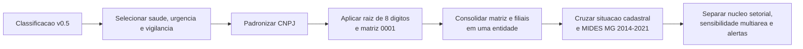
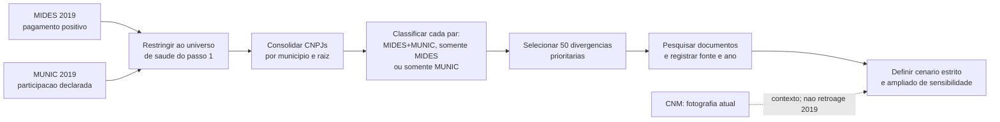
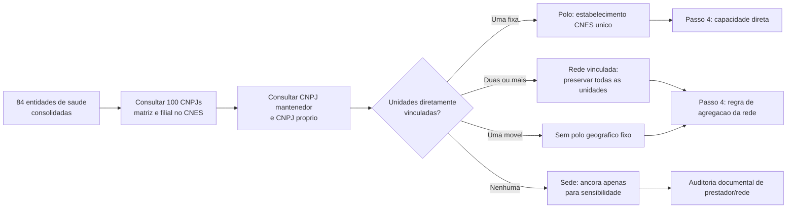
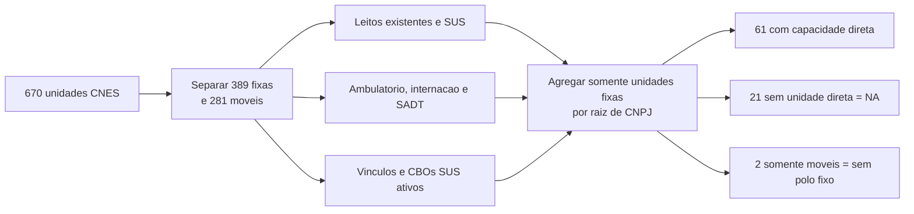
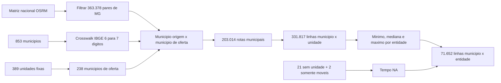
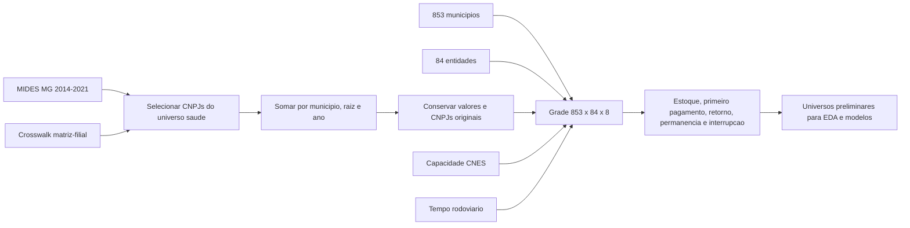
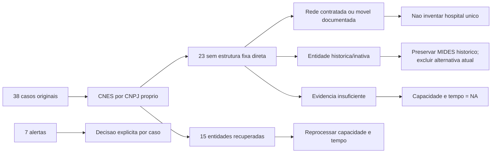
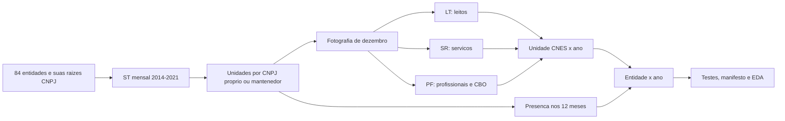

# Metodologia Geral - Modelo Gravitacional De Saude

## Objetivo

Preparar uma base defensavel para o futuro modelo gravitacional de consorcios
de saude em Minas Gerais. Antes de estimar distancia, capacidade assistencial
ou probabilidade de entrada, foi necessario responder perguntas operacionais
que aprofundam os primeiros passos do plano:

1. quais instituicoes de saude existem no universo analitico?
2. que tipo de evidencia existe para cada vinculo municipio-consorcio em 2019?
3. qual estabelecimento, rede ou ancora administrativa pode representar a
   oferta assistencial de cada entidade?
4. quais componentes de capacidade estao registrados diretamente sob os CNPJs
   dos consorcios e podem ser usados sem inventar oferta?
5. qual a impedancia rodoviaria entre cada municipio e a oferta fixa
   documentada, sem reduzir redes a uma sede administrativa?
6. como organizar pagamentos, ausencias e movimentos em um painel anual
   completo sem confundir evidencia financeira com adesao juridica?
7. como reconstruir a oferta CNES de 2014-2021 sem repetir a fotografia atual
   em todos os anos?

A ordem e o estado dos dez passos cientificos estao exclusivamente em
[`PLANO_DE_TRABALHO.md`](PLANO_DE_TRABALHO.md). Este documento registra a
metodologia das entregas executadas; sua numeracao interna nao cria outro plano.

O MIDES continua significando **pagamento observado** e a MUNIC,
**participacao declarada**. Nenhuma das duas fontes e alterada por esta
preparacao.

## Entregas Documentadas

Esta tabela resume produtos tecnicos. O estado dos passos cientificos e seus
criterios de conclusao ficam somente em `PLANO_DE_TRABALHO.md`.

| Passo | Situacao | Produto principal |
|---|---|---|
| 1. Fechar o universo de saude | Concluido | 84 entidades consolidadas e auditadas |
| 2a. Comparar MIDES, MUNIC e documentos | Concluido | 1.311 pares em 2019 e revisao de 50 divergencias |
| 2b. Usar CNM como fotografia atual no recorte saude | Disponivel, mas ainda nao materializado na tabela de saude | Snapshot CNM de 27/08 e piloto CNM x MIDES ja existem em outra frente |
| 3. Definir polo de atracao assistencial | Produto direto concluido; cobertura final em andamento | 84 entidades consultadas por CNPJ mantenedor e proprio |
| 4. Construir capacidade assistencial | Concluido e reprocessado | 670 unidades; medidas separadas para 61 entidades com oferta fixa direta |
| 5. Integrar tempo rodoviario | Concluido e reprocessado | 853 origens, 389 unidades fixas e tres camadas de impedancia |
| 6. Montar o painel analitico anual | Grade preliminar concluida; painel final em andamento | 573.216 observacoes municipio x entidade x ano |
| Complemento. Cobertura assistencial | Auditoria executada; pendencias no passo 3 | 38 casos auditados, 15 recuperados e 7 alertas decididos |
| Complemento temporal do passo 4 | Concluido | 672 entidades-ano e 120 arquivos oficiais auditados |

O item 2b nao bloqueia a proxima etapa: a CNM e uma fotografia atual e nao
prova a composicao em 2019. Caso seja integrada, ela entrara como marcador
descritivo separado, nunca como evidencia historica retroativa.

---

## Passo 1 - Fechar O Universo De Consorcios De Saude

### Em Que Consistiu

Transformar CNPJs classificados como saude em entidades analiticas unicas,
preservando matriz, filiais, situacao cadastral e evidencia de pagamento no
MIDES.

### Antes

- havia CNPJs individuais com classificacao de saude, urgencia/emergencia ou
  vigilancia em saude;
- uma mesma instituicao podia aparecer como matriz e filiais;
- ainda nao se sabia quais entidades efetivamente recebiam pagamentos de
  municipios mineiros entre 2014 e 2021;
- situacao cadastral atual, escopo setorial e uso no MIDES nao estavam juntos
  em uma unica camada.

### Pipeline



### Depois

| Antes | Depois |
|---|---|
| CNPJ isolado | Entidade consolidada pela raiz de oito digitos |
| Filial podia parecer outro consorcio | Filial e matriz sao somadas, com CNPJs originais preservados |
| Pagamentos dispersos | Presenca MIDES identificada por entidade e ano |
| Situacao cadastral sem contexto temporal | Situacao atual preservada, sem retroagir seu significado aos anos do MIDES |

**Resultados:** 100 estabelecimentos classificados em saude formaram 84
entidades consolidadas. Foram incorporadas 16 filiais em 11 raizes. Sessenta e
seis entidades aparecem no MIDES MG; 64 formam o nucleo setorial preliminar e
duas ficam em sensibilidade multiarea. Sete entidades foram marcadas para
revisao de escopo, situacao temporal ou macrogrupo.

### Exemplo Real

O CISMEP possui CNPJs com a mesma raiz `05802877`. Em vez de interpretar cada
estabelecimento como um consorcio independente, a rotina os trata como uma
entidade. Os CNPJs originais continuam disponiveis para auditoria; pagamentos
do mesmo municipio no mesmo ano sao somados antes de qualquer analise.

### O Que O Passo 1 Resolveu E O Que Nao Resolveu

Resolveu o universo tecnico para MG: quais entidades de saude entram, quais
filiais pertencem a qual matriz e quais aparecem no MIDES. Nao afirmou que
todo pagamento prova adesao juridica, nem escolheu ainda qual hospital ou sede
representara a capacidade de atracao de cada consorcio.

---

## Passo 2 - Auditar Os Vinculos Municipio-Consorcio Em 2019

### Em Que Consistiu

Comparar, para cada par `municipio x entidade consolidada`, o pagamento
observado no MIDES e a declaracao de participacao na MUNIC. Em seguida,
qualificar documentalmente as divergencias prioritarias sem reescrever as
fontes originais.

### Antes

- MIDES e MUNIC podiam aparentar discordancia porque usavam CNPJs distintos de
  matriz e filial;
- nao havia uma tabela unica que mostrasse, por par, pagamento, declaracao e
  valor financeiro;
- uma divergencia podia ser erro, mudanca temporal, prestacao de servico ou
  ausencia de documentacao; todas essas possibilidades estavam misturadas.

### Pipeline



### Depois

| Resultado do par | Quantidade | Leitura correta |
|---|---:|---|
| MIDES + MUNIC | 630 | Pagamento e declaracao coincidem em 2019 |
| Somente MIDES | 658 | Pagamento observado, sem declaracao MUNIC no par |
| Somente MUNIC | 23 | Declaracao MUNIC, sem pagamento MIDES positivo no par |
| Uniao | 1.311 | Total de pares com pelo menos uma das duas evidencias |

Dos 653 pares declarados na MUNIC, 630 (96,5%) tambem possuem pagamento
MIDES. Em sentido inverso, a MUNIC cobre 48,9% dos 1.288 pares MIDES. O valor
MIDES da uniao e R$ 379,1 milhoes; 71,3% esta nos pares comuns as duas fontes.

As duas coberturas respondem a denominadores diferentes:

> **Cobertura dos pares MUNIC**
>
> 630 pares comuns ÷ 653 pares MUNIC = **96,5%**

> **Cobertura dos pares MIDES**
>
> 630 pares comuns ÷ 1.288 pares MIDES = **48,9%**

### Exemplos Reais

| Par | Evidencia | Como fica depois da auditoria |
|---|---|---|
| `Itabira x CIAS` | MUNIC em 2019 e documento oficial de 2016 | Vinculo historicamente sustentado; ausencia em lista atual parece mudanca temporal, nao erro automatico |
| `Juiz de Fora x ACISPES` | MIDES positivo; ACISPES diferencia consorciados de cidades atendidas | Mantem pagamento financeiro, mas nao vira filiacao juridica confirmada |
| `Sao Miguel do Anta x SIMSAUDE` | MUNIC em 2019; nenhuma corroboracao localizada, nem na revisao humana | Permanece divergente e nao confirmado |
| `Para de Minas x CISMEP` | MIDES e fonte oficial posterior | Pagamento permanece no modelo financeiro; vinculo institucional entra apenas no cenario ampliado |

### Revisao Documental

A amostra incluiu todos os 23 pares somente MUNIC e os 27 maiores valores
somente MIDES. Cada caso recebeu URL, ano, cobertura temporal, grau de
evidencia e decisao analitica no catalogo versionado.

| Resultado documental | Pares | Tratamento |
|---|---:|---|
| Evidencia anterior ou igual a 2019 | 14 | Pode sustentar vinculo historico no cenario estrito |
| Corroboracao apenas posterior | 33 | Mantem-se como plausivel; entra somente no cenario ampliado |
| Historicamente compativel | 1 | Mantem-se com ressalva temporal |
| Relacao financeira sem filiacao comprovada | 1 | Nao converter pagamento em adesao juridica |
| Nao corroborado com indicio alternativo | 1 | Revisao humana prioritaria; nao promover a vinculo confirmado |

### Sensibilidade: O Que Muda Na Pratica

| Cenario | O que conta como vinculo institucional | Uso |
|---|---|---|
| Estrito | Documento compativel com 2019 | Resultado principal quando a pergunta exigir filiacao |
| Ampliado | Estrito + fonte oficial posterior | Verificar se a conclusao depende de composicoes que podem ter mudado no tempo |

Exemplo hipotetico: se o efeito estimado do tempo de viagem for semelhante no
cenario estrito e no ampliado, a conclusao e robusta a essa incerteza. Se o
sinal ou a magnitude mudar muito, a filiacao temporal precisa ser tratada como
parte central da limitacao. O modelo financeiro MIDES nao exclui pagamentos
apenas porque falta prova juridica: ele mede pagamentos observados.

### Decisoes Validadas

1. Pagamento MIDES e forte indicio de relacao real com o consorcio, mas nao e
   prova juridica suficiente de filiacao.
2. Fonte posterior a 2019 corrobora plausibilidade, mas nao reconstroi
   automaticamente a composicao naquele ano.
3. `Sao Miguel do Anta x SIMSAUDE` continua nao confirmado apos pesquisa e
   revisao humana.

### Limite Da CNM Nesta Etapa

A CNM ja foi raspada, versionada e comparada com maio de 2026; tambem existe
um piloto CNM x MIDES para MG. Ela ainda nao foi adicionada como coluna da
tabela de saude de 2019 porque sua composicao e uma fotografia atual. A
integracao futura recomendada e o marcador `presente_snapshot_cnm`, util para
descricao e sensibilidade, sem alterar a leitura historica do ano de 2019.

---

## Passo 3 - Definir O Polo De Atracao Assistencial

### Em Que Consistiu

Separar a **sede administrativa** de um possivel destino assistencial. A sede
do CNPJ nao foi assumida como hospital, clinica ou rede de atendimento. Cada
matriz e filial do universo consolidado foi consultada na pagina publica do
[CNES/DATASUS](https://cnes.datasus.gov.br/) por duas rotas complementares:
estabelecimentos mantidos pelo CNPJ e estabelecimentos cujo CNPJ proprio e o
da matriz ou filial do consorcio.

### Antes

- a distancia poderia ser calculada ate a sede administrativa do consorcio,
  ainda que ela fosse escritorio ou nao tivesse unidade propria;
- uma rede com unidades em municipios distintos poderia ser artificialmente
  comprimida em um unico municipio;
- a ausencia de estabelecimento sob o CNPJ poderia ser confundida com ausencia
  de atendimento, embora o consorcio possa operar por prestador contratado ou
  outro CNPJ.

### Pipeline



### Depois

| Decisao de polo | Entidades | Leitura e proxima acao |
|---|---:|---|
| Estabelecimento fixo unico | 13 | A localizacao CNES pode ser usada como destino atual; a capacidade e medida no passo 4. |
| Rede vinculada, sem polo unico | 49 | Manter todas as unidades; definir tempo e capacidade por rede, sem escolher uma sede arbitraria. |
| Sem unidade CNES pelo CNPJ | 21 | Nao inferir ausencia de atendimento; auditar rede propria, contrato ou prestador externo. |
| Unidade movel, sem polo fixo | 1 | Nao usar o endereco cadastral como destino de viagem. |

Foram consultados os 100 CNPJs matriz/filial das 84 entidades e retornaram
670 unidades CNES diretamente vinculadas: 638 preservadas pela rota de CNPJ
mantenedor e 32 pela rota de CNPJ proprio, com uma unidade sobreposta
deduplicada. A segunda rota recuperou 15 das 36 entidades antes classificadas
como sem unidade. O passo 4 confirmou 61 entidades com ao menos uma unidade
fixa; CIS/CEN e CIMES continuam apenas com unidades moveis diretamente ligadas.

### Exemplos Reais

| Entidade | Evidencia encontrada | Decisao |
|---|---|---|
| CISARP | Clinica CNES 7918747 encontrada pelo CNPJ proprio em Taiobeiras | Corrige um falso negativo da rota de mantenedora. |
| CONSONORTE | Clinica fixa CNES 0975397 e dois vacimoveis | Unidade fixa e oferta movel permanecem separadas. |
| CISVER | Cinco unidades CNES diretamente vinculadas | Rede; nao se escolhe uma unidade isolada como destino do consorcio. |
| CIMES | Uma unidade movel VACIMOVEL | Sem polo fixo; endereco cadastral nao representa destino assistencial. |

### Decisao Metodologica Para Redes E Casos Sem Unidade Direta

Cada rede e mantida como conjunto de destinos possiveis. Para os casos sem
unidade direta, foi buscada evidencia de rede propria, prestador contratado ou
estabelecimento operado sob outro CNPJ. Cada caso recebe uma saida explicita:

1. `polo_rede_documentada`: entra na analise principal de capacidade e tempo;
2. `prestador_externo_documentado`: entra somente em especificacao explicitamente
   identificada como complementar;
3. `sede_apenas_sensibilidade`: nao entra na medida principal de capacidade;
4. `evidencia_insuficiente`: permanece fora das variaveis de polo/capacidade.

Nao sera imputado o hospital mais proximo nem assumida a sede administrativa
como local de atendimento. Isso preserva a validade do futuro modelo
gravitacional: distancia e capacidade so serao calculadas contra oferta
assistencial documentada.

---

## Passo 4 - Construir A Capacidade Assistencial

### Em Que Consistiu

Consultar ficha, leitos, atendimento e profissionais no CNES para as 670
unidades diretamente vinculadas aos CNPJs consolidados. A agregacao por
entidade utiliza somente unidades fixas e mantem cada componente separado.

### Pipeline



### Resultado

| Indicador | Resultado |
|---|---:|
| Unidades consultadas sem erro final | 670 |
| Unidades fixas | 389 |
| Unidades moveis/itinerantes | 281 |
| Entidades com capacidade fixa direta | 61 |
| Entidades sem unidade no proprio CNPJ | 21 |
| Entidades somente com unidades moveis | 2 |
| Entidades com leitos SUS diretos | 1 |

Das 61 entidades com oferta fixa, 58 possuem ao menos um CBO medico SUS ativo
no retrato. CISREC, CISAP-VP e CISVALEGRAN possuem unidade fixa, mas zero CBO
medico SUS diretamente registrado; isso exige producao ou contratos
complementares, nao permite concluir capacidade zero. Leitos SUS aparecem
somente no CISMEP; portanto, nao sao
medida suficiente para representar sozinhos a atracao de todos os consorcios.

### Exemplos Reais

- CISMAS e CISMARPA tem uma clinica fixa, zero leito e escopo profissional
  cadastrado: capacidade nao e sinonimo de internacao.
- CISVER tem cinco unidades, mas quatro sao moveis; a agregacao usa a unidade
  fixa e preserva as moveis separadamente.
- CIS/CEN tem tres vacimoveis e CIMES tem um; ambos ficam sem polo rodoviario
  fixo.
- CISMEP tem quatro unidades fixas e 11 moveis; os 32 leitos SUS pertencem ao
  Hospital 272 Joias diretamente vinculado.

### Decisao Metodologica

O modelo futuro devera testar separadamente quantidade de unidades, CBOs
medicos SUS, atendimento ambulatorial, SADT e leitos. Nao foi criado indice
composto. CBO e proxy cadastral atual, nao especialidade unica, producao ou
capacidade historica.

### Por Que Leitos SUS Nao Podem Ser A Massa Unica

Na formulacao gravitacional simplificada, a atracao da entidade `j` sobre o
municipio `i` pode ser representada por:

> **Atracao gravitacional**
>
> A(i,j) ∝ M(j) × f[t(i,j)]

`M(j)` e a massa assistencial da entidade. `f[t(i,j)]` diminui com o tempo
rodoviario entre o municipio e a oferta.

Na fotografia atual, 60 das 61 entidades com oferta fixa direta possuem zero
leito SUS sob o proprio CNPJ. Isso nao significa ausencia de servico: clinicas
especializadas podem ter profissionais, atendimento ambulatorial e SADT sem
internacao.

| Entidade | Leitos SUS diretos | Outra evidencia de oferta | Erro se a massa fosse apenas leitos |
|---|---:|---|---|
| CISMAS | 0 | clinica fixa e 10 CBOs medicos somados | atracao seria forçada a zero |
| CISMARPA | 0 | clinica fixa e 18 CBOs medicos somados | estrutura ambulatorial seria ignorada |
| CISVER | 0 | uma unidade fixa e 33 CBOs medicos somados | rede seria tratada como sem oferta |
| CISMEP | 32 | quatro unidades fixas e 22 CBOs medicos somados | seria a unica entidade com massa positiva |

> **Transformacao possivel dos leitos**
>
> log(1 + leitos SUS da entidade j)

Essa transformacao evita o logaritmo de zero, mas nao corrige a falta de
informacao. Os 21 casos sem unidade direta tambem nao possuem capacidade zero:
possuem capacidade nao observada nesta etapa (`NA`).

---

## Passo 5 - Integrar O Tempo Rodoviario

### Em Que Consistiu

Ligar os 853 municipios de Minas Gerais aos municipios das 389 unidades CNES
fixas diretamente vinculadas aos consorcios. A impedancia e calculada ate a
oferta documentada, nao automaticamente ate a sede administrativa.

### Fonte

Foi usada a [matriz de distancias rodoviarias e duracao de viagens para
municipios brasileiros](https://rfsaldanha.github.io/data-projects/brazil_road_distances.html),
depositada no [Zenodo 11400243](https://zenodo.org/records/11400243). A fonte
usa sedes municipais IBGE 2010 e rotas OSRM/OpenStreetMap com perfil de
automovel. O arquivo `dist_brasil.rds` foi validado pelo MD5 oficial
`39f71b10ddf9fda7c53e2b39fa6bd202`.

### Antes

- havia localizacao das unidades, mas nenhuma medida rodoviaria integrada;
- redes podiam ser reduzidas incorretamente a uma sede;
- unidades moveis e entidades sem unidade direta podiam receber destinos
  artificiais;
- o pedido original de viagem as 10h30 de sabado nao era atendido pela fonte
  estatica disponivel.

### Pipeline



### Regras

1. Todos os 853 municipios entram como origens, inclusive os que nao possuem
   pagamento de saude no MIDES.
2. Somente unidades fixas diretamente vinculadas entram como destinos.
3. A rota e entre sedes municipais; nao representa deslocamento porta a porta.
4. Origem e destino no mesmo municipio recebem zero e a flag
   `mesmo_municipio_destino = TRUE`.
5. A camada por unidade e a fonte de verdade. Minimo, mediana e maximo sao
   resumos de sensibilidade para redes com varios destinos.
6. Ausencia de unidade fixa recebe `NA`, nunca zero.

Para uma entidade `j` com conjunto de unidades fixas `U(j)`, os resumos sao:

> **Tempos da rede**
>
> - t_min(i,j) = menor tempo entre o municipio `i` e as unidades de `U(j)`
> - t_med(i,j) = mediana dos tempos entre o municipio `i` e as unidades de `U(j)`
> - t_max(i,j) = maior tempo entre o municipio `i` e as unidades de `U(j)`

Esses tres valores descrevem a dispersao territorial da rede; nenhum deles e
automaticamente a impedancia definitiva do modelo.

### Resultado

| Produto | Unidade da linha | Linhas |
|---|---|---:|
| municipio-destino | municipio x municipio de oferta | 203.014 |
| municipio-unidade | municipio x unidade CNES fixa | 331.817 |
| municipio-entidade | municipio x entidade consolidada | 71.652 |

Os 363.378 pares rodoviarios entre os 853 municipios de MG estao completos.
A cobertura final possui 238 municipios de oferta, 389 unidades fixas e 61
entidades com tempo. Trinta e seis entidades sem unidade direta e duas somente
moveis permanecem com tempo ausente.

### Exemplos Reais

| Origem | Entidade | Resultado | Leitura |
|---|---|---:|---|
| Igarape | CISMEP | minimo 0; mediana 4,2; maximo 8,4 min | rede com unidades em Igarape e Sao Joaquim de Bicas |
| Para de Minas | CISMEP | minimo 58,3 min | unidade mais proxima pode diferir da sede administrativa |
| Itajuba | CISMAS | 0 min | mesma cidade; nao significa viagem porta a porta nula |
| Abaete | CISVER | 252,2 min | somente a unidade fixa entra; quatro vacimoveis ficam fora |

### Limites

- a duracao e estatica e nao representa transito as 10h30 de sabado;
- a matriz assume ida e volta com a mesma duracao;
- usa a sede municipal IBGE 2010, nao o endereco exato do CNES;
- nao reconstroi mudancas viarias anuais entre 2014 e 2021;
- a unidade mais proxima pode nao oferecer a especialidade procurada;
- ainda falta definir quais entidades eram alternativas plausiveis para cada
  municipio.

---

## Passo 6 - Montar O Painel Analitico Anual

### Em Que Consistiu

Transformar pagamentos MIDES, identidade matriz-filial, capacidade CNES e
tempo rodoviario em uma base longitudinal com unidade:

> **Unidade da observacao**
>
> observacao(i,j,t) = municipio `i` × entidade `j` × ano `t`

O painel prepara a EDA e os modelos. Ele nao afirma que todas as 84 entidades
eram escolhas reais para todos os municipios.

### Antes

- pagamentos apareciam apenas quando observados;
- matriz e filial podiam gerar linhas separadas;
- ausencias, retornos e interrupcoes nao estavam no mesmo produto;
- um pagamento em 2014 podia ser confundido com entrada;
- tempo e capacidade estavam em tabelas separadas.

### Pipeline



### Regra Temporal

Seja `V(i,j,t)` o valor MIDES do municipio `i` para a entidade `j` no ano `t`.
A presenca financeira e definida por:

> **Presenca financeira**
>
> P(i,j,t) = 1 quando V(i,j,t) > 0; caso contrario, P(i,j,t) = 0

| Condicao | Evento | Leitura |
|---|---|---|
| t = 2014 e P(i,j,t) = 1 | estoque inicial | havia pagamento no inicio da janela; a entrada real e desconhecida |
| P(i,j,t) = 1 e P(i,j,t − 1) = 1 | permanencia | pagamento positivo consecutivo |
| P(i,j,t) = 1, P(i,j,t − 1) = 0 e nunca houve pagamento | primeiro pagamento | primeira aparicao financeira observada |
| P(i,j,t) = 1, P(i,j,t − 1) = 0 e ja houve pagamento | retorno | pagamento reaparece apos ausencia |
| P(i,j,t) = 0 e P(i,j,t − 1) = 1 | interrupcao | deixa de haver pagamento positivo |
| demais casos | ausencia | sem pagamento positivo |

Esses eventos descrevem pagamentos. Nao provam adesao, desligamento ou retorno
juridico.

### Consolidacao Matriz-Filial

Quando um municipio paga para matriz e filial da mesma raiz no mesmo ano, os
valores sao somados em uma linha da entidade e os CNPJs originais permanecem
registrados. Isso ocorreu em 21 combinacoes municipio-entidade-ano.

Se `C(j)` e o conjunto de CNPJs pertencentes a entidade consolidada `j`, entao:

> **Consolidacao matriz-filial**
>
> V(i,j,t) = soma dos pagamentos V(i,c,t) para todos os CNPJs `c` de C(j)

### Resultados Validados

| Medida | Resultado |
|---|---:|
| grade completa | 573.216 linhas |
| linhas MIDES de saude antes da consolidacao | 10.080 |
| linhas municipio-entidade-ano consolidadas | 10.059 |
| pares municipio-entidade com algum pagamento | 1.618 |
| estoque positivo em 2014 | 1.192 |
| primeiros pagamentos depois de 2014 | 426 |
| retornos observados | 252 |
| permanencias observadas | 8.188 |
| interrupcoes observadas | 533 |
| pares com mais de uma transicao | 329 |
| valor financeiro preservado | R$ 3.101.980.422,83 |

A dimensao da grade completa decorre diretamente de:

> **Dimensao do painel**
>
> 853 municipios × 84 entidades × 8 anos = **573.216 observacoes**

Dos 853 municipios, 843 possuem alguma linha MIDES de saude. Os dez restantes
continuam na grade com zeros para evitar selecionar o universo pela resposta.

### Exemplos Reais

| Caso | Sequencia observada | Interpretacao |
|---|---|---|
| Sete Lagoas x CISMEP, 2016 | primeiro valor positivo: R$ 12,70 milhoes | primeiro pagamento observado, nao data juridica de adesao |
| Muriae x CISLESTE, 2021 | pagamento anterior, zero em 2020 e R$ 4,16 milhoes em 2021 | retorno financeiro observado |
| Aguanil x CISMARG | positivo em 2018, zero em 2019 e positivo em 2020 | interrupcao seguida de retorno |
| Igarape x CISMEP, 2019 | matriz e filial somam R$ 4,74 milhoes | uma entidade com dois CNPJs originais preservados |

### Universos Preliminares

| Bloco futuro | Marcador atual | Pendencia |
|---|---|---|
| primeiro pagamento | sem pagamento anterior e entidade ativa em t − 1 | limitar alternativas territoriais |
| entrada ou retorno | ausente em t − 1 e entidade ativa em t − 1 | decidir se retorno sera separado |
| interrupcao | pagamento em t − 1 | definir sobrevivencia e censura |
| intensidade | pagamento positivo em `t` | escolher deflacao e normalizacao |

O universo estadual e apenas um limite superior. Oferecer todos os consorcios
ativos de MG a todo municipio nao e uma hipotese substantiva pronta para
estimacao.

### Limites

1. Presenca significa pagamento MIDES, nao filiacao juridica.
2. Pares positivos em 2014 sao censurados a esquerda.
3. O painel original repete a fotografia CNES de 2026; a nova serie historica
   esta validada separadamente e ainda precisa ser integrada ao painel.
4. Vinte e tres entidades permanecem sem estrutura fixa CNES direta; algumas
   possuem rede movel ou contratada que exige outra especificacao territorial.
5. Populacao, RCL, regiao de saude, bacia e mandato ainda nao foram integrados.
6. O conjunto final de alternativas ainda precisa de regra substantiva.

---

## Complemento - Completar A Cobertura Assistencial

### Em Que Consistiu

Revisar os 36 casos originalmente sem unidade CNES direta e os dois casos
classificados como somente moveis. A auditoria corrigiu a busca CNES, pesquisou
redes contratadas ou moveis e registrou uma decisao para os sete alertas de
escopo, situacao cadastral ou macrogrupo.

### Antes

- a consulta por CNPJ mantenedor deixava unidades com CNPJ proprio do consorcio
  fora do resultado;
- “sem unidade”, “somente movel”, “rede contratada” e “entidade historica”
  apareciam como lacunas semelhantes;
- os sete alertas indicavam revisao, mas ainda nao tinham decisao operacional;
- usar a sede administrativa como correcao produziria um polo ficticio.

### Pipeline



### Resultado

| Indicador | Antes | Depois |
|---|---:|---:|
| unidades CNES diretamente vinculadas | 639 | 670 |
| unidades fixas | 366 | 389 |
| entidades com estrutura fixa direta | 46 | 61 |
| entidades sem unidade CNES direta | 36 | 21 |
| entidades somente com unidades moveis diretas | 2 | 2 |
| alertas com decisao registrada | 0 | 7 |

Das 38 entidades reavaliadas, 15 foram recuperadas pela API oficial de busca
por CNPJ proprio. As 23 restantes nao foram convertidas em capacidade zero:
duas sao historicas e inativas com MIDES, cinco possuem oferta ou rede movel,
indireta ou planejada sem polo fixo atual confirmado, uma esta ativa sem MIDES
e sem evidencia assistencial suficiente, e 15 estao fora do universo modelavel
atual por inatividade e ausencia de MIDES.

### Exemplos Reais

| Caso | Antes | Evidencia | Decisao |
|---|---|---|---|
| CISARP | sem unidade direta | clinica CNES 7918747 pelo CNPJ proprio | unidade fixa atual; temporalidade ainda deve ser validada |
| CONSONORTE | sem unidade direta | clinica CNES 0975397 e dois vacimoveis | clinica e oferta movel separadas |
| CIS/CEN | somente unidades moveis | contratos para media/alta complexidade | rede credenciada sem hospital unico; tempo fixo continua `NA` |
| CIAS | sem unidade direta | gestao regional do SAMU em varios municipios | modelar bases/central em especificacao propria |
| CIS/UBA | matriz inapta com MIDES ate 2020 | nenhuma unidade CNES atual | manter historia financeira e excluir alternativa atual |

### Sete Alertas

- CISREC e CONVALES permanecem em analise de sensibilidade multiarea;
- CIS/UBA e o CNPJ `02287790` permanecem apenas como entidades historicas;
- CIMESMI fica fora do modelo de saude ate surgir evidencia assistencial;
- CODERI fica fora por inatividade e ausencia de MIDES;
- CICONZ tem vigilancia/zoonoses reconhecida como tema de saude, mas fica fora
  do modelo por inatividade e ausencia de MIDES.

### Limites

1. Unidade CNES atual nao prova que a mesma estrutura existia em 2014-2021.
2. Rede contratada sem prestador e endereco por ano nao recebe tempo nem massa.
3. Unidade movel nao possui um destino rodoviario fixo equivalente a hospital.
4. Unidade fixa com zero CBO medico SUS registrado nao significa capacidade
   zero; CISREC, CISAP-VP e CISVALEGRAN exigem producao ou contratos adicionais.

---

## Complemento Temporal Do Passo 4 - Cobertura E Capacidade CNES

### Em Que Consistiu

Substituir a repeticao da fotografia CNES de 2026 por uma camada historica
compativel com o MIDES de 2014 a 2021. A unidade de capacidade passou a ser:

> **entidade de saude x ano, medida na competencia de dezembro**

Presenca cadastral tambem foi verificada nos 12 meses de cada ano para medir o
quanto dezembro pode subestimar unidades que aparecem apenas em parte do ano.

### Antes

- as 389 unidades fixas observadas em 03/09/2026 eram repetidas nos oito anos
  do painel;
- uma estrutura criada depois de 2021 podia parecer disponivel em 2014;
- uma unidade historica encerrada antes de 2026 desaparecia de toda a serie;
- leitos, servicos e profissionais atuais podiam ser usados como se fossem
  invariantes no tempo.

### Fontes E Ligacoes

Foram usados arquivos de disseminacao oficial do CNES/DATASUS:

| Tabela | Periodicidade usada | O que mede |
|---|---|---|
| `ST` | todos os 96 meses | existencia, municipio, tipo, CNPJ proprio e mantenedor |
| `LT` | dezembro de cada ano | leitos existentes e leitos SUS por unidade |
| `SR` | dezembro de cada ano | servico especializado e classificacao, com atendimento SUS |
| `PF` | dezembro de cada ano | profissionais, CBO e carga horaria SUS; somente agregados |

O encadeamento usa o codigo CNES. Primeiro, `ST` encontra a unidade quando o
CNPJ proprio ou mantenedor pertence a uma das 84 raizes. Depois `LT`, `SR` e
`PF` sao ligados ao mesmo codigo CNES. Assim, uma linha de profissional com
CNPJ vazio nao e perdida quando pertence a uma unidade ja identificada.

Nenhum nome, CPF ou CNS de profissional e gravado. Apenas contagens distintas,
CBOs e carga horaria agregada sao preservados.

### Pipeline



### Regra Temporal

A capacidade principal de uma entidade `j` no ano `t` e a soma ou uniao das
unidades fixas diretamente vinculadas em dezembro:

> **Leitos SUS diretos(j,t)** = soma dos leitos SUS das unidades fixas da
> entidade `j` em dezembro de `t`.

> **Servicos SUS diretos(j,t)** = numero de pares distintos de servico e
> classificacao registrados nas unidades fixas em dezembro de `t`.

> **Profissionais SUS diretos(j,t)** = numero de profissionais distintos
> registrados como SUS nas unidades fixas em dezembro de `t`.

As formulas acima medem somente oferta diretamente vinculada no CNES. Elas nao
somam hospitais de terceiros, prestadores contratados sem CNPJ vinculado ou a
capacidade geral do municipio-sede.

Quando nao ha unidade fixa em dezembro, `n_unidades_fixas = 0`, mas leitos,
servicos e profissionais ficam vazios. Isso evita interpretar falta de
cobertura direta como capacidade assistencial igual a zero.

### Resultados Validados

| Indicador | 2014 | 2021 |
|---|---:|---:|
| entidades com unidade fixa em dezembro | 40 | 60 |
| unidades fixas em dezembro | 48 | 68 |
| unidades moveis em dezembro | 126 | 224 |
| servicos SUS distintos, somados por entidade | 226 | 319 |
| profissionais SUS distintos, somados por entidade | 1.169 | 3.004 |
| leitos SUS diretamente vinculados | 26 | 0 |

Produtos e controles:

- 672 entidades-ano, resultado de `84 x 8`;
- 1.868 unidades-ano observadas em dezembro;
- 120 arquivos oficiais registrados com URL, tamanho e SHA-256;
- 3 entidades-ano sem fixa em dezembro, mas com fixa em outro mes;
- 12 entidades-ano com mais unidades fixas em algum mes do que em dezembro;
- 412 entidades-ano combinaram pagamento MIDES e unidade fixa direta;
- 91 tiveram pagamento, mas nenhuma unidade fixa direta em dezembro;
- uma teve unidade fixa sem pagamento MIDES: CONSONORTE em 2021;
- 168 nao tiveram pagamento nem unidade fixa direta.

Os 91 casos nao provam erro do MIDES ou do CNES. Podem representar rede
contratada, oferta movel, estrutura de terceiro, registro cadastral incompleto
ou pagamento por servico sem unidade propria. Eles formam uma pauta de EDA e
sensibilidade, nao uma regra automatica de exclusao.

### Exemplos Reais

| Caso | Resultado historico | Leitura correta |
|---|---|---|
| CISMARG, CNES `6214371`, 2016 | presente de janeiro a novembro; ausente em dezembro | dezembro mede tres fixas; a sensibilidade anual registra quatro, sem afirmar fechamento |
| CISMEP, 2014-2020 | duas fixas em dezembro; em 2021, uma fixa em dezembro e duas em algum mes | as quatro fixas e 11 moveis de 2026 nao podem ser retroagidas |
| CONSONORTE, 2021 | CNES `0975397` aparece somente em dezembro; um profissional SUS e nenhum pagamento MIDES | estrutura cadastrada e fluxo financeiro sao dimensoes diferentes |
| Consorcio do Alto Sao Francisco, raiz `64486822` | 26 leitos SUS diretos em 2014-2016 e nenhuma unidade direta depois | a serie nao autoriza concluir perda de acesso; pode ter mudado a forma de provisao |
| CIAS, 2015 | unidade fixa aparece apenas em janeiro | dezembro perde o registro; usar como sensibilidade, nao como capacidade anual imputada |

### Limites

1. Dezembro e uma fotografia, nao media, estoque diario ou producao anual.
2. Presenca em algum mes reduz falso negativo cadastral, mas nao define qual
   capacidade deve valer para o ano inteiro.
3. Mudanca de CNPJ, mantenedor ou tipo CNES pode refletir reorganizacao
   cadastral, nao abertura ou fechamento real.
4. Servico e CBO medem cadastro; nao garantem producao, disponibilidade ou
   atendimento efetivo aos municipios consorciados.
5. Contagens somadas por entidade podem contar o mesmo profissional em mais de
   uma entidade; os microdados identificados nao foram retidos.
6. A camada cobre oferta diretamente vinculada ao CNPJ. Redes indiretas ainda
   precisam de prestador e vigencia documental.

---

## Reproducibilidade E Limites

Os produtos quantitativos das entregas executadas usam bases locais processadas do
projeto. A qualificacao documental da amostra usou fontes oficiais ou
institucionais na internet, com URL e interpretacao preservadas. Scripts,
testes e relatorios estao em `analises/modelo_gravitacional_saude/`; resultados
derivados locais ficam em `outputs/`.

### Ordem De Execucao

```powershell
Rscript analises/modelo_gravitacional_saude/01_fechar_universo_saude_mg.R
Rscript analises/modelo_gravitacional_saude/02_cotejar_mides_munic_saude_2019.R
Rscript analises/modelo_gravitacional_saude/03_revisar_divergencias_documentais_2019.R
Rscript analises/modelo_gravitacional_saude/04_definir_polos_atracao_saude.R
Rscript analises/modelo_gravitacional_saude/05_construir_capacidade_assistencial_saude.R
Rscript analises/modelo_gravitacional_saude/06_integrar_tempo_rodoviario_saude.R
Rscript analises/modelo_gravitacional_saude/07_montar_painel_analitico_saude.R
Rscript analises/modelo_gravitacional_saude/08_completar_cobertura_assistencial_saude.R
python -m pip install -r analises/modelo_gravitacional_saude/requirements_cnes_historico.txt
python analises/modelo_gravitacional_saude/09_temporalizar_cnes_historico_saude.py
```

Cada script possui um teste correspondente em `tests/`. Os resultados locais
ficam em `outputs/`, as auditorias em `checks/` e as evidencias documentais em
`evidencias/`. O [`DICIONARIO_TECNICO.md`](DICIONARIO_TECNICO.md) identifica
entradas e saidas; a [`LINHA_DO_TEMPO_PASSOS.md`](LINHA_DO_TEMPO_PASSOS.md)
acompanha o caso Igarape x CISMEP ao longo das entregas executadas.

### Proximo Passo

Executar a EDA usando a camada historica, definir o conjunto de alternativas
plausiveis e integrar controles anuais validados antes da estimacao. Para redes
moveis ou contratadas, a alternativa deve representar bases ou prestadores
documentados, nao a sede administrativa. A CNM pode entrar como marcador atual
de sensibilidade, sem retroagir sua composicao para 2019.
