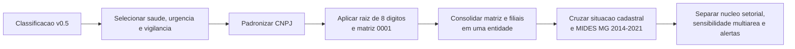
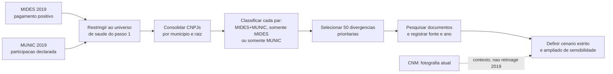
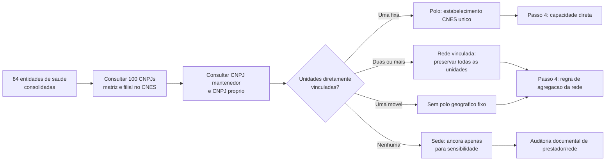
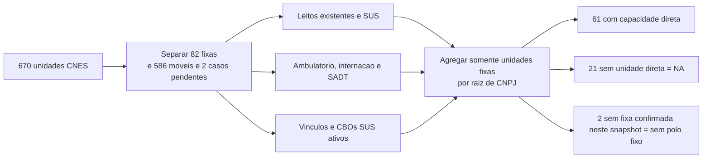
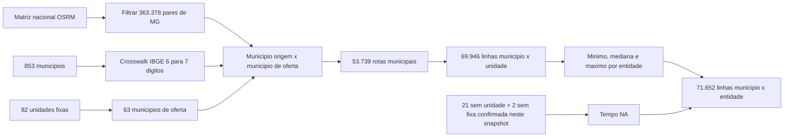
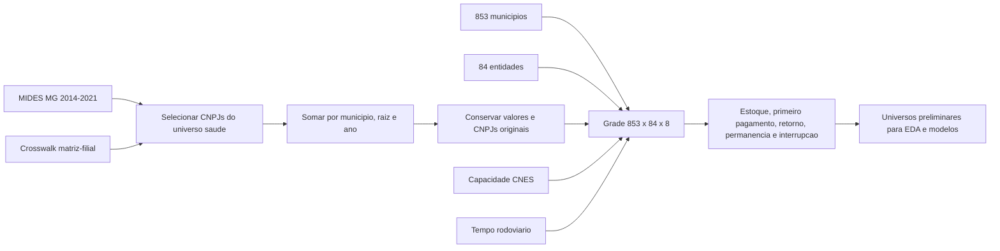
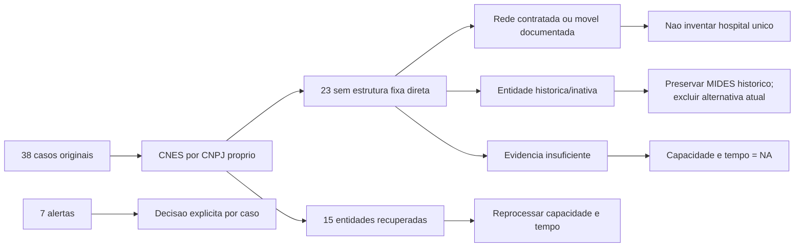
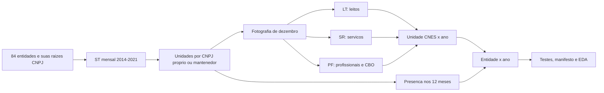

# Metodologia Geral - Modelo Gravitacional De Saude

> Estado vigente: v1 fechada em 24/09/2026 para o nucleo financeiro e a oferta
> clinica direta de dezembro. Comece pelo README e pela secao final
> "Fechamento Da Base V1". As secoes anteriores preservam o historico;
> nao exigem reabrir todas as pendencias para utilizar esta entrega.

> Marco de 16/09/2026: filtro funcional concluido, com 63 destinos
> clinicos fixos, 20 estruturas fixas nao clinicas e 587 moveis nas 670 unidades.
> Historico: 398 unidades-ano clinicas, 74 nao clinicas e 1.396 moveis.
> As secoes datadas preservam a evolucao das camadas anteriores; para preparar
> o painel final, usar a elegibilidade do script 11 descrita ao final.

## Objetivo

Preparar uma base defensavel para o futuro modelo gravitacional de consorcios
de saude em Minas Gerais. Antes de estimar distancia, capacidade assistencial
ou probabilidade de entrada, foi necessario responder perguntas operacionais
que aprofundam os primeiros passos do plano:

- quais instituicoes de saude existem no universo analitico?
- que tipo de evidencia existe para cada vinculo municipio-consorcio em 2019?
- qual estabelecimento, rede ou ancora administrativa pode representar a
   oferta assistencial de cada entidade?
- quais componentes de capacidade estao registrados diretamente sob os CNPJs
   dos consorcios e podem ser usados sem inventar oferta?
- qual a impedancia rodoviaria entre cada municipio e a oferta fixa
   documentada, sem reduzir redes a uma sede administrativa?
- como organizar pagamentos, ausencias e movimentos em um painel anual
   completo sem confundir evidencia financeira com adesao juridica?
- como reconstruir a oferta CNES de 2014-2021 sem repetir a fotografia atual
   em todos os anos?

A ordem e o estado dos dez passos cientificos estao exclusivamente em
[`PLANO_DE_TRABALHO.md`](PLANO_DE_TRABALHO.md). Este documento registra a
metodologia das entregas executadas; sua numeracao interna nao cria outro plano.

O MIDES continua significando **pagamento observado** e a MUNIC,
**participacao declarada**. Nenhuma das duas fontes e alterada por esta
preparacao.

## Entregas Documentadas

Esta tabela resume produtos tecnicos. O estado dos passos cientificos e seus
criterios de conclusao ficam somente em `PLANO_DE_TRABALHO.md`.

| Passo | Situacao | Produto principal |
|---|---|---|
| 1. Fechar o universo de saude | Concluido | 84 entidades consolidadas e auditadas |
| 2a. Comparar MIDES, MUNIC e documentos | Concluido | 1.311 pares em 2019 e revisao de 50 divergencias |
| 2b. Usar CNM como fotografia atual no recorte saude | Disponivel, mas ainda nao materializado na tabela de saude | Snapshot CNM de 27/08 e piloto CNM x MIDES ja existem em outra frente |
| 3. Definir polo de atracao assistencial | Concluido com exclusoes explicitas | 84 entidades consultadas; filtro funcional e rodada documental fechados em 16/09 |
| 4. Construir capacidade assistencial | Concluido e reprocessado | 670 unidades; medidas separadas para 61 entidades com oferta fixa direta |
| 5. Integrar tempo rodoviario | Concluido e reprocessado | 853 origens, 82 unidades fixas e tres camadas de impedancia |
| 6. Montar o painel analitico anual | Concluido como grade e recorte clinico direto candidato; suficiencia em avaliacao no passo 7 | 661.928 observacoes municipio x entidade x ano, preservando as 573.216 originais |
| Complemento. Cobertura assistencial | Decisoes de uso concluidas | 38 casos iniciais, 91 entidades-ano e rodada documental das 21 nao prioritarias |
| Complemento temporal do passo 4 | Concluido | 672 entidades-ano e 120 arquivos oficiais auditados |

O item 2b nao bloqueia a proxima etapa: a CNM e uma fotografia atual e nao
prova a composicao em 2019. Caso seja integrada, ela entrara como marcador
descritivo separado, nunca como evidencia historica retroativa.

---

## Passo 1 - Fechar O Universo De Consorcios De Saude

### Em Que Consistiu

Transformar CNPJs classificados como saude em entidades analiticas unicas,
preservando matriz, filiais, situacao cadastral e evidencia de pagamento no
MIDES.

### Antes

- havia CNPJs individuais com classificacao de saude, urgencia/emergencia ou
  vigilancia em saude;
- uma mesma instituicao podia aparecer como matriz e filiais;
- ainda nao se sabia quais entidades efetivamente recebiam pagamentos de
  municipios mineiros entre 2014 e 2021;
- situacao cadastral atual, escopo setorial e uso no MIDES nao estavam juntos
  em uma unica camada.

### Pipeline



### Depois

| Antes | Depois |
|---|---|
| CNPJ isolado | Entidade consolidada pela raiz de oito digitos |
| Filial podia parecer outro consorcio | Filial e matriz sao somadas, com CNPJs originais preservados |
| Pagamentos dispersos | Presenca MIDES identificada por entidade e ano |
| Situacao cadastral sem contexto temporal | Situacao atual preservada, sem retroagir seu significado aos anos do MIDES |

**Resultados:** 100 estabelecimentos classificados em saude formaram 84
entidades consolidadas. Foram incorporadas 16 filiais em 11 raizes. Sessenta e
seis entidades aparecem no MIDES MG; 64 formam o nucleo setorial preliminar e
duas ficam em sensibilidade multiarea na classificacao v0.5. A auditoria de
16/09 acrescentou CIMBAJE e um alerta estatutario para CISPARA, sem reescrever
a classificacao original ou aprovar uma amostra final. Sete entidades foram marcadas para
revisao de escopo, situacao temporal ou macrogrupo.

### Exemplo Real

O CISMEP possui CNPJs com a mesma raiz `05802877`. Em vez de interpretar cada
estabelecimento como um consorcio independente, a rotina os trata como uma
entidade. Os CNPJs originais continuam disponiveis para auditoria; pagamentos
do mesmo municipio no mesmo ano sao somados antes de qualquer analise.

### O Que O Passo 1 Resolveu E O Que Nao Resolveu

Resolveu o universo tecnico para MG: quais entidades de saude entram, quais
filiais pertencem a qual matriz e quais aparecem no MIDES. Nao afirmou que
todo pagamento prova adesao juridica, nem escolheu ainda qual hospital ou sede
representara a capacidade de atracao de cada consorcio.

---

## Passo 2 - Auditar Os Vinculos Municipio-Consorcio Em 2019

### Em Que Consistiu

Comparar, para cada par `municipio x entidade consolidada`, o pagamento
observado no MIDES e a declaracao de participacao na MUNIC. Em seguida,
qualificar documentalmente as divergencias prioritarias sem reescrever as
fontes originais.

### Antes

- MIDES e MUNIC podiam aparentar discordancia porque usavam CNPJs distintos de
  matriz e filial;
- nao havia uma tabela unica que mostrasse, por par, pagamento, declaracao e
  valor financeiro;
- uma divergencia podia ser erro, mudanca temporal, prestacao de servico ou
  ausencia de documentacao; todas essas possibilidades estavam misturadas.

### Pipeline



### Depois

| Resultado do par | Quantidade | Leitura correta |
|---|---:|---|
| MIDES + MUNIC | 630 | Pagamento e declaracao coincidem em 2019 |
| Somente MIDES | 658 | Pagamento observado, sem declaracao MUNIC no par |
| Somente MUNIC | 23 | Declaracao MUNIC, sem pagamento MIDES positivo no par |
| Uniao | 1.311 | Total de pares com pelo menos uma das duas evidencias |

Dos 653 pares declarados na MUNIC, 630 (96,5%) tambem possuem pagamento
MIDES. Em sentido inverso, a MUNIC cobre 48,9% dos 1.288 pares MIDES. O valor
MIDES da uniao e R$ 379,1 milhoes; 71,3% esta nos pares comuns as duas fontes.

As duas coberturas respondem a denominadores diferentes:

> **Cobertura dos pares MUNIC**
>
> 630 pares comuns ÷ 653 pares MUNIC = **96,5%**

> **Cobertura dos pares MIDES**
>
> 630 pares comuns ÷ 1.288 pares MIDES = **48,9%**

### Exemplos Reais

| Par | Evidencia | Como fica depois da auditoria |
|---|---|---|
| `Itabira x CIAS` | MUNIC em 2019 e documento oficial de 2016 | Vinculo historicamente sustentado; ausencia em lista atual parece mudanca temporal, nao erro automatico |
| `Juiz de Fora x ACISPES` | MIDES positivo; ACISPES diferencia consorciados de cidades atendidas | Mantem pagamento financeiro, mas nao vira filiacao juridica confirmada |
| `Sao Miguel do Anta x SIMSAUDE` | MUNIC em 2019; nenhuma corroboracao localizada, nem na revisao humana | Permanece divergente e nao confirmado |
| `Para de Minas x CISMEP` | MIDES e fonte oficial posterior | Pagamento permanece no modelo financeiro; vinculo institucional entra apenas no cenario ampliado |

### Revisao Documental

A amostra incluiu todos os 23 pares somente MUNIC e os 27 maiores valores
somente MIDES. Cada caso recebeu URL, ano, cobertura temporal, grau de
evidencia e decisao analitica no catalogo versionado.

| Resultado documental | Pares | Tratamento |
|---|---:|---|
| Evidencia anterior ou igual a 2019 | 14 | Pode sustentar vinculo historico no cenario estrito |
| Corroboracao apenas posterior | 33 | Mantem-se como plausivel; entra somente no cenario ampliado |
| Historicamente compativel | 1 | Mantem-se com ressalva temporal |
| Relacao financeira sem filiacao comprovada | 1 | Nao converter pagamento em adesao juridica |
| Nao corroborado com indicio alternativo | 1 | Revisao humana prioritaria; nao promover a vinculo confirmado |

### Sensibilidade: O Que Muda Na Pratica

| Cenario | O que conta como vinculo institucional | Uso |
|---|---|---|
| Estrito | Documento compativel com 2019 | Resultado principal quando a pergunta exigir filiacao |
| Ampliado | Estrito + fonte oficial posterior | Verificar se a conclusao depende de composicoes que podem ter mudado no tempo |

Exemplo hipotetico: se o efeito estimado do tempo de viagem for semelhante no
cenario estrito e no ampliado, a conclusao e robusta a essa incerteza. Se o
sinal ou a magnitude mudar muito, a filiacao temporal precisa ser tratada como
parte central da limitacao. O modelo financeiro MIDES nao exclui pagamentos
apenas porque falta prova juridica: ele mede pagamentos observados.

### Decisoes Validadas

1. Pagamento MIDES e forte indicio de relacao real com o consorcio, mas nao e
   prova juridica suficiente de filiacao.
2. Fonte posterior a 2019 corrobora plausibilidade, mas nao reconstroi
   automaticamente a composicao naquele ano.
3. `Sao Miguel do Anta x SIMSAUDE` continua nao confirmado apos pesquisa e
   revisao humana.

### Limite Da CNM Nesta Etapa

A CNM ja foi raspada, versionada e comparada com maio de 2026; tambem existe
um piloto CNM x MIDES para MG. Ela ainda nao foi adicionada como coluna da
tabela de saude de 2019 porque sua composicao e uma fotografia atual. A
integracao futura recomendada e o marcador `presente_snapshot_cnm`, util para
descricao e sensibilidade, sem alterar a leitura historica do ano de 2019.

---

## Passo 3 - Definir O Polo De Atracao Assistencial

### Em Que Consistiu

Separar a **sede administrativa** de um possivel destino assistencial. A sede
do CNPJ nao foi assumida como hospital, clinica ou rede de atendimento. Cada
matriz e filial do universo consolidado foi consultada na pagina publica do
[CNES/DATASUS](https://cnes.datasus.gov.br/) por duas rotas complementares:
estabelecimentos mantidos pelo CNPJ e estabelecimentos cujo CNPJ proprio e o
da matriz ou filial do consorcio.

### Antes

- a distancia poderia ser calculada ate a sede administrativa do consorcio,
  ainda que ela fosse escritorio ou nao tivesse unidade propria;
- uma rede com unidades em municipios distintos poderia ser artificialmente
  comprimida em um unico municipio;
- a ausencia de estabelecimento sob o CNPJ poderia ser confundida com ausencia
  de atendimento, embora o consorcio possa operar por prestador contratado ou
  outro CNPJ.

### Pipeline



### Depois

| Decisao de polo | Entidades | Leitura e proxima acao |
|---|---:|---|
| Estabelecimento fixo unico | 13 | A localizacao CNES pode ser usada como destino atual; a capacidade e medida no passo 4. |
| Rede vinculada, sem polo unico | 49 | Manter todas as unidades; definir tempo e capacidade por rede, sem escolher uma sede arbitraria. |
| Sem unidade CNES pelo CNPJ | 21 | Nao inferir ausencia de atendimento; auditar rede propria, contrato ou prestador externo. |
| Unidade movel, sem polo fixo | 1 | Nao usar o endereco cadastral como destino de viagem. |

Foram consultados os 100 CNPJs matriz/filial das 84 entidades e retornaram
670 unidades CNES diretamente vinculadas: 638 preservadas pela rota de CNPJ
mantenedor e 32 pela rota de CNPJ proprio, com uma unidade sobreposta
deduplicada. A segunda rota recuperou 15 das 36 entidades antes classificadas
como sem unidade. O passo 4 confirmou 61 entidades com ao menos uma unidade
fixa; CIS/CEN e CIMES continuam apenas com unidades moveis diretamente ligadas.

### Exemplos Reais

| Entidade | Evidencia encontrada | Decisao |
|---|---|---|
| CISARP | Clinica CNES 7918747 encontrada pelo CNPJ proprio em Taiobeiras | Corrige um falso negativo da rota de mantenedora. |
| CONSONORTE | Clinica fixa CNES 0975397 e dois vacimoveis | Unidade fixa e oferta movel permanecem separadas. |
| CISVER | Cinco unidades CNES diretamente vinculadas | Rede; nao se escolhe uma unidade isolada como destino do consorcio. |
| CIMES | Uma unidade movel VACIMOVEL | Sem polo fixo; endereco cadastral nao representa destino assistencial. |

### Decisao Metodologica Para Redes E Casos Sem Unidade Direta

Cada rede e mantida como conjunto de destinos possiveis. Para os casos sem
unidade direta, foi buscada evidencia de rede propria, prestador contratado ou
estabelecimento operado sob outro CNPJ. Cada caso recebe uma saida explicita:

1. `polo_rede_documentada`: entra na analise principal de capacidade e tempo;
2. `prestador_externo_documentado`: entra somente em especificacao explicitamente
   identificada como complementar;
3. `sede_apenas_sensibilidade`: nao entra na medida principal de capacidade;
4. `evidencia_insuficiente`: permanece fora das variaveis de polo/capacidade.

Nao sera imputado o hospital mais proximo nem assumida a sede administrativa
como local de atendimento. Isso preserva a validade do futuro modelo
gravitacional: distancia e capacidade so serao calculadas contra oferta
assistencial documentada.

---

## Passo 4 - Construir A Capacidade Assistencial

### Em Que Consistiu

Consultar ficha, leitos, atendimento e profissionais no CNES para as 670
unidades diretamente vinculadas aos CNPJs consolidados. A agregacao por
entidade utiliza somente unidades fixas e mantem cada componente separado.

### Pipeline



### Resultado

| Indicador | Resultado |
|---|---:|
| Unidades consultadas sem erro final | 670 |
| Estruturas candidatas antes do filtro funcional de 16/09 | 82 |
| Unidades moveis pelo tipo CNES | 586 |
| Fichas conflitantes antes da revisao de 16/09 | 2 |
| Entidades com capacidade fixa direta | 61 |
| Entidades sem unidade no proprio CNPJ | 21 |
| Entidades sem fixa confirmada por mobilidade/conflito cadastral | 2 |
| Entidades com leitos SUS diretos | 1 |

Na camada-base de 10/09, das 61 entidades com estrutura fixa, 58 possuem ao menos um CBO medico SUS ativo
no retrato. CISREC, CISAP-VP e CISVALEGRAN possuem unidade fixa, mas zero CBO
medico SUS diretamente registrado; isso exige producao ou contratos
complementares, nao permite concluir capacidade zero. Leitos SUS aparecem
somente no CISMEP; portanto, nao sao
medida suficiente para representar sozinhos a atracao de todos os consorcios.

### Exemplos Reais

- CISMAS e CISMARPA tem uma clinica fixa, zero leito e escopo profissional
  cadastrado: capacidade nao e sinonimo de internacao.
- CISVER tem cinco unidades, mas quatro sao moveis; a agregacao usa a unidade
  fixa e preserva as moveis separadamente.
- CIS/CEN tem tres unidades atuais moveis; o CIMES tem ficha de nome
  VACIMOVEL, mas tipo clinica e oferta ambulatorial, classificada como destino
  clinico em 16/09. Nome isolado nao prevalece sobre a ficha e a evidencia.
- CISMEP tem quatro unidades fixas e 11 moveis; os 32 leitos SUS pertencem ao
  Hospital 272 Joias diretamente vinculado.

### Decisao Metodologica

O modelo futuro devera testar separadamente quantidade de unidades, CBOs
medicos SUS, atendimento ambulatorial, SADT e leitos. Nao foi criado indice
composto. CBO e proxy cadastral atual, nao especialidade unica, producao ou
capacidade historica.

### Por Que Leitos SUS Nao Podem Ser A Massa Unica

Na formulacao gravitacional simplificada, a atracao da entidade `j` sobre o
municipio `i` pode ser representada por:

> **Atracao gravitacional**
>
> A(i,j) ∝ M(j) × f[t(i,j)]

`M(j)` e a massa assistencial da entidade. `f[t(i,j)]` diminui com o tempo
rodoviario entre o municipio e a oferta.

Na fotografia atual, 60 das 61 entidades com oferta fixa direta possuem zero
leito SUS sob o proprio CNPJ. Isso nao significa ausencia de servico: clinicas
especializadas podem ter profissionais, atendimento ambulatorial e SADT sem
internacao.

| Entidade | Leitos SUS diretos | Outra evidencia de oferta | Erro se a massa fosse apenas leitos |
|---|---:|---|---|
| CISMAS | 0 | clinica fixa e 10 CBOs medicos somados | atracao seria forçada a zero |
| CISMARPA | 0 | clinica fixa e 18 CBOs medicos somados | estrutura ambulatorial seria ignorada |
| CISVER | 0 | uma unidade fixa e 33 CBOs medicos somados | rede seria tratada como sem oferta |
| CISMEP | 32 | quatro unidades fixas e 22 CBOs medicos somados | seria a unica entidade com massa positiva |

> **Transformacao possivel dos leitos**
>
> log(1 + leitos SUS da entidade j)

Essa transformacao evita o logaritmo de zero, mas nao corrige a falta de
informacao. Os 21 casos sem unidade direta tambem nao possuem capacidade zero:
possuem capacidade nao observada nesta etapa (`NA`).

---

## Passo 5 - Integrar O Tempo Rodoviario

### Em Que Consistiu

Ligar os 853 municipios de Minas Gerais aos municipios das 82 unidades CNES
fixas diretamente vinculadas aos consorcios. A impedancia e calculada ate a
oferta documentada, nao automaticamente ate a sede administrativa.

### Fonte

Foi usada a [matriz de distancias rodoviarias e duracao de viagens para
municipios brasileiros](https://rfsaldanha.github.io/data-projects/brazil_road_distances.html),
depositada no [Zenodo 11400243](https://zenodo.org/records/11400243). A fonte
usa sedes municipais IBGE 2010 e rotas OSRM/OpenStreetMap com perfil de
automovel. O arquivo `dist_brasil.rds` foi validado pelo MD5 oficial
`39f71b10ddf9fda7c53e2b39fa6bd202`.

### Antes

- havia localizacao das unidades, mas nenhuma medida rodoviaria integrada;
- redes podiam ser reduzidas incorretamente a uma sede;
- unidades moveis e entidades sem unidade direta podiam receber destinos
  artificiais;
- o pedido original de viagem as 10h30 de sabado nao era atendido pela fonte
  estatica disponivel.

### Pipeline



### Regras

1. Todos os 853 municipios entram como origens, inclusive os que nao possuem
   pagamento de saude no MIDES.
2. Somente unidades fixas diretamente vinculadas entram como destinos.
3. A rota e entre sedes municipais; nao representa deslocamento porta a porta.
4. Origem e destino no mesmo municipio recebem zero e a flag
   `mesmo_municipio_destino = TRUE`.
5. A camada por unidade e a fonte de verdade. Minimo, mediana e maximo sao
   resumos de sensibilidade para redes com varios destinos.
6. Ausencia de unidade fixa recebe `NA`, nunca zero.

Para uma entidade `j` com conjunto de unidades fixas `U(j)`, os resumos sao:

> **Tempos da rede**
>
> - t_min(i,j) = menor tempo entre o municipio `i` e as unidades de `U(j)`
> - t_med(i,j) = mediana dos tempos entre o municipio `i` e as unidades de `U(j)`
> - t_max(i,j) = maior tempo entre o municipio `i` e as unidades de `U(j)`

Esses tres valores descrevem a dispersao territorial da rede; nenhum deles e
automaticamente a impedancia definitiva do modelo.

### Resultado

| Produto | Unidade da linha | Linhas |
|---|---|---:|
| municipio-destino | municipio x municipio de oferta | 53.739 |
| municipio-unidade | municipio x unidade CNES fixa | 69.946 |
| municipio-entidade | municipio x entidade consolidada | 71.652 |

Os 363.378 pares rodoviarios entre os 853 municipios de MG estao completos.
A cobertura final possui 63 municipios de oferta, 82 unidades fixas e 61
entidades com tempo. Vinte e uma entidades sem unidade direta e duas somente
moveis permanecem com tempo ausente.

### Exemplos Reais

| Origem | Entidade | Resultado | Leitura |
|---|---|---:|---|
| Igarape | CISMEP | minimo 0; mediana 11,75; maximo 25,8 min | rede com unidades em Igarape, Sao Joaquim de Bicas, Betim e Brumadinho |
| Para de Minas | CISMEP | minimo 58,3 min | unidade mais proxima pode diferir da sede administrativa |
| Itajuba | CISMAS | 0 min | mesma cidade; nao significa viagem porta a porta nula |
| Abaete | CISVER | 252,2 min | somente a unidade fixa entra; quatro vacimoveis ficam fora |

### Limites

- a duracao e estatica e nao representa transito as 10h30 de sabado;
- a matriz assume ida e volta com a mesma duracao;
- usa a sede municipal IBGE 2010, nao o endereco exato do CNES;
- nao reconstroi mudancas viarias anuais entre 2014 e 2021;
- a unidade mais proxima pode nao oferecer a especialidade procurada;
- ainda falta definir quais entidades eram alternativas plausiveis para cada
  municipio.

---

## Passo 6 - Montar O Painel Analitico Anual

### Em Que Consistiu

Transformar pagamentos MIDES, identidade matriz-filial, capacidade CNES e
tempo rodoviario em uma base longitudinal com unidade:

> **Unidade da observacao**
>
> observacao(i,j,t) = municipio `i` × entidade `j` × ano `t`

O painel prepara a EDA e os modelos. Ele nao afirma que todas as 84 entidades
eram escolhas reais para todos os municipios.

### Antes

- pagamentos apareciam apenas quando observados;
- matriz e filial podiam gerar linhas separadas;
- ausencias, retornos e interrupcoes nao estavam no mesmo produto;
- um pagamento em 2014 podia ser confundido com entrada;
- tempo e capacidade estavam em tabelas separadas.

### Pipeline



### Regra Temporal

Seja `V(i,j,t)` o valor MIDES do municipio `i` para a entidade `j` no ano `t`.
A presenca financeira e definida por:

> **Presenca financeira**
>
> P(i,j,t) = 1 quando V(i,j,t) > 0; caso contrario, P(i,j,t) = 0

| Condicao | Evento | Leitura |
|---|---|---|
| t = 2014 e P(i,j,t) = 1 | estoque inicial | havia pagamento no inicio da janela; a entrada real e desconhecida |
| P(i,j,t) = 1 e P(i,j,t − 1) = 1 | permanencia | pagamento positivo consecutivo |
| P(i,j,t) = 1, P(i,j,t − 1) = 0 e nunca houve pagamento | primeiro pagamento | primeira aparicao financeira observada |
| P(i,j,t) = 1, P(i,j,t − 1) = 0 e ja houve pagamento | retorno | pagamento reaparece apos ausencia |
| P(i,j,t) = 0 e P(i,j,t − 1) = 1 | interrupcao | deixa de haver pagamento positivo |
| demais casos | ausencia | sem pagamento positivo |

Esses eventos descrevem pagamentos. Nao provam adesao, desligamento ou retorno
juridico.

### Consolidacao Matriz-Filial

Quando um municipio paga para matriz e filial da mesma raiz no mesmo ano, os
valores sao somados em uma linha da entidade e os CNPJs originais permanecem
registrados. Isso ocorreu em 21 combinacoes municipio-entidade-ano.

Se `C(j)` e o conjunto de CNPJs pertencentes a entidade consolidada `j`, entao:

> **Consolidacao matriz-filial**
>
> V(i,j,t) = soma dos pagamentos V(i,c,t) para todos os CNPJs `c` de C(j)

### Resultados Validados

| Medida | Resultado |
|---|---:|
| grade completa | 573.216 linhas |
| linhas MIDES de saude antes da consolidacao | 10.080 |
| linhas municipio-entidade-ano consolidadas | 10.059 |
| pares municipio-entidade com algum pagamento | 1.618 |
| estoque positivo em 2014 | 1.192 |
| primeiros pagamentos depois de 2014 | 426 |
| retornos observados | 252 |
| permanencias observadas | 8.188 |
| interrupcoes observadas | 533 |
| pares com mais de uma transicao | 329 |
| valor financeiro preservado | R$ 3.101.980.422,83 |

A dimensao da grade completa decorre diretamente de:

> **Dimensao do painel**
>
> 853 municipios × 84 entidades × 8 anos = **573.216 observacoes**

Dos 853 municipios, 843 possuem alguma linha MIDES de saude. Os dez restantes
continuam na grade com zeros para evitar selecionar o universo pela resposta.

### Exemplos Reais

| Caso | Sequencia observada | Interpretacao |
|---|---|---|
| Sete Lagoas x CISMEP, 2016 | primeiro valor positivo: R$ 12,70 milhoes | primeiro pagamento observado, nao data juridica de adesao |
| Muriae x CISLESTE, 2021 | pagamento anterior, zero em 2020 e R$ 4,16 milhoes em 2021 | retorno financeiro observado |
| Aguanil x CISMARG | positivo em 2018, zero em 2019 e positivo em 2020 | interrupcao seguida de retorno |
| Igarape x CISMEP, 2019 | matriz e filial somam R$ 4,74 milhoes | uma entidade com dois CNPJs originais preservados |

### Universos Preliminares

| Bloco futuro | Marcador atual | Pendencia |
|---|---|---|
| primeiro pagamento | sem pagamento anterior e entidade ativa em t − 1 | limitar alternativas territoriais |
| entrada ou retorno | ausente em t − 1 e entidade ativa em t − 1 | decidir se retorno sera separado |
| interrupcao | pagamento em t − 1 | definir sobrevivencia e censura |
| intensidade | pagamento positivo em `t` | escolher deflacao e normalizacao |

O universo estadual e apenas um limite superior. Oferecer todos os consorcios
ativos de MG a todo municipio nao e uma hipotese substantiva pronta para
estimacao.

### Limites

1. Presenca significa pagamento MIDES, nao filiacao juridica.
2. Pares positivos em 2014 sao censurados a esquerda.
3. O painel original repete a fotografia CNES de 2026. A integracao anual de
   23/09 corrige isso em um arquivo novo, preservando o original como trilha.
4. Vinte e tres entidades permanecem sem estrutura fixa CNES direta; algumas
   possuem rede movel ou contratada que exige outra especificacao territorial.
5. Populacao e ciclo do mandato foram integrados; RCL e regiao de saude tem
   cobertura parcial documentada. Bacia ainda nao foi integrada.
6. O conjunto final de alternativas ainda precisa de regra substantiva.

---

## Complemento - Completar A Cobertura Assistencial

### Em Que Consistiu

Revisar os 36 casos originalmente sem unidade CNES direta e os dois casos
classificados como somente moveis. A auditoria corrigiu a busca CNES, pesquisou
redes contratadas ou moveis e registrou uma decisao para os sete alertas de
escopo, situacao cadastral ou macrogrupo.

### Antes

- a consulta por CNPJ mantenedor deixava unidades com CNPJ proprio do consorcio
  fora do resultado;
- “sem unidade”, “somente movel”, “rede contratada” e “entidade historica”
  apareciam como lacunas semelhantes;
- os sete alertas indicavam revisao, mas ainda nao tinham decisao operacional;
- usar a sede administrativa como correcao produziria um polo ficticio.

### Pipeline



### Resultado

| Indicador | Antes | Depois |
|---|---:|---:|
| unidades CNES diretamente vinculadas | 639 | 670 |
| unidades fixas (classificacao anterior, corrigida em 10/09) | 366 | 389 |
| entidades com estrutura fixa direta | 46 | 61 |
| entidades sem unidade CNES direta | 36 | 21 |
| entidades somente com unidades moveis diretas | 2 | 2 |
| alertas com decisao registrada | 0 | 7 |

Das 38 entidades reavaliadas, 15 foram recuperadas pela API oficial de busca
por CNPJ proprio. As 23 restantes nao foram convertidas em capacidade zero:
duas sao historicas e inativas com MIDES, cinco possuem oferta ou rede movel,
indireta ou planejada sem polo fixo atual confirmado, uma esta ativa sem MIDES
e sem evidencia assistencial suficiente, e 15 estao fora do universo modelavel
atual por inatividade e ausencia de MIDES.

### Exemplos Reais

| Caso | Antes | Evidencia | Decisao |
|---|---|---|---|
| CISARP | sem unidade direta | clinica CNES 7918747 pelo CNPJ proprio | unidade fixa atual; temporalidade ainda deve ser validada |
| CONSONORTE | sem unidade direta | clinica CNES 0975397 e dois vacimoveis | clinica e oferta movel separadas |
| CIS/CEN | exclusao fixa no snapshot atual | CNES historico 7609868 em Guanhaes, 2014-2021 | polo cadastral historico recuperado em 10/09; rede externa ainda pendente |
| CIAS | sem unidade direta | gestao regional do SAMU em varios municipios | modelar bases/central em especificacao propria |
| CIS/UBA | matriz inapta com MIDES ate 2020 | nenhuma unidade CNES atual | manter historia financeira e excluir alternativa atual |

### Sete Alertas

- CISREC e CONVALES permanecem em analise de sensibilidade multiarea;
- CIS/UBA e o CNPJ `02287790` permanecem apenas como entidades historicas;
- CIMESMI fica fora do modelo de saude ate surgir evidencia assistencial;
- CODERI fica fora por inatividade e ausencia de MIDES;
- CICONZ tem vigilancia/zoonoses reconhecida como tema de saude, mas fica fora
  do modelo por inatividade e ausencia de MIDES.

### Limites

1. Unidade CNES atual nao prova que a mesma estrutura existia em 2014-2021.
2. Rede contratada sem prestador e endereco por ano nao recebe tempo nem massa.
3. Unidade movel nao possui um destino rodoviario fixo equivalente a hospital.
4. Unidade fixa com zero CBO medico SUS registrado nao significa capacidade
   zero; CISREC, CISAP-VP e CISVALEGRAN exigem producao ou contratos adicionais.

---

## Complemento Temporal Do Passo 4 - Cobertura E Capacidade CNES

### Em Que Consistiu

Substituir a repeticao da fotografia CNES de 2026 por uma camada historica
compativel com o MIDES de 2014 a 2021. A unidade de capacidade passou a ser:

> **entidade de saude x ano, medida na competencia de dezembro**

Presenca cadastral tambem foi verificada nos 12 meses de cada ano para medir o
quanto dezembro pode subestimar unidades que aparecem apenas em parte do ano.

### Antes

- as 389 unidades entao classificadas como fixas em 03/09/2026 eram repetidas nos oito anos
  do painel;
- uma estrutura criada depois de 2021 podia parecer disponivel em 2014;
- uma unidade historica encerrada antes de 2026 desaparecia de toda a serie;
- leitos, servicos e profissionais atuais podiam ser usados como se fossem
  invariantes no tempo.

### Fontes E Ligacoes

Foram usados arquivos de disseminacao oficial do CNES/DATASUS:

| Tabela | Periodicidade usada | O que mede |
|---|---|---|
| `ST` | todos os 96 meses | existencia, municipio, tipo, CNPJ proprio e mantenedor |
| `LT` | dezembro de cada ano | leitos existentes e leitos SUS por unidade |
| `SR` | dezembro de cada ano | servico especializado e classificacao, com atendimento SUS |
| `PF` | dezembro de cada ano | profissionais, CBO e carga horaria SUS; somente agregados |

O encadeamento usa o codigo CNES. Primeiro, `ST` encontra a unidade quando o
CNPJ proprio ou mantenedor pertence a uma das 84 raizes. Depois `LT`, `SR` e
`PF` sao ligados ao mesmo codigo CNES. Assim, uma linha de profissional com
CNPJ vazio nao e perdida quando pertence a uma unidade ja identificada.

Nenhum nome, CPF ou CNS de profissional e gravado. Apenas contagens distintas,
CBOs e carga horaria agregada sao preservados.

### Pipeline



### Regra Temporal

A capacidade principal de uma entidade `j` no ano `t` e a soma ou uniao das
unidades fixas diretamente vinculadas em dezembro:

> **Leitos SUS diretos(j,t)** = soma dos leitos SUS das unidades fixas da
> entidade `j` em dezembro de `t`.

> **Servicos SUS diretos(j,t)** = numero de pares distintos de servico e
> classificacao registrados nas unidades fixas em dezembro de `t`.

> **Profissionais SUS diretos(j,t)** = numero de profissionais distintos
> registrados como SUS nas unidades fixas em dezembro de `t`.

As formulas acima medem somente oferta diretamente vinculada no CNES. Elas nao
somam hospitais de terceiros, prestadores contratados sem CNPJ vinculado ou a
capacidade geral do municipio-sede.

Quando nao ha unidade fixa em dezembro, `n_unidades_fixas = 0`, mas leitos,
servicos e profissionais ficam vazios. Isso evita interpretar falta de
cobertura direta como capacidade assistencial igual a zero.

### Resultados Validados

| Indicador | 2014 | 2021 |
|---|---:|---:|
| entidades com unidade fixa em dezembro | 40 | 60 |
| unidades fixas em dezembro | 48 | 68 |
| unidades moveis em dezembro | 126 | 224 |
| servicos SUS distintos, somados por entidade | 226 | 319 |
| profissionais SUS distintos, somados por entidade | 1.169 | 3.004 |
| leitos SUS diretamente vinculados | 26 | 0 |

Produtos e controles:

- 672 entidades-ano, resultado de `84 x 8`;
- 1.868 unidades-ano observadas em dezembro;
- 120 arquivos oficiais registrados com URL, tamanho e SHA-256;
- 3 entidades-ano sem fixa em dezembro, mas com fixa em outro mes;
- 12 entidades-ano com mais unidades fixas em algum mes do que em dezembro;
- 412 entidades-ano combinaram pagamento MIDES e unidade fixa direta;
- 91 tiveram pagamento, mas nenhuma unidade fixa direta em dezembro;
- uma teve unidade fixa sem pagamento MIDES: CONSONORTE em 2021;
- 168 nao tiveram pagamento nem unidade fixa direta.

Os 91 casos nao provam erro do MIDES ou do CNES. Podem representar rede
contratada, oferta movel, estrutura de terceiro, registro cadastral incompleto
ou pagamento por servico sem unidade propria. Eles formam uma pauta de EDA e
sensibilidade, nao uma regra automatica de exclusao.

### Exemplos Reais

| Caso | Resultado historico | Leitura correta |
|---|---|---|
| CISMARG, CNES `6214371`, 2016 | presente de janeiro a novembro; ausente em dezembro | dezembro mede tres fixas; a sensibilidade anual registra quatro, sem afirmar fechamento |
| CISMEP, 2014-2020 | duas fixas em dezembro; em 2021, uma fixa em dezembro e duas em algum mes | as quatro fixas e 11 moveis de 2026 nao podem ser retroagidas |
| CONSONORTE, 2021 | CNES `0975397` aparece somente em dezembro; um profissional SUS e nenhum pagamento MIDES | estrutura cadastrada e fluxo financeiro sao dimensoes diferentes |
| Consorcio do Alto Sao Francisco, raiz `64486822` | 26 leitos SUS diretos em 2014-2016 e nenhuma unidade direta depois | a serie nao autoriza concluir perda de acesso; pode ter mudado a forma de provisao |
| CIAS, 2015 | unidade fixa aparece apenas em janeiro | dezembro perde o registro; usar como sensibilidade, nao como capacidade anual imputada |

### Limites

1. Dezembro e uma fotografia, nao media, estoque diario ou producao anual.
2. Presenca em algum mes reduz falso negativo cadastral, mas nao define qual
   capacidade deve valer para o ano inteiro.
3. Mudanca de CNPJ, mantenedor ou tipo CNES pode refletir reorganizacao
   cadastral, nao abertura ou fechamento real.
4. Servico e CBO medem cadastro; nao garantem producao, disponibilidade ou
   atendimento efetivo aos municipios consorciados.
5. Contagens somadas por entidade podem contar o mesmo profissional em mais de
   uma entidade; os microdados identificados nao foram retidos.
6. A camada cobre oferta diretamente vinculada ao CNPJ. Redes indiretas ainda
   precisam de prestador e vigencia documental.

---

## Reproducibilidade E Limites

Os produtos quantitativos das entregas executadas usam bases locais processadas do
projeto. A qualificacao documental da amostra usou fontes oficiais ou
institucionais na internet, com URL e interpretacao preservadas. Scripts,
testes e relatorios estao em `analises/modelo_gravitacional_saude/`; resultados
derivados locais ficam em `outputs/`.

### Ordem De Execucao

```powershell
Rscript analises/modelo_gravitacional_saude/01_fechar_universo_saude_mg.R
Rscript analises/modelo_gravitacional_saude/02_cotejar_mides_munic_saude_2019.R
Rscript analises/modelo_gravitacional_saude/03_revisar_divergencias_documentais_2019.R
Rscript analises/modelo_gravitacional_saude/04_definir_polos_atracao_saude.R
Rscript analises/modelo_gravitacional_saude/05_construir_capacidade_assistencial_saude.R
Rscript analises/modelo_gravitacional_saude/06_integrar_tempo_rodoviario_saude.R
Rscript analises/modelo_gravitacional_saude/07_montar_painel_analitico_saude.R
Rscript analises/modelo_gravitacional_saude/08_completar_cobertura_assistencial_saude.R
python -m pip install -r analises/modelo_gravitacional_saude/requirements_cnes_historico.txt
python analises/modelo_gravitacional_saude/09_temporalizar_cnes_historico_saude.py
python analises/modelo_gravitacional_saude/10_auditar_pendencias_assistenciais_saude.py
```

Cada script possui um teste correspondente em `tests/`. Os resultados locais
ficam em `outputs/`, as auditorias em `checks/` e as evidencias documentais em
`evidencias/`. O [`DICIONARIO_TECNICO.md`](DICIONARIO_TECNICO.md) identifica
entradas e saidas; a [`LINHA_DO_TEMPO_PASSOS.md`](LINHA_DO_TEMPO_PASSOS.md)
acompanha o caso Igarape x CISMEP ao longo das entregas executadas.

### Proximo Passo

#### Auditoria Retomada Em 10/09/2026

O repositorio foi retomado em `a411bc0`, com diff vazio e apenas
`pdf_bundle.py` preexistente fora do versionamento. A leitura do acervo e os
nove testes iniciais precederam as alteracoes. Os testes estruturais passavam,
mas nao impediam uma unidade de tipo movel de ser classificada como fixa:
307 nomes USB/USA e variantes escapavam do filtro nominal.

A regra passou a considerar o tipo CNES. A documentacao oficial do
[CNES sobre criticas cadastrais](https://wiki.saude.gov.br/cnes/index.php/Principais_Cr%C3%ADticas_do_CNES)
identifica os tipos 32/40/42 como estruturas moveis. O reprocessamento dos
670 caches conservou as fontes e suas datas. A proveniencia de 32 unidades
recuperadas por CNPJ proprio tambem foi preservada, corrigindo a atribuicao
generica a mantenedora. Capacidade atual, tempo e grade preliminar foram
regenerados; a matriz original e o CNES historico permaneceram intactos.

**Nao movel ainda nao significa polo clinico.** As 82 candidatas incluem
centrais administrativas/regulatorias e outros tipos que precisam de filtro
por funcao e atendimento. Nenhum resultado de estimacao foi produzido com
esses destinos. Nas duas fichas conflitantes/sem tipo, manteve-se exclusao
conservadora da oferta fixa atual, sem aplicar essa decisao aos anos passados.

O script tecnico 10 materializa o dossie de 91 entidades-ano em 28 entidades,
com R$ 151.093.325,68 em pagamentos. A ausencia em dezembro foi cruzada com
os meses do mesmo ano e com a primeira presenca observada, gerando:

| Classificacao | Entidades-ano | Interpretacao |
|---|---:|---|
| Sem vinculo no ano; registro fixo posterior | 59 | nao prova cadastro tardio nem oferta anterior |
| Historicas sem polo documentado | 12 | preservar pagamentos; nenhuma sucessao presumida |
| Fixa em outros meses, ausente em dezembro | 3 | sensibilidade mensal; nao preencher capacidade de dezembro |
| Planejamento CISVALES sem operacao comprovada | 5 | intencao de implantar nao e oferta realizada |
| Regulacao SAMU/CIAS explicitamente referente a 2021 | 1 | servico documentado sem destino hospitalar atribuivel |
| Sem evidencia suficiente de polo no ano | 11 | manter exclusao/sensibilidade explicita |

Os tres casos mensais sao CISPARA/2017, Alto Sao Francisco/2017 e CIAS/2015.
Os 91 permanecem fora da especificacao principal de destino fixo enquanto
faltar vinculo anual comprovado. Isso **nao apaga os pagamentos**, nao os
transforma em zero e nao define ainda o universo estatistico final do passo 6.
Em 10/09 a pesquisa individual das entidades nao prioritarias estava pendente.
A rodada de 16/09 acrescentou uma ficha para cada uma das 21 restantes, alem
dos dois multiarea e das sete prioritarias. E uma busca documental delimitada,
nao prova de inexistencia de documentos ou prestadores em outras fontes.

| Entidade | Evidencia temporal recuperada | Decisao e limite |
|---|---|---|
| CIS/CEN, 00773222 | CNES 7609868, Guanhaes; fixa nos oito dezembros | candidato historico; nao integra os 91; verificar escopo SUS de 2014 |
| CIMES/CISNES, 07333598 | CNES 3987981, Salinas; clinica nos oito dezembros | candidato historico; nao integra os 91; conflito nominal atual nao retroage |
| Alto Sao Francisco, 64486822 | CNES 2143674, Moema, 2014-2016; 26 leitos SUS em cada dezembro | polo historico; parte de 2017 apenas em sensibilidade mensal; anos posteriores sem imputacao |
| CIAS, 97550393 | CNES 6150063, Santa Luzia, dezembro de 2014 e janeiro de 2015 | polo cadastral de 2014; rede SAMU exige especificacao propria nos demais anos |
| CISVALES, 23866705 | planejamento institucional, sem CNES fixo anual diretamente ligado | excluir destino fixo; nao unir a CONSURGE por semelhanca funcional |
| CIS/UBA, 00840724 | pagamento em 2014-2016 e 2019-2020; sem polo CNES anual | preservar historico; nao presumir sucessao pelo SIMSAUDE |
| Raiz 02287790 | pagamento em 2014-2019 e 2021; sem polo CNES anual | preservar historico; situacao cadastral nao fornece data de fim assistencial |

As conclusoes de polo cadastral provem das bases ST/LT/SR/PF anuais existentes.
A [portaria federal de 2015](https://bvsms.saude.gov.br/bvs/saudelegis/gm/2015/prt2139_18_12_2015.html)
corrobora a identidade do hospital de Moema. O
[termo de Santa Luzia assinado em 2024](https://dom.santaluzia.mg.gov.br/?mec-events=termo-de-ajuste-de-contas-6)
refere expressamente regulacao SAMU de 2021-2022; sustenta esse fato temporal,
sem oferecer um CNES hospitalar ou autorizacao para retroagir a outros anos.
A [audiencia da ALMG de 2019](https://www.almg.gov.br/projetos-de-lei/RQC/294/2019)
trata da implantacao, insuficiente para confirmar operacao do CISVALES.
O catalogo datado registra fontes, alcance e pendencias; o catalogo anterior
do script 08 continua sendo retrato documental atual, nao regra historica.

## Fechamento Funcional E Documental De 16/09/2026

O script 11 reutiliza universo, unidades atuais, unidades historicas e a malha
municipal ja existentes. Nenhuma nova coleta integral CNES foi necessaria.
Os catalogos pequenos de fontes e decisoes sao versionados; as tabelas e mapas
sao reproduziveis localmente. O criterio do passo 3 foi cumprido: casos sem
prestador e vigencia suficientes receberam exclusao ou sensibilidade explicita.
Isso encerra a decisao para esta especificacao, sem afirmar cobertura integral.

### Regra Funcional

Clinicas, policlinicas, consultorios, hospitais e apoio diagnostico podem ser
destinos presenciais. Centrais de gestao/regulacao, farmacias, vigilancia e
telessaude ficam fora da especificacao clinica principal. Estas ultimas podem
prestar servicos relevantes, mas nao representam o mesmo deslocamento para
consulta/procedimento. Tipos novos ou desconhecidos exigem revisao explicita.

O historico usa codigos CNES 04, 05, 22, 36, 39 e 62 como clinicos e 64, 68,
76 e 81 como nao clinicos; os tipos moveis ja estavam identificados. A regra
classifica funcao cadastral, nao comprova acesso, producao nem disponibilidade
contratual de cada municipio. O passo 6 ainda deve aplicar escopo, vigencia,
capacidade e alternativas, sem usar o marcador funcional sozinho como amostra.

| Fotografia | Clinicas fixas | Fixas nao clinicas | Moveis | Total |
|---|---:|---:|---:|---:|
| Atual, unidades | 63 | 20 | 587 | 670 |
| Dezembros 2014-2021, unidades-ano | 398 | 74 | 1.396 | 1.868 |

As 82 candidatas anteriores continham 62 clinicas e 20 nao clinicas. O CIMES,
CNES 3987981 em Salinas, acrescenta uma clinica apos revisao: tipo oficial,
atendimento ambulatorial, 20 vinculos medicos SUS, 12 CBO medicos e 129 horas
no cache corroboram a decisao, apesar do nome VACIMOVEL. O portal do CIMES
[identifica o CNES nos relatorios de saude](https://www.cimes.mg.gov.br/relatorio-de-saude).
A ficha CIS/CEN 5563003 foi confirmada como movel pela lista oficial de unidades
moveis do CNES. A unidade historica CIS/CEN 7609868 e outra: em dezembro de 2014
possui vinculo SUS, atendimento ambulatorial, 17 profissionais SUS e 13 CBO
medicos SUS. O historico foi lido por competencia, sem aplicar nomes atuais.

### Comparacao Das 66 Com MIDES E Das 18 Sem MIDES

| Indicador | Com MIDES | Sem MIDES |
|---|---:|---:|
| Entidades | 66 | 18 |
| Ativas no cadastro atual | 64 (97,0%) | 3 (16,7%) |
| Com CNES atual | 61 (92,4%) | 2 (11,1%) |
| Com destino clinico fixo atual | 48 (72,7%) | 1 (5,6%) |
| Com destino clinico em algum dezembro de 2014-2021 | 52 (78,8%) | 0 |

Das 18, quinze estao hoje inativas/inaptas sem oferta CNES direta identificada
na janela; duas abriram depois de 2021 (CIMGEP e CISURG Medio Piracicaba); e
uma, CIMESMI, esta ativa desde 2021 sem MIDES nem evidencia assistencial direta.
A situacao atual nao foi retroagida como data de fechamento. O contraste
revela composicao muito diferente entre grupos; nao identifica causalmente
selecao nem autoriza excluir uma alternativa so porque nao recebeu pagamento.

### Evidencia Documental E Escopo

Uma linha por entidade registra fonte, anos investigados, evidencia, decisao e
limite nas 21 nao prioritarias. O dossie final associa essas linhas aos 91 casos
originais sem alterar pagamentos, chaves ou a triagem cadastral anterior.
Nao foi recuperado novo prestador com identificacao e vigencia suficientes
para adicionar capacidade ao modelo principal nesta rodada.

Exemplos: o [CIS-URG Oeste](https://cisurg.oeste.mg.gov.br/07-anos-de-funcionamento-do-samu-gerenciado-pelo-cis-urg-oeste/)
foi criado em 2014 e iniciou SAMU em 2017; seus pagamentos de 2014-2015 nao
recebem as bases posteriores. O [CISREUNO](https://cisreuno.saude.mg.gov.br/cisreuno/institucional/)
separa atividade administrativa em 2015 da implantacao em 2022. O
[CISTRISUL](https://cistrisul.mg.gov.br/cistrisul-institucional.html) documenta
servico aeromedico desde 2019: deve ser tratado como movel, sem hospital
ficticio. O CISPARA/2017 conserva apenas a sensibilidade mensal ja detectada.

CISREC e CONVALES continuam na sensibilidade multiárea. A
[Enap](https://www.enap.gov.br/acontece/noticias/enap-apoia-municipios-do-baixo-jequitinhonha-a-desenvolverem-estrategia-para-lidar-com-o-aprofundamento-da-pobreza-decorrente-da-pandemia/)
documenta transformacao do CIMBAJE e iluminacao publica no fim de 2014, alem
de projeto socioeconomico em 2021. Ele recebe o mesmo tratamento conservador.
O [CISPARA](https://www.cispara.mg.gov.br/consorcio/apresentacao) informa ampliacao
estatutaria em 2017; isso e alerta para sensibilidade desde esse ano, sem
afirmar execucao de outra politica. Sao tres casos com evidencia multiárea e
um alerta estatutario. Nao existe decomposicao setorial dos pagamentos.

### Mapas, Limites E Continuacao

Dois mapas mostram sedes cadastrais das 84 entidades e distribuicao municipal
das unidades por funcao. Pontos de unidades sao representacoes municipais,
nao enderecos geocodificados nem territorios de cobertura. Entidades na mesma
sede podem sobrepor-se. O mapa CNES localiza 669/670 unidades: o movel 5563003
nao tem municipio no cache e permanece na tabela, sem localizacao inventada.

O passo 6 deve integrar a elegibilidade ao tempo e a capacidade do proprio ano.
A camada de tempos anterior nao contem a clinica CIMES acrescentada agora e
nao e a amostra final: usar a matriz municipal completa para ligar todos os
destinos historicos e recalcular agregados clinicos. Contagens agregadas de
profissionais entre unidades nao devem ser somadas como pessoas distintas.
Depois, comparar alternativas estaduais, por tempo e por regiao de saude,
integrar controles anuais e executar a EDA final do passo 7.

Validacao: os onze testes da pasta passaram em 16/09. O teste 11 reconcilia
contagens e chaves, confirma as duas fichas revistas, os grupos 18/66, os
catalogos, a preservacao integral do dossie de 91 e a existencia dos mapas.
Os dois PNG tambem foram inspecionados visualmente. Avisos locais de locale
e de versao de pacotes R nao impediram a execucao.

## Revisao Fora Das 84 E Atlas Individual — 16/09/2026

Esta entrega responde ao complemento de universo e mapas levantado na reuniao
de 10/09 e reafirmado por Adriano. A classificacao v0.5 e os produtos originais
foram preservados para comparacao. As 84 entidades nunca foram um censo
comprovado de toda a saude consorciada de MG.

### Universo Pesquisado E Criterio De Fechamento

O cadastro MG possui 206 raizes: 84 no recorte original e 122 fora dele.
A CNM de 27/08 acrescenta 15 raizes sediadas em MG ausentes desse cadastro.
A triagem externa cobre, portanto, 137 raizes; o inventario combinado tem 221.
Foram cruzados classificacao, macroareas CNM e os oito ST de dezembro de
2014-2021, pelo CNPJ proprio ou mantenedor. Nenhum DBC precisou ser baixado
novamente. Vinte e quatro externas tinham sinal de saude na CNM; foram
revisadas documentalmente, junto com CIMAMS, CIMPLA, CODAP e CODANORTE.

| Decisao documental | Entidades | Interpretacao |
|---|---:|---|
| Candidata com saude historica | 10 | CIESP, CISCAXAMBU, CISVI, CISCOM, CISAMESP, CONSARDOCE, CISMIP, CISLAGOS, CISSM e CISMMA; harmonizar escopo e disponibilidade antes da amostra |
| Saude historica com escopo a segregar | 3 | CIDESLESTE, UNIAO SERRA GERAL e CIMAMS; pagamento total nao vira gasto exclusivamente assistencial |
| Evidencia localizada posterior a 2021 | 3 | CIMPLA, CODAP e IPER; nao retroagir documento posterior |
| Compras sem destino clinico identificado | 2 | CIMJEQUITINHONHA e CIMPAR |
| Fora da janela | 1 | CIMBASP, abertura em 2022 |
| Fora da assistencia humana | 1 | CISICOM; inspecao animal nao e atendimento clinico humano |
| Inabilitado no recorte SES de 2020 | 1 | CODANORTE; nao equivale a provar ausencia de toda atividade de saude |
| Sinal CNM sem oferta historica confirmada | 7 | AMESP, CIMOG, INFRAMINAS, CIMMES, CONSMEPI, CIMLESTE e CIDSMEJE |

As outras 109 receberam decisao de nao inclusao por ausencia de sinal
selecionado nas fontes cruzadas. Isso encerra a triagem delimitada, nao uma
auditoria de todos os contratos municipais nem prova de inexistencia de
redes indiretas. Cada uma das 28 linhas documentais conserva fonte, periodo,
interpretacao e limite em `evidencias/revisao_fora_84_2026_09_16.csv`.

### Omissao Na Extracao Financeira Original

Os scripts de download MIDES filtravam pelos CNPJs do cadastro IPEA. As nove
candidatas setoriais acrescentadas pela CNM nao estavam nesse cadastro:
portanto, nao tinham sido consultadas, em vez de terem pagamento igual a zero.
Sao grupo distinto das 18 sem MIDES entre as 84 originais.

A consulta complementar pesquisou as 15 raizes novas, incluindo CNPJs de
matriz/filial, em `world_wb_mides.pagamento`, MG, 2014-2021. Agregou
`valor_final` por ano, municipio e CNPJ sem filtrar finalidade ou restos;
produziu 1.079 linhas. Quatorze raizes possuem pagamento positivo; todas as
nove de saude aparecem nos oito anos. Somam R$ 258.359.912,14. CIESP ja estava
no MIDES local, mas fora da classificacao de saude: R$ 37.349.881,30. Juntas,
as dez candidatas somam R$ 295.709.793,44, ainda sem decomposicao setorial.
Nao somar automaticamente esse valor ao modelo: elegibilidade e escopo
precisam ser aplicados ao painel final. Valores nominais, sem deflacao.

Exemplo: CISAMESP, raiz `01080759`, tem R$ 82.604.740,13 no MIDES complementar
e CNES `5338409` nos oito dezembros. O problema era o filtro cadastral da
consulta, nao ausencia de relacao financeira. CIESP, raiz `07356999`, tem
20 unidades-ano; o [catalogo CONASEMS de 2019, p. 92](https://conasems-ava-prod.s3.sa-east-1.amazonaws.com/institucional/wpcontent/2020/11/Catalogo_2019_Arteweb_fev2022.pdf)
descreve CAPS desde 2013 e transferencia em janeiro de 2019. CNES sustenta
presenca cadastral; o documento nao transforma essa presenca em disponibilidade
garantida a todo municipio em todo o ano.

### CNES Complementar E Cartografia

Foram recuperadas 74 unidades-ano em 11 entidades externas: 71 clinicas e
tres estruturas de gestao, sem moveis. A regra inclui o tipo 70 (CAPS),
encontrado nesta revisao. CIMAMS possui a central de gestao `9954988` em
2019-2021: ela fica fora dos destinos clinicos, embora documentos oficiais
comprovem contratacao de hospitais. CONSARDOCE e UNIAO SERRA GERAL possuem
evidencia assistencial, mas nenhum vinculo CNES direto nos oito arquivos
consultados; nao recebem capacidade zero nem hospital imputado.

O atlas conserva separadamente 670 unidades atuais originais, 1.868
unidades-ano historicas originais e as 74 externas: 2.612 registros de
unidade-periodo, nao 2.612 estabelecimentos distintos. As externas foram
consultadas apenas em ST de dezembro: faltam LT/SR/PF e presenca mensal para
ter a mesma profundidade das originais. Seu retrato atual nao foi coletado.

O HTML funciona offline, com filtros de entidade, ano, funcao e tipo CNES,
tabela/exportacao CSV, municipios pagadores no ano e composicao CNM atual
opcional. Pontos representam municipios, nao enderecos; unidades no mesmo
municipio sao agrupadas. O movel original sem municipio continua na tabela,
sem ponto inventado. Nenhuma camada representa fluxo de pacientes, trajeto
rodoviario ou area juridica/assistencial comprovada. CNM/2026 permanece
explicitamente atual mesmo quando sobreposta a 2019. A ausencia de coleta
atual externa recebe aviso, sem ser interpretada como ausencia de oferta.

O passo 6 incorporara as regras dos candidatos e completara suas medidas,
antes de ligar capacidade anual e destinos a matriz rodoviaria e definir
alternativas. Permanecem preservados os R$ 3.101.980.422,83 do recorte original.

Validacao desta entrega: os onze testes anteriores e o novo teste 12 passaram.
O teste adicional verifica separacao de universos, chaves, montantes, hashes
das fontes e temporalidade. Com `--browser`, verifica filtros, tipo CAPS,
exportacao CSV, avisos de coleta ausente, tela estreita e ausencia de pedidos
de rede para carregar o atlas. As capturas CISMEP/2019 e CIESP/2019 foram
inspecionadas visualmente. A validacao nao transforma evidencia documental
insuficiente em oferta confirmada.

## Passo 6 Concluido Para A Amostra Restrita - Integracao Anual De 23/09/2026

O arquivo `painel_anual_integrado_saude_mg_2014_2021.rds` preserva a grade
preliminar de 84 raizes e acrescenta separadamente dez candidatas documentais
de saude e tres entidades de escopo misto para sensibilidade. A grade resultante
tem 853 municipios x 97 entidades x 8 anos = 661.928 linhas. Os R$
3.101.980.422,83 das 84 originais foram conservados; as 13 candidatas
acrescentam R$ 397.523.124,05 sem duplicar o MIDES original. Pagamento total
de entidade multiarea nao e gasto de saude identificado.

O CNES historico das candidatas foi completado com os mesmos tipos de arquivo
das originais: ST mensal e LT/SR/PF de dezembro. Ha 74 unidades-ano externas em
dezembro, das quais 71 clinicas e tres estruturas de gestao do CIMAMS; para
duas candidatas nao ha unidade direta nessa janela. As 398 unidades-ano
clinicas originais e as 71 externas geram capacidade somente nos anos em que
constam em dezembro. Ausencia de unidade diretamente vinculada deixa leitos,
servicos, profissionais e tempo ausentes; nao produz capacidade zero nem
hospital imputado. As 91 decisoes anuais e as 56 decisoes prioritarias foram
ligadas por entidade-ano para consulta no painel.

O tempo rodoviario foi recalculado para cada municipio de origem e todos os
municipios que continham clinicas diretas daquele consorcio naquele ano. O
painel guarda minimo, mediana, maximo e destino mais proximo. A matriz
Distbrasil continua estatica entre sedes municipais, mas a lista de destinos
agora varia anualmente. No exemplo Igarape x CISMEP em 2019, permanecem R$
4.740.790,51 e duas clinicas historicas (Betim e Brumadinho), sem carregar as
quatro clinicas observadas em 2026. O tempo minimo historico e positivo; o
tempo zero da fotografia atual de Igarape nao foi retroagido. O menor tempo
historico e 15,1 minutos ate Betim; a mediana dos dois destinos e 20,45.

Tres conjuntos diagnosticos foram materializados: entidades de saude abertas
no ano, entidades com clinica direta e tempo conhecido, e este segundo grupo
limitado a 90 minutos. A regra de mesma microrregiao usa o Anexo I do
PDR-SUS/MG 2019 (853 municipios, 66 micros e 12 macros), apenas como
referencia para 2019-2021. Um corte de 90 minutos reduziria os pares pagantes
elegiveis em 2019 de 781 para 630. A especificacao principal, condicionada a
unidade de tipo clinico diretamente cadastrada no CNES historico, conserva todos os tempos
conhecidos, sem corte de minutos. Os cortes de 90/120/180 minutos e a mesma
microrregiao ficam para robustez. Trata-se de uma pergunta mais restrita que
a rede total: em 2019, 781 dos 1.513 pares pagantes, mas 82,8% do valor pago,
tem polo direto e tempo. Pagamentos fora desse recorte continuam no painel
descritivo e nao significam ausencia de atendimento. CIMBAJE, CISREC,
CONVALES e os tres candidatos de escopo misto
ficam identificados para sensibilidade. O alerta estatutario do CISPARA nao
converte automaticamente seus pagamentos em outra politica.

Populacao anual IBGE esta completa para os 853 municipios de 2014 a 2021. A
RCL foi procurada no sexto bimestre do RREO/Anexo 03 da API Siconfi: foram
encontrados, respectivamente, 160, 219, 185, 227, 270, 154 e 150 municipios
em 2015-2021; a consulta de 2014 nao retornou dados. A falta de resposta e
marcada como ausente, nunca como RCL zero nem substituida por receita
orcamentaria total. O ciclo do mandato e indexado em quatro anos; nao identifica
prefeito, reeleicao ou partido. Por decisao de Adriano, bacias ANA/BHO6 ficam
para analise territorial posterior: divisao hidrologica nao mede diretamente
acesso clinico. A regionalizacao anterior a 2019 nao foi ligada, pois retroagir
o PDR/2019 criaria erro temporal.

Eventos financeiros (primeiro pagamento observado, permanencia, retorno e
interrupcao), censura inicial de 2014 e universos sob risco foram recalculados
na grade ampliada. A entrada com tempo requer covariaveis de capacidade e
impedancia defasadas em `t-1`; a intensidade conserva covariaveis do proprio
ano, cuja interpretacao e associativa. A selecao operacional da amostra esta
definida. A EDA do passo 7 verificou composicao, extremos e perdas por
ausencia de polo direto ou RCL em 24/09. Os testes conferem integridade e
casos reais, nao efeitos gravitacionais.

## Passo 7 - Validacao Dos Dados Em 24/09/2026

O recorte direto foi confrontado com o painel de pagamentos, os extratos
anteriores do MIDES, as fichas anuais CNES e a matriz Distbrasil. Em 2019,
das 46.062 alternativas com unidade clinica direta e tempo, 45.281 tem
pagamento zero e 781 pagamento positivo. Estes 781 representam 82,8% do
valor pago entre todas as 97 entidades do painel. Os 595 pares de saude sem
polo direto e 137 fora do escopo restrito nao foram apagados nem convertidos
em ausencia de atendimento. Em todo o periodo de risco com tempo em `t-1`,
ha 181 primeiros pagamentos, 67 retornos e 216 interrupcoes. O primeiro
pagamento e uma observacao financeira, nao data juridica de adesao.

Os 19 registros de mais de 300 minutos correspondem a seis pares
municipio-entidade repetidos em anos diferentes. Somam R$ 1.059.868,20,
0,037% do valor do recorte direto em oito anos. Tempo e distancia reproduzem
a matriz rodoviaria; valor e numero de transacoes reproduzem os extratos
MIDES original ou complementar. Matias Cardoso x ACISPES (761,3 minutos ate
Juiz de Fora) ilustra que consistencia de bases nao prova deslocamento de
pacientes. Os registros permanecem no painel, sinalizados para sensibilidade.

Em 2019, cortes de 90, 120 e 180 minutos reteriam 630, 708 e 762 dos 781
pagadores diretos, deixando respectivamente 151, 70 e 21 municipios sem
alternativa. A mesma microrregiao do PDR/2019 reteria 558 pagadores e deixaria
156 municipios sem alternativa. O recorte principal sem corte preserva
opcoes para todas as 853 origens. O PDR/2019 nao foi retroagido a 2014-2018.

RCL do RREO/Anexo 03 foi encontrada em 2019 para 241 dos 781 pares diretos.
Nesses pares, a populacao mediana municipal e 13.828, contra 7.098,5 nos
540 pares sem RCL. A cobertura fiscal e seletiva; RCL nao entra como controle
obrigatorio no painel 2014-2021 e sua ausencia nao vira zero ou receita total.

A escassez de leitos SUS **ja estava registrada**: no retrato atual, apenas
CISMEP apresenta 32 leitos diretos; no historico de dezembro, a raiz Alto Sao
Francisco `64486822` apresenta 26 leitos em 2014-2016. Em 2019, nenhuma das
54 entidades diretas com pagamento tem leitos SUS. A EDA confirma a decisao
anterior de nao usar leitos como unica massa, sem escolher a formula da equipe.

Uma clinica de tipo assistencial no CNES nao garante atividade SUS observada.
Em 2019, quatro unidades-ano clinicas nao tinham vinculo SUS nem leitos,
servicos ou profissionais SUS registrados: tres do CISMARG e uma do CISVAS.
O CISVAS tinha dez municipios pagadores e R$ 1.465.922,21 no ano, mas nenhuma
clinica com marcador SUS; em seis pares do CISMARG, o tempo minimo aumenta
se apenas unidades com marcador SUS forem consideradas. Estes seis somam R$
624.809,36. Em 2020, 18 pares pagantes de CISVAS e CISCAXAMBU (R$
4.963.224,00) pertencem a entidades cujas clinicas tinham vinculo SUS
informado, mas nenhuma capacidade SUS positiva nos modulos coletados. Estes
zeros cadastrais nao provam ausencia de atendimento e a regra principal nao
foi alterada; as duas definicoes foram separadas para sensibilidade.

Adriano orientou manter o trabalho integralmente nos dados e informou que a
equipe ja definiu uma formula gravitacional, a ser enviada depois. Nenhum
modelo foi estimado nem uma nova massa escolhida nesta etapa.

### Inventario Completo De Variaveis E Suficiencia — 24/09

O script `21_inventariar_qualidade_painel_saude.R` percorre as 60 colunas do
painel por ano em tres universos: grade inteira, pares pagantes do nucleo
cadastral de saude e pares pagantes com clinica direta. Registra nulos,
strings vazias, zeros, valores distintos, quantis e extremos numericos; nao
altera o painel. As 661.928 linhas sao uma grade balanceada, nao 661.928
vinculos observados. Existem 11.675 pares pagos em oito anos, dos quais
10.735 pertencem ao nucleo cadastral de saude. Destes, 5.612 tem polo clinico
direto e 5.123 nao tem (R$ 450.467.803,61, 13,6% do valor pago pelo nucleo).
As 5.123 observacoes se distribuem em 181 entidades-ano. O painel contem
classificacao documental anual para 84 delas; nas outras 97, ausencia de
classificacao *no painel* nao implica ausencia de documento nos dossies.

| Ano | Pares pagos de saude | Com polo clinico direto | Sem polo clinico direto | Municipios com RCL |
|---:|---:|---:|---:|---:|
| 2014 | 1.277 | 641 | 636 | 0 |
| 2015 | 1.304 | 592 | 712 | 160 |
| 2016 | 1.288 | 588 | 700 | 219 |
| 2017 | 1.325 | 649 | 676 | 185 |
| 2018 | 1.357 | 774 | 583 | 227 |
| 2019 | 1.376 | 781 | 595 | 270 |
| 2020 | 1.386 | 784 | 602 | 154 |
| 2021 | 1.422 | 803 | 619 | 150 |

Cada ano tem 853 municipios; os pares sao municipio-entidade-ano pagos. A
queda do numero sem polo direto em 2018 nao deve ser interpretada isoladamente
como abertura de clinicas: a composicao e a vigencia das entidades tambem
mudam.

Em 2019, RCL esta presente para 270/853 municipios e 241/781 pares pagantes
diretos. Capacidade e tempo direto sao nulos nos 595 pares pagos de saude sem
polo clinico direto; esse nulo e estrutural para a regra de vinculo CNES direto,
nao um zero assistencial. As variaveis PDR/2019 sao intencionalmente ausentes
antes de 2019; os campos defasados sao ausentes em 2014. Entre os 781 pares
diretos pagantes de 2019, leitos SUS registrados sao zero em todos, servicos
SUS em 119 e profissionais SUS em dez. Cinco raizes originais possuem sigla
vazia em 314 pares pagos no periodo; o CNPJ raiz permanece disponivel para a
identificacao. As verificacoes de chaves, pagamentos, transacoes, temporalidade,
capacidade e tempos nao encontraram contradicoes nos campos testados. Extremos
financeiros e por habitante foram separados e depois conferidos na fonte:
Betim-CISMEP tem R$ 72.822.301,96 em 2014, reproduzidos em 186 transacoes.
Essa consistencia nao identifica a finalidade de cada pagamento.
Uma excecao semantica deve ficar explicita: Sao Joao das Missoes-CISNORTE-MG
em 2021 tem quatro transacoes no consolidado MIDES, mas valor corrente,
restos e total iguais a zero. `tem_registro_mides` e verdadeiro e
`presente_mides` e falso pela definicao de pagamento positivo; a linha nao
foi apagada nem transformada em pagamento.

Esses resultados validam a integridade mecanica de partes do painel, mas nao
a suficiencia substantiva para o modelo gravitacional amplo de saude. A etapa
7 continua aberta para definir que
perguntas o recorte observavel permite responder sem confundir cadastro,
pagamento e atendimento efetivo.

### Conciliacao Das Lacunas E Proveniencia — 24/09

O script 22 cruza as 181 lacunas entidade-ano com os dossies anteriores,
unidades CNES de dezembro, presenca mensal e fontes institucionais. Sao 37
entidades e 5.123 pares municipio-entidade-ano pagos. As 84 classificacoes
anteriores sao preservadas em coluna propria; os 97 vazios anteriores passam
a ter decisao na tabela complementar. O painel RDS de 60 colunas nao foi
sobrescrito. Nenhum pagamento foi descartado e nenhum destino foi imputado.

| Grupo de conciliacao | Entidades-ano | Pares pagos | Valor MIDES (R$) |
|---|---:|---:|---:|
| Movel, regulacao ou transporte | 57 | 3.668 | 227.782.480,73 |
| Fase anterior a operacao regional SAMU | 21 | 603 | 15.812.901,19 |
| Redes indiretas ou programas | 28 | 287 | 76.542.094,60 |
| Cadastro em outro momento do ano ou posterior | 6 | 98 | 11.229.573,51 |
| Historicas sem polo documentado | 12 | 12 | 1.129.965,47 |
| Demais sem destino clinico suficientemente documentado | 57 | 455 | 117.970.788,11 |
| **Total** | **181** | **5.123** | **450.467.803,61** |

Os grupos sao exclusivos por entidade-ano, mas uma entidade pode mudar de
grupo entre anos. As 22 classificacoes detalhadas permanecem no CSV. Mesmo
uma rede documentada pode continuar sem prestador, endereco ou vigencia anual
suficientes para calcular impedancia. Assim, 181 classificacoes preenchidas
nao significam 181 lacunas assistenciais resolvidas.

Cinco fontes oficiais precisaram ser datadas com mais cuidado. Os inicios
informados sao CISSUL em 31/01/2015, CIS-URG Oeste em 07/06/2017, CISTRI em
03/07/2018, primeira fase CONSURGE em 28/12/2020 e implantacao CISREUNO em
outubro/2022. URLs, datas de publicacao conhecidas, data de consulta e limites
estao em `evidencias/fontes_conciliacao_2026_09_24.csv`. Publicacoes posteriores
descrevem retrospectivamente esses marcos; nao demonstram continuidade diaria
ou cobertura de todos os municipios. Fase anterior ao SAMU nao significa
inatividade institucional nem inexistencia de outro servico. O ano inaugural
nao recebe disponibilidade integral; a segunda fase CONSURGE nao foi retroagida.

Quatro entidades-ano tinham algum tipo clinico em outros meses, sem clinica
em dezembro: CIAS/2015, CISMAS/2016, Alto Sao Francisco/2017 e CISPARA/2017.
A leitura direta dos 12 ST de 2016 mostrou que o **CISMAS, CNES 6776434**, era
tipo 36 em janeiro-junho e tipo 64 em julho-dezembro. A mesma unidade permaneceu
cadastrada; a mudanca de tipo nao prova fechamento nem ausencia de atendimento.
Naquela primeira conciliacao nao foi extraida capacidade para os meses iniciais;
o piloto posterior descrito abaixo recupera junho/2016. URL e hash de cada
competencia estao em `outputs/conciliacao_cismas_2016_mensal.csv`.

No Circuito das Aguas, a primeira leitura da Fhemig utilizou a passagem de
2014-2016. A revisao abaixo corrige essa leitura incompleta: as paginas 9-10
tambem descrevem instrumentos de 2017-2019. As atas de 2016 e 2017 foram localizadas no indice oficial,
mas o PDF nao ficou legivel e o download retornou HTTP 403. Seus conteudos nao
foram utilizados. A pagina CIS-URG foi lida pela consulta web, mas sua copia
local tambem retornou 403; o manifesto distingue leitura de disponibilidade
do arquivo. Quatro novas fontes puderam ser preservadas em cache com SHA-256.

O script 21 conferiu **59 extremos distintos e um caso de valor zero**:
52 casos no transacional MIDES original e oito no extrato complementar por
CNPJ. Valores e quantidades de transacoes coincidem, sem diferenca material
de centavos. O complemento ja e agregado: nao permite reinspecionar suas
transacoes individuais. Sao Joao das Missoes-CISNORTE-MG/2021 tem quatro
transacoes realmente zeradas no original, sem valores nulos. Nao foi uma soma
de `NA` transformada em zero. Nenhum extremo foi excluido automaticamente.

As cinco raizes sem sigla receberam um mapa de nomes completos de exibicao,
derivados da razao social canonica, cobrindo 314 pares pagos. Siglas e chaves
originais permanecem preservadas. O inventario de produtos registra caminho,
tamanho, hash e referencias nos scripts; nao altera a organizacao fisica nem
atribui autoria apenas porque um script menciona o nome do arquivo.

**Limite da proveniencia MIDES:** comentario no script de coleta e metadados
locais apontam 05/05/2026 para o extrato original, mas nao foi localizado log
que confirme a data exata da extracao. Modificacao do arquivo nao e data de
coleta comprovada. A consulta complementar tem manifesto de 16/09/2026. Os
arquivos efetivamente usados nesta auditoria foram identificados por SHA-256.

Validacao: script 21, teste 13 do painel e teste 14 da conciliacao passaram.
O teste 14 verifica as 181 chaves, conservacao financeira, datas de inicio,
mudanca mensal CISMAS, nomes completos, extremos e hashes. Permanecem abertas
a recuperacao de prestadores indiretos anuais, a capacidade fora de dezembro
e a suficiencia dos recortes; nenhum modelo foi estimado.

### Prestadores, Temporalidade E Suficiencia — Continuidade De 24/09

**Pergunta:** que parte da relacao financeira observada pode ser ligada a
oferta clinica documentada, e onde dezembro ou a falta de controles limitam
a descricao? Fluxo: conciliacao anterior + documentos primarios + CNES
mensal -> revisao de 14 chaves e seis fotografias -> matriz de recortes.
O painel de 661.928 linhas/60 colunas e os extratos financeiros permanecem
intactos. Nenhuma exclusao, imputacao, capacidade anual nova ou modelo foi aplicado.

| Caso prioritario | Antes | Evidencia acrescentada | O que ainda falta |
|---|---|---|---|
| CIAS, 2016-2020; 114 pares pagos, R$ 34.343.898,00 | Sem polo clinico direto; contexto de rede/mobilidade | Contrato SAMU de Ouro Preto em fevereiro/2016, com aditivos cobrindo os anos seguintes; regulacao de sete municipios em 2019 | Hospitais receptores e objeto dos outros repasses; nao e possivel atribuir todo o valor MIDES ao contrato localizado |
| Circuito das Aguas, 2017; 18 pares, R$ 16.603.678,41 | Estrutura direta nao clinica; leitura documental restrita a 2014-2016 | CEAE/Centro Viva Vida municipal identificado; instrumento 2017-2019 e noticia contemporanea sobre atendimento e restricao | Retomada, acesso de cada municipio, cotas e capacidade efetivamente disponibilizada ao CIS |
| CONSARDOCE, 2014-2021; 40 pares, R$ 12.893.230,11 | Repasses/programas sem prestador anual identificavel | Chamamento de clinica especializada em 2018; ficha CNES atual investigada no historico | Resultado do credenciamento, contratos e prestadores anuais |

No [contrato CIAS/Ouro Preto](https://cias.mg.gov.br/uploads/contratos/Ouro_Preto.pdf),
paginas 1-3, 11 e 18-25, ha duas USB, uma USA, um VIR e uma base descentralizada.
O setimo aditivo chega a 03/02/2021; o oitavo a 03/07/2021. Sao servicos moveis,
nao clinicas fixas. Pequenas diferencas de dia entre os aditivos de agosto/2018
foram preservadas; nao foi reconstruida continuidade diaria. Vigencia contratual
nao comprova cada atendimento. No
[contrato de regulacao de 2019](https://cias.mg.gov.br/uploads/contratos/Contrato_de_REGULAO_SAMU_compressed.pdf),
paginas 3 e 16, a regra geral e 12 meses desde 01/01/2019, mas Ouro Preto e
Mariana possuem prazo excepcional de tres meses. A central fica em Belo
Horizonte; nao foi transformada em destino de pacientes. A ata de 21/12/2020
descreve preparacao de credenciamento clinico, sem comprovar sua operacao anual.

**Correcao documental Circuito:** a
[ata de julgamento Fhemig](https://www.fhemig.mg.gov.br/files/3070/ConsorcioEntidades-Filantropicas---CSSFe/33901/Ata-de-Julgamento---CSSFE--Edital-06/2024.pdf?preview=1),
paginas 9-10, relaciona instrumento CEAE de janeiro/2017 a dezembro/2019,
mantendo administracao, gestao tecnica e recursos humanos municipais. A coluna
de experiencia pontuada nao corresponde automaticamente a vigencia. Ha referencia
a transferencia de gestao em novembro/2019, sem fim identificavel na nota.
A [noticia municipal de 03/05/2017](https://saolourenco.mg.gov.br/noticia.php?id=903)
informa custeio municipal em janeiro-abril e suspensao parcial com prejuizo ao
acesso externo. Nao se sabe quando esse acesso foi integralmente restabelecido.
O CNES 6019463 foi associado por nome e localidade ao Centro Viva Vida; o
instrumento citado nao fornece esse codigo. Nos ST de abril/dezembro de 2017,
a mantenedora e o municipio, CNPJ 18188219000121, e nao o CIS. Essa associacao
documental nao transforma toda a capacidade municipal em capacidade consorciada.

No CONSARDOCE, o
[aviso primario publicado em agosto/2018](https://www.hojeemdia.com.br/polopoly_fs/1.647310.1534168964!/menu/standard/file/Editais%20-%2011-08-2018.pdf),
pagina 3, abre credenciamento de clinica especializada; nao nomeia contratado.
A [ficha atual CNES 5941954](https://cnes2.datasus.gov.br/Mod_Conjunto.asp?VCo_Unidade=3154305941954)
exibe cadastro em 12/10/2025. O codigo nao foi encontrado em nenhum dos oito
ST de dezembro de 2014-2021, mesmo procurando pelo CNES sem filtrar CNPJ.
Isso impede sua retroacao automatica, mas nao demonstra inexistencia de
atendimento historico por outro estabelecimento. Fontes, paginas, limites e
hashes estao nos dois CSV de evidencias e no manifesto local.

**Diagnostico mensal:** entre 482 unidades-ano com algum tipo clinico, 58
merecem aprofundamento por presenca parcial, mudanca de tipo ou falta de
clinica em dezembro. Correspondem a 53 entidades-ano; 48 possuem pagamento
no nucleo cadastral de saude: 692 pares e R$ 394.645.232,32. Este valor mede
exposicao ao problema temporal, nao erro financeiro ou montante a excluir.
As outras 352 entidades-ano tem presenca/tipo estaveis, mas sua capacidade
mensal ainda nao foi verificada. Lista de meses de presenca nao equivale a
lista de meses de tipo clinico quando ha mudanca cadastral.

| Unidade / vinculo | Competencia | Leitos SUS | Servicos SUS distintos | Profissionais SUS distintos na unidade |
|---|---|---:|---:|---:|
| CIAS, 6150063; direto | 01/2015 | 0 | 3 | 24 |
| CISMAS, 6776434; direto | 06/2016 | 0 | 1 | 3 |
| Alto Sao Francisco, 2143674; direto | 06/2017 | 12 | 19 | 35 |
| CISPARA, 6311709; direto | 10/2017 | 0 | 0 | 3 |
| Centro Viva Vida, 6019463; municipal associado ao Circuito | 04/2017 | 0 | 7 | 35 |
| Mesma unidade municipal | 12/2017 | 0 | 7 | 22 |

O piloto reutiliza o extrator 09 e 24 arquivos ST/LT/SR/PF: 15 novos DBC
de capacidade fora de dezembro e nove arquivos ja em cache. Sao fotografias
pontuais, nao media anual, producao ou profissionais exclusivos do consorcio.
Os 12 leitos do Alto em junho/2017 nao substituem os 26 conhecidos em
dezembro/2014-2016; reforcam a necessidade de respeitar a competencia.
No CISMAS, R$ 899.027,51 foram pagos em janeiro-junho/2016 e R$ 1.468.348,10
em julho-dezembro. O segundo valor continua valido: pagamento posterior a
mudanca cadastral nao comprova erro nem data de utilizacao do servico.
As 1.022 transacoes dos quatro casos diretos foram conciliadas com os
totais anuais, usando `valor_final`, a mesma medida do painel.

**O que cada recorte sustenta:** contagens abaixo sao municipio-entidade-ano
com pagamento positivo, nao pacientes nem pares distintos ao longo do tempo.

| Recorte 2014-2021 | Pares-ano pagos | Valor MIDES (R$) | Permite descrever | Nao permite concluir |
|---|---:|---:|---|---|
| Grade de 97 entidades | 11.675 | 3.499.503.546,88 | Relacoes financeiras no universo pesquisado | Que todas as entidades/atividades sao de saude |
| Nucleo cadastral de saude | 10.735 | 3.315.638.156,17 | Pagamentos e sua distribuicao temporal/territorial | Que todo pagamento financia atendimento clinico |
| Clinica direta e tempo conhecidos | 5.612 | 2.865.170.352,56 | Pagamento associado a cadastro de oferta direta do ano e proximidade municipal | Acesso efetivo; representatividade das redes indiretas |
| Saude sem clinica direta | 5.123 | 450.467.803,61 | Dimensao financeira das lacunas e perfis documentados | Oferta inexistente ou distancia igual a zero |
| Direto com RCL | 1.052 | 1.350.630.594,24 | Descricao fiscal dos casos observados, sobretudo 2015-2021 | Cobertura fiscal completa ou amostra aleatoria |
| Direto com RCL e PDR | 510 | 653.482.902,15 | Comparacao fiscal/territorial restrita a 2019-2021 | Extrapolacao automatica para oito anos |

As linhas se sobrepoem: nao somar a tabela. A decomposicao exata e nucleo
de saude = direto + sem direto. A matriz CSV tambem registra todos os anos,
zeros, municipios e entidades-ano. RCL nao foi imputada; PDR/2019 nao foi
retroagido. Nenhuma amostra final foi escolhida.

**MIDES:** nao foi necessario repetir a consulta. Os extratos existentes
permitem conferir as janelas financeiras e os 60 casos extremos ja auditados;
baixar novamente a mesma selecao nao identifica clinicas contratadas ou cotas
assistenciais. Tampouco recuperaria a data perdida da extracao antiga. Se uma
nova pergunta exigir historico/objeto adicional ou auditoria de revisoes do
MIDES, sera preciso guardar outro extrato com consulta e manifesto, preservando
o atual. O script original sobrescreve sua saida e nao foi executado nesta etapa.

### Leitura Da Base, Indicadores E Literatura Comparavel — 24/09/2026

Esta secao responde a uma consulta de Adriano sobre o significado das bases,
PCA e pesquisas semelhantes. **Sao recomendacoes, nao decisoes de amostra,
massa ou formula.** Nao houve nova coleta assistencial, exclusao ou estimacao.
O marco oficial permanece o passo 7; a equipe ja tem uma formula, ainda nao
enviada para confronto com as exigencias de dados.

O projeto tem tres objetos que devem ser distinguidos: relacao financeira
municipio-consorcio (MIDES), oferta cadastrada unidade-competencia (CNES) e
proximidade geografica ate municipios de oferta (matriz rodoviaria). A ligacao
consorcio-unidade depende de CNPJ ou evidencia documental, e varia no tempo.
Ter esses arquivos nao prova que cada repasse financiou cada unidade, nem
que a populacao inteira teve acesso a toda a capacidade cadastrada.

**Exemplo conferido no painel:** Igarape-CISMEP/2019, municipio 3130101,
raiz 05802877: populacao 43.045; R$ 4.740.790,51 em 81 transacoes; duas
unidades clinicas diretas; soma de 17 contagens de servicos SUS e de 105
profissionais SUS nas unidades; zero leitos SUS; menor tempo 15,1 minutos,
mediana 20,45. As contagens sao da oferta do consorcio, repetida para cada
origem no painel: nao sao 105 pessoas exclusivas, 105 atendimentos ou recursos
reservados a Igarape. Profissionais e servicos podem repetir entre unidades.

Outro limite para a formulacao futura: o painel guarda tanto capacidade
somada entre unidades quanto tempo minimo/mediano/maximo. Usar toda a
capacidade com apenas o menor tempo pode aproximar artificialmente a oferta
das unidades distantes. A combinacao devera ser justificada; as medidas por
unidade foram preservadas para permitir alternativas. Nao se conhece a
distribuicao de cada pagamento entre os estabelecimentos do consorcio.

As familias de dados de saude coletadas sao:

| Familia | Medidas disponiveis nas bases auxiliares | Leitura adequada |
|---|---|---|
| Estrutura/localizacao | CNES, CNPJ proprio/mantenedor, municipio, tipo, funcao fixa clinica/nao clinica/movel | Onde e de que natureza e o cadastro |
| Atendimento | Marcadores de ambulatorio, hospitalar e vinculo SUS; SADT no retrato atual | Modalidade cadastrada, nao quantidade realizada |
| Leitos | Existentes, SUS, tipos de leito | Pertinentes a internacao; nao resumem oferta ambulatorial |
| Servicos | Contagens de servicos especializados e servicos SUS no historico | Diversidade cadastrada, nao exames/consultas realizados |
| Trabalho | Profissionais, ocupacoes CBO, CBO medicos, horas SUS; vinculos ativos no retrato atual | Quantidade/dedicacao e diversidade ocupacional; CBO nao comprova especialidade efetivamente ofertada |
| Tempo e evidencia | Competencia, meses presentes, mudancas de tipo, status da consulta e fonte | Cobertura e interpretacao do dado; nao qualidade clinica |

Diagnosticos, procedimentos efetivamente realizados, pacientes, filas, precos
por procedimento e qualidade clinica nao estao integrados. Tambem nao ha
inventario historico completo de equipamentos por tipo nesta base. Os arquivos
brutos ST/LT/SR/PF nao devem ser confundidos com todos os modulos possiveis do CNES.

**PCA:** pode ajudar a explorar dimensoes correlacionadas, mas nao resolve
prestador desconhecido, mes ausente, acesso municipal ou diferencas entre
hospital, ambulatorio e SAMU. Minha recomendacao e comecar com medidas
separadas de escala, diversidade e dedicacao, estratificadas por modalidade.
Usar PCA apenas depois de explicitar o que o indice deve medir, tratar
assimetria/escala e testar estabilidade entre anos e diante de grandes entidades.
Nunca incluir pagamento MIDES, populacao ou tempo numa suposta massa de oferta.
O escore PCA pode ser negativo e nao e quantidade de capacidade; transforma-lo
em massa positiva exige justificativa adicional. Pesos estatisticos nao sao
pesos de importancia assistencial. Ver
[manual OCDE/JRC de indicadores compostos (2008)](https://www.oecd.org/en/publications/handbook-on-constructing-composite-indicators-methodology-and-user-guide_9789264043466-en.html).

Verificacao descritiva, sem ajustar PCA: ha 379 entidades-ano distintas com
clinica direta e tempo; em 2019 sao 54. Para essas 54, Spearman entre
servicos SUS e profissionais SUS e 0,701; unidades-servicos 0,408;
unidades-profissionais 0,384. Numero de unidades tem quatro valores distintos.
Leitos SUS sao constantes em zero, fato ja conhecido, e nao informam uma PCA
padronizada desse recorte/ano. Isso sugere redundancia parcial, sem demonstrar
que um unico componente seja suficiente. As 661.928 linhas nao sao observacoes
independentes de capacidade; deduplicar por entidade-ano antes desse diagnostico,
e ainda considerar a repeticao das mesmas entidades no tempo.

Reproduzir a verificacao em R a partir desta pasta:

```r
p <- readRDS('outputs/painel_anual_integrado_saude_mg_2014_2021.rds')
v <- c('n_destinos_clinicos_dezembro',
       'servicos_sus_clinicos_soma_unidades',
       'profissionais_sus_clinicos_soma_unidades')
x <- unique(as.data.frame(p[p$alternativa_direta_com_tempo & p$ano == 2019,
                           c('cnpj_raiz_8', v)]))
stopifnot(nrow(x) == 54L)
round(cor(x[v], method = 'spearman'), 3)
```

**Analise discriminante:** responde a classificacao em grupos previamente
conhecidos, e nao a construcao neutra de uma massa. Nao e prioridade para as
lacunas atuais. Tipologia substantiva por modalidade vem antes; agrupamentos
podem ser explorados depois, sem tratar clusters como grupos clinicos validados.
Referencia metodologica: [documentacao de LDA/QDA](https://scikit-learn.org/stable/modules/lda_qda.html).

**Literatura selecionada:** busca dirigida por gravidade, origem-destino,
oferta de saude, populacao e impedancia; nao e revisao sistematica. Fontes
primarias consultadas em 24/09/2026. A semelhanca e de estrutura/conceito,
nao identidade de desfecho ou de estimador.

| Pesquisa | Estrutura e contribuicao para este projeto | Diferenca relevante |
|---|---|---|
| [Rocha, Rache e Nunes, IEPS (2022), A Regionalizacao da Saude no Brasil](https://ieps.org.br/wp-content/uploads/2022/06/IEPS_Estudo_Institucional_07.pdf) | SIH, CNES/AMS, SIA e IBGE; fluxos intermunicipais e painel regional 1998-2019; distingue recursos de utilizacao | Modelo gravitacional adaptado sobre proporcoes de internacoes por destinos regionais; nao replica nosso painel financeiro bilateral nem usa a mesma impedancia |
| [Jia, Wang e Xierali (2019), Florida](https://d-nb.info/1202585205/34) | Origem residencial-hospital; populacao, leitos e tempo rodoviario; analisa variacao entre grupos | Desfecho e internacao observada; leitos correspondem a esse servico, enquanto nossos consorcios incluem ambulatorios e servicos moveis |
| [Latruwe et al. (2023; online 2022), Belgica](https://link.springer.com/article/10.1007/s10742-022-00298-4) | Admissoes, leitos e impedancia; enfrenta hospitais com multiplos campi e fluxos disponiveis apenas no nivel agregado | Distribuicao por campus exige hipotese; parte da area foi excluida por problema de dados. Tempo de carro nao teve melhor ajuste em todos os testes |
| [Luo (2004), escassez de medicos](https://www.niu.edu/landform/papers/LuoH%26P.pdf) | Populacao, medicos e areas de alcance; referencia complementar para acessibilidade potencial | Nao estima pagamento a consorcio nem demonstra utilizacao; ajuda a pensar oferta por modalidade e competicao por recursos |

**Avaliacao:** a arquitetura origem-oferta-impedancia-tempo e coerente com
essa literatura. A pergunta mais proxima dos dados atuais e a associacao
entre pagamento municipal ao consorcio, oferta cadastrada documentada e
proximidade. Interpretar o resultado como fluxo efetivo de pacientes exige
dados adicionais. Mesmo SIH/SIA nao atribuem automaticamente a producao de
uma unidade ao consorcio financiador; a ligacao institucional continua necessaria.

**Prioridades sugeridas, sem substituir o plano:**
1. Utilizar este mapa de camadas para alinhar com a equipe qual desfecho se
   pretende explicar. Enviar a formula ja definida ajudara a transformar seus
   termos numa lista de exigencias de dados, sem estimar imediatamente.
2. Concluir os meses/casos prioritarios ja definidos e manter um registro
   de resolvido, parcial, nao aplicavel e sem evidencia; nao exigir eliminar
   todo NA para permitir qualquer pesquisa.
3. Explorar capacidade por modalidade e suas correlacoes, antes de indice
   geral. Distinguir contagem de profissionais de horas e duplicacao entre unidades.
4. Definir deflacao dos pagamentos nominais antes de comparar montantes reais
   ao longo de oito anos; RCL parcial permanece sensibilidade, nao exigencia geral.
5. So ampliar PIB, estrutura etaria, oferta local alternativa ou producao
   SIH/SIA quando a pergunta exigir; uma coleta ampla sem finalidade nao fecha
   automaticamente a base. Producao hospitalar e ambulatorial sao caminhos diferentes.

As ultimas entregas combinaram **auditoria de consistencia** (chaves, somas,
rotas, temporalidade), **enriquecimento** (candidatas externas, contratos e
competencias faltantes) e **definicao do alcance** (perdas e recortes). Conferir
um extrato ou cadastro nao certifica a veracidade de cada atendimento no mundo
real. O passo 7 permanece aberto por suficiencia, nao porque toda a base esteja
sem validacao. Esta consulta nao altera os dados ou as decisoes anteriores.

### Fechamento Da Base V1 — 24/09/2026, Apos Autorizacao De Simplificacao

Adriano autorizou quatro entregas: duas tabelas claras, sintese da capacidade,
encerramento da revisao por criterios objetivos e retrato consultavel. MIDES
permanece prioritario; RCL e fontes documentais sao complementos. Esta decisao
substitui a exigencia de aprofundar todos os contratos/meses antes de entregar.
O passo 7 fica concluido para a v1 delimitada, nao para toda interpretacao futura.

**Antes:** painel integrado com 661.928 linhas/60 colunas, muitos produtos
auxiliares e pendencias tratadas como prioridade aberta. **Agora:** esse painel
permanece intacto e origina duas tabelas com finalidade explicita:

| Tabela | Regra reaproveitada do script 15 | Dimensao | Alcance financeiro |
|---|---|---|---|
| Financeira v1 | `alternativa_cadastral_saude` | 491.328 linhas, 19 colunas, 73 entidades, 576 entidades-ano | 10.735 pares-ano positivos; R$ 3.315.638.156,17 |
| Gravitacional v1 | `alternativa_direta_com_tempo` | 323.287 linhas, 30 colunas, 58 entidades, 379 entidades-ano | 5.612 pares-ano positivos; R$ 2.865.170.352,56 |

As duas incluem 853 municipios e oito anos. A primeira conserva 480.593 linhas
sem pagamento positivo e a segunda 317.675. Isso NAO e uma selecao apenas de
pagadores. Os zeros resultam da ausencia de pagamento positivo nos extratos
e do universo cadastral admitido; nao comprovam ausencia de servico. O registro
zerado com quatro transacoes do CISNORTE/2021 permanece identificavel por
`tem_registro_mides=TRUE` e `presente_mides=FALSE`.

A regra de abertura/escopo e herdada, sem nova redefinicao de saude. Os 97
consorcios da grade original permanecem representados em um registro de 776
entidades-ano: 379 em ambas as bases, 197 apenas na financeira, 169 fora do
nucleo por escopo e 31 anteriores a abertura. As 169 somam 940 pares pagos e
R$ 183.865.390,71, mantidos na origem e no registro. As 197 somam 5.123 pares
pagos/R$ 450.467.803,61, dos quais os 181 casos pagos ja foram conciliados.
Nao se apagou dado dos multiarea ou de outra classificacao.

**Campos e enriquecimento minimo:** nenhum pagamento, destino ou capacidade
anterior foi corrigido sem evidencia. Os nomes de exibicao usam sigla existente
ou razao social, sem inventar abreviacoes. A conciliacao vigente foi trazida
para classificacao das lacunas; os alertas ST foram associados por raiz/ano.
`polo_direto_identificado` e 0/1 para presenca de clinica em dezembro; zero
significa nao identificada. Esse indicador nao preenche tempo ausente.

Horas SUS ja existiam nos arquivos CNES por unidade. A v1 acrescenta a soma
das horas das clinicas diretas do proprio ano; nao realiza nova coleta. O
script 09 soma HORAOUTR, HORAHOSP e HORA_AMB de registros PF com PROF_SUS
positivo; o script 25 agrega essas somas entre unidades. Nao sao horas anuais
efetivamente trabalhadas, pessoas unicas ou dedicacao exclusiva ao consorcio.
Profissionais sao distintos dentro da unidade; servicos sao pares
SERV_ESP:CLASS_SR distintos dentro da unidade. A soma entre unidades pode
contar novamente as mesmas pessoas ou classificacoes.

**Verificacoes de capacidade:** os 1.942 registros unidade-ano (1.868 originais
e 74 externos) nao tem duplicacao na chave raiz/ano/CNES. Tambem nao se encontrou
um mesmo CNES em duas raizes no mesmo ano. Isso nao demonstra ausencia de
profissionais compartilhados: a exportacao agregada nao permite deduplica-los
entre unidades. Foram reconciliadas todas as somas clinicas com o painel
anterior. Nenhuma ausente foi convertida em zero pelo script 25; valores zero
dos modulos coletados conservam sua interpretacao cadastral.

A EDA usa as 379 entidades-ano, e nao suas repeticoes por municipio. Contem
45 perfis (cinco medidas x nove periodos), quantis, zeros, nulos, concentracao
nas cinco maiores observacoes e 90 correlacoes por periodo/par de medidas.
O periodo agregado repete entidades em anos diferentes e nao e uma amostra
independente; nao ha p-valores ou inferencia. Perfis por funcao/tipo CNES
usam as 1.942 unidades-ano, incluindo as fora do nucleo, sem mistura-las na
capacidade clinica das duas tabelas.

Em 2019, nas 54 entidades diretas, profissionais tem mediana 25,5, maximo
262 e um zero; servicos, mediana 3,5, maximo 44 e 11 zeros; horas, mediana
218,5, maximo 7.866 e um zero. ACISPES tem os tres maximos, conferidos nos
agregados das unidades. As cinco maiores entidades concentram 34,9% das
contagens de profissionais, 38,1% das de servicos e 47,6% das horas. Sao
concentracoes cadastrais; nenhum extremo foi eliminado por ser grande.
Spearman: profissionais-horas 0,808; profissionais-servicos 0,701;
servicos-horas 0,620. Recomendacao: profissionais e servicos como medidas
separadas, horas como alternativa, unidades como contexto. Isso nao escolhe
a massa da formula. Leitos continuam complemento, sem utilidade discriminante
em 2019 nesse recorte, conforme ja documentado. Nao se ajustou PCA.

**Criterio de encerramento:** a v1 foi liberada porque identidade/chave,
conservacao dos pagamentos, competencia dos destinos, coerencia das medidas,
ausencias/zeros e rastreabilidade das exclusoes foram verificados. Presenca
parcial e mudanca de tipo sao sinalizadas, sem converter dezembro em media
anual: 45 entidades-ano diretas com alerta abrangem 624 pares pagos. A serie
mensal completa e prestadores indiretos permanecem questoes de outra cobertura,
nao falhas ocultas que impeçam entregar este recorte.

Erros comprovados de identidade/valor/destino/ano bloqueiam nova liberacao ate
correcao. Falta de RCL nao exclui observacao; falta de polo impede apenas a
entrada no recorte gravitacional direto; cadastro de dezembro permanece
fotografia. Contratos, MUNIC e CNM ficam como apoio ja preservado. Coleta
adicional so se reabre por exigencia concreta da pergunta ou nova evidencia.

**Exemplo:** Igarape-CISMEP/2019 conserva populacao 43.045, R$ 4.740.790,51,
81 transacoes, duas clinicas, 17 contagens de servicos e 105 profissionais.
Acrescenta 1.651 horas dos registros PF dessas clinicas. Tempo minimo 15,1
minutos ate Betim, mediana 20,45 e maximo 25,8. A coluna herdada
`distancia_minima_km` e a distancia ate o destino de menor tempo (17,748 km
no exemplo); nao foi calculada como minimo independente de quilometragem.
O nome foi preservado para compatibilidade, com significado corrigido no
dicionario. Recursos caracterizam a oferta, nao uma cota exclusiva do municipio.

**Limites da liberacao:** cobertura indireta/movel permanece na base financeira;
o recorte direto conserva 52,3% dos pares pagos e 86,4% do dinheiro do nucleo.
Valores sao nominais; deflacao depende da preparacao da especificacao. A
matriz e estatica entre sedes; cadastro nao mede producao; capacidades somadas
e tempo minimo ainda exigem combinacao justificada na formula. Variaveis de
eventos descrevem trajetorias precomputadas, mas a v1 nao substitui os conjuntos
de risco/defasagens para modelos de entrada ou interrupcao do painel completo.

O script 25 grava CSV e RDS em `outputs/base_v1/` e manifesto SHA-256 de entradas
e saidas. Se qualquer entrada mudar, ele recusa sobrescrever essa versao.
CSV tem UTF-8, virgula, ponto decimal e vazio para NA; CNPJ e IBGE devem ser
importados como texto. RDS conserva os tipos. Fonte original MIDES e painel
anual foram conferidos contra seus hashes anteriores. Testes 13, 15 e 16
passaram. Reproducao detalhada no dicionario; nenhum modelo ou dashboard alterado.

### Esclarecimento Sobre Os Pares E Zeros — 24/09/2026

Adriano questionou se a amostra deveria conter apenas municipios membros.
A grade v1 e uma estrutura de dados candidata; seus testes nao validam a
plausibilidade institucional de todos os pares. Foi corrigido o checkbox do
passo 6 que sugeria essa validacao concluida. Nenhuma linha ou regra mudou.

Tres perguntas exigem universos diferentes: valor pago entre membros exige
composicao no ano (inclusive membros sem pagamento); formacao de relacao
financeira exige nao pagadores plausiveis; intensidade entre pagamentos
positivos descreve apenas relacoes pagas. Pagamento MIDES nao substitui uma
serie juridica de filiacao, e filtrar apenas positivos nao permite explicar
a ocorrencia de pagamento. Uma lista de quem pagou em qualquer ano tampouco
comprova elegibilidade anual e pode usar informacao futura em modelos de entrada.

O guia [OMC/UNCTAD, Yotov et al. (2016), pp. 19-20 e 25-26](https://www.yotoyotov.com/files/book.pdf)
discute fluxos zero e PPML, inclusive em dados com muitos zeros. Isso apoia
manter zeros quando coerentes com a pergunta, nao certifica a amostra deste
projeto. [Train, cap. 2, secao 2.2](https://eml.berkeley.edu/books/choice2nd/Ch02_p9-33.pdf)
define o conjunto de escolha em termos das alternativas disponiveis: referencia
conceitual, sem impor escolha exclusiva, pois municipios podem pagar a varios
consorcios. [Latruwe et al.](https://link.springer.com/article/10.1007/s10742-022-00298-4)
estudam fluxos hospitalares em contexto de escolha de prestadores, que nao
equivale automaticamente a possibilidade institucional de consorciamento.

Aplicacao ao projeto: Igarape-CISMEP/2019 tem pagamento comprovado no extrato;
Igarape-CISPARA/2019 tem zero e tempo calculado, mas esses dois campos nao
demonstram que CISPARA era uma opcao institucionalmente disponivel. Se houver
restricao comprovada, o tratamento depende do objeto: excluir da amostra
condicional de membros ou representar a restricao num modelo mais amplo.
Um dado financeiro nao coberto pela fonte deve ser ausente, nao zero. Os
zeros v1 significam ausencia de pagamento positivo nos extratos utilizados.
Nao foi comprovado nesta consulta erro de cobertura, nem escolhida nova amostra.

Recomendacao: preservar a grade, chamar elegibilidade de cadastral, definir
com a formula da equipe o universo da estimacao e justificar os filtros antes
de regredir. A porcentagem elevada de zeros, sozinha, nao aprova nem reprova
o desenho. Permanecem fechadas a construcao/auditoria v1 e aberta a especificacao.

## Visualizacao Descritiva Da V1

O pacote visual de 24/09 usa as fontes ja auditadas, sem nova coleta e sem
alterar os recortes. Os pagamentos sao positivos no nucleo financeiro v1;
os totais anuais foram conciliados com os CSVs originais. Os rankings
incluem todos os consorcios nas tabelas e mostram os 15 maiores na figura.
As trajetorias comparativas mostram os 12 maiores no periodo, com escala
comum. Valores permanecem nominais.

O perfil de unidades CNES em 2019 usa as entidades elegiveis ao nucleo
financeiro naquele ano: 207 unidades moveis, 64 clinicas e nove estruturas
nao clinicas. A capacidade usa uma linha por entidade-ano do recorte
direto: 379 fotografias no periodo e 54 consorcios em 2019. Somar essas
fotografias nao produz contagem de pessoas ou unidades unicas no periodo.
Os graficos mantem unidades, profissionais, servicos e horas separados.

A comparacao auxiliar seleciona CISREC, CONVALES (raiz 06070075) e CIMBAJE.
Eles nao esgotam as entidades multiarea do cadastro e permanecem fora do
nucleo v1. No CISREC/2019, capacidade clinica sem identificacao fica ausente;
em CONVALES/2019, servicos SUS iguais a zero sao zero cadastral observado.
Os dois casos recebem representacoes distintas.

Tempos usam as 5.612 relacoes pagas diretas: mediana 52,65 minutos,
percentil 90 de 119,4 minutos, maximo 761,3 minutos e 368 casos
intramunicipais. O histograma preserva toda a cauda; o painel de detalhe
repete apenas valores a partir de 240 minutos, com outra escala vertical.
Essa repeticao visual nao e somada ao total. A curva acumulada apresenta
separadamente relacoes e peso financeiro, sem inferir viagens ou pacientes.

Na primeira entrega visual, o atlas mantinha 221 entidades do inventario ampliado e 2.612 registros de
unidade/periodo. Um indicador informa a inclusao na v1 do ano escolhido.
Pagamentos do atlas abrangem as finalidades da entidade; as figuras de
pagamentos do nucleo usam a v1. CNM atual fica em camada opcional datada.
Pontos sao representativos dos municipios. Unidade sem municipio continua
na lista e no contador, com aviso, sem receber coordenada inventada.

Os graficos sao descritivos. A proxima decisao depende da formula da equipe,
da definicao da pergunta e da elegibilidade dos pares, inclusive dos zeros.

### Consulta Concentrada Na V1

Na revisao solicitada em 24/09, a interface foi restrita a v1 financeira:
73 raizes, somente as 576 combinacoes entidade-ano admitidas e 1.914
registros de unidade/periodo associados a essas chaves. Pagamentos foram
extraidos diretamente da tabela financeira v1. A capacidade exibida usa
as 379 combinacoes da tabela direta. O retrato 2026, CNM e comparacoes
externas sairam da interface; os produtos de origem foram preservados.

A primeira aba explica municipio x consorcio x ano, periodos e fontes,
estatisticas, exemplos e primeiras linhas reais. Fluxos nas abas registram
a consolidacao por raiz do CNPJ, a grade municipal nos anos admitidos,
a ligacao de populacao por municipio/ano e o acrescimo de capacidade/tempo.
No CNES, o CNPJ do estabelecimento ou da mantenedora identifica a unidade;
codigo CNES e competencia ligam ST, SR, PF e LT. O municipio localiza a
unidade, mas nao atribui toda a oferta local ao consorcio. Somam-se recursos
das clinicas selecionadas no proprio dezembro, mantendo as ressalvas sobre
duplicacao entre unidades e cadastro versus atendimento.

As tabelas completas sao serializadas por ano para consulta sob demanda:
491.328 x 19 na financeira e 323.287 x 30 na direta. Filtros e paginacao
afetam apenas a visualizacao. O teste 17 compara cada celula aos CSVs
originais. As duas tabelas tem zero celulas nulas nos recortes/colunas
selecionados; isso nao implica oferta assistencial completamente conhecida.
Nenhuma fonte, criterio da v1, formula ou amostra de estimacao foi alterada.

## Compatibilidade Da Proposta Logit Com A V1

Avaliacao em 24/09/2026 de uma proposta de piloto transversal para saude/MG:
probabilidades normalizadas por exp(utilidade), com atracao por capacidade
e impedancia espacial; populacao da sede foi sugerida como massa alternativa.
O pedido nao especificou ano, variavel de escolha observada, alternativas,
tratamento da nao participacao ou regra para consorcios com varias unidades.
Nao foi acessivel o historico da interacao de IA vinculado na imagem.
Esta avaliacao usa somente o pedido visivel, as decisoes registradas e a v1.

Permanecem as decisoes anteriores: MG e saude, MIDES como pagamento,
consolidacao por raiz, clinicas do proprio ano, leitos sem uso como massa
unica, RCL complementar, bacia posterior e ausencia de PCA aprovada.
O script 29 quantifica a compatibilidade sem estimar nem alterar fontes.

### Dados Disponiveis E Escolha De Ano

2019 e recomendado como piloto por ser anterior a pandemia, ter 54 entidades
com capacidade/tempo e permitir cotejos ja documentados naquele ano.
Nao foi escolhido por ajuste econometrico ou resultado favoravel.
2018 tem tambem 54 diretas; 2020 e 2021 tem 55 e 56, respectivamente.
As comparacoes de cobertura estao em `comparacao_anos.csv`.

| Em 2019 | Financeira | Direta com clinica e tempo |
|---|---:|---:|
| Entidades | 73 | 54 |
| Linhas municipio-consorcio | 62.269 | 46.062 |
| Relacoes com pagamento positivo | 1.376 | 781 |
| Municipios pagadores | 808 | 703 |
| Municipios que pagam a mais de um consorcio do recorte | 497 | 75 |
| Valor nominal | R$ 406.799.086,09 | R$ 361.802.069,73 |

O direto conserva 88,94% do valor de 2019, diferente dos 86,4% nos oito anos.
Dos 853 municipios, 45 nao tem pagamento positivo no nucleo financeiro;
105 pagam somente a entidades fora do direto e 477 combinam pagamentos
diretos e nao diretos. Os 150 sem pagamento direto nao sao 150 nao aderentes.
703 x 54 = 37.962 linhas seria a grade do piloto condicional a pagamento
direto, ainda antes de justificar alternativas. As linhas nao sao 37.962
decisoes independentes: os casos sao os 703 municipios.

### O Que Significa O Logit Neste Problema

[Train, cap. 2](https://eml.berkeley.edu/books/choice2nd/Ch02_p9-33.pdf)
define escolhas discretas entre alternativas exclusivas; o
[cap. 3](https://eml.berkeley.edu/books/choice2nd/Ch03_p34-75.pdf)
apresenta a normalizacao exponencial e a restricao IIA. Para atributos
que variam entre destinos, a implementacao pertinente e o logit condicional
de McFadden, tambem descrito na
[documentacao Stata](https://www.stata.com/features/overview/choice-models/).

Aplicacao a nossa base: marcar todos os pagamentos como 1 dentro de um
municipio nao constitui uma unica escolha multinomial. Ha tres objetos:

| Objeto | Resposta observada | Consequencia |
|---|---|---|
| Principal destino financeiro | 1 para o consorcio de maior valor, 0 para os demais | Logit de escolha exclusiva, mas nao explica todos os vinculos ou nova adesao |
| Distribuicao dos pagamentos | Valor ao consorcio / total municipal no recorte | Media de participacoes com normalizacao logit; preserva multiplos destinos |
| Ocorrencia por par | 1 quando municipio paga ao consorcio | Logit binario por par admite varios positivos; probabilidades nao somam 1 entre consorcios |

A segunda via tem fundamento em
[Mullahy, Multivariate Fractional Regression Estimation of Econometric Share Models](https://www.nber.org/papers/w16354):
modelagem conjunta de participacoes, inclusive zeros e uns. E uma
adaptacao proposta para a distribuicao financeira, nao o mesmo desfecho
de escolha unica. Nao transformar reais em contagens independentes nem
usar automaticamente n_transacoes como viagens/decisoes.

Uma referencia aplicada analoga e
[Suhara et al. (2019)](https://arxiv.org/abs/1902.03488), que examina
Huff com dados transacionais de comercio. Mostra um uso de atracao/distancia
para participacoes; nao valida equivalencia entre compra, pagamento
intergovernamental, filiacao e utilizacao de saude.

No primeiro caminho e preciso distinguir maior entre todos e maior entre
os diretos. 687 municipios tem seu maior pagamento financeiro em uma
entidade direta; 16 dos 703 pagadores diretos tem maior pagamento fora
desse recorte. Nao substituir silenciosamente o principal global pelo
principal direto. Nao ha empate no maior financeiro em 2019.
A mediana da parcela do maior pagamento municipal e 96,15% no financeiro.
Portanto, principal destino pode resumir bem muitos casos, mas tem perdas
importantes em municipios como Conceicao do Para; deve ser nomeado como tal.

No caminho de participacoes, o denominador direto soma apenas os 54
consorcios. Ele descreve gasto condicionado a esse recorte e redistribui
o total direto entre eles; nao recupera redes excluidas. Os municipios
com total zero nao tem participacao definida. Uma alternativa externa
"nao aderir" exige outro desenho; nao pode reunir falta de pagamento,
SAMU e redes indiretas como se fossem ausencia de relacao.

### Exemplo Que Diferencia As Perguntas

Conceicao do Para, 2019:

| Consorcio | Valor | Parcela no financeiro | Parcela dentro do direto |
|---|---:|---:|---:|
| CISVI | R$ 114.357,72 | 40,28% | 43,80% |
| CISPARA | R$ 47.006,59 | 16,56% | 18,00% |
| CISMEP | R$ 99.725,42 | 35,12% | 38,20% |
| CIS-URG OESTE | R$ 22.841,89 | 8,04% | Fora do recorte direto |

O logit do principal marcaria CISVI; as participacoes preservam os outros
destinos dentro do recorte. A via binaria mantem os varios pagamentos.
Igarape tem somente CISMEP como pagamento positivo no nucleo em 2019,
portanto seu exemplo isolado nao revela a multiplicidade dos outros casos.

### Massa E Impedancia

As 64 unidades clinicas de 2019 sao 45 clinicas/centros de especialidade,
dez policlinicas, seis SADT, dois consultorios e um CAPS. Nao ha hospital
geral/especializado nesse recorte. Codigos conferidos com a
[tabela CNES](https://cnes2.datasus.gov.br/Mod_Ind_Unidade.asp?VEstado=00).
Nos 54 consorcios, leitos SUS sao zero em todos; profissionais e horas
tem um zero cada (CISVAS), e servicos tem onze. Nulos dessas medidas: zero.
Numero de clinicas varia de um a quatro. Capacidade descreve cadastro,
nao qualidade ou producao, e pessoas podem repetir entre unidades.

Proposta minima, ainda nao estimada, usando a parte observavel da utilidade:

    V_ij = beta_A * log(1 + profissionais_SUS_j) - beta_T * tempo_ij / 60
    P_ij = exp(V_ij) / soma_x_em_Ji exp(V_ix)

O componente de atracao resultante e (1+A_j)^beta_A e a impedancia e
exp(-beta_T * t_ij/60). Essa e uma derivacao algebrica da especificacao
proposta. Mantem atracao e decaimento espacial da familia gravitacional,
com normalizacao por alternativas, cuja interpretacao e discutida na
[documentacao Huff](https://pro.arcgis.com/en/pro-app/3.5/tool-reference/business-analyst/understanding-huff-model.htm).
Nao e a forma de potencia pura da distancia. Os coeficientes seriam
estimados, com sinais esperados positivos na notacao acima, nao fixados
arbitrariamente. log(1+A) acomoda zero cadastral; nao corrige sua qualidade.

Tempo em horas aceita os 59 pares intramunicipais com zero (53 pagos)
sem log de zero nem deslocamento ficticio. Uma variante com quilometros
tambem e possivel. A coluna distancia_minima_km e a distancia da rota
ate o destino de menor TEMPO, nao necessariamente o menor quilometro.
As rotas vao entre sedes municipais, nao ao portao do estabelecimento.
Profissionais totais da rede com tempo minimo sao uma aproximacao de
atracao/proximidade do consorcio; nao indicam que toda capacidade esta
no destino mais proximo. Mediana e agregacao por unidade sao sensibilidades.

A populacao da sede foi ligada tecnicamente para as 73 entidades, usando
o municipio cadastral disponivel e a populacao IBGE de 2019. A localizacao
historica da sede nao foi validada. Para CISMEP: sede cadastral Sao Joaquim
de Bicas, 31.578 habitantes; clinicas de 2019 em Betim (439.340) e
Brumadinho (40.103). E uma medida de porte urbano diferente da capacidade.
Nao usar automaticamente a soma dos habitantes dos destinos como massa.
Se a equipe quiser um polo urbano, massa e destino devem ter definicao
territorial coerente, com tempo ate esse polo recalculado a partir da
matriz existente. A variante de sede administrativa e teste de centralidade,
nao substituto comprovado de hospital.

Na normalizacao proposta, um fator de populacao da ORIGEM com coeficiente
comum cancela entre numerador e denominador; a populacao do DESTINO varia
entre alternativas. Essa distincao e algebrica. Efeitos fixos irrestritos
por consorcio em um unico ano absorveriam a massa constante de cada
consorcio; nao permitem estimar separadamente seu coeficiente.

### Condicoes Para O Primeiro Piloto

Recomendacao analitica: 2019, profissionais e tempo, sem indice composto.
Para preservar a distribuicao observada, preferir participacoes condicionais
ao direto; se o objetivo for reproduzir a escolha exclusiva solicitada,
explicitar principal destino financeiro como outro desfecho. Essa escolha
precisa de alinhamento e nao foi tomada pelo diagnostico.

Definir J_i antes da estimacao. As 54 entidades cadastralmente disponiveis
podem ser um cenario exploratorio amplo, nao prova de acesso de cada municipio.
Nao usar somente destinos pagos como alternativas, nem cortar rotas para
melhorar ajuste. Qualquer restricao territorial deve ter regra previa,
conservar ou explicar cada destino observado e reportar perdas.

Validar convergencia, sinais, calibracao e previsao separando municipios,
nao linhas aleatorias do mesmo municipio. Comparar tempo sozinho,
capacidade+tempo e alternativa de massa, mantendo a mesma amostra quando
possivel. Inferencia precisa respeitar casos municipais e dependencia
territorial; 46.062 linhas nao criam 46.062 observacoes independentes.
Investigar sensibilidade a alternativas semelhantes, zeros de capacidade
e discrepancia entre dezembro e pagamentos do ano. Capacidade pode reagir
a pagamentos; estimativas transversais nao demonstram efeito causal.
Uma robustez com capacidade de 2018 e possivel sem mudar o ano do desfecho.

Nao e necessario reabrir toda a coleta para discutir/rodar um piloto
delimitado. A pendencia central agora e a definicao da pergunta, do conjunto
de alternativas e da interpretacao. Nenhum modelo foi ajustado nesta avaliacao.

## Piloto De Participacoes De 2019 — Executado Apos Autorizacao

Depois do diagnostico, foi autorizada a tentativa de participacoes e sua
explicacao em uma aba nova. O script `30_estimar_piloto_participacoes.R`
estima uma media fracional com normalizacao logit. A pergunta e sobre a
distribuicao dos pagamentos dentro do recorte direto, condicionada a total
municipal positivo. Nao mede adesao juridica, pacientes, orcamento ou causalidade.

### Selecao E Transformacoes

O registro `inclusao_entidade_ano.csv` fornece a selecao nominal de 2019:

| Etapa | Quantidade | Regra e perda |
|---|---:|---|
| Universo investigado | 97 entidades | 84 originais + 13 candidatas externas |
| Base financeira | 73 entidades | 3 antes da abertura; 21 fora do nucleo (6 multiarea e 15 outros fora do nucleo) |
| Recorte direto | 54 entidades | 19 permanecem somente na financeira, sem polo clinico direto com tempo |
| Grade direta do ano | 46.062 linhas | 853 municipios x 54 alternativas |
| Municipios com total direto positivo | 703 | 105 pagam somente fora do direto; 45 nao tem pagamento financeiro positivo |
| Base de estimacao | 37.962 linhas | 703 x 54; 781 positivas e 37.181 zeros |

As 54 entidades tem 64 unidades clinicas e R$ 361.802.069,73 de pagamentos,
88,94% dos R$ 406.799.086,09 da financeira no ano. A regra nao seleciona
apenas alternativas com pagamento. Todos os 54 destinos entram para cada
origem, inclusive zeros. Disponibilidade cadastral nao prova acesso institucional.
628 municipios pagam a um consorcio direto, 72 a dois e tres a tres.

Preservamos as 30 colunas da v1 nas linhas selecionadas. Acrescentamos:
`total_direto`, `participacao`, `log_profissionais`, `tempo_horas`, `fold`,
`bloco_espacial`, `utilidade`, `previsto_ajuste`, `previsto_validacao` e
`previsto_espacial`. O pagamento somado por origem forma o denominador;
nao somamos capacidade entre origens. Nao houve imputacao, corte de tempo,
PCA, exclusao de CISVAS por massa zero ou exclusao automatica por alerta.
Dois consorcios de 2019 tem alerta temporal, envolvendo 20 pares pagos.
O +1 da transformacao acomoda o zero cadastral; nao corrige sua qualidade.

Leitos (todos zero), servicos, numero de unidades, populacao da origem,
populacao da sede, RCL, bacia, mandato, movimentos e indicadores derivados
do pagamento nao entram na formula principal. Horas substituem profissionais
e mediana substitui minimo em sensibilidades separadas. A aba explica cada
escolha. Contratos/MUNIC/CNM continuam documentais, sem formar J_i automaticamente.

### Estimacao E Validacao

Com A_j igual a soma de profissionais SUS por unidade e t_ij em minutos:

    s_ij = valor_ij / soma_j(valor_ij)
    V_ij = beta_A * ln(1 + A_j) - beta_T * t_ij/60
    media_ij = exp(V_ij) / soma_x(exp(V_ix))
    perda = -media_i(soma_j(s_ij * ln(media_ij)))

Cada municipio pesa igualmente. Reais e transacoes nao sao tentativas
independentes. R `optim`, BFGS e gradiente analitico minimizam a perda;
log-sum-exp estabiliza a normalizacao. Nao se impuseram sinais ou penalizacao.
Intercepto comum cancela; efeitos fixos de destino absorveriam a massa anual.
Zeros/uns da resposta ficam intactos. A referencia para medias multivariadas
de participacoes e [Mullahy](https://www.nber.org/papers/w16354), aqui com
especificacao restrita de atributos das alternativas. Fracoes nao sao rotulos
de classificacao ou contagens multinomiais.

Semente 24092026. Cinco grupos sorteados por municipio sao usados para
previsao fora da estimacao. Outra particao usa k-means das coordenadas
projetadas do pacote geobr, cinco grupos e 30 inicializacoes, sem pagamentos.
Esses grupos nao sao regioes oficiais de saude. As alternativas continuam
iguais; validamos transporte a outras origens, nao a novos consorcios.
Coeficientes de cada treino e particoes sao salvos.

Referencias: participacoes iguais e media municipal das participacoes do
treino, com uma distribuicao uniforme adicional fixa para evitar previsao
exatamente zero. A referencia uniforme nao define principal, portanto esse
acerto e NA. Sensibilidades nao substituem automaticamente a especificacao.
Nao foi ajustado modelo separado de escolha exclusiva: principal recebedor
e uma metrica secundaria da previsao das participacoes.

Erro de distribuicao = 100 * media_i(soma_j(abs(s_ij - media_ij))/2).
Mede a parcela que precisaria mudar de destino, nao percentual de linhas
erradas ou erro do orcamento. A perda logaritmica avalia todas as parcelas.
O acerto do principal compara argmax previsto e observado. Nao usamos
classificacao de zeros como medida de sucesso. Sem p-valores ou interpretacao
causal; as linhas da grade nao sao observacoes independentes.

### Resultados Do Primeiro Exercicio

Coeficientes completos: beta_A = 0,3939313483; beta_T = 3,0049814421, subtraido.
Com +30 minutos somente em um destino, seu peso relativo e multiplicado
por exp(-3,0049814421/2), aproximadamente 0,223. A participacao precisa ser
renormalizada. Essa conta nao e efeito causal de uma estrada.

| Validacao | Modelo | Perda logaritmica | Erro de distribuicao | Principal correto |
|---|---|---:|---:|---:|
| Municipios sorteados | Tempo | 0,766817 | 34,9759% | 75,9602% |
| Municipios sorteados | Profissionais + tempo | 0,742736 | 34,0823% | 78,3784% |
| Municipios sorteados | Horas + tempo | 0,734738 | 33,8691% | 77,3826% |
| Municipios sorteados | Profissionais + mediana | 0,732299 | 33,3408% | 78,8051% |
| Grupos geograficos | Tempo | 0,786646 | 36,1331% | 75,9602% |
| Grupos geograficos | Profissionais + tempo | 0,765524 | 35,3054% | 78,3784% |

Profissionais reduzem a perda logaritmica em 3,14% na particao sorteada e
2,69% na geografica; ganho pequeno, sem teste de significancia. Horas e
mediana tiveram resultados proximos. O piloto nao foi promovido a modelo
final ou generalizado ao universo financeiro inteiro. Permanecem acesso
institucional, heterogeneidade de servicos, dupla contagem entre unidades,
dezembro versus ano e endogeneidade.

Conceicao do Para: total direto R$ 261.089,73. Fora do treino municipal,
o modelo preve CISVI 50,51% (observado 43,80%), CISPARA 23,74% (18,00%) e
CISMEP 14,71% (38,20%). A diferenca do CISMEP fica visivel; acertar o
principal nao implica acertar a distribuicao. R$ 22.841,89 ao CIS-URG OESTE
continuam fora do denominador direto, preservados na financeira. As contas
da aba usam os coeficientes do treino correspondente quando se seleciona
validacao; o ajuste completo e rotulado separadamente.

### Entrega E Verificacoes

Setima aba `outputs/visuais_v1/index.html#modelo`: selecao nominal das 97,
variaveis, transformacoes, pipeline, comparacoes, consulta dos 703 municipios
com 54 alternativas, matematica real, limites e referencias. Sem biblioteca
de graficos nova ou botoes de download. Layout e paleta aprovados reutilizados.
Duas visualizacoes SVG interativas no navegador; cinco figuras de dados mantidas.

Teste 18 confere celulas originais com CSVs v1, somas, chaves, exclusoes,
previsoes e metricas. Reestima com SciPy; coeficientes coincidem com R dentro
de 2e-5. Confere gradientes de treino e previsoes nos dez grupos. O script R
confere gradiente por diferencas finitas e recupera parametros sinteticos.
Teste 17 reconcilia o pacote e as consultas anteriores. Hashes conservados.
Reproducao no README/dicionario. Proximo: alternativas documentadas e capacidade
anterior ao pagamento. Blocos longitudinais continuam pendentes.

## Encaminhamento Da Reuniao De 24/09/2026

Esta secao registra a nova especificacao em preparacao, sem alterar o piloto
fracional anterior, seus coeficientes ou a v1. A ata integral fica no vault;
aqui entram somente as consequencias tecnicas. A reuniao orientou comecar
por horas SUS cadastradas, separando tres cenarios espaciais. Depois da
leitura, Adriano confirmou expressamente: adesao sera pagamento positivo,
permitindo varios vinculos por municipio. Define-se, portanto,
`y_ijt = 1(valor_mides_ijt > 0)` no universo elegivel. O termo designa vinculo
financeiro observado, nao filiacao juridica nem necessariamente nova entrada.
Zeros significam ausencia de pagamento positivo observado.

### Cenarios Encaminhados, Ainda Nao Estimados

| Cenario | Destino espacial | Massa inicial | Condicao para a amostra |
|---|---|---|---|
| Unidades | Municipios das unidades clinicas fixas do ano | Horas SUS por unidade, agregadas com regra explicita para o consorcio | Unidade, capacidade e rota identificadas |
| Sedes | Sede municipal do consorcio para todos os casos | Horas SUS alocadas nesse ponto como aproximacao | Sede e capacidade identificadas; nao basta recuperar endereco |
| Misto | Unidades quando existentes; sede municipal nos demais | Horas, com modalidade e origem do destino registradas | Comparavel ao cenario de sedes; substituicoes explicitas |

A reuniao reconheceu que o misto combina significados diferentes do destino.
A ampliacao da amostra nos cenarios 2/3 e uma expectativa, nao um resultado
confirmado. E preciso separar a mudanca de destino da mudanca de composicao:
comparar tambem os tres cenarios numa amostra comum. Horas de ambulancias,
regulacao e clinicas nao sao automaticamente intercambiaveis. Continuam
pendentes o escopo da soma de horas e o tratamento de massa zero/ausente.
Nao se aprovou usar 2026 como substituto de capacidade ou sede historica.

### Formula Discutida E Compatibilidade Do Desfecho

A descricao verbal corresponde a uma atracao do tipo
`w_ij = P_i^a * H_j^b / d_ij^c`, normalizada entre destinos. Esta e uma
traducao tecnica da fala, nao uma formula final aprovada. Os expoentes,
a unidade de d (km ou minutos) e a regra para varias unidades nao foram
fixados. Para uma participacao `r_ij = w_ij / soma_x(w_ix)`, a soma deve
incluir o proprio destino j; excluir j produz uma razao contra os demais,
nao uma probabilidade limitada a um. A expressao verbal "outros" foi
registrada como ambiguidade a resolver, sem implementacao literal.

Dois pontos matematicos precisam orientar o proximo desenho:

- Como P_i e comum aos destinos do municipio i, o fator P_i^a cancela
  nessa normalizacao. A populacao da origem nao tera efeito separavel nas
  participacoes nessa forma. Pode ter papel num modelo binario por par ou
  em quantidade/volume, mas isso exige especificacao explicita.
- Um municipio pode ter varios y_ij=1. Suas probabilidades marginais de
  vinculo nao precisam somar um. A normalizacao multinomial de escolha
  exclusiva nao pode ser relabelada como adesao multipla. A referencia de
  [Train, capitulo 3](https://eml.berkeley.edu/books/choice2nd/Ch03_p34-75.pdf),
  pp. 36–37, explicita a soma um e a escolha de uma alternativa.

Uma formulacao binaria gravitacional por par e uma possibilidade a preparar,
assim como usar atracao relativa como atributo de um modelo de vinculo.
Nenhuma foi escolhida ou estimada nesta leitura. Nao normalizar os positivos
por sua quantidade sem reconhecer que isso mudaria novamente o desfecho.
No novo desfecho, municipios sem pagamento tambem podem ser informativos:
nao herdar automaticamente a exclusao dos 150 municipios do piloto fracional.
Dependencia entre pares do mesmo municipio/consorcio deve ser considerada
na estimacao e validacao, sem tratar todas as linhas como escolhas independentes.

### O Que Os Arquivos Ja Permitem Conferir

As tabelas historicas originais e de candidatas externas preservam
`carga_horaria_sus` por codigo CNES e competencia. Em 2019, CISMEP tem
1.417 horas em Betim (CNES 3476014) e 234 em Brumadinho (5364167), totalizando
as 1.651 horas da v1. Desagregar horas por unidade e, portanto, possivel
nesse exemplo. Isso nao e producao realizada nem tempo anual de atendimento.

A sede cadastral disponivel do CISMEP e Sao Joaquim de Bicas, nao Ouro Preto:
o exemplo de sede na reuniao era hipotetico. Sua vigencia historica ainda
precisa ser sustentada para o cenario de sedes. A Distbrasil mede trajetos
entre sedes municipais, nao entre enderecos exatos das unidades.

Dos 19 consorcios somente financeiros em 2019, nove possuem registros de
unidades com horas SUS nas tabelas historicas consultadas, apesar de nao
terem clinica direta elegivel; dez nao possuem unidade nessas duas tabelas
naquele ano. Nao converter esta ausencia em zero de capacidade. Esses nove
nao sao nove inclusoes automaticas: modalidade, vinculo e sede precisam de
conferencia. Entre as 54 entidades clinicas, CISVAS tem horas SUS zero.
Uma funcao em potencia/logaritmo deve definir como tratar esse cadastro e
as distancias intramunicipais iguais a zero, sem imputacao silenciosa.

O CNES 5364167 de Brumadinho consta de 2014 a 2020 na tabela historica
consultada e nao consta em 2021. Isso confirma a lacuna exibida no mapa,
mas nao sua causa: mudanca de vinculo/CNPJ, cadastro, funcao ou funcionamento
devem ser investigados antes de afirmar encerramento da clinica ou saida
do municipio do consorcio. Essa e uma verificacao pontual decorrente da reuniao.

### Leitura Do Grafico E Agenda Documental

A equipe pediu trocar "polo direto" por descricao compreensivel de
equipamento de saude fixo. A implementacao futura deve preservar o criterio
clinico e a identificacao do tempo: sede administrativa/regulacao fixa nao
vira clinica. Unidades moveis nao entram como destino fixo, mas um consorcio
que tambem opera SAMU nao e excluido se possuir clinica elegivel.
Os 52,3% contam pares municipio-consorcio-ano pagos, nao transacoes. Os 86,4%
somam pagamentos aos consorcios com o recorte identificado, sem demonstrar
destinacao do dinheiro as clinicas. Pares sem pagamento nao entram em nenhuma
das duas cores deste grafico, embora continuem nas tabelas analiticas.

A agenda documental geral passa a organizar protocolo de intencoes/contrato
de consorcio, contrato de rateio e estatuto, com fonte e vigencia, a partir
do acervo e do radar, priorizando MG e incluindo outras areas de politica.
Esses documentos compoem uma camada institucional, nao a base completa.
O desenho de cadastro discutido tem quatro eixos: documentos, recursos,
producao efetivamente entregue e governanca/funcionamento administrativo.
Trata-se de frente complementar, sem exigir coleta documental exaustiva
como condicao para executar o primeiro exercicio de saude.

## Preparacao Dos Cenarios De Adesao Financeira — Script 31

Executada depois da leitura da reuniao, por autorizacao de Adriano para
preparar o proximo passo. Nao foram estimados coeficientes nem substituidas
as bases v1 ou a aba do piloto. O ano de 2019 foi mantido como referencia
tecnica para comparacao, sem busca do ano de melhor ajuste. Os produtos
estao em `outputs/cenarios_adesao/`, com dicionario dos novos campos,
fontes SHA-256 e manifesto dos produtos. O teste 19 concilia as 186.807
linhas com a v1 e confere os pesos/rotas e os resumos independentemente em
Python. Nao foi necessaria coleta nova ou instalacao de dependencias.

### Entradas, Recortes E Perdas

Universo de referencia: 73 consorcios, 853 municipios, 62.269 pares de 2019,
1.376 pagamentos positivos e R$ 406.799.086,09. Tres copias identificadas
por cenario formam a grade candidata de 186.807 linhas; ela preserva todos
os pares para explicar inclusoes e exclusoes. Nao e amostra ja estimada.

| Cenario | Entidades com destino e horas conhecidas | Entidades com horas positivas | Linhas com horas positivas | Pagamentos positivos | Valor preservado / financeiro de 2019 |
|---|---:|---:|---:|---:|---:|
| S1 unidades | 54 | 53 | 45.209 | 771 | R$ 360.336.147,52 / 88,58% |
| S2 sedes | 63 | 62 | 52.886 | 1.299 | R$ 395.154.662,92 / 97,14% |
| S3 misto | 63 | 62 | 52.886 | 1.299 | R$ 395.154.662,92 / 97,14% |

Todos mantem as 853 origens, inclusive quem nao pagou a nenhum consorcio do
recorte: 159 no S1 positivo e 74 em S2/S3 positivos. Nao se reutilizou o
filtro de 703 municipios do piloto fracional. S1 positivo tem 74 origens
com multiplos vinculos; S2/S3, 456. A resposta binaria preserva todos eles.

O cadastral com 54/63 inclui CISVAS, que possui zero horas SUS registradas
e dez pares positivos (R$ 1.465.922,21). Zero fica documentado e preservado;
na proposta log(H), a amostra positiva o separa e log(1+H) e a sensibilidade.
Usar log(1+H) nao transforma zero cadastral em ausencia real de servico.

As nove entidades acrescidas nos cenarios de sede/misto sao CISRUN,
CISRU-CENTRO SUL, CISNORJE, CISSUL, CISDESTE, CISTRI, CIS-URG OESTE,
CONSURGE e CISREUNO. Elas possuem horas em unidades moveis/nao clinicas,
nao clinicas fixas recuperadas. O ganho de cobertura nao comprova melhor
comparabilidade assistencial ou melhor modelo. A decomposicao por funcao
esta em `horas_por_modalidade_2019.csv`.

Dez permanecem sem capacidade identificada nessas tabelas em 2019:
CONSONORTE, CIS/UBA, CONSARDOCE, consorcio da regiao fronteira BA/MG/ES,
CISMMA, CISTRISUL, CISVALES, CISAME, Alto Sao Francisco (raiz 64486822)
e CIAS. Ausencia e NA, nunca soma vazia convertida em zero. Todas as 73
sedes cadastrais foram ligadas a MG, mas sua vigencia historica nao foi
validada nesta preparacao; S2 e o complemento de S3 sao exploratorios.

Regra de horas mantida entre cenarios: se ha clinicas, usar a soma das
clinicas, como na v1; se nao ha, usar horas das outras modalidades apenas
no complemento de S2/S3. Nao adicionar horas de ambulancias ao CISMEP
enquanto outros cenarios continuam contando somente suas clinicas.

A matriz MG cobre todos os destinos identificados, sem rota ausente.
Nao falta malha para esses pares: as perdas relevantes sao localizacao
clinica e capacidade. A malha permanece estatica, de 2024, entre sedes
municipais; nao e reconstruida para 2019 nem representa enderecos exatos.

### Especificacao Recomendada Para O Proximo Exercicio

Esta e proposta tecnica preparada a partir das decisoes, nao formula
verbatim da reuniao ou resultado ajustado. Uma linha continua sendo o
par municipio-consorcio. Nao duplicar o pagamento para estimar uma linha
por unidade: os pontos clinicos servem para construir os atributos do par.

    y_ij = 1(valor_ij > 0)
    H_j = soma_u h_ju
    q_ju = h_ju / H_j
    L_ij = soma_u q_ju * ln(1 + d_iu / d_ref)
    eta_ij = alpha + beta_P * ln(P_i) + beta_H * ln(H_j) - gamma * L_ij
    p_ij = exp(eta_ij) / (1 + exp(eta_ij))

P e populacao da origem; h e carga horaria SUS por unidade; d e distancia
rodoviaria em km; proposta principal d_ref=1 km. Em S2, todas as horas
ficam na sede e o peso e um. No complemento de S3 vale a mesma regra;
nos demais casos, cada unidade clinica recebe seu peso cadastral de horas.
Portanto, capacidade distante nao e toda atribuida a clinica mais proxima.
Essa ponderacao e aproximacao de oferta, nao distribuicao observada de pacientes.

Com uma unidade, as chances de vinculo (p/(1-p)) sao proporcionais a
P^beta_P * H^beta_H / (1+d/d_ref)^gamma: estrutura gravitacional com
potencias estimadas, mas probabilidade binaria por par. Com varias unidades,
o fator de distancia e uma media geometrica ponderada dos fatores de cada
ponto. A populacao nao cancela porque nao se normaliza entre consorcios.
O denominador 1+exp(eta) compara vinculo/ausencia do par, permitindo varios
positivos por municipio. Base tecnica: familia binomial com ligacao logit,
documentada em [statsmodels GLM](https://www.statsmodels.org/stable/glm.html).
A ponderacao espacial acima e escolha deste exercicio, nao prescrita pela fonte.

A troca da normalizacao entre destinos significa que este modelo nao e a
formula multinomial literal de Paulo. Ela e necessaria para a interpretacao
binaria proposta; concorrencia explicita entre alternativas, alem das
distancias e capacidades, pode ser estudada depois como especificacao distinta.
Nao afirmar que esta formulacao ja estima substituicao entre consorcios.

ln(1+d/d_ref) evita infinito na coincidencia municipal, mas d_ref e uma
convencao de modelagem, nao imputacao de 1 km de viagem. Sensibilidades
propostas: 0,5 e 5 km; tempo rodoviario em vez de distancia; menor distancia
em vez da agregacao por horas; log(1+H) retendo CISVAS. Coeficientes ainda
nao existem e sinais esperados devem ser confrontados com a estimacao.
distancia_min_km e o menor comprimento entre rotas candidatas; nao e
necessariamente o comprimento da rota de menor tempo usado na coluna
distancia_minima_km da v1. Os nomes/origens permanecem distintos.

### Exemplo E Comparacao Justa

Igarape-CISMEP/2019 conserva R$ 4.740.790,51 e y=1 em todos os cenarios.
Horas: 1.417 em Betim e 234 em Brumadinho, pesos aproximados 85,83%/14,17%.
S1/S3: minimo 17,748 km e 15,1 min; distancia media ponderada por horas
18,507 km, tempo medio 16,617 min; L_ij em km = 2,966703.
S2: sede cadastral Sao Joaquim de Bicas, 7,466 km e 8,4 min, mantendo 1.651
horas. Isso mede efeito de mudar a representacao espacial, nao melhora real
no acesso de Igarape. A vigencia da sede deve acompanhar a interpretacao.

Primeiro comparar S1 e S2 nos mesmos 53 consorcios (45.209 pares), com as
mesmas horas e desfechos. S3 coincide com S1 nessa amostra; repetir a mesma
regressao como terceiro resultado seria redundante. Depois, comparar S2/S3
ampliados nos mesmos 62 consorcios, identificando as nove novas modalidades.
Nao comparar ajustes em amostras diferentes como se fosse apenas efeito de distancia.

Validacao planejada: cinco grupos de municipios, os mesmos entre cenarios;
reter todos os pares da origem no mesmo grupo, incluindo municipios sem
pagamento. Avaliar perda logaritmica, Brier, calibracao e precisao-revocacao
contra prevalencia estimada apenas no treino. Acuracia de prever zero para
tudo e inadequada (98,29% dos pares do S1 positivo sao zero). Nao balancear
classes artificialmente e depois interpretar saidas como probabilidades
populacionais sem correcao. Reportar dependencia por municipio e consorcio;
eventual inferencia precisa de incerteza agrupada, nao erros iid por linha.
Sem selecao automatica pelo melhor ajuste nem conclusao causal.

### Brumadinho Em 2021

A serie mensal existente registra CNES 5364167 de janeiro a junho de 2021,
alem dos 12 meses de 2014–2020. Nao foi necessario coletar meses novamente.
Uma leitura pontual dos STMG1912.dbc e STMG2012.dbc confirmou CNPJ 05802877000209 e tipo
36; o codigo nao aparece em STMG2112. Logo, a ausencia na fotografia de
dezembro nao e mero erro do mapa, nem evidencia de que nao existiu oferta
em todo 2021. A causa da mudanca cadastral/operacional permanece em aberto.
O arquivo `cismep_brumadinho_presenca_mensal.csv` conserva essa evidencia.

## Estimacao Do Vinculo Financeiro Em 2019: Script 32

Adriano autorizou prosseguir depois da preparacao. Executada a proposta
binaria: y=1 se pagamento positivo no MIDES, com varios positivos permitidos
por municipio. A pergunta e se populacao da origem, horas SUS e impedancia
espacial se associam a presenca de vinculo financeiro entre cada municipio
e consorcio em 2019. Nao estima valor pago, filiacao juridica, nova entrada,
fluxo de pacientes, decisao causal ou escolha exclusiva de um consorcio.

Pipeline: produtos do script 31 -> recortes com flags -> tres variaveis
explicativas transformadas -> GLM binomial/logit -> validacao com municipios
retidos -> comparacao e sensibilidades -> tabelas, exemplos e teste 20.
O valor financeiro so define y e contextualiza as perdas; nao pondera a
regressao. Cada par tem peso um. Nenhum zero foi subamostrado e nenhum
municipio foi excluido por pagar zero em todas as alternativas do recorte.

### Ajustes Executados E Amostras

| Ajuste | Consorcios | Pares | Pagos | Municipios sem pagamento no recorte |
|---|---:|---:|---:|---:|
| Clinicas, principal | 53 | 45.209 | 771 | 159 |
| Sedes, mesma amostra | 53 | 45.209 | 771 | 159 |
| Sedes ampliadas | 62 | 52.886 | 1.299 | 74 |
| Misto ampliado | 62 | 52.886 | 1.299 | 74 |
| log(1+horas), incluindo CISVAS | 54 | 46.062 | 781 | 150 |
| Sem entidades com alerta temporal da v1 | 51 | 43.503 | 751 | 174 |

Todos contem 853 municipios. O misto nos 53 e igual ao clinico, por isso
nao se estimou duplicata. Os nove adicionais continuam sendo modalidades
moveis/nao clinicas; sedes sao referencias cadastrais sem vigencia historica
confirmada. Dez ausencias de capacidade continuam fora desses ajustes.
Nao se imputou capacidade zero nos dez. CISVAS possui um destino, portanto
log(1+horas) permite inclui-lo e sua impedancia dispensa ponderacao entre unidades.

Ao todo, doze especificacoes: quatro principais acima, tempo no lugar de km,
distancia de referencia 0,5 e 5 km (principal 1 km), menor distancia no lugar
da ponderada, inclusao de horas zero, exclusao de alertas, retirada das horas
e indicador intramunicipal. Os onze primeiros foram definidos antes de olhar
resultados; o ultimo foi acrescentado apos diagnosticar excesso de confianca
na distancia zero. Nao houve selecao automatica da melhor formula.

### Estimador, Incerteza E Validacao

Mantida a formula da secao anterior. Estimacao por IRLS de `stats::glm`,
familia binomial, ligacao logit, sem regularizacao. Convergencia, posto,
gradiente e probabilidades finitas conferidos. Referencia do procedimento:
[documentacao oficial de glm](https://stat.ethz.ch/R-manual/R-devel/library/stats/html/glm.html).

Intervalos de 95% sao assintoticos normais, usando `sandwich::vcovCL` com
agrupamento simultaneo por municipio e consorcio, HC1, ajuste G/(G-1) e
subtracao HC0 dos pares unicos (`multi0=TRUE`). Nao foram usados erros iid
por linha nem correcao artificial de autovalores; as matrizes obtidas sao
positivas definidas. A aproximacao tem limites com 51 a 62 grupos de
consorcios e nao elimina vies de variaveis omitidas, dependencia espacial
entre grupos ou simultaneidade. [Referencia oficial do estimador](https://sandwich.r-forge.r-project.org/reference/vcovCL.html).

Validacao de cinco grupos, semente 24092026, sem repartir pares do mesmo
municipio entre treino e teste. A divisao sorteada e comum a todos os modelos.
Nos quatro principais e no teste intramunicipal, usou-se tambem k-means sobre
os centroides ja existentes no pacote visual, sem usar respostas. Os cinco
blocos geograficos tem 326, 199, 88, 93 e 147 municipios, sem faixa de exclusao
nas fronteiras. Isso testa transferencia espacial limitada dentro de MG,
nao outros anos, novos consorcios ou regioes institucionalmente equivalentes.

Referencias calculadas so no treino: prevalencia geral e frequencia por
consorcio, esta suavizada por (positivos+0,5)/(municipios+1). Metricas:
logloss (penaliza erro confiante), Brier (erro quadratico da probabilidade),
average precision (AP, qualidade da ordenacao dos pagamentos) e ROC-AUC.
AP considera empates; nao e percentual de acertos ou precisao num limiar.
[Definicao de AP no scikit-learn](https://scikit-learn.org/stable/modules/generated/sklearn.metrics.average_precision_score.html).
Calibracao compara media prevista e fracao paga em faixas fixas de
probabilidade. `fold=0` agrega todas as previsoes fora do treino; 1 a 5
reportam cada grupo. Referencias de prevalencia podem variar entre folds,
logo sua AP agregada nao precisa coincidir exatamente com a prevalencia global.

### Resultados E O Que Permitem Dizer

| Ajuste | Logloss municipal | Brier municipal | AP municipal | Logloss espacial | AP espacial |
|---|---:|---:|---:|---:|---:|
| Clinicas 53 | 0,03297 | 0,00891 | 0,6679 | 0,03637 | 0,6304 |
| Sedes 53 | 0,03340 | 0,00898 | 0,6620 | 0,03658 | 0,6266 |
| Sedes 62 | 0,05062 | 0,01386 | 0,6203 | 0,05594 | 0,5757 |
| Misto 62 | 0,05036 | 0,01382 | 0,6232 | 0,05588 | 0,5770 |

Nos 53 clinicos, a referencia de prevalencia tem logloss 0,08635 e Brier
0,01676 na validacao municipal; frequencia por consorcio, 0,08527 e 0,01671.
O modelo supera ambas. Nao traduzir AUC 0,9863 em 98,63% de acerto: prever
zero sempre ja acertaria 98,29% das linhas, mas ignoraria todos os pagamentos.
Sedes e clinicas sao proximas na amostra comum; nao ha evidencia aqui de
vantagem relevante de usar a sede. Os 62 mudam amostra e prevalencia, portanto
nao comparar seus escores com os 53 como se fosse apenas mudanca espacial.

No ajuste clinico completo:

| Variavel | Coeficiente | IC95 agrupado |
|---|---:|---:|
| log(populacao de origem) | -0,2856 | -0,4457 a -0,1256 |
| log(horas SUS clinicas) | 0,1609 | -0,1163 a 0,4381 |
| Impedancia ponderada | -3,4426 | -3,7079 a -3,1774 |

Distancia tem associacao negativa forte. Horas apresentam sinal positivo,
mas intervalo inclui zero. Retira-las quase nao muda a validacao: logloss
0,03310 e AP 0,6672. Dobrar horas corresponde a multiplicar as chances
p/(1-p) por aproximadamente 1,12, mantendo os demais atributos, nao a somar
12 pontos percentuais na probabilidade. A associacao de horas aumenta para
aproximadamente 0,575 nos 62, junto com a mudanca de modalidades e amostra;
nao demonstra validacao mais forte da mesma medida clinica.

A populacao apresenta sinal negativo condicional. Nao se forcou sinal
gravitacional positivo. Capacidade propria municipal, organizacao regional
e modalidades distintas podem ser investigadas, mas nao foram medidas aqui
como explicacao desse sinal. Nao concluir que aumentar populacao reduz
causalmente adesao. Horas e pagamentos no mesmo ano tambem podem refletir
relacao reversa entre recursos e vinculos.

As sensibilidades planejadas mantem distancia negativa e horas com intervalo
incluindo zero no recorte clinico. Escala 5 km tem logloss 0,03229, mas nao
substituiu a regra de 1 km por ajuste ao resultado. Retirar alertas elimina
20 pares positivos e R$ 7.246.677,68; conservar horas zero acrescenta dez
positivos e R$ 1.465.922,21. Nenhuma fonte foi corrigida a partir desses ajustes.

### Calibracao, Falhas Concretas E Teste Adicional

Na validacao municipal, a faixa acima de 80% tem media prevista 92,55%, mas
85,37% de pagamentos observados (210/246). No teste espacial, 92,74% versus
80,00% (244/305). A media espacial geral tambem sobe a 2,01% diante de
1,71% observado. Assim, boa ordenacao nao garante probabilidades individuais
bem calibradas, sobretudo ao transportar o ajuste geograficamente.

Ha 58 pares cujo municipio contem ao menos uma clinica; 52 pagaram.
Nesse grupo, o principal preve em media 97,36% fora do treino contra 89,66%
observados. Exemplos de zero com previsao perto de um: Uberaba-CISVALEGRAN,
Uberlandia-AMVAP SAUDE, Ipatinga-CONSAUDE. Localizar clinica no municipio nao
prova pagamento ou filiacao. Distancia zero na malha nao e viagem real nula.

Acrescentou-se, como exploracao posterior, indicador de coincidencia municipal
sem inventar quilometragem. A media cai para 87,92% nesse grupo, mas logloss
global municipal muda pouco (0,03291), Brier piora (0,00901), AP cai a 0,6584
e logloss espacial piora levemente (0,03646). O coeficiente do indicador
varia bastante entre folds. Portanto, nao foi adotado como correcao definitiva
nem se declarou resolvido o problema. Os pares continuam na base.

### Exemplo Real E Continuidade

Igarape-CISMEP/2019: 43.045 habitantes; R$ 4.740.790,51 pagos; y=1; horas
1.417 em Betim e 234 em Brumadinho, total 1.651. Impedancia ponderada em km
2,966703. No ajuste completo clinico:

    eta = 15,2323 - 0,2856*ln(43045) + 0,1609*ln(1651) - 3,4426*2,966703
    p = exp(eta)/(1+exp(eta)) = aproximadamente 95,94%

Retendo Igarape e seu grupo fora do treino, a previsao e 96,67%; usando
sedes nos mesmos 53, 99,81%. Sao estimativas do vinculo financeiro em 2019,
nao probabilidades observadas nem previsoes de uma futura adesao juridica.
O exemplo nao valida sozinho o modelo e deve acompanhar os erros acima.

O teste 20 reestima cada especificacao em SciPy por trust-exact, reconcilia
pagamentos/variaveis com o script 31, reconstrui a covariancia agrupada,
confere o score de cada treino e as previsoes, verifica ausencia de municipios
compartilhados entre treino/teste e calcula metricas independentemente com
scikit-learn. Os manifestos protegem as fontes e produtos. Ambiente em
`ambiente.txt`; nao foi necessario instalar bibliotecas.

Proximo marco: incorporar essa leitura na aba de modelo, preservando a
distincao do piloto fracional; antes de conclusoes finais, tratar calibracao
intramunicipal, alternativas institucionais e comparabilidade das modalidades.
Vigencia das sedes, fotografia CNES de dezembro e malha estatica continuam
limitacoes. O exercicio ja permite discutir a associacao espacial com dados
reais; nao encerra os modelos longitudinais nem a agenda documental geral.
