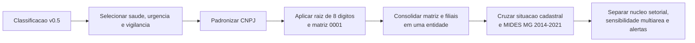
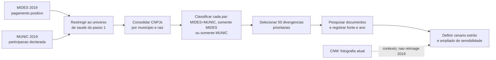
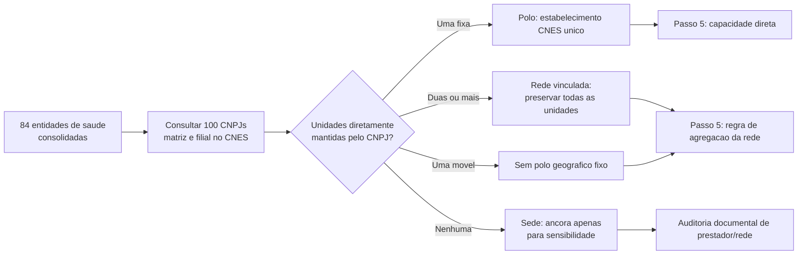

# Passos 1 A 3 - Preparacao Da Base De Saude

## Objetivo

Preparar uma base defensavel para o futuro modelo gravitacional de consorcios
de saude em Minas Gerais. Antes de estimar distancia, capacidade assistencial
ou probabilidade de entrada, foi necessario responder duas perguntas simples:

1. quais instituicoes de saude existem no universo analitico?
2. que tipo de evidencia existe para cada vinculo municipio-consorcio em 2019?
3. qual estabelecimento, rede ou ancora administrativa pode representar a
   oferta assistencial de cada entidade?

O MIDES continua significando **pagamento observado** e a MUNIC,
**participacao declarada**. Nenhuma das duas fontes e alterada por esta
preparacao.

## Situacao Dos Passos

| Passo | Situacao | Produto principal |
|---|---|---|
| 1. Fechar o universo de saude | Concluido | 84 entidades consolidadas e auditadas |
| 2a. Comparar MIDES, MUNIC e documentos | Concluido | 1.311 pares em 2019 e revisao de 50 divergencias |
| 2b. Usar CNM como fotografia atual no recorte saude | Disponivel, mas ainda nao materializado na tabela de saude | Snapshot CNM de 27/08 e piloto CNM x MIDES ja existem em outra frente |
| 3. Definir polo de atracao assistencial | Concluido | 84 entidades consultadas no CNES e regra rastreavel de polo/rede |

O item 2b nao bloqueia a proxima etapa: a CNM e uma fotografia atual e nao
prova a composicao em 2019. Caso seja integrada, ela entrara como marcador
descritivo separado, nunca como evidencia historica retroativa.

---

## Passo 1 - Fechar O Universo De Consorcios De Saude

### Em Que Consistiu

Transformar CNPJs classificados como saude em entidades analiticas unicas,
preservando matriz, filiais, situacao cadastral e evidencia de pagamento no
MIDES.

### Antes

- havia CNPJs individuais com classificacao de saude, urgencia/emergencia ou
  vigilancia em saude;
- uma mesma instituicao podia aparecer como matriz e filiais;
- ainda nao se sabia quais entidades efetivamente recebiam pagamentos de
  municipios mineiros entre 2014 e 2021;
- situacao cadastral atual, escopo setorial e uso no MIDES nao estavam juntos
  em uma unica camada.

### Pipeline

### Depois

| Antes | Depois |
|---|---|
| CNPJ isolado | Entidade consolidada pela raiz de oito digitos |
| Filial podia parecer outro consorcio | Filial e matriz sao somadas, com CNPJs originais preservados |
| Pagamentos dispersos | Presenca MIDES identificada por entidade e ano |
| Situacao cadastral sem contexto temporal | Situacao atual preservada, sem retroagir seu significado aos anos do MIDES |

**Resultados:** 100 estabelecimentos classificados em saude formaram 84
entidades consolidadas. Foram incorporadas 16 filiais em 11 raizes. Sessenta e
seis entidades aparecem no MIDES MG; 64 formam o nucleo setorial preliminar e
duas ficam em sensibilidade multiarea. Sete entidades foram marcadas para
revisao de escopo, situacao temporal ou macrogrupo.

### Exemplo Real

O CISMEP possui CNPJs com a mesma raiz `05802877`. Em vez de interpretar cada
estabelecimento como um consorcio independente, a rotina os trata como uma
entidade. Os CNPJs originais continuam disponiveis para auditoria; pagamentos
do mesmo municipio no mesmo ano sao somados antes de qualquer analise.

### O Que O Passo 1 Resolveu E O Que Nao Resolveu

Resolveu o universo tecnico para MG: quais entidades de saude entram, quais
filiais pertencem a qual matriz e quais aparecem no MIDES. Nao afirmou que
todo pagamento prova adesao juridica, nem escolheu ainda qual hospital ou sede
representara a capacidade de atracao de cada consorcio.

---

## Passo 2 - Auditar Os Vinculos Municipio-Consorcio Em 2019

### Em Que Consistiu

Comparar, para cada par `municipio x entidade consolidada`, o pagamento
observado no MIDES e a declaracao de participacao na MUNIC. Em seguida,
qualificar documentalmente as divergencias prioritarias sem reescrever as
fontes originais.

### Antes

- MIDES e MUNIC podiam aparentar discordancia porque usavam CNPJs distintos de
  matriz e filial;
- nao havia uma tabela unica que mostrasse, por par, pagamento, declaracao e
  valor financeiro;
- uma divergencia podia ser erro, mudanca temporal, prestacao de servico ou
  ausencia de documentacao; todas essas possibilidades estavam misturadas.

### Pipeline

### Depois

| Resultado do par | Quantidade | Leitura correta |
|---|---:|---|
| MIDES + MUNIC | 630 | Pagamento e declaracao coincidem em 2019 |
| Somente MIDES | 658 | Pagamento observado, sem declaracao MUNIC no par |
| Somente MUNIC | 23 | Declaracao MUNIC, sem pagamento MIDES positivo no par |
| Uniao | 1.311 | Total de pares com pelo menos uma das duas evidencias |

Dos 653 pares declarados na MUNIC, 630 (96,5%) tambem possuem pagamento
MIDES. Em sentido inverso, a MUNIC cobre 48,9% dos 1.288 pares MIDES. O valor
MIDES da uniao e R$ 379,1 milhoes; 71,3% esta nos pares comuns as duas fontes.

### Exemplos Reais

| Par | Evidencia | Como fica depois da auditoria |
|---|---|---|
| `Itabira x CIAS` | MUNIC em 2019 e documento oficial de 2016 | Vinculo historicamente sustentado; ausencia em lista atual parece mudanca temporal, nao erro automatico |
| `Juiz de Fora x ACISPES` | MIDES positivo; ACISPES diferencia consorciados de cidades atendidas | Mantem pagamento financeiro, mas nao vira filiacao juridica confirmada |
| `Sao Miguel do Anta x SIMSAUDE` | MUNIC em 2019; nenhuma corroboracao localizada, nem na revisao humana | Permanece divergente e nao confirmado |
| `Para de Minas x CISMEP` | MIDES e fonte oficial posterior | Pagamento permanece no modelo financeiro; vinculo institucional entra apenas no cenario ampliado |

### Revisao Documental

A amostra incluiu todos os 23 pares somente MUNIC e os 27 maiores valores
somente MIDES. Cada caso recebeu URL, ano, cobertura temporal, grau de
evidencia e decisao analitica no catalogo versionado.

| Resultado documental | Pares | Tratamento |
|---|---:|---|
| Evidencia anterior ou igual a 2019 | 14 | Pode sustentar vinculo historico no cenario estrito |
| Corroboracao apenas posterior | 33 | Mantem-se como plausivel; entra somente no cenario ampliado |
| Historicamente compativel | 1 | Mantem-se com ressalva temporal |
| Relacao financeira sem filiacao comprovada | 1 | Nao converter pagamento em adesao juridica |
| Nao corroborado com indicio alternativo | 1 | Revisao humana prioritaria; nao promover a vinculo confirmado |

### Sensibilidade: O Que Muda Na Pratica

| Cenario | O que conta como vinculo institucional | Uso |
|---|---|---|
| Estrito | Documento compativel com 2019 | Resultado principal quando a pergunta exigir filiacao |
| Ampliado | Estrito + fonte oficial posterior | Verificar se a conclusao depende de composicoes que podem ter mudado no tempo |

Exemplo hipotetico: se o efeito estimado do tempo de viagem for semelhante no
cenario estrito e no ampliado, a conclusao e robusta a essa incerteza. Se o
sinal ou a magnitude mudar muito, a filiacao temporal precisa ser tratada como
parte central da limitacao. O modelo financeiro MIDES nao exclui pagamentos
apenas porque falta prova juridica: ele mede pagamentos observados.

### Decisoes Validadas

1. Pagamento MIDES e forte indicio de relacao real com o consorcio, mas nao e
   prova juridica suficiente de filiacao.
2. Fonte posterior a 2019 corrobora plausibilidade, mas nao reconstroi
   automaticamente a composicao naquele ano.
3. `Sao Miguel do Anta x SIMSAUDE` continua nao confirmado apos pesquisa e
   revisao humana.

### Limite Da CNM Nesta Etapa

A CNM ja foi raspada, versionada e comparada com maio de 2026; tambem existe
um piloto CNM x MIDES para MG. Ela ainda nao foi adicionada como coluna da
tabela de saude de 2019 porque sua composicao e uma fotografia atual. A
integracao futura recomendada e o marcador `presente_snapshot_cnm`, util para
descricao e sensibilidade, sem alterar a leitura historica do ano de 2019.

---

## Passo 3 - Definir O Polo De Atracao Assistencial

### Em Que Consistiu

Separar a **sede administrativa** de um possivel destino assistencial. A sede
do CNPJ nao foi assumida como hospital, clinica ou rede de atendimento. Cada
matriz e filial do universo consolidado foi consultada na pagina publica do
[CNES/DATASUS](https://cnes2.datasus.gov.br/) de estabelecimentos mantidos
pelo CNPJ.

### Antes

- a distancia poderia ser calculada ate a sede administrativa do consorcio,
  ainda que ela fosse escritorio ou nao tivesse unidade propria;
- uma rede com unidades em municipios distintos poderia ser artificialmente
  comprimida em um unico municipio;
- a ausencia de estabelecimento sob o CNPJ poderia ser confundida com ausencia
  de atendimento, embora o consorcio possa operar por prestador contratado ou
  outro CNPJ.

### Pipeline

### Depois

| Decisao de polo | Entidades | Leitura e proxima acao |
|---|---:|---|
| Estabelecimento fixo unico | 2 | A localizacao CNES pode ser usada como polo; a capacidade ainda sera medida no passo 5. |
| Rede vinculada, sem polo unico | 45 | Manter todas as unidades; definir tempo e capacidade por rede, sem escolher uma sede arbitraria. |
| Sem unidade CNES pelo CNPJ | 36 | Nao inferir ausencia de atendimento; auditar rede propria, contrato ou prestador externo. |
| Unidade movel, sem polo fixo | 1 | Nao usar o endereco cadastral como destino de viagem. |

Foram consultados os 100 CNPJs matriz/filial das 84 entidades e retornaram
639 unidades CNES diretamente vinculadas. A coleta final nao teve erro de
consulta. Entre as 64 entidades do nucleo setorial com pagamento MIDES, ha 2
polos fixos unicos, 43 redes, 18 casos sem unidade direta e 1 unidade movel.

### Exemplos Reais

| Entidade | Evidencia encontrada | Decisao |
|---|---|---|
| CISMAS | Uma clinica/centro de especialidade CNES em Itajuba | Polo fixo unico; apto a receber medida de capacidade no passo 5. |
| CISMARPA | Uma clinica/centro de especialidade CNES em Pocos de Caldas | Polo fixo unico; apto a receber medida de capacidade no passo 5. |
| CISVER | Cinco unidades CNES diretamente vinculadas | Rede; nao se escolhe uma unidade isolada como destino do consorcio. |
| CIMES | Uma unidade movel VACIMOVEL | Sem polo fixo; endereco cadastral nao representa destino assistencial. |

### Decisao Metodologica Para Redes E Casos Sem Unidade Direta

O proximo produto nao sera ainda uma matriz de tempo. Primeiro sera criado um
cadastro de oferta assistencial. Para cada uma das 45 redes, as unidades serao
mantidas como destinos possiveis. Para os 36 sem unidade sob o proprio CNPJ,
sera buscada evidencia de rede propria, prestador contratado ou estabelecimento
operado sob outro CNPJ. Cada caso recebera uma destas saidas:

1. `polo_rede_documentada`: entra na analise principal de capacidade e tempo;
2. `prestador_externo_documentado`: entra somente em especificacao explicitamente
   identificada como complementar;
3. `sede_apenas_sensibilidade`: nao entra na medida principal de capacidade;
4. `evidencia_insuficiente`: permanece fora das variaveis de polo/capacidade.

Nao sera imputado o hospital mais proximo nem assumida a sede administrativa
como local de atendimento. Isso preserva a validade do futuro modelo
gravitacional: distancia e capacidade so serao calculadas contra oferta
assistencial documentada.

---

## Reproducibilidade E Limites

Os produtos quantitativos dos passos 1 a 3 usam bases locais processadas do
projeto. A qualificacao documental da amostra usou fontes oficiais ou
institucionais na internet, com URL e interpretacao preservadas. Scripts,
testes e relatorios estao em `analises/modelo_gravitacional_saude/`; resultados
derivados locais ficam em `outputs/`.

Os scripts `01` a `04`, seus testes e o relatorio de validacao do passo 3 estao
em `analises/modelo_gravitacional_saude/`. O proximo passo substantivo e
construir a capacidade assistencial e a regra de agregacao das redes; so depois
sera calculado o tempo rodoviario ate polos ou unidades documentadas. A
integracao opcional do marcador CNM pode ocorrer em paralelo e nao deve alterar
a leitura historica do MIDES/MUNIC.
