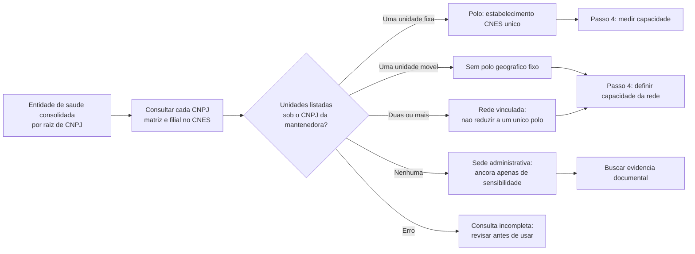

# Passo 3: Polo De Atracao Assistencial

**Escopo:** consorcios com classificacao explicita de saude em Minas Gerais,
consolidados por raiz de CNPJ. Este passo nao altera o MIDES, a MUNIC, a CNM
nem o cadastro original.

## Pergunta Resolvida

Antes de calcular uma distancia, e preciso saber **para onde** ela sera
calculada. A sede administrativa de um consorcio pode ser uma clinica, um
escritorio, uma rede de varios servicos ou nao ter estabelecimento proprio
registrado no CNES. Portanto, "municipio-sede do CNPJ" e "polo assistencial"
nao sao sinonimos.



## Fonte E Evidencia

A consulta usa a pagina publica de estabelecimentos **mantidos** pelo CNPJ no
[CNES/DATASUS](https://cnes2.datasus.gov.br/). Essa pagina e apropriada porque
o proprio CNES informa que lista estabelecimento cujo CNPJ coincide com o da
mantenedora. Para cada unidade encontrada, a ficha publica permite recuperar,
entre outros campos, municipio, codigo IBGE, tipo de estabelecimento e
dependencia.

O CNES e a fonte administrativa para identificar estabelecimento de saude. Ele
nao prova, por si so, que todo gasto MIDES corresponde a cada unidade, nem que
uma unidade de municipio proximo sem esse vinculo cadastral pertence ao
consorcio.

## Regra Implementada

| Situacao observada no CNES | Decisao para o modelo | O que nao se conclui |
|---|---|---|
| Uma unidade fixa diretamente vinculada | Usar o estabelecimento como polo assistencial no proximo passo. | Que seja hospitalar ou que possua determinada capacidade sem consultar os modulos do CNES. |
| Uma unica unidade movel ou itinerante | Nao tratar como destino rodoviario fixo; manter fora da especificacao principal ate definir medida propria. | Que o endereco cadastral seja o local onde o servico e prestado. |
| Duas ou mais unidades diretamente vinculadas | Manter a rede; nao escolher uma unidade arbitrariamente. | Que a sede administrativa resuma a capacidade de toda a rede. |
| Nenhuma unidade listada sob os CNPJs consultados | Manter a sede administrativa so como ancora para analise de sensibilidade. | Que nao exista atendimento contratado, conveniado ou prestado em estabelecimento de terceiro. |
| Falha de consulta | Marcar pendencia e repetir a consulta. | Ausencia de unidade ou de polo. |

## Exemplo Real: CISVER

O CNPJ `01.098.929/0001-68` do **CISVER** retorna no CNES uma clinica/centro de
especialidade e unidades moveis mantidas pelo consorcio. O resultado correto e
`rede_vinculada_sem_polo_unico`: ha vinculo cadastral direto, mas nao seria
metodologicamente correto escolher so a sede ou so uma unidade movel como se
representasse toda a oferta. No passo 4, as unidades serao preservadas e a
regra de capacidade da rede sera decidida explicitamente. Outro caso instrutivo
e o **CIMES**, cuja unica unidade listada se chama `CIMES VACIMOVEL`: apesar de
ter endereco cadastral, ela e servico movel e, por isso, nao e usada como polo
fixo na medida principal de tempo.

## Resultado Da Fotografia De 03/09/2026

| Resultado | Entidades |
|---|---:|
| Estabelecimento fixo unico, com polo definido | 2 |
| Rede CNES vinculada, sem polo unico arbitrario | 45 |
| Sem unidade CNES listada pelo CNPJ | 36 |
| Unidade movel, sem polo geografico fixo | 1 |

O passo 4 refinou esta classificacao: CIS/CEN estava entre as 45 redes por ter
tres unidades, mas as tres sao vacimoveis. Para capacidade e tempo, ele se soma
ao CIMES como segunda entidade composta somente por unidades moveis. Permanecem
44 redes com ao menos uma unidade fixa e dois polos fixos unicos.
| **Total** | **84** |

Foram consultados os 100 CNPJs de matriz e filial das 84 entidades, sem falha
final de consulta, e retornaram 639 unidades vinculadas por mantenedora. O
resultado nao significa que so duas entidades tenham capacidade assistencial:
significa apenas que duas possuem **uma unica unidade fixa diretamente
vinculada** e, portanto, admitem um polo sem nova regra. As outras 45 redes
exigem uma regra de agregacao no passo 4; as 36 sem unidade CNES pelo CNPJ
podem operar por contrato, convenio ou estabelecimento de terceiro, algo que
esta consulta isolada nao resolve.

Os dois polos fixos diretamente identificados sao: **CISMAS**, clinica/centro
de especialidade CNES `6776434` em Itajuba; e **CISMARPA**, clinica/centro de
especialidade CNES `5796601` em Pocos de Caldas. Ambos coincidem com a sede
administrativa registrada nesta base. Eles ilustram a regra, mas ainda nao
representam uma medida de leitos, especialidades ou producao.

## Produto Reprocessavel

O script [`04_definir_polos_atracao_saude.R`](04_definir_polos_atracao_saude.R)
produz localmente:

- `outputs/consultas_cnes_polo_saude_mg.csv`: cada CNPJ consultado e seu
  resultado;
- `outputs/unidades_cnes_vinculadas_saude_mg.csv`: unidades encontradas com a
  ficha CNES correspondente quando existe polo unico; redes preservam a lista
  de unidades e terao suas fichas examinadas no passo 4;
- `outputs/polos_atracao_saude_mg.csv`: uma linha por entidade consolidada,
  com sede, decisao de polo e proxima acao;
- `checks/VALIDACAO_POLOS_ATRACAO_SAUDE_MG.md`: contagens e regras aplicadas.

Execute na raiz do repositorio:

```powershell
Rscript analises/modelo_gravitacional_saude/04_definir_polos_atracao_saude.R
Rscript analises/modelo_gravitacional_saude/tests/04_validar_polos_atracao_saude.R
```

Por padrao, uma reexecucao no mesmo dia reutiliza a fotografia CNES local para
permitir testes rapidos. Para forcar uma nova coleta, use
`$env:REFRESH_CNES='1'` antes do comando no PowerShell.

## Limites E Proximo Passo

O resultado e uma fotografia do CNES na data de execucao, e nao uma serie
historica 2014--2021. A ficha detalhada e aberta neste passo apenas para
entidades com uma unica unidade, pois ela resolve a localizacao do polo unico.
As redes sao mantidas como listas de unidades e terao seus tipos, capacidade e
forma de agregacao examinados no passo 4. Nenhum leito, especialidade ou
producao e somado agora.
