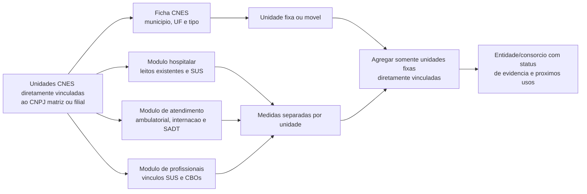

# Passo 4: Capacidade Assistencial Direta CNES

**Escopo:** consorcios com classificacao explicita de saude em Minas Gerais,
consolidados por raiz de CNPJ. Este passo nao modifica MIDES, MUNIC, CNM ou o
dashboard. Ele produz uma fotografia atual, reprocessavel, da oferta registrada
sob os CNPJs de matriz e filial ja identificados no passo 3.

Na lista original de planejamento, tempo rodoviario aparecia antes da
capacidade. A ordem foi invertida apos o passo 3: primeiro se define **qual
oferta existe e onde ela esta**; depois se calcula tempo ate destinos
documentados. Por isso, capacidade e o quarto bloco cientifico executado,
embora o arquivo tecnico seja numerado `05` porque o passo 2 usa dois scripts.

## Antes E Depois

| Antes | Depois |
|---|---|
| Unidade CNES era apenas localizacao | Cada unidade tem leitos, atendimentos SUS e contagens profissionais separadas |
| Rede podia misturar clinica, base fixa e vacimovel | 366 unidades fixas e 273 moveis/itinerantes foram separadas |
| Ausencia sob o CNPJ podia parecer capacidade zero | 36 entidades permanecem `NA` e exigem prestador/rede documentada |
| Uma ou varias unidades moveis podiam parecer polo | CIS/CEN e CIMES foram classificados sem polo rodoviario fixo |
| Leitos eram a massa inicialmente sugerida | A EDA mostrou leitos SUS em apenas uma de 46 entidades com oferta fixa direta |

## Pergunta Resolvida

Depois de identificar uma unidade ou rede diretamente vinculada, e necessario
medir **que tipo de oferta ela registra**. "Capacidade" nao e um unico numero:
uma clinica especializada pode nao ter leitos e, ainda assim, ter profissionais
SUS e atendimento ambulatorial. Por isso, o produto mantem componentes
separados, sem construir indice arbitrario.



## Medidas Produzidas

| Medida | Fonte CNES | Leitura correta |
|---|---|---|
| Unidades fixas e municipios de oferta | Ficha do estabelecimento | Extensao da rede diretamente mantida pelo CNPJ. |
| Leitos existentes e leitos SUS | Modulo hospitalar | Estrutura de internacao registrada; clinicas podem legitimamente ter zero. |
| Tipos de atendimento SUS | Modulo basico | Registro de ambulatorio, internacao e/ou SADT; nao mede volume de atendimento. |
| Vinculos profissionais SUS ativos | Modulo de profissionais | Numero de vinculos, nao necessariamente pessoas unicas. |
| CBOs SUS distintos | Modulo de profissionais | Escopo ocupacional cadastrado. |
| CBOs medicos SUS distintos | Modulo de profissionais | Proxy de escopo medico; nao equivale a lista formal de servicos especializados. |

Os nomes e identificadores individuais de profissionais nao sao retidos. O
produto guarda somente contagens agregadas por unidade e por consorcio.

## Regra De Agregacao

1. A unidade so entra na soma se estiver diretamente listada pelo CNES sob o
   CNPJ de matriz ou filial do consorcio e nao for movel/itinerante.
2. Leitos e vinculos sao somados entre essas unidades fixas. Carga horaria nao
   entra: o formato legado da pagina nao a oferece de forma estavel para uma
   agregacao comparavel.
3. As medidas de CBO somadas por unidade representam escopo cadastrado da rede;
   o mesmo CBO pode existir em mais de uma unidade, portanto nao sao pessoas ou
   especialidades unicas da rede.
4. Unidade sob CNPJ de prefeitura, hospital parceiro ou terceiro nao entra sem
   documento que prove o vinculo com o consorcio.

## O Que Nao E Inferido

- zero de leitos em unidade consultada nao significa ausencia de oferta de
  saude; significa que nao ha leito naquele modulo CNES;
- nenhuma unidade listada sob o CNPJ nao vira zero de capacidade: permanece
  ausente (`NA`) e exige auditoria documental;
- CBO medico nao e sinomino de servico especializado formal;
- producao SIA/SIH ainda nao entra nesta etapa, pois exige identificar se a
  producao do estabelecimento corresponde de fato ao consorcio e nao a outro
  arranjo de gestao;
- a fotografia atual do CNES nao reconstroi capacidade entre 2014 e 2021.

## Resultados Da Fotografia De 03/09/2026

| Situacao da entidade | Quantidade | Uso analitico |
|---|---:|---|
| Capacidade fixa direta no CNES | 46 | Candidata ao calculo de tempo e as medidas de atracao |
| Sem unidade sob o CNPJ | 36 | `NA`; exige auditoria de rede/prestador externo |
| Somente unidades moveis | 2 | Fora da distancia a polo fixo |

As 639 unidades foram consultadas nos quatro modulos sem erro final. Entre as
366 unidades fixas, 59 registram atendimento ambulatorial SUS, 27 registram
SADT, uma registra internacao e 140 possuem ao menos um CBO medico SUS ativo.
Todas as 46 entidades com capacidade fixa direta possuem algum CBO medico SUS
ativo, mas apenas uma possui leitos SUS diretamente registrados.

Os dois estabelecimentos com leitos existentes sao:

| Estabelecimento | CNES | Existentes | SUS |
|---|---:|---:|---:|
| ACISPES | 3154920 | 5 | 0 |
| Hospital 272 Joias ICISMEP | 0979538 | 32 | 32 |

### Exemplos Reais

| Entidade | Evidencia atual | Leitura |
|---|---|---|
| CISMAS | Uma clinica fixa, zero leito e 10 CBOs medicos somados | Polo fixo valido; capacidade nao pode ser resumida a leitos |
| CISMARPA | Uma clinica fixa, zero leito e 18 CBOs medicos somados | Mesmo principio do CISMAS |
| CISVER | Cinco unidades, quatro moveis e uma fixa | Distancia usa a fixa; vacimoveis nao viram polos |
| CISMEP | Treze unidades, onze moveis e duas fixas; 32 leitos SUS | Rede fixa agregada, preservando o detalhamento por unidade |
| CIS/CEN | Tres vacimoveis e nenhuma unidade fixa | Sem polo rodoviario fixo |
| CIMES | Um vacimovel e nenhuma unidade fixa | Sem polo rodoviario fixo |

## Uso No Modelo Futuro

As especificacoes deverao testar, separadamente, leitos SUS, escopo medico
SUS, quantidade de unidades e tipos de atendimento. A escolha de uma medida
principal dependera de distribuicao, cobertura e interpretacao substantiva.
Nao sera escolhido um indice composto antes da EDA.

A EDA inicial ja elimina **leitos SUS como medida unica**, pois sua cobertura
e de apenas uma entidade. CBOs medicos, atendimentos e quantidade de unidades
possuem cobertura maior, mas ainda precisam ser confrontados com CNES
historico, producao SIA/SIH e evidencia de que a oferta pertence ao consorcio.

O passo seguinte calcula tempo rodoviario de cada municipio de origem ate cada
unidade fixa documentada; para redes, o tempo sera derivado a partir das
unidades, e nao da sede administrativa arbitraria.

## Reproducao

```powershell
Rscript analises/modelo_gravitacional_saude/05_construir_capacidade_assistencial_saude.R
Rscript analises/modelo_gravitacional_saude/tests/05_validar_capacidade_assistencial_saude.R
```

No mesmo dia, o cache em `outputs/cache_cnes_capacidade/` permite repetir a
validacao sem novas consultas. Para renovar a fotografia, use:

```powershell
$env:REFRESH_CNES_CAPACIDADE='1'
Rscript analises/modelo_gravitacional_saude/05_construir_capacidade_assistencial_saude.R
```

Se uma coleta for interrompida ou limitada pela fonte, somente os modulos com
erro podem ser recuperados:

```powershell
$env:REFRESH_CNES_ERROS='1'
Rscript analises/modelo_gravitacional_saude/05_construir_capacidade_assistencial_saude.R
```

Para lotes grandes, `CNES_START_INDEX`, `CNES_END_INDEX` e
`CNES_FETCH_ONLY=1` permitem dividir apenas a coleta. A consolidacao final deve
sempre ser executada sem essas variaveis, usando o cache completo.
