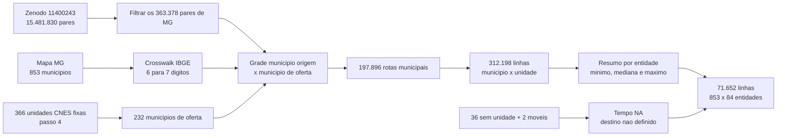

# Passo 5: Tempo Rodoviario Ate A Oferta Assistencial Fixa

**Escopo:** 853 municipios de Minas Gerais e as unidades CNES fixas diretamente
vinculadas aos CNPJs das entidades de saude identificadas nos passos 1 a 4.
Este passo permanece fora do dashboard e ainda nao estima o modelo.

## Pergunta

Quanto tempo um municipio levaria, por automovel, para alcancar cada municipio
que possui uma unidade fixa diretamente registrada sob o CNPJ do consorcio?

A pergunta e deliberadamente mais precisa que "distancia ate a sede do
consorcio". Uma sede administrativa pode nao ser o local de atendimento, e uma
rede pode ter unidades em varios municipios.

## Antes E Depois

| Antes | Depois |
|---|---|
| Havia 366 unidades fixas, mas nenhuma impedancia rodoviaria integrada | Cada um dos 853 municipios possui tempo e distancia para as 366 unidades |
| Redes poderiam ser reduzidas a uma sede | Todas as unidades e seus 232 municipios de oferta foram preservados |
| Casos sem unidade poderiam receber distancia artificial | 36 sem unidade direta e duas somente moveis permanecem `NA` |
| Codigo CNES tinha seis digitos e a fonte, sete | Crosswalk validado para todos os 853 municipios de MG |
| Pedido original mencionava 10h30 de sabado | O produto registra explicitamente que a fonte e estatica e nao considera horario |

## Fonte

A matriz utilizada e a
[Matriz de distancias rodoviarias e duracao de viagens para municipios brasileiros](https://rfsaldanha.github.io/data-projects/brazil_road_distances.html),
depositada no [Zenodo 11400243](https://zenodo.org/records/11400243).

O autor utilizou sedes municipais do IBGE 2010 e o servico OSRM baseado em
OpenStreetMap, perfil `car`, para obter a rota mais rapida. O produto possui
15.481.830 pares nacionais com distancia em metros e duracao em minutos.

O script baixa `dist_brasil.rds` apenas quando necessario e valida o MD5
`39f71b10ddf9fda7c53e2b39fa6bd202`. O codigo de reproducao da fonte esta no
[repositorio distbrasil](https://github.com/rfsaldanha/distbrasil).

## Pipeline



## Regras

1. O universo de origem inclui os 853 municipios, mesmo que nao aparecam em um
   pagamento de saude no MIDES. Isso evita selecionar a amostra pela resposta.
2. Entram como destinos apenas unidades fixas diretamente vinculadas a matriz
   ou filial. Vacimoveis nao recebem destino fixo.
3. A rota e calculada entre sedes municipais, pois a fonte nao contem endereco
   exato de cada CNES.
4. Quando origem e destino estao no mesmo municipio, distancia e tempo
   intermunicipal recebem zero e a flag `mesmo_municipio_destino = TRUE`.
5. A camada por unidade e a fonte de verdade. O resumo por entidade preserva
   minimo, mediana, media e maximo entre municipios distintos de oferta.
6. O menor tempo e uma medida inicial de acessibilidade, nao a especificacao
   final do modelo: a unidade mais proxima pode nao oferecer o servico buscado.
7. Ausencia de unidade fixa e `NA`, nunca zero.

## Produtos

| Produto | Unidade da linha | Linhas | Uso |
|---|---|---:|---|
| `tempo_rodoviario_municipio_destino_saude_mg.rds` | municipio x municipio de oferta | 197.896 | matriz municipal sem duplicar unidades |
| `tempo_rodoviario_municipio_unidade_saude_mg.rds` | municipio x unidade CNES fixa | 312.198 | integracao futura de tempo e capacidade por unidade |
| `tempo_rodoviario_municipio_entidade_saude_mg.rds` | municipio x entidade | 71.652 | alternativas completas, inclusive tempos indisponiveis |

As mesmas camadas tambem sao exportadas em CSV para inspecao. Os derivados
ficam em `outputs/`, fora do Git, e sao reprodutiveis pelo script.

## Resultado

- 853 origens;
- 232 municipios com oferta fixa;
- 366 unidades fixas;
- 46 entidades com tempo disponivel;
- 36 entidades sem unidade direta e duas somente moveis com tempo `NA`;
- nenhuma rota interna de MG ausente na fonte.

Entre todos os pares municipio-entidade disponiveis, o menor tempo tem mediana
de 406,4 minutos e P95 de 778,0 minutos. Esses valores altos refletem a grade
estadual completa, nao um conjunto de escolha plausivel. O proximo painel deve
definir quais alternativas realmente estavam sob risco de escolha.

## Exemplos

| Origem | Entidade | Destino mais proximo | Tempo minimo | Leitura |
|---|---|---|---:|---|
| Abaete | CISMEP | Igarape | 170,9 min | rede com dois municipios de oferta; mediana de 171,3 min |
| Para de Minas | CISMEP | Sao Joaquim de Bicas | 58,3 min | unidade mais proxima difere da sede administrativa como regra geral |
| Itajuba | CISMAS | Itajuba | 0,0 min | mesma cidade; nao significa deslocamento porta a porta nulo |
| Abaete | CISVER | Sao Joao del Rei | 252,2 min | somente a unidade fixa entra; quatro vacimoveis foram excluidos |

Redes extensas mostram por que uma unica sede seria inadequada. O CISDESTE tem
71 unidades fixas em 48 municipios; o CISNORJE, 48 em 39. A impedancia futura
pode depender da unidade e da especialidade, nao apenas da entidade.

## Limitacoes

- A duracao OSRM e estatica: nao representa transito ou uma partida as 10h30 de
  sabado.
- A fonte assume que ida e volta possuem o mesmo tempo.
- O ponto e a sede municipal do IBGE 2010, nao a porta da unidade CNES.
- O dado publicado em 2024 nao reconstroi mudancas rodoviarias anuais de
  2014-2021.
- O menor tempo ate qualquer unidade pode superestimar acesso quando aquela
  unidade nao oferece a especialidade relevante.
- Ainda falta definir o conjunto de alternativas plausiveis por municipio.

Essas limitacoes nao invalidam a medida como primeira impedancia rodoviaria;
elas definem o que precisa entrar nas sensibilidades e no painel analitico.

## Reproducao

Na raiz do repositorio:

```powershell
Rscript analises/modelo_gravitacional_saude/06_integrar_tempo_rodoviario_saude.R
Rscript analises/modelo_gravitacional_saude/tests/06_validar_tempo_rodoviario_saude.R
```

O primeiro comando baixa a fonte para `dados/bruto/externo/distbrasil/` se ela
nao existir, confere o checksum e recria as tres camadas.

## Proximo Passo

Montar o painel `municipio x entidade x ano`, integrando MIDES, entrada,
permanencia, saida, retorno, tempo rodoviario, capacidade e indicadores de
elegibilidade. Antes da estimacao, o painel deve explicitar quais entidades
formam o conjunto de escolha de cada municipio em cada ano.
