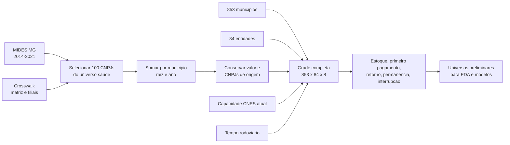

# Passo 6 - Painel Analitico Municipio x Entidade x Ano

## Objetivo

Transformar pagamentos MIDES de saude, identidade matriz/filial, capacidade
CNES e tempo rodoviario em uma base longitudinal unica. A unidade e:

`municipio i x entidade consolidada j x ano t`.

O produto prepara a EDA e os modelos; ele ainda nao estima probabilidades nem
declara que todos os consorcios de MG eram alternativas reais para todos os
municipios.

## Antes E Depois

| Antes | Depois |
|---|---|
| 15.135 linhas anuais MIDES de todas as areas | somente os 72 CNPJs originais de saude observados sao selecionados |
| matriz e filial podiam aparecer separadas | 72 CNPJs observados sao consolidados em 66 entidades por raiz |
| somente combinacoes observadas apareciam | a grade explicita todos os 853 municipios, 84 entidades e oito anos |
| um pagamento em 2014 podia parecer uma entrada | 2014 positivo vira `estoque_inicial_2014`, pois o inicio pode ser anterior |
| zeros, retornos e interrupcoes nao estavam no mesmo produto | cada linha recebe presenca financeira, movimento e defasagens em `t-1` |
| tempo e capacidade estavam em tabelas separadas | as medidas atuais sao ligadas a cada municipio-entidade sem imputar os casos ausentes |

## Pipeline



## Regra Temporal

Seja `P_ijt = 1` quando o valor MIDES do municipio `i` para a entidade `j` no
ano `t` e positivo. A classificacao e:

| Condicao | Evento | Leitura |
|---|---|---|
| `t = 2014` e `P_ijt = 1` | estoque inicial | havia pagamento no inicio da janela; a entrada real e desconhecida |
| `P_ijt = 1` e `P_ij,t-1 = 1` | permanencia | pagamento positivo em anos consecutivos |
| `P_ijt = 1`, `P_ij,t-1 = 0` e nunca houve pagamento anterior | primeiro pagamento observado | primeira aparicao financeira dentro da janela |
| `P_ijt = 1`, `P_ij,t-1 = 0` e ja houve pagamento | retorno observado | pagamento reaparece apos ausencia |
| `P_ijt = 0` e `P_ij,t-1 = 1` | interrupcao observada | deixa de haver pagamento positivo no ano |
| demais casos | ausencia | nao houve pagamento positivo |

Esses nomes descrevem o MIDES. Eles nao provam adesao, desligamento ou retorno
juridico.

Dos 853 municipios da grade, 843 possuem ao menos uma linha MIDES de saude no
periodo. Os outros dez permanecem no painel com zeros, pois sao parte valida do
universo territorial e nao devem desaparecer da formacao de comparacoes.

## Exemplo De Consolidacao

Suponha que, no mesmo ano, um municipio pague R$ 100 mil para a matriz e
R$ 20 mil para uma filial da mesma raiz. Antes da consolidacao seriam duas
linhas. No painel ha uma linha da entidade com `valor_total = R$ 120 mil`,
`n_cnpjs_originais_no_ano = 2` e os dois CNPJs preservados. Nos dados reais,
isso ocorre em 21 combinacoes municipio-entidade-ano.

## Exemplo Temporal Didatico

Para um par hipotetico com valores `0, 50, 70, 0, 30, 30, 0, 0` entre 2014 e
2021, os eventos sao:

| Ano | Valor | Evento |
|---:|---:|---|
| 2014 | 0 | ausencia inicial |
| 2015 | 50 | primeiro pagamento observado |
| 2016 | 70 | permanencia |
| 2017 | 0 | interrupcao observada |
| 2018 | 30 | retorno observado |
| 2019 | 30 | permanencia |
| 2020 | 0 | interrupcao observada |
| 2021 | 0 | ausencia |

## Universos Preliminares

| Marcador | Quem entra | O que ainda falta |
|---|---|---|
| primeiro pagamento | sem pagamento anterior, entidade ativa em `t-1`, nucleo setorial e tempo/capacidade direta | definir alternativas territoriais plausiveis |
| entrada ou retorno | ausente em `t-1`, entidade ativa em `t-1`, nucleo e tempo/capacidade direta | decidir se retorno sera modelo separado |
| interrupcao | havia pagamento em `t-1` para entidade do nucleo | escolher formulacao de sobrevivencia e censura |
| intensidade | pagamento positivo em `t` para entidade do nucleo | escolher denominador, deflacao e PPML/hurdle |

Interrupcao e intensidade possuem tambem marcadores `_com_tempo`. Eles recortam
as observacoes para as quais tempo rodoviario e capacidade direta estao
disponiveis, sem apagar do painel os pares das entidades ainda nao auditadas.

A atividade da entidade em `t-1` evita oferecer como alternativa principal uma
entidade ainda nao observada no MIDES. Ainda assim, a grade estadual e apenas
um limite superior: nao significa que um municipio do extremo norte realmente
pudesse escolher qualquer consorcio do extremo sul.

## Produtos

| Arquivo | Unidade | Uso |
|---|---|---|
| `painel_analitico_saude_mg.rds` | municipio x entidade x ano | produto completo, inclusive zeros |
| `mides_saude_mg_consolidado_entidade_ano.*` | combinacoes observadas | auditoria da consolidacao financeira |
| `painel_analitico_saude_mg_eventos.csv` | linhas com presenca ou transicao | inspecao sem abrir a grade completa |
| `painel_analitico_saude_mg_resumo_par.*` | municipio x entidade | trajetoria e recorrencia do par |
| `painel_analitico_saude_mg_resumo_ano.csv` | ano | contagens anuais |
| `painel_analitico_saude_mg_resumo_entidade.csv` | entidade | cobertura e eventos por consorcio |
| `DICIONARIO_PAINEL_ANALITICO_SAUDE_MG.csv` | variavel | definicoes das colunas centrais |

O RDS e a fonte analitica completa. Nao foi gravado um CSV integral de 573 mil
linhas porque seria redundante e muito maior; os CSVs auditaveis cobrem eventos,
pares e resumos.

## Resultados Validados

| Medida | Resultado |
|---|---:|
| grade completa | 573.216 linhas |
| linhas MIDES de saude antes da consolidacao | 10.080 |
| linhas municipio-entidade-ano consolidadas | 10.059 |
| pares municipio-entidade com algum pagamento | 1.618 |
| estoque positivo em 2014 | 1.192 |
| primeiros pagamentos observados depois de 2014 | 426 |
| retornos observados | 252 |
| interrupcoes observadas | 533 |
| pares com mais de uma transicao | 329 |
| valor financeiro preservado | R$ 3.101.980.422,83 |

### Casos Reais Conferidos

| Caso | Sequencia observada | Interpretacao correta |
|---|---|---|
| Sete Lagoas x CISMEP, 2016 | sem pagamento anterior e R$ 12,70 milhoes em 2016 | primeiro pagamento observado, nao prova data juridica de adesao |
| Muriae x CISLESTE, 2021 | pagamento anterior, ausencia em 2020 e R$ 4,16 milhoes em 2021 | retorno financeiro observado |
| Aguanil x CISMARG | R$ 26,9 mil em 2018, zero em 2019 e R$ 48,2 mil em 2020 | interrupcao em 2019 e retorno em 2020 |
| Igarape x CISMEP, 2019 | matriz e filial da raiz `05802877` somam R$ 4,74 milhoes | uma entidade, dois CNPJs originais preservados |

Os universos estaduais preliminares sao grandes: 242.988 linhas para primeiro
pagamento e 243.763 para entrada ou retorno. Isso confirma que oferecer todos
os consorcios ativos de MG a todo municipio e apenas um limite superior. O
passo 7 deve reduzir alternativas com uma regra substantiva antes da estimacao.

## Limites

1. Presenca significa pagamento positivo no MIDES, nao filiacao juridica.
2. O painel comeca em 2014; pares positivos nesse ano sao censurados a esquerda.
3. CNES e capacidade sao fotografia de 2026 aplicada como atributo atual, nao
   reconstrucao historica de 2014-2021.
4. Trinta e oito entidades nao possuem tempo fixo diretamente documentado e
   permanecem com `NA`; nao foram convertidas em zero nem excluidas da grade.
5. Populacao, RCL, regiao de saude, bacia e mandato ainda nao entram porque a
   trilha ainda nao possui fontes anuais validadas para essas variaveis.
6. O conjunto final de alternativas exige decisao no passo 7: limite de tempo,
   regiao de saude ou outra regra institucional defensavel.

## Reproducao

```powershell
Rscript analises/modelo_gravitacional_saude/07_montar_painel_analitico_saude.R
Rscript analises/modelo_gravitacional_saude/tests/07_validar_painel_analitico_saude.R
```
