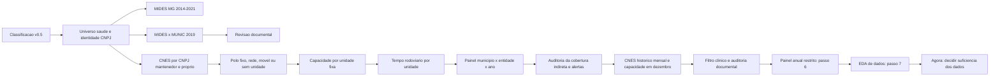

# Modelo Gravitacional De Saude - MG

## Comece Aqui: Base V1 — 24/09/2026

A v1 organiza o que ja foi coletado em **duas tabelas**. Uma linha significa
municipio x consorcio x ano. MIDES e o eixo financeiro; nenhuma PCA ou modelo
foi estimado. Os arquivos ficam em [outputs/base_v1](outputs/base_v1/), localmente.

| Entrega | Linhas | Entidades | Pagamentos positivos | Valor nominal 2014-2021 |
|---|---:|---:|---:|---:|
| [Base financeira](outputs/base_v1/base_financeira_v1.csv), 19 colunas | 491.328 | 73 | 10.735 | R$ 3.315.638.156,17 |
| [Base gravitacional](outputs/base_v1/base_gravitacional_v1.csv), 30 colunas | 323.287 | 58 | 5.612 | R$ 2.865.170.352,56 |

Ambas cobrem 853 municipios e 2014-2021, com disponibilidade das entidades
variando entre anos. A primeira tem 480.593 linhas sem pagamento positivo;
a segunda, 317.675. Esses zeros sao possibilidades sem pagamento observado,
nao vinculos comprovados ou ausencia comprovada de atendimento. Um registro
MIDES com quatro transacoes zeradas permanece distinguido da falta de registro.

**O que entra:** nucleo cadastral de saude nos anos admissiveis; no recorte
gravitacional, tambem clinica direta em dezembro e tempo disponivel. Nao ha
corte de minutos, exigencia de RCL/PDR ou filtro para manter apenas pagadores.
As 97 entidades da grade anterior foram preservadas: o
[registro de inclusao](outputs/base_v1/inclusao_entidade_ano.csv) explica as
776 entidades-ano. As 940 relacoes pagas fora do nucleo (R$ 183,87 milhoes)
continuam na origem e nesse registro; nao sao uma perda silenciosa.

**O que fica como complemento:** RCL, PDR, contratos, MUNIC, CNM, mensalizacao
e redes indiretas. Os 5.123 pares pagos de saude sem polo direto continuam na
base financeira. O indicador de polo e 0/1; zero significa nao identificado.
Os documentos sustentam classificacoes, mas nao sao requisito de cada pagamento.

| Medida de capacidade — 54 entidades diretas em 2019 | Mediana | Maximo | Entidades com zero |
|---|---:|---:|---:|
| Unidades clinicas | 1 | 4 | 0 |
| Soma dos profissionais SUS por unidade | 25,5 | 262 | 1 |
| Soma dos servicos/classificacoes SUS por unidade | 3,5 | 44 | 11 |
| Soma das horas registradas no PF/SUS | 218,5 | 7.866 | 1 |
| Leitos SUS | 0 | 0 | 54 |

Recomendacao inicial: profissionais e servicos como medidas separadas; horas
como alternativa e unidades como contexto de escala. Nao ha massa escolhida.
Profissionais-horas tem correlacao Spearman 0,808; profissionais-servicos,
0,701. Leitos nao resumem ambulatorios. Profissionais/servicos podem repetir
entre unidades e horas nao sao horas anuais realizadas. Nenhum CNES foi
encontrado em duas entidades no mesmo ano; isso nao deduplica pessoas.

**Exemplo real:** Igarape x CISMEP/2019: 43.045 habitantes, R$ 4.740.790,51
em 81 transacoes; duas clinicas, 105 profissionais e 17 servicos somados,
1.651 horas cadastradas e tempo minimo de 15,1 min ate Betim. Esses recursos
caracterizam a oferta do consorcio, nao uma cota exclusiva de Igarape.
[Veja os oito anos](outputs/base_v1/exemplo_igarape_cismep.csv).

**Como consultar:** leia o [dicionario de variaveis](outputs/base_v1/dicionario_variaveis.csv),
a [cobertura](outputs/base_v1/cobertura_recortes.csv) e a metodologia.
CSV usa virgula, ponto decimal, UTF-8 e vazio para NA. Importe CNPJ/IBGE como
texto para preservar zeros iniciais. Os mesmos dados estao em RDS, com tipos
preservados. Os arquivos grandes sao locais e nao sao publicados no GitHub;
scripts e documentacao sao versionados.

**Estado:** passo 7 fechado para esta v1 delimitada. Ha alertas temporais em
45 entidades-ano diretas (624 pares pagos), conservados no retrato de dezembro.
Nao representam erros automaticamente. Proxima etapa: receber a formula da
equipe e conferir suas exigencias, incluindo deflacao. Veja o plano canonico.

## Historico Das Entregas Anteriores A V1

> Ultima continuidade de 24/09: revisao documental de 14 entidades-ano,
> diagnostico de 53 prioridades temporais e seis fotografias mensais CNES
> concluidos. A matriz de suficiencia distingue 10.735 pares-ano pagos de
> saude, 5.612 diretos e 1.052 diretos com RCL. Ha contratos SAMU do CIAS e
> evidencia parcial para o CEAE municipal do Circuito/2017; faltam os
> prestadores historicos do CONSARDOCE. Consulte as secoes finais da metodologia
> e do dicionario. Painel anual e extratos MIDES preservados; passo 7 aberto.

> Integracao de 23/09: o painel anual novo tem 661.928 linhas (853 municipios,
> 97 entidades e 2014-2021). Pagamentos originais foram preservados; CNES,
> capacidade e destinos rodoviarios variam pelo ano. O passo 6 esta concluido
> para um recorte candidato com unidades de tipo clinico diretamente
> cadastradas e tempo historico conhecido, sem corte de minutos. Esse cadastro
> nao comprova producao SUS ou deslocamento. Consulte
> `outputs/painel_anual_integrado_resumo.csv` e
> `outputs/diagnostico_alternativas_painel_saude_2014_2021.csv`. O passo 7
> segue em andamento: perdas, extremos, RCL, alternativas, marcadores SUS e as
> 60 variaveis foram auditados, mas a suficiencia ainda precisa ser julgada.
> Nenhum modelo foi estimado. Bacias ficaram para analise territorial posterior.

> Conciliacao de 24/09: as 181 entidades-ano pagas sem polo direto receberam
> classificacao, fonte e limite em
> `evidencias/conciliacao_181_entidades_ano_2026_09_24.csv`. Isso explica as
> lacunas; nenhum novo polo clinico anual foi imputado. Os 60 casos financeiros
> inspecionados conferem com as fontes. Para localizar os produtos locais,
> consulte `outputs/inventario_produtos_saude.csv` e o dicionario tecnico.

> Complemento de 16/09: revisao fora das 84 concluida nas fontes consultadas.
> Foram triadas 137 raizes e documentados 28 casos: dez candidatas com saude
> historica e tres com escopo a segregar. Nove candidatas estavam ausentes do
> cadastro usado na consulta MIDES; recuperados R$ 258,36 milhoes em consulta
> complementar. Os numeros anteriores continuam descrevendo o recorte original.
> Abra `outputs/atlas_consorcios_saude_mg.html` para mapas por entidade, ano,
> funcao e tipo CNES, pagamentos e composicao CNM atual. O inventario de 221
> entidades nao constitui a amostra final do modelo.

> Revisao de 16/09/2026: as 670 unidades atuais foram classificadas por funcao
> em 63 destinos clinicos fixos, 20 estruturas fixas nao clinicas e 587 moveis.
> As duas fichas conflitantes foram resolvidas e nenhuma unidade ficou
> pendente. A coleta original de 03/09 e os reprocessamentos anteriores foram
> preservados; o novo filtro apenas define elegibilidade para o modelo.

Esta pasta prepara, fora do dashboard, o recorte de Minas Gerais definido na
reuniao de 27/08/2026. O objetivo e construir uma base defensavel antes de
estimar novos modelos.

## Leitura Rapida

**Como enxergar a base:** uma linha do painel e um municipio x entidade x ano,
e nao um paciente, uma unidade CNES ou um consorcio isolado. A grade de
853 x 97 x 8 combina possibilidades; seus 661.928 registros nao representam
essa quantidade de relacoes observadas. As 60 colunas incluem identificadores,
regras de elegibilidade e defasagens, alem das medidas substantivas.

| Camada | O que esta disponivel no modelo | Limite principal |
|---|---|---|
| Municipio e ano | Populacao IBGE anual; RCL parcial; regiao/micro/macro de saude conforme versao; ciclo do mandato | PIB/renda/estrutura etaria e partidos nao estao integrados nas 60 colunas; PDR so 2019-2021 |
| Entidade | CNPJ raiz; nomes; escopo; abertura; origem nas 84 ou nas 13 externas | Matriz/filial nao e outra entidade; criacao juridica nao e inicio de cada servico |
| Relacao financeira | Valor MIDES; transacoes; presenca; primeiro pagamento; retorno; permanencia; interrupcao | Valor nominal e vinculo financeiro observado; nao filiacao juridica ou pacientes |
| Unidade CNES e competencia | Identificacao/localidade; tipo; vinculo CNPJ; atendimento; leitos; servicos; profissionais; ocupacoes e horas | Estrutura registrada; capacidade do mes, nao producao ou cota do consorcio |
| Deslocamento | Matriz Distbrasil de distancia/tempo entre sedes; destinos selecionados pelo CNES do ano | Rede viaria estatica resumida; nao rota de paciente, transito ou percurso porta a porta |
| Evidencia institucional | MUNIC, CNM, contratos e datas; decisoes de elegibilidade e limites | Fontes com datas/objetos distintos, sem serie juridica anual completa |

Ha bases CNES detalhadas separadas do painel. O historico original tem
1.868 unidades-ano e 29 campos (31 apos elegibilidade); as externas acrescentam
74 unidades-ano. O retrato atual original tem 670 unidades e 40 campos, mas
nao substitui o historico. ST foi coletado mensalmente; LT/SR/PF inicialmente
em dezembro, com o piloto posterior de seis fotografias. As 60 colunas do
painel nao sao 60 indicadores de capacidade medica.

Em 2014-2021, ha 10.735 pares-ano pagos no nucleo cadastral de saude. O
recorte direto com tempo conserva 5.612 (52,3%) e 86,4% do valor desse nucleo.
Isso sugere selecao relevante: boa cobertura financeira nao e cobertura
integral das modalidades assistenciais. Oferta movel/regulacao/terceirizada
nao se transforma automaticamente em clinica fixa. Consulte a nova leitura
critica da literatura e dos indicadores ao fim da metodologia.

| Necessidade | Arquivo |
|---|---|
| saber a ordem, o estado e o proximo marco | `PLANO_DE_TRABALHO.md` |
| obter uma visao geral das entregas | `README.md` |
| localizar scripts, fontes, links, extracoes e produtos | `DICIONARIO_TECNICO.md` |
| entender a evolucao das entregas com um caso real | `LINHA_DO_TEMPO_PASSOS.md` |
| defender uma decisao metodologica | `METODOLOGIA_GERAL.md` |
| consultar resultados ja validados | `checks/` |

O `PLANO_DE_TRABALHO.md` e a unica fonte para ordem e estado dos dez passos. O
dicionario tecnico e a referencia para a funcao de cada arquivo e a proveniencia
das fontes. O README resume; nao substitui nenhum dos dois.

## Entregas Tecnicas Concluidas

Esta tabela registra produtos ja construidos. Ela nao define a ordem nem o
estado do plano cientifico.

| Entrega tecnica | Estado do produto | Resultado principal |
|---|---|---|
| 1. Fechar universo de saude | Concluido | 100 CNPJs em 84 entidades; 66 observadas no MIDES |
| 2. Auditar vinculos | Concluido | 1.311 pares MIDES/MUNIC em 2019 e 50 divergencias revisadas |
| 3. Polo/rede direta | Concluido | 670 unidades classificadas por funcao; todo caso relevante recebeu destino/rede ou exclusao/sensibilidade explicita |
| 4. Construir capacidade | Concluido e reprocessado | 63 destinos clinicos fixos, 20 estruturas fixas nao clinicas e 587 moveis no retrato atual |
| 5. Integrar tempo rodoviario | Camada-base concluida | 853 origens ligadas a 82 estruturas candidatas; o passo 6 selecionara somente destinos clinicos elegiveis por ano |
| 6. Grade analitica preliminar | Produto preliminar preservado; painel anual restrito concluido | 573.216 linhas originais e 661.928 na integracao de 97 entidades |
| Complemento. Cobertura assistencial | Concluido | 38 casos iniciais, 91 entidades-ano, 21 auditorias documentais e 2 fichas conflitantes decididos sem imputar prestador |
| Complemento. Temporalizar CNES | Concluido | 672 entidades-ano; 1.868 unidades-ano; 120 arquivos oficiais auditados |

Capacidade foi executada antes do tempo rodoviario. Calcular distancia ate uma
sede administrativa sem saber onde esta a oferta assistencial produziria uma
impedancia sem interpretacao substantiva.

### Antes E Depois Das Entregas Tecnicas

| Bloco | Antes | Agora |
|---|---|---|
| 1. Universo | 100 CNPJs de saude podiam representar matriz e filiais como instituicoes distintas | 84 entidades por raiz, com CNPJs originais preservados; o CISMEP ilustra a consolidacao da raiz `05802877` |
| 2. Vinculos | pagamento MIDES e declaracao MUNIC podiam ser confundidos com a mesma evidencia | 1.311 pares de 2019 separados em 630 comuns, 658 somente MIDES e 23 somente MUNIC; 50 divergencias receberam revisao |
| 3. Polo/rede | sede administrativa podia ser usada automaticamente como destino | 670 unidades foram separadas por funcao; 15 falsos negativos foram recuperados e casos sem prestador ficaram explicitamente excluidos ou em sensibilidade |
| 4. Capacidade | unidade CNES indicava localizacao, mas nao a oferta registrada | ficha, leitos, atendimento e CBOs foram medidos separadamente; CISMAS tem zero leito e 10 CBOs medicos somados |
| 5. Tempo | nao havia impedancia integrada e redes poderiam ser reduzidas a uma sede | 853 municipios foram ligados a 82 unidades fixas; redes preservam minimo, mediana e maximo |
| 6. Painel | pagamentos, identidade, tempo e capacidade estavam em tabelas distintas | grade `853 x 84 x 8`, com valor conservado, censura em 2014 e eventos financeiros explicitos |
| Complemento | 36 ausencias CNES e 2 casos moveis pareciam um unico tipo de lacuna | unidades por CNPJ proprio, redes contratadas, oferta movel, casos historicos e falta real de evidencia foram separados |
| Complemento temporal | capacidade de 2026 podia ser repetida nos oito anos | dezembro mede a capacidade anual e os 12 meses auditam presenca sem retroagir o cadastro atual |

## Fluxo Reprocessavel



## Como Navegar Nesta Pasta

O `README.md` e o ponto de entrada. Os arquivos foram separados por funcao:

| Local | Conteudo | Quando consultar |
|---|---|---|
| raiz da pasta | plano canonico, scripts e metodologia das entregas executadas | entender ou reprocessar o pipeline |
| `tests/` | validacoes automatizadas dos produtos e invariantes | confirmar chaves, contagens e invariantes |
| `checks/` | relatorios curtos com resultados validados | consultar numeros sem abrir os dados |
| `evidencias/` | catalogos de fontes e decisoes anuais versionados | auditar identidade, cobertura e limites documentais |
| `outputs/` | CSV/RDS derivados e caches locais | analisar linhas e continuar o modelo; nao entra no Git |

Cada passo deve ser lido na ordem: **script -> teste -> check -> secao
correspondente em `METODOLOGIA_GERAL.md`**.
Os dados brutos e processados das demais pastas do projeto permanecem
inalterados.

## Mapa De Scripts, Testes E Documentos

O numero do script e tecnico. O passo 2 usa dois scripts (`02` e `03`), por
isso os blocos cientificos 3 a 6 sao executados pelos scripts `04` a `07`.

| Arquivo | Papel | Entrada principal | Saida/checagem |
|---|---|---|---|
| `01_fechar_universo_saude_mg.R` | Seleciona saude e consolida matriz/filiais | classificacao v0.5, crosswalk nacional e MIDES MG | universo por CNPJ e por raiz |
| `02_cotejar_mides_munic_saude_2019.R` | Compara pagamento e declaracao em 2019 | Base 1, universo do passo 1 e cadastro | pares MIDES+MUNIC/somente fonte |
| `03_revisar_divergencias_documentais_2019.R` | Aplica evidencias aos 50 casos priorizados | amostra do passo 2 e catalogo versionado | cenarios estrito e ampliado |
| `04_definir_polos_atracao_saude.R` | Consulta estabelecimentos por CNPJ mantenedor e CNPJ proprio | universo do passo 1 e CNES | polo, rede, movel ou ancora de sede |
| `05_construir_capacidade_assistencial_saude.R` | Mede oferta atual diretamente vinculada | unidades do passo 3 e modulos CNES | capacidade por unidade e entidade |
| `06_integrar_tempo_rodoviario_saude.R` | Integra impedancia rodoviaria a oferta fixa | capacidade, mapa MG e Zenodo 11400243 | tempo por destino, unidade e entidade |
| `07_montar_painel_analitico_saude.R` | Materializa a grade longitudinal e seus eventos | MIDES, identidade, capacidade e tempo | painel completo, eventos e universos preliminares |
| `08_completar_cobertura_assistencial_saude.R` | Consolida CNES direto, redes indiretas e decisoes dos alertas | resultados dos passos 1, 3 e 4 e catalogos documentais | cobertura auditada das 84 entidades |
| `09_temporalizar_cnes_historico_saude.py` | Reconstroi presenca mensal e capacidade anual direta | arquivos DBC oficiais ST, LT, SR e PF | camada entidade-ano e unidade-ano 2014-2021 |
| `10_auditar_pendencias_assistenciais_saude.py` | Materializa os 91 casos sem fixa em dezembro | painel e CNES historico ja existentes | dossie por entidade-ano e resumo de 28 entidades |
| `11_diagnosticar_universo_e_elegibilidade_saude.R` | Compara 66 com MIDES e 18 sem MIDES e aplica o filtro funcional | universo e CNES atual/historico existentes | tabelas de elegibilidade e dois mapas diagnosticos |
| `14_completar_cnes_candidatas_saude.py` | Completa historico das 13 candidatas | cache ST/LT/SR/PF ja existente | 74 unidades-ano externas e capacidade anual |
| `15_integrar_painel_anual_saude.R` | Junta candidatos, pagamentos, destinos anuais, tempo, populacao, RCL parcial e PDR/2019 | saidas 01-14, Distbrasil e controles | painel anual de 661.928 linhas; teste 13 |
| `16_extrair_rcl_siconfi_saude.py` | Consulta RCL na API Siconfi | RREO/Anexo 03, sexto bimestre | CSV por municipio-ano com status de ausencia |
| `17_extrair_regioes_saude_pdr_2019.py` | Extrai micro e macro da deliberação oficial | Anexo I PDR-SUS/MG 2019 | 853 municipios, 66 micros e 12 macros |
| `18_diagnosticar_alternativas_painel_saude.R` | Compara regra estadual, tempo e microrregiao | painel anual integrado | perdas amostrais e municipios sem alternativa |
| `requirements_cnes_historico.txt` | Declara as duas dependencias Python do conversor DBC | Python, WSL e `curl` | ambiente reprodutivel para o passo 7 |
| `tests/01...09...` | Protege chaves, contagens e invariantes | respectivas saidas locais | falha explicita ou mensagem `OK` |
| `checks/*.md` | Guarda os resultados auditaveis | calculado pelos scripts | relatorio versionado no Git |
| `evidencias/catalogo_revisao_documental_2019.csv` | Preserva URL, ano e interpretacao documental | fontes oficiais/institucionais | rastreabilidade da revisao humana |
| `PLANO_DE_TRABALHO.md` | Define ordem, estado e proximo marco | dez passos cientificos | unica fonte de verdade do planejamento |
| `METODOLOGIA_GERAL.md` | Explica todo o percurso metodologico executado | entregas e complementos | fontes, regras, resultados, exemplos, limites e reproducao |
| `DICIONARIO_TECNICO.md` | Inventaria arquivos, fontes, links e datas | scripts e produtos | referencia de localizacao e reproducao |
| `LINHA_DO_TEMPO_PASSOS.md` | Mostra a evolucao com Igarape x CISMEP | entregas executadas | explicacao didatica ponta a ponta |

### Dicionario Por Passo

| Passo | Unidade/chave | Script | Produtos principais | Teste e relatorio |
|---|---|---|---|---|
| 1. Universo | entidade por raiz de oito digitos e CNPJ original | `01_fechar_universo_saude_mg.R` | `universo_saude_mg_entidades.rds`; `universo_saude_mg_estabelecimentos.rds` | `tests/01_validar_universo_saude_mg.R`; `checks/VALIDACAO_UNIVERSO_SAUDE_MG.md` |
| 2. Vinculos | municipio x entidade em 2019 | `02_cotejar_mides_munic_saude_2019.R` | `cotejamento_mides_munic_saude_mg_2019.rds`; divergencias e resumo | `tests/02_validar_cotejamento_mides_munic_saude_2019.R`; `checks/VALIDACAO_COTEJAMENTO_MIDES_MUNIC_SAUDE_2019.md` |
| 2. Revisao | par municipio x entidade priorizado | `03_revisar_divergencias_documentais_2019.R` | `revisao_documental_divergencias_saude_mg_2019.csv` | `tests/03_validar_revisao_documental_2019.R`; `checks/VALIDACAO_DOCUMENTAL_DIVERGENCIAS_2019.md` |
| 3. Polo/rede | entidade e unidade CNES | `04_definir_polos_atracao_saude.R` | `polos_atracao_saude_mg.rds`; `unidades_cnes_vinculadas_saude_mg.csv` | `tests/04_validar_polos_atracao_saude.R`; `checks/VALIDACAO_POLOS_ATRACAO_SAUDE_MG.md` |
| 4. Capacidade | unidade CNES e entidade agregada | `05_construir_capacidade_assistencial_saude.R` | `capacidade_unidades_cnes_saude_mg.csv`; `capacidade_entidades_saude_mg.rds` | `tests/05_validar_capacidade_assistencial_saude.R`; `checks/VALIDACAO_CAPACIDADE_ASSISTENCIAL_SAUDE_MG.md` |
| 5. Tempo | municipio x destino/unidade/entidade | `06_integrar_tempo_rodoviario_saude.R` | tres camadas `tempo_rodoviario_*` | `tests/06_validar_tempo_rodoviario_saude.R`; `checks/VALIDACAO_TEMPO_RODOVIARIO_SAUDE_MG.md` |
| 6. Painel | municipio x entidade x ano | `07_montar_painel_analitico_saude.R` | painel completo, eventos, pares e resumos | `tests/07_validar_painel_analitico_saude.R`; `checks/VALIDACAO_PAINEL_ANALITICO_SAUDE_MG.md` |
| Complemento. Cobertura | entidade | `08_completar_cobertura_assistencial_saude.R` | cobertura consolidada, 38 casos e 7 alertas | `tests/08_validar_cobertura_assistencial_saude.R`; `checks/VALIDACAO_COBERTURA_ASSISTENCIAL_COMPLEMENTAR_SAUDE_MG.md` |
| Complemento do 4. CNES historico | entidade x ano e unidade x ano | `09_temporalizar_cnes_historico_saude.py` | presenca mensal; capacidade de dezembro; manifesto das fontes | `tests/09_validar_cnes_historico_saude.py`; `checks/VALIDACAO_CNES_HISTORICO_SAUDE_MG.md` |
| Fechamento do 3. Elegibilidade | unidade, entidade e entidade x ano | `10_auditar_pendencias_assistenciais_saude.py`; `11_diagnosticar_universo_e_elegibilidade_saude.R` | dossie 91; auditorias; elegibilidade funcional; mapas | `tests/10_validar_pendencias_assistenciais_saude.py`; `tests/11_validar_diagnostico_universo_e_elegibilidade_saude.R` |

`outputs/` contem derivados locais e cache, e esta fora do Git. Nada nessa
pasta altera MIDES, MUNIC, CNM, SICONFI ou o dashboard.

## Linhagem Das Fontes

| Fonte | Arquivo/URL usado | Etapa | Leitura correta |
|---|---|---|---|
| Classificacao v0.5 | `analises/classificacao_politicas/outputs/classificacao_areas_politica_mg_v0_5_completa.csv` | 1 | evidencia setorial, nao vinculo municipal |
| Identidade nacional | `analises/base_nacional/outputs/crosswalk_cnpj_matriz_filial_nacional.rds` | 1 | matriz/filial pela raiz de oito digitos |
| MIDES MG | `dados/processado/painel_mg_anual.rds` | 1 | pagamento positivo observado em 2014-2021 |
| Base 1 MIDES/MUNIC | `dashboards/base1_shiny/data/base_1_vinculos_2015_2019.rds` | 2 | pagamento e declaracao preservados separadamente |
| Cadastro processado | `dashboards/base1_shiny/data/cadastro_base.rds` | 2 | nomes e contexto documental |
| Catalogo de evidencias | `evidencias/catalogo_revisao_documental_2019.csv` | 2 | fonte, ano e alcance; fonte posterior nao retroage 2019 |
| CNES/DATASUS atual | https://cnes.datasus.gov.br/ e https://cnes2.datasus.gov.br/ | 3 e 4 | fotografia atual por CNPJ proprio e por CNPJ mantenedor |
| CNES/DATASUS historico | `ftp://ftp.datasus.gov.br/dissemin/publicos/CNES/200508_/Dados/` | 7 | competencias mensais ST e dezembro LT/SR/PF de 2014-2021 |
| Distbrasil/Zenodo | https://zenodo.org/records/11400243 | 5 | distancia e duracao OSRM entre sedes municipais, perfil automovel |

### Registro Das Extracoes

| Fonte | Como entrou no pipeline | Data/periodo representado | Limitacao que deve acompanhar o uso |
|---|---|---|---|
| Classificacao v0.5 | leitura do CSV local produzido pela trilha de classificacao | versao tecnica vigente em 03/09/2026 | classifica area; nao prova vinculo municipal |
| Crosswalk matriz/filial | leitura do RDS nacional, com raiz de oito digitos e CNPJ canonico | fotografia cadastral processada antes desta trilha | raiz comum aproxima identidade institucional, mas alertas permanecem auditaveis |
| MIDES MG | leitura do painel anual local e selecao de valor total positivo | 2014-2021 | evidencia pagamento, nao adesao juridica |
| MUNIC | leitura da Base 1 e preservacao da declaracao separada | 2019 | autodeclaracao pontual, nao painel anual |
| Evidencia documental | catalogo CSV com URL, titulo, ano e interpretacao | varia por documento | documento posterior nao e retroagido automaticamente a 2019 |
| CNES/DATASUS | requisicao HTTP publica por CNPJ proprio, CNPJ mantenedor e codigo CNES; cache local | fotografia coletada em 03/09/2026 | cadastro atual, nao capacidade historica de 2014-2021 |
| Distbrasil | download do RDS Zenodo, checksum MD5 e filtro dos pares de MG | publicado em 31/05/2024; sedes IBGE 2010 | tempo estatico, simetrico e sem transito por horario |

### Modulos CNES Consultados

| Modulo publico | Endpoint relativo | Campos aproveitados |
|---|---|---|
| Lista de mantidas | `Listar_Mantidas.asp?VCnpj=...&VEstado=31` | unidades diretamente registradas sob cada matriz/filial em MG |
| Busca por CNPJ proprio | `/services/estabelecimentos?cnpj=...&estado=31` | estabelecimentos cujo CNPJ proprio coincide com matriz/filial do consorcio |
| Ficha do estabelecimento | `Exibe_Ficha_Estabelecimento.asp?VCo_Unidade=...` | municipio, IBGE, UF, tipo e dependencia |
| Hospitalar | `Mod_Hospitalar.asp?VCo_Unidade=...` | leitos existentes e leitos SUS |
| Atendimento | `Mod_Bas_Atendimento.asp?VCo_Unidade=...` | ambulatorial, internacao e SADT SUS |
| Profissionais | `Mod_Profissional.asp?VCo_Unidade=...` | contagens de vinculos e CBOs SUS ativos |

Nomes e CNS de profissionais nao sao gravados. Somente contagens agregadas
permanecem no produto. O cache local preserva as respostas processadas, nao os
microdados nominais da pagina.

## Produtos Locais Principais

| Produto em `outputs/` | Unidade | Uso |
|---|---|---|
| `universo_saude_mg_entidades.rds` | raiz de CNPJ | universo canonico |
| `cotejamento_mides_munic_saude_mg_2019.rds` | municipio x raiz | evidencia financeira/declarada |
| `revisao_documental_divergencias_saude_mg_2019.csv` | par priorizado | decisao de sensibilidade |
| `polos_atracao_saude_mg.rds` | entidade | polo, rede, movel ou sede-ancora |
| `unidades_cnes_vinculadas_saude_mg.csv` | unidade CNES | localizacao e vinculo direto por CNPJ |
| `capacidade_unidades_cnes_saude_mg.csv` | unidade CNES | componentes atuais de oferta |
| `capacidade_entidades_saude_mg.rds` | entidade | agregacao apenas das unidades fixas diretas |
| `tempo_rodoviario_municipio_destino_saude_mg.rds` | municipio x municipio de oferta | grade municipal de 53.739 rotas |
| `tempo_rodoviario_municipio_unidade_saude_mg.rds` | municipio x unidade fixa | tempo preservado para 82 unidades |
| `tempo_rodoviario_municipio_entidade_saude_mg.rds` | municipio x entidade | minimo, mediana e maximo; `NA` sem destino fixo |
| `painel_analitico_saude_mg.rds` | municipio x entidade x ano | grade completa com zeros, eventos, tempo e capacidade |
| `painel_analitico_saude_mg_eventos.csv` | observacoes com presenca ou transicao | auditoria dos movimentos sem abrir a grade completa |
| `painel_analitico_saude_mg_resumo_par.rds` | municipio x entidade | trajetoria, valor e recorrencia do par |
| `DICIONARIO_PAINEL_ANALITICO_SAUDE_MG.csv` | variavel | definicoes das colunas centrais |
| `cobertura_assistencial_entidades_saude_mg.rds` | entidade | sintese final da cobertura direta, indireta, movel ou historica |
| `auditoria_38_casos_cobertura_assistencial_saude_mg.csv` | entidade originalmente pendente | antes/depois dos 36 sem unidade e 2 sem fixa confirmada neste snapshot |
| `auditoria_alertas_universo_saude_mg.csv` | alerta | decisao dos sete casos de escopo, situacao ou macrogrupo |

## Execucao Completa

Na raiz do repositorio:

```powershell
Rscript analises/modelo_gravitacional_saude/01_fechar_universo_saude_mg.R
Rscript analises/modelo_gravitacional_saude/tests/01_validar_universo_saude_mg.R
Rscript analises/modelo_gravitacional_saude/02_cotejar_mides_munic_saude_2019.R
Rscript analises/modelo_gravitacional_saude/tests/02_validar_cotejamento_mides_munic_saude_2019.R
Rscript analises/modelo_gravitacional_saude/03_revisar_divergencias_documentais_2019.R
Rscript analises/modelo_gravitacional_saude/tests/03_validar_revisao_documental_2019.R
Rscript analises/modelo_gravitacional_saude/04_definir_polos_atracao_saude.R
Rscript analises/modelo_gravitacional_saude/tests/04_validar_polos_atracao_saude.R
Rscript analises/modelo_gravitacional_saude/05_construir_capacidade_assistencial_saude.R
Rscript analises/modelo_gravitacional_saude/tests/05_validar_capacidade_assistencial_saude.R
Rscript analises/modelo_gravitacional_saude/06_integrar_tempo_rodoviario_saude.R
Rscript analises/modelo_gravitacional_saude/tests/06_validar_tempo_rodoviario_saude.R
Rscript analises/modelo_gravitacional_saude/07_montar_painel_analitico_saude.R
Rscript analises/modelo_gravitacional_saude/tests/07_validar_painel_analitico_saude.R
Rscript analises/modelo_gravitacional_saude/08_completar_cobertura_assistencial_saude.R
Rscript analises/modelo_gravitacional_saude/tests/08_validar_cobertura_assistencial_saude.R
python -m pip install -r analises/modelo_gravitacional_saude/requirements_cnes_historico.txt
python analises/modelo_gravitacional_saude/09_temporalizar_cnes_historico_saude.py
python analises/modelo_gravitacional_saude/10_auditar_pendencias_assistenciais_saude.py
python analises/modelo_gravitacional_saude/tests/09_validar_cnes_historico_saude.py
python analises/modelo_gravitacional_saude/tests/10_validar_pendencias_assistenciais_saude.py
Rscript analises/modelo_gravitacional_saude/11_diagnosticar_universo_e_elegibilidade_saude.R
Rscript analises/modelo_gravitacional_saude/tests/11_validar_diagnostico_universo_e_elegibilidade_saude.R
```

## Resultado Metodologico Do Passo 4

- 670 unidades: 63 destinos clinicos fixos, 20 estruturas fixas nao clinicas
  e 587 moveis, sem classificacao pendente;
- 49 das 84 entidades possuem ao menos um destino clinico fixo atual; entre as
  66 com MIDES, sao 48 (72,7%);
- o filtro funcional retira centrais de regulacao, sedes administrativas,
  farmacias, vigilancia e telessaude da medida principal de impedancia;
- apenas uma entidade possui leitos SUS diretamente registrados.

Logo, leitos nao devem ser usados como massa unica. Quantidade de unidades,
CBOs medicos, atendimento ambulatorial e SADT devem ser testados separadamente.
Nao foi criado indice composto e ainda nao foi estimado modelo novo.

### Por Que Leitos SUS Nao Podem Ser A Massa Unica

Em uma formulacao gravitacional simples, a atracao do consorcio `j` teria um
termo proporcional a sua massa:

`atracao_ij proporcional a massa_j x impedancia(tempo_ij)`.

Se `massa_j = leitos_SUS_j`, quase todas as entidades com oferta ambulatorial
receberiam massa zero. Isso produziria tres problemas:

1. CISMAS teria atracao zero apesar de possuir clinica fixa e 10 CBOs medicos
   SUS somados; CISMARPA teria o mesmo problema com 18 CBOs medicos;
2. somente o CISMEP, com 32 leitos SUS diretos, teria massa hospitalar positiva
   e dominaria artificialmente a comparacao;
3. usar `log(leitos_SUS)` seria indefinido para os zeros; usar
   `log(1 + leitos_SUS)` evitaria o erro numerico, mas ainda deixaria 45
   entidades indistinguiveis pela medida.

Zero leito significa **ausencia de leito no modulo hospitalar daquele CNPJ**,
nao ausencia de atendimento, profissionais ou servicos ambulatoriais. E as 21
entidades sem unidade diretamente registrada nem sequer recebem zero: ficam
`NA`, porque sua oferta pode estar em hospital municipal, contratado ou outro
CNPJ ainda nao documentado.

## Resultado Metodologico Do Passo 5

- os 363.378 pares entre municipios de MG existem na fonte, sem rota ausente;
- 853 municipios foram ligados a 63 municipios e 82 estruturas fixas
  candidatas na camada-base;
- 62 dessas estruturas sao clinicas; a revisao acrescentou a clinica CIMES,
  chegando a 63 destinos atuais. O passo 6 ligara a oferta de cada ano a
  matriz municipal completa, incluindo destinos ausentes desta camada-base;
- a camada por unidade e a fonte principal; minimo, mediana e maximo por
  entidade sao medidas de sensibilidade;
- a duracao e estatica, simetrica e nao representa uma partida as 10h30 de
  sabado.

## Resultado Metodologico Do Passo 6

- 10.080 linhas MIDES de saude foram consolidadas em 10.059 observacoes
  municipio-entidade-ano; as 21 reducoes sao casos com matriz e filial na mesma
  combinacao;
- a grade completa possui 573.216 linhas: 853 municipios, 84 entidades e oito
  anos, com R$ 3.101.980.422,83 integralmente conservados;
- 2014 contem 1.192 estoques positivos, tratados como censurados a esquerda;
- depois de 2014 foram observados 426 primeiros pagamentos, 252 retornos, 8.188
  permanencias e 533 interrupcoes;
- 1.618 pares possuem algum pagamento e 329 apresentam mais de uma transicao;
- os marcadores de risco sao preliminares e nao convertem a grade estadual em
  conjunto final de alternativas.

## Cobertura Assistencial Complementar

- os 38 casos originalmente pendentes foram auditados;
- 15 entidades foram recuperadas pela busca oficial de CNPJ proprio no CNES;
- a cobertura fixa direta aumentou de 46 para 61 entidades;
- CIS/CEN possui unidades atuais moveis e polo historico em Guanhaes;
  CIMES/CISNES possui clinica em Salinas na serie historica e no filtro atual;
- CISVALES, CISASF e CIAS possuem oferta/rede documentada, mas exigem desenho
  especifico de bases ou prestadores antes de receber tempo e capacidade;
- os sete alertas de escopo, situacao cadastral ou macrogrupo receberam uma
  decisao explicita, sem transformar pagamento historico em alternativa atual.

## Resultado Do Complemento Temporal CNES

- a fotografia atual deixou de ser a unica medida disponivel para 2014-2021;
- 96 arquivos `ST` mensais medem presenca e tipo da unidade ao longo do ano;
- 24 arquivos de dezembro (`LT`, `SR` e `PF`) medem leitos, servicos e
  profissionais na mesma competencia anual;
- a grade possui 672 entidades-ano e 1.868 unidades-ano observadas em dezembro;
- entidades com unidade fixa direta em dezembro passam de 40 em 2014 para 60
  em 2021; as unidades fixas passam de 48 para 68;
- em tres entidades-ano dezembro nao tinha unidade fixa, embora outro mes do
  mesmo ano tivesse; em 12 entidades-ano algum mes tinha mais unidades fixas
  que dezembro;
- capacidade permanece vazia quando nao ha unidade fixa em dezembro. Ausencia
  de linha nao foi convertida em zero assistencial.

Exemplo: a unidade CNES `6214371` do CISMARG aparece de janeiro a novembro de
2016, mas nao em dezembro. A medida principal de dezembro preserva apenas as
tres outras unidades fixas; a sensibilidade anual registra que quatro unidades
fixas apareceram em algum mes. Nenhuma das duas leituras e tratada como data
juridica de abertura ou fechamento.

## Auditoria De 10/09/2026

Dossie materializado: 91 entidades-ano em 28 entidades, R$ 151.093.325,68
preservados. Ha 56 decisoes anuais para sete prioritarias. CIS/CEN e CIMES
possuem fixa cadastral historica em 2014-2021 e nao integram os 91. Alto Sao
Francisco possui hospital vinculado em Moema em 2014-2016; CIAS possui
hospital-dia cadastrado em Santa Luzia em dezembro de 2014.

O script tecnico `10_auditar_pendencias_assistenciais_saude.py` reproduz a
triagem. O script `11_diagnosticar_universo_e_elegibilidade_saude.R` fecha o
filtro funcional, compara as 66 entidades com MIDES as 18 sem MIDES e produz
dois mapas diagnosticos. A pesquisa documental das 21 entidades nao
prioritarias foi registrada em `evidencias/`: quando a fonte nao fornece
prestador, endereco e vigencia, o pagamento e preservado, mas nenhum destino e
imputado.

Entre as 18 entidades sem MIDES, 15 estao hoje inativas ou inaptas, duas foram
abertas depois de 2021 e uma esta ativa sem evidencia assistencial suficiente.
Isso mostra forte selecao cadastral do grupo sem pagamento e impede trata-lo
como conjunto simples de alternativas omitidas. A busca tambem encontrou um
terceiro caso multiarea documentado, CIMBAJE, alem de CISREC e CONVALES.
O CISPARA recebeu alerta estatutario desde 2017; a fonte nao comprova execucao
de outra politica. O catalogo distingue os tres casos desse alerta adicional.

## Limites E Proximo Passo

Os itens abaixo registram o diagnostico de 16/09; o painel integrado de 23/09
substituiu as pendencias de temporalizacao e controles ali descritas.

- o painel de 573.216 linhas ainda contem a fotografia CNES de 03/09/2026; a
  camada historica foi validada separadamente e ainda nao foi incorporada;
- CBO distinto por unidade e proxy cadastral, nao especialidade unica da rede;
- unidade de prefeitura ou terceiro nao entra sem evidencia documental;
- entidades sem destino clinico documentado permanecem com tempo e capacidade
  ausentes na especificacao principal; redes, servicos moveis e implantacoes
  ficam em sensibilidades proprias;
- a ficha CNES 5563003 do CIS/CEN foi confirmada como movel; a ficha 3987981 do
  CIMES foi classificada como clinica fixa atual em Salinas. A serie historica
  continua sendo lida pela competencia de cada ano;
- o menor tempo ate uma rede pode apontar para unidade sem a especialidade
  relevante;
- na especificacao atual, a grade estadual usa somente clinicas diretas com
  tempo historico; cortes temporais e regiao de saude sao sensibilidades;
- populacao esta completa; RCL e parcial, PDR/2019 nao foi retroagido, o ciclo
  do mandato foi indexado, e bacia foi adiada para analise posterior.

Esta secao registra o diagnostico anterior de 16/09. O painel anual foi
integrado em 23/09, preservando as 84 originais e acrescentando 13 candidatas.
O diagnostico do recorte restrito foi executado em 24/09; o passo 7 segue
aberto quanto a suficiencia dos dados. Em 2019, 781 pares pagantes tem tempo
clinico direto, 595 pares de saude nao tem polo direto e 137 ficam fora do
recorte restrito. Os 19 tempos acima de 300 minutos foram
conferidos com as rotas e com os extratos financeiros; nenhum foi apagado.
Uma segunda auditoria separou clinica cadastrada de marcador SUS observado:
em 2019, CISVAS tem dez pares pagantes sem esse marcador; seis pares do
CISMARG teriam tempo maior ao exigir clinica com marcador. RCL continua
incompleta e seletiva. O inventario de 60 variaveis encontrou 5.123 pares
pagos de saude sem polo clinico direto entre 2014 e 2021, em 181
entidades-ano. A classificacao documental anual esta no painel para 84
dessas entidades-ano; as outras exigem confronto com dossies existentes.
Um registro Sao Joao das Missoes-CISNORTE-MG em 2021 tem quatro transacoes
MIDES e valor total zero; permanece como registro sem pagamento positivo.
Nenhum modelo ou indice de massa foi estimado.

Com o painel anual ja materializado, reproduza o inventario completo a partir
da raiz do repositorio:

```powershell
Rscript analises/modelo_gravitacional_saude/21_inventariar_qualidade_painel_saude.R
```

Os cinco CSVs resultantes ficam em `analises/modelo_gravitacional_saude/outputs/`.

Para reproduzir a nova entrega, depois dos produtos anteriores:

```powershell
python analises/modelo_gravitacional_saude/12_revisar_fronteira_universo_saude.py
Rscript analises/modelo_gravitacional_saude/13_detalhar_atlas_consorcios_saude.R --consultar-mides
python analises/modelo_gravitacional_saude/tests/12_validar_fronteira_e_atlas.py
```

A consulta requer credencial BigQuery e projeto de faturamento autorizado;
`MIDES_BILLING_ID` permite escolher o projeto. Sem `--consultar-mides`, o
script reutiliza o cache. O dicionario detalha os produtos e o teste do atlas.
