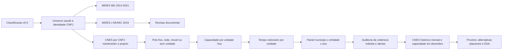

# Modelo Gravitacional De Saude - MG

Esta pasta prepara, fora do dashboard, o recorte de Minas Gerais definido na
reuniao de 27/08/2026. O objetivo e construir uma base defensavel antes de
estimar novos modelos.

## Leitura Rapida

| Necessidade | Arquivo |
|---|---|
| saber a ordem, o estado e o proximo marco | `PLANO_DE_TRABALHO.md` |
| obter uma visao geral das entregas | `README.md` |
| localizar scripts, fontes, links, extracoes e produtos | `DICIONARIO_TECNICO.md` |
| entender a evolucao dos passos com um caso real | `LINHA_DO_TEMPO_PASSOS.md` |
| defender uma decisao metodologica | `METODOLOGIA_GERAL.md` |
| consultar resultados ja validados | `checks/` |

O `PLANO_DE_TRABALHO.md` e a unica fonte para ordem e estado dos dez passos. O
dicionario tecnico e a referencia para a funcao de cada arquivo e a proveniencia
das fontes. O README resume; nao substitui nenhum dos dois.

## Entregas Tecnicas Concluidas

Esta tabela registra produtos ja construidos. Ela nao define a ordem nem o
estado do plano cientifico.

| Entrega tecnica | Estado do produto | Resultado principal |
|---|---|---|
| 1. Fechar universo de saude | Concluido | 100 CNPJs em 84 entidades; 66 observadas no MIDES |
| 2. Auditar vinculos | Concluido | 1.311 pares MIDES/MUNIC em 2019 e 50 divergencias revisadas |
| 3. Polo/rede direta | Produto direto validado; cobertura final em andamento | 670 unidades CNES por CNPJ mantenedor ou proprio; sede separada de oferta assistencial |
| 4. Construir capacidade | Concluido e reprocessado | 61 entidades com oferta fixa direta, 21 sem unidade direta e 2 somente moveis |
| 5. Integrar tempo rodoviario | Concluido e reprocessado | 853 origens, 389 unidades fixas e 61 entidades com tempo disponivel |
| 6. Grade analitica preliminar | Produto preliminar validado; painel final em andamento | 573.216 linhas; movimentos e universos preliminares separados |
| Complemento. Cobertura assistencial | Auditoria executada; pendencias documentais no passo 3 | 38 casos auditados, 15 recuperados por CNPJ proprio e 7 alertas decididos |
| Complemento. Temporalizar CNES | Concluido | 672 entidades-ano; 1.868 unidades-ano; 120 arquivos oficiais auditados |

Capacidade foi executada antes do tempo rodoviario. Calcular distancia ate uma
sede administrativa sem saber onde esta a oferta assistencial produziria uma
impedancia sem interpretacao substantiva.

### Antes E Depois Das Entregas Tecnicas

| Bloco | Antes | Agora |
|---|---|---|
| 1. Universo | 100 CNPJs de saude podiam representar matriz e filiais como instituicoes distintas | 84 entidades por raiz, com CNPJs originais preservados; o CISMEP ilustra a consolidacao da raiz `05802877` |
| 2. Vinculos | pagamento MIDES e declaracao MUNIC podiam ser confundidos com a mesma evidencia | 1.311 pares de 2019 separados em 630 comuns, 658 somente MIDES e 23 somente MUNIC; 50 divergencias receberam revisao |
| 3. Polo/rede | sede administrativa podia ser usada automaticamente como destino | 670 unidades diretamente vinculadas foram separadas em rede fixa, polo unico, movel ou sem unidade; a consulta por CNPJ proprio corrigiu 15 falsos negativos |
| 4. Capacidade | unidade CNES indicava localizacao, mas nao a oferta registrada | ficha, leitos, atendimento e CBOs foram medidos separadamente; CISMAS tem zero leito e 10 CBOs medicos somados |
| 5. Tempo | nao havia impedancia integrada e redes poderiam ser reduzidas a uma sede | 853 municipios foram ligados a 389 unidades fixas; redes preservam minimo, mediana e maximo |
| 6. Painel | pagamentos, identidade, tempo e capacidade estavam em tabelas distintas | grade `853 x 84 x 8`, com valor conservado, censura em 2014 e eventos financeiros explicitos |
| Complemento | 36 ausencias CNES e 2 casos moveis pareciam um unico tipo de lacuna | unidades por CNPJ proprio, redes contratadas, oferta movel, casos historicos e falta real de evidencia foram separados |
| Complemento temporal | capacidade de 2026 podia ser repetida nos oito anos | dezembro mede a capacidade anual e os 12 meses auditam presenca sem retroagir o cadastro atual |

## Fluxo Reprocessavel



## Como Navegar Nesta Pasta

O `README.md` e o ponto de entrada. Os arquivos foram separados por funcao:

| Local | Conteudo | Quando consultar |
|---|---|---|
| raiz da pasta | plano canonico, scripts e metodologia das entregas executadas | entender ou reprocessar o pipeline |
| `tests/` | uma validacao automatizada por script | confirmar chaves, contagens e invariantes |
| `checks/` | relatorios curtos com resultados validados | consultar numeros sem abrir os dados |
| `evidencias/` | catalogo versionado de fontes documentais | auditar decisoes humanas do passo 2 |
| `outputs/` | CSV/RDS derivados e caches locais | analisar linhas e continuar o modelo; nao entra no Git |

Cada passo deve ser lido na ordem: **script -> teste -> check -> secao
correspondente em `METODOLOGIA_GERAL.md`**.
Os dados brutos e processados das demais pastas do projeto permanecem
inalterados.

## Mapa De Scripts, Testes E Documentos

O numero do script e tecnico. O passo 2 usa dois scripts (`02` e `03`), por
isso os blocos cientificos 3 a 6 sao executados pelos scripts `04` a `07`.

| Arquivo | Papel | Entrada principal | Saida/checagem |
|---|---|---|---|
| `01_fechar_universo_saude_mg.R` | Seleciona saude e consolida matriz/filiais | classificacao v0.5, crosswalk nacional e MIDES MG | universo por CNPJ e por raiz |
| `02_cotejar_mides_munic_saude_2019.R` | Compara pagamento e declaracao em 2019 | Base 1, universo do passo 1 e cadastro | pares MIDES+MUNIC/somente fonte |
| `03_revisar_divergencias_documentais_2019.R` | Aplica evidencias aos 50 casos priorizados | amostra do passo 2 e catalogo versionado | cenarios estrito e ampliado |
| `04_definir_polos_atracao_saude.R` | Consulta estabelecimentos por CNPJ mantenedor e CNPJ proprio | universo do passo 1 e CNES | polo, rede, movel ou ancora de sede |
| `05_construir_capacidade_assistencial_saude.R` | Mede oferta atual diretamente vinculada | unidades do passo 3 e modulos CNES | capacidade por unidade e entidade |
| `06_integrar_tempo_rodoviario_saude.R` | Integra impedancia rodoviaria a oferta fixa | capacidade, mapa MG e Zenodo 11400243 | tempo por destino, unidade e entidade |
| `07_montar_painel_analitico_saude.R` | Materializa a grade longitudinal e seus eventos | MIDES, identidade, capacidade e tempo | painel completo, eventos e universos preliminares |
| `08_completar_cobertura_assistencial_saude.R` | Consolida CNES direto, redes indiretas e decisoes dos alertas | resultados dos passos 1, 3 e 4 e catalogos documentais | cobertura auditada das 84 entidades |
| `09_temporalizar_cnes_historico_saude.py` | Reconstroi presenca mensal e capacidade anual direta | arquivos DBC oficiais ST, LT, SR e PF | camada entidade-ano e unidade-ano 2014-2021 |
| `requirements_cnes_historico.txt` | Declara as duas dependencias Python do conversor DBC | Python, WSL e `curl` | ambiente reprodutivel para o passo 7 |
| `tests/01...09...` | Protege chaves, contagens e invariantes | respectivas saidas locais | falha explicita ou mensagem `OK` |
| `checks/*.md` | Guarda os resultados auditaveis | calculado pelos scripts | relatorio versionado no Git |
| `evidencias/catalogo_revisao_documental_2019.csv` | Preserva URL, ano e interpretacao documental | fontes oficiais/institucionais | rastreabilidade da revisao humana |
| `PLANO_DE_TRABALHO.md` | Define ordem, estado e proximo marco | dez passos cientificos | unica fonte de verdade do planejamento |
| `METODOLOGIA_GERAL.md` | Explica todo o percurso metodologico executado | entregas e complementos | fontes, regras, resultados, exemplos, limites e reproducao |
| `DICIONARIO_TECNICO.md` | Inventaria arquivos, fontes, links e datas | scripts e produtos | referencia de localizacao e reproducao |
| `LINHA_DO_TEMPO_PASSOS.md` | Mostra a evolucao com Igarape x CISMEP | entregas executadas | explicacao didatica ponta a ponta |

### Dicionario Por Passo

| Passo | Unidade/chave | Script | Produtos principais | Teste e relatorio |
|---|---|---|---|---|
| 1. Universo | entidade por raiz de oito digitos e CNPJ original | `01_fechar_universo_saude_mg.R` | `universo_saude_mg_entidades.rds`; `universo_saude_mg_estabelecimentos.rds` | `tests/01_validar_universo_saude_mg.R`; `checks/VALIDACAO_UNIVERSO_SAUDE_MG.md` |
| 2. Vinculos | municipio x entidade em 2019 | `02_cotejar_mides_munic_saude_2019.R` | `cotejamento_mides_munic_saude_mg_2019.rds`; divergencias e resumo | `tests/02_validar_cotejamento_mides_munic_saude_2019.R`; `checks/VALIDACAO_COTEJAMENTO_MIDES_MUNIC_SAUDE_2019.md` |
| 2. Revisao | par municipio x entidade priorizado | `03_revisar_divergencias_documentais_2019.R` | `revisao_documental_divergencias_saude_mg_2019.csv` | `tests/03_validar_revisao_documental_2019.R`; `checks/VALIDACAO_DOCUMENTAL_DIVERGENCIAS_2019.md` |
| 3. Polo/rede | entidade e unidade CNES | `04_definir_polos_atracao_saude.R` | `polos_atracao_saude_mg.rds`; `unidades_cnes_vinculadas_saude_mg.csv` | `tests/04_validar_polos_atracao_saude.R`; `checks/VALIDACAO_POLOS_ATRACAO_SAUDE_MG.md` |
| 4. Capacidade | unidade CNES e entidade agregada | `05_construir_capacidade_assistencial_saude.R` | `capacidade_unidades_cnes_saude_mg.csv`; `capacidade_entidades_saude_mg.rds` | `tests/05_validar_capacidade_assistencial_saude.R`; `checks/VALIDACAO_CAPACIDADE_ASSISTENCIAL_SAUDE_MG.md` |
| 5. Tempo | municipio x destino/unidade/entidade | `06_integrar_tempo_rodoviario_saude.R` | tres camadas `tempo_rodoviario_*` | `tests/06_validar_tempo_rodoviario_saude.R`; `checks/VALIDACAO_TEMPO_RODOVIARIO_SAUDE_MG.md` |
| 6. Painel | municipio x entidade x ano | `07_montar_painel_analitico_saude.R` | painel completo, eventos, pares e resumos | `tests/07_validar_painel_analitico_saude.R`; `checks/VALIDACAO_PAINEL_ANALITICO_SAUDE_MG.md` |
| Complemento. Cobertura | entidade | `08_completar_cobertura_assistencial_saude.R` | cobertura consolidada, 38 casos e 7 alertas | `tests/08_validar_cobertura_assistencial_saude.R`; `checks/VALIDACAO_COBERTURA_ASSISTENCIAL_COMPLEMENTAR_SAUDE_MG.md` |
| 7. CNES historico | entidade x ano e unidade x ano | `09_temporalizar_cnes_historico_saude.py` | presenca mensal; capacidade de dezembro; manifesto das fontes | `tests/09_validar_cnes_historico_saude.py`; `checks/VALIDACAO_CNES_HISTORICO_SAUDE_MG.md` |

`outputs/` contem derivados locais e cache, e esta fora do Git. Nada nessa
pasta altera MIDES, MUNIC, CNM, SICONFI ou o dashboard.

## Linhagem Das Fontes

| Fonte | Arquivo/URL usado | Etapa | Leitura correta |
|---|---|---|---|
| Classificacao v0.5 | `analises/classificacao_politicas/outputs/classificacao_areas_politica_mg_v0_5_completa.csv` | 1 | evidencia setorial, nao vinculo municipal |
| Identidade nacional | `analises/base_nacional/outputs/crosswalk_cnpj_matriz_filial_nacional.rds` | 1 | matriz/filial pela raiz de oito digitos |
| MIDES MG | `dados/processado/painel_mg_anual.rds` | 1 | pagamento positivo observado em 2014-2021 |
| Base 1 MIDES/MUNIC | `dashboards/base1_shiny/data/base_1_vinculos_2015_2019.rds` | 2 | pagamento e declaracao preservados separadamente |
| Cadastro processado | `dashboards/base1_shiny/data/cadastro_base.rds` | 2 | nomes e contexto documental |
| Catalogo de evidencias | `evidencias/catalogo_revisao_documental_2019.csv` | 2 | fonte, ano e alcance; fonte posterior nao retroage 2019 |
| CNES/DATASUS atual | https://cnes.datasus.gov.br/ e https://cnes2.datasus.gov.br/ | 3 e 4 | fotografia atual por CNPJ proprio e por CNPJ mantenedor |
| CNES/DATASUS historico | `ftp://ftp.datasus.gov.br/dissemin/publicos/CNES/200508_/Dados/` | 7 | competencias mensais ST e dezembro LT/SR/PF de 2014-2021 |
| Distbrasil/Zenodo | https://zenodo.org/records/11400243 | 5 | distancia e duracao OSRM entre sedes municipais, perfil automovel |

### Registro Das Extracoes

| Fonte | Como entrou no pipeline | Data/periodo representado | Limitacao que deve acompanhar o uso |
|---|---|---|---|
| Classificacao v0.5 | leitura do CSV local produzido pela trilha de classificacao | versao tecnica vigente em 03/09/2026 | classifica area; nao prova vinculo municipal |
| Crosswalk matriz/filial | leitura do RDS nacional, com raiz de oito digitos e CNPJ canonico | fotografia cadastral processada antes desta trilha | raiz comum aproxima identidade institucional, mas alertas permanecem auditaveis |
| MIDES MG | leitura do painel anual local e selecao de valor total positivo | 2014-2021 | evidencia pagamento, nao adesao juridica |
| MUNIC | leitura da Base 1 e preservacao da declaracao separada | 2019 | autodeclaracao pontual, nao painel anual |
| Evidencia documental | catalogo CSV com URL, titulo, ano e interpretacao | varia por documento | documento posterior nao e retroagido automaticamente a 2019 |
| CNES/DATASUS | requisicao HTTP publica por CNPJ proprio, CNPJ mantenedor e codigo CNES; cache local | fotografia coletada em 03/09/2026 | cadastro atual, nao capacidade historica de 2014-2021 |
| Distbrasil | download do RDS Zenodo, checksum MD5 e filtro dos pares de MG | publicado em 31/05/2024; sedes IBGE 2010 | tempo estatico, simetrico e sem transito por horario |

### Modulos CNES Consultados

| Modulo publico | Endpoint relativo | Campos aproveitados |
|---|---|---|
| Lista de mantidas | `Listar_Mantidas.asp?VCnpj=...&VEstado=31` | unidades diretamente registradas sob cada matriz/filial em MG |
| Busca por CNPJ proprio | `/services/estabelecimentos?cnpj=...&estado=31` | estabelecimentos cujo CNPJ proprio coincide com matriz/filial do consorcio |
| Ficha do estabelecimento | `Exibe_Ficha_Estabelecimento.asp?VCo_Unidade=...` | municipio, IBGE, UF, tipo e dependencia |
| Hospitalar | `Mod_Hospitalar.asp?VCo_Unidade=...` | leitos existentes e leitos SUS |
| Atendimento | `Mod_Bas_Atendimento.asp?VCo_Unidade=...` | ambulatorial, internacao e SADT SUS |
| Profissionais | `Mod_Profissional.asp?VCo_Unidade=...` | contagens de vinculos e CBOs SUS ativos |

Nomes e CNS de profissionais nao sao gravados. Somente contagens agregadas
permanecem no produto. O cache local preserva as respostas processadas, nao os
microdados nominais da pagina.

## Produtos Locais Principais

| Produto em `outputs/` | Unidade | Uso |
|---|---|---|
| `universo_saude_mg_entidades.rds` | raiz de CNPJ | universo canonico |
| `cotejamento_mides_munic_saude_mg_2019.rds` | municipio x raiz | evidencia financeira/declarada |
| `revisao_documental_divergencias_saude_mg_2019.csv` | par priorizado | decisao de sensibilidade |
| `polos_atracao_saude_mg.rds` | entidade | polo, rede, movel ou sede-ancora |
| `unidades_cnes_vinculadas_saude_mg.csv` | unidade CNES | localizacao e vinculo direto por CNPJ |
| `capacidade_unidades_cnes_saude_mg.csv` | unidade CNES | componentes atuais de oferta |
| `capacidade_entidades_saude_mg.rds` | entidade | agregacao apenas das unidades fixas diretas |
| `tempo_rodoviario_municipio_destino_saude_mg.rds` | municipio x municipio de oferta | grade municipal de 203.014 rotas |
| `tempo_rodoviario_municipio_unidade_saude_mg.rds` | municipio x unidade fixa | tempo preservado para 389 unidades |
| `tempo_rodoviario_municipio_entidade_saude_mg.rds` | municipio x entidade | minimo, mediana e maximo; `NA` sem destino fixo |
| `painel_analitico_saude_mg.rds` | municipio x entidade x ano | grade completa com zeros, eventos, tempo e capacidade |
| `painel_analitico_saude_mg_eventos.csv` | observacoes com presenca ou transicao | auditoria dos movimentos sem abrir a grade completa |
| `painel_analitico_saude_mg_resumo_par.rds` | municipio x entidade | trajetoria, valor e recorrencia do par |
| `DICIONARIO_PAINEL_ANALITICO_SAUDE_MG.csv` | variavel | definicoes das colunas centrais |
| `cobertura_assistencial_entidades_saude_mg.rds` | entidade | sintese final da cobertura direta, indireta, movel ou historica |
| `auditoria_38_casos_cobertura_assistencial_saude_mg.csv` | entidade originalmente pendente | antes/depois dos 36 sem unidade e 2 somente moveis |
| `auditoria_alertas_universo_saude_mg.csv` | alerta | decisao dos sete casos de escopo, situacao ou macrogrupo |

## Execucao Completa

Na raiz do repositorio:

```powershell
Rscript analises/modelo_gravitacional_saude/01_fechar_universo_saude_mg.R
Rscript analises/modelo_gravitacional_saude/tests/01_validar_universo_saude_mg.R
Rscript analises/modelo_gravitacional_saude/02_cotejar_mides_munic_saude_2019.R
Rscript analises/modelo_gravitacional_saude/tests/02_validar_cotejamento_mides_munic_saude_2019.R
Rscript analises/modelo_gravitacional_saude/03_revisar_divergencias_documentais_2019.R
Rscript analises/modelo_gravitacional_saude/tests/03_validar_revisao_documental_2019.R
Rscript analises/modelo_gravitacional_saude/04_definir_polos_atracao_saude.R
Rscript analises/modelo_gravitacional_saude/tests/04_validar_polos_atracao_saude.R
Rscript analises/modelo_gravitacional_saude/05_construir_capacidade_assistencial_saude.R
Rscript analises/modelo_gravitacional_saude/tests/05_validar_capacidade_assistencial_saude.R
Rscript analises/modelo_gravitacional_saude/06_integrar_tempo_rodoviario_saude.R
Rscript analises/modelo_gravitacional_saude/tests/06_validar_tempo_rodoviario_saude.R
Rscript analises/modelo_gravitacional_saude/07_montar_painel_analitico_saude.R
Rscript analises/modelo_gravitacional_saude/tests/07_validar_painel_analitico_saude.R
Rscript analises/modelo_gravitacional_saude/08_completar_cobertura_assistencial_saude.R
Rscript analises/modelo_gravitacional_saude/tests/08_validar_cobertura_assistencial_saude.R
python -m pip install -r analises/modelo_gravitacional_saude/requirements_cnes_historico.txt
python analises/modelo_gravitacional_saude/09_temporalizar_cnes_historico_saude.py
python analises/modelo_gravitacional_saude/tests/09_validar_cnes_historico_saude.py
```

## Resultado Metodologico Do Passo 4

- 670 unidades: 389 fixas e 281 moveis/itinerantes;
- 61 entidades com unidade fixa diretamente vinculada, 21 sem unidade sob o
  CNPJ e duas com somente unidades moveis;
- 58 das 61 entidades com oferta fixa possuem CBO medico SUS ativo no retrato;
- apenas uma entidade possui leitos SUS diretamente registrados.

Logo, leitos nao devem ser usados como massa unica. Quantidade de unidades,
CBOs medicos, atendimento ambulatorial e SADT devem ser testados separadamente.
Nao foi criado indice composto e ainda nao foi estimado modelo novo.

### Por Que Leitos SUS Nao Podem Ser A Massa Unica

Em uma formulacao gravitacional simples, a atracao do consorcio `j` teria um
termo proporcional a sua massa:

`atracao_ij proporcional a massa_j x impedancia(tempo_ij)`.

Se `massa_j = leitos_SUS_j`, 60 das 61 entidades com oferta fixa direta
receberiam massa zero. Isso produziria tres problemas:

1. CISMAS teria atracao zero apesar de possuir clinica fixa e 10 CBOs medicos
   SUS somados; CISMARPA teria o mesmo problema com 18 CBOs medicos;
2. somente o CISMEP, com 32 leitos SUS diretos, teria massa hospitalar positiva
   e dominaria artificialmente a comparacao;
3. usar `log(leitos_SUS)` seria indefinido para os zeros; usar
   `log(1 + leitos_SUS)` evitaria o erro numerico, mas ainda deixaria 45
   entidades indistinguiveis pela medida.

Zero leito significa **ausencia de leito no modulo hospitalar daquele CNPJ**,
nao ausencia de atendimento, profissionais ou servicos ambulatoriais. E as 21
entidades sem unidade diretamente registrada nem sequer recebem zero: ficam
`NA`, porque sua oferta pode estar em hospital municipal, contratado ou outro
CNPJ ainda nao documentado.

## Resultado Metodologico Do Passo 5

- os 363.378 pares entre municipios de MG existem na fonte, sem rota ausente;
- 853 municipios foram ligados a 238 municipios de oferta e 389 unidades;
- 61 entidades possuem tempo disponivel; 21 sem unidade direta e duas somente
  moveis permanecem com `NA`;
- a camada por unidade e a fonte principal; minimo, mediana e maximo por
  entidade sao medidas de sensibilidade;
- a duracao e estatica, simetrica e nao representa uma partida as 10h30 de
  sabado.

## Resultado Metodologico Do Passo 6

- 10.080 linhas MIDES de saude foram consolidadas em 10.059 observacoes
  municipio-entidade-ano; as 21 reducoes sao casos com matriz e filial na mesma
  combinacao;
- a grade completa possui 573.216 linhas: 853 municipios, 84 entidades e oito
  anos, com R$ 3.101.980.422,83 integralmente conservados;
- 2014 contem 1.192 estoques positivos, tratados como censurados a esquerda;
- depois de 2014 foram observados 426 primeiros pagamentos, 252 retornos, 8.188
  permanencias e 533 interrupcoes;
- 1.618 pares possuem algum pagamento e 329 apresentam mais de uma transicao;
- os marcadores de risco sao preliminares e nao convertem a grade estadual em
  conjunto final de alternativas.

## Cobertura Assistencial Complementar

- os 38 casos originalmente pendentes foram auditados;
- 15 entidades foram recuperadas pela busca oficial de CNPJ proprio no CNES;
- a cobertura fixa direta aumentou de 46 para 61 entidades;
- CISCEN e CIMES/CISNES possuem unidade movel e rede indireta documentada, mas
  continuam sem destino fixo unico;
- CISVALES, CISASF e CIAS possuem oferta/rede documentada, mas exigem desenho
  especifico de bases ou prestadores antes de receber tempo e capacidade;
- os sete alertas de escopo, situacao cadastral ou macrogrupo receberam uma
  decisao explicita, sem transformar pagamento historico em alternativa atual.

## Resultado Do Complemento Temporal CNES

- a fotografia atual deixou de ser a unica medida disponivel para 2014-2021;
- 96 arquivos `ST` mensais medem presenca e tipo da unidade ao longo do ano;
- 24 arquivos de dezembro (`LT`, `SR` e `PF`) medem leitos, servicos e
  profissionais na mesma competencia anual;
- a grade possui 672 entidades-ano e 1.868 unidades-ano observadas em dezembro;
- entidades com unidade fixa direta em dezembro passam de 40 em 2014 para 60
  em 2021; as unidades fixas passam de 48 para 68;
- em tres entidades-ano dezembro nao tinha unidade fixa, embora outro mes do
  mesmo ano tivesse; em 12 entidades-ano algum mes tinha mais unidades fixas
  que dezembro;
- capacidade permanece vazia quando nao ha unidade fixa em dezembro. Ausencia
  de linha nao foi convertida em zero assistencial.

Exemplo: a unidade CNES `6214371` do CISMARG aparece de janeiro a novembro de
2016, mas nao em dezembro. A medida principal de dezembro preserva apenas as
tres outras unidades fixas; a sensibilidade anual registra que quatro unidades
fixas apareceram em algum mes. Nenhuma das duas leituras e tratada como data
juridica de abertura ou fechamento.

## Limites E Proximo Passo

- o painel de 573.216 linhas ainda contem a fotografia CNES de 03/09/2026; a
  camada historica foi validada separadamente e ainda nao foi incorporada;
- CBO distinto por unidade e proxy cadastral, nao especialidade unica da rede;
- unidade de prefeitura ou terceiro nao entra sem evidencia documental;
- 23 entidades continuam sem estrutura fixa CNES direta; cinco possuem oferta
  ou rede
  assistencial documentada sem polo unico e as demais foram classificadas por
  situacao historica ou insuficiencia de evidencia;
- CIS/CEN e CIMES possuem somente unidades moveis e nao recebem polo fixo;
- o menor tempo ate uma rede pode apontar para unidade sem a especialidade
  relevante;
- a grade estadual ainda nao define o conjunto de escolha plausivel;
- populacao, RCL, regiao de saude, bacia e mandato ainda exigem fontes anuais
  validadas antes de integrar o painel.

O proximo passo e a EDA dos universos e a definicao do conjunto de alternativas
plausiveis por tempo, regiao de saude ou regra institucional. A EDA deve usar a
camada historica e comparar dezembro com a sensibilidade de qualquer mes.
Somente depois devem ser integrados os controles anuais e estimados os modelos.
