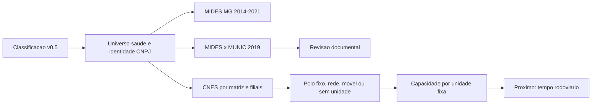

# Modelo Gravitacional De Saude - MG

Esta pasta prepara, fora do dashboard, o recorte de Minas Gerais definido na
reuniao de 27/08/2026. O objetivo e construir uma base defensavel antes de
calcular tempo rodoviario ou estimar novos modelos.

## Estado Dos Quatro Blocos

| Passo cientifico | Estado | Resultado principal |
|---|---|---|
| 1. Fechar universo de saude | Concluido | 100 CNPJs em 84 entidades; 66 observadas no MIDES |
| 2. Auditar vinculos | Concluido | 1.311 pares MIDES/MUNIC em 2019 e 50 divergencias revisadas |
| 3. Definir polo/rede | Concluido | 639 unidades CNES; sede separada de oferta assistencial |
| 4. Construir capacidade | Concluido | 46 entidades com oferta fixa direta, 36 sem unidade direta e 2 somente moveis |

Capacidade foi executada antes do tempo rodoviario. Calcular distancia ate uma
sede administrativa sem saber onde esta a oferta assistencial produziria uma
impedancia sem interpretacao substantiva.

## Fluxo Reprocessavel



## Mapa De Scripts, Testes E Documentos

O numero do script e tecnico. O passo 2 usa dois scripts (`02` e `03`), por
isso o quarto bloco cientifico e executado pelo script `05`.

| Arquivo | Papel | Entrada principal | Saida/checagem |
|---|---|---|---|
| `01_fechar_universo_saude_mg.R` | Seleciona saude e consolida matriz/filiais | classificacao v0.5, crosswalk nacional e MIDES MG | universo por CNPJ e por raiz |
| `02_cotejar_mides_munic_saude_2019.R` | Compara pagamento e declaracao em 2019 | Base 1, universo do passo 1 e cadastro | pares MIDES+MUNIC/somente fonte |
| `03_revisar_divergencias_documentais_2019.R` | Aplica evidencias aos 50 casos priorizados | amostra do passo 2 e catalogo versionado | cenarios estrito e ampliado |
| `04_definir_polos_atracao_saude.R` | Consulta estabelecimentos mantidos pelos CNPJs | universo do passo 1 e CNES | polo, rede, movel ou ancora de sede |
| `05_construir_capacidade_assistencial_saude.R` | Mede oferta atual diretamente vinculada | unidades do passo 3 e modulos CNES | capacidade por unidade e entidade |
| `tests/01...05...R` | Protege chaves, contagens e invariantes | respectivas saidas locais | falha explicita ou mensagem `OK` |
| `checks/*.md` | Guarda os resultados auditaveis | calculado pelos scripts | relatorio versionado no Git |
| `evidencias/catalogo_revisao_documental_2019.csv` | Preserva URL, ano e interpretacao documental | fontes oficiais/institucionais | rastreabilidade da revisao humana |
| `METODOLOGIA_PASSOS_1_2.md` | Explica universo e auditoria de vinculos | passos 1 e 2 | antes/depois, exemplos e limites |
| `METODOLOGIA_PASSO_3_POLO_ATRACAO.md` | Explica polo versus sede/rede | passo 3 | regras territoriais |
| `METODOLOGIA_PASSO_4_CAPACIDADE_ASSISTENCIAL.md` | Explica capacidade e EDA | passo 4 | medidas, resultados e limites |

`outputs/` contem derivados locais e cache, e esta fora do Git. Nada nessa
pasta altera MIDES, MUNIC, CNM, SICONFI ou o dashboard.

## Linhagem Das Fontes

| Fonte | Arquivo/URL usado | Etapa | Leitura correta |
|---|---|---|---|
| Classificacao v0.5 | `analises/classificacao_politicas/outputs/classificacao_areas_politica_mg_v0_5_completa.csv` | 1 | evidencia setorial, nao vinculo municipal |
| Identidade nacional | `analises/base_nacional/outputs/crosswalk_cnpj_matriz_filial_nacional.rds` | 1 | matriz/filial pela raiz de oito digitos |
| MIDES MG | `dados/processado/painel_mg_anual.rds` | 1 | pagamento positivo observado em 2014-2021 |
| Base 1 MIDES/MUNIC | `dashboards/base1_shiny/data/base_1_vinculos_2015_2019.rds` | 2 | pagamento e declaracao preservados separadamente |
| Cadastro processado | `dashboards/base1_shiny/data/cadastro_base.rds` | 2 | nomes e contexto documental |
| Catalogo de evidencias | `evidencias/catalogo_revisao_documental_2019.csv` | 2 | fonte, ano e alcance; fonte posterior nao retroage 2019 |
| CNES/DATASUS | https://cnes2.datasus.gov.br/ | 3 e 4 | fotografia atual de estabelecimentos sob o CNPJ mantenedor |

### Modulos CNES Consultados

| Modulo publico | Campos aproveitados |
|---|---|
| `Exibe_Ficha_Estabelecimento.asp` | municipio, IBGE, UF, tipo e dependencia |
| `Mod_Hospitalar.asp` | leitos existentes e leitos SUS |
| `Mod_Bas_Atendimento.asp` | ambulatorial, internacao e SADT SUS |
| `Mod_Profissional.asp` | contagens de vinculos e CBOs SUS ativos |

Nomes e CNS de profissionais nao sao gravados. Somente contagens agregadas
permanecem no produto. O cache local preserva as respostas processadas, nao os
microdados nominais da pagina.

## Produtos Locais Principais

| Produto em `outputs/` | Unidade | Uso |
|---|---|---|
| `universo_saude_mg_entidades.rds` | raiz de CNPJ | universo canonico |
| `cotejamento_mides_munic_saude_mg_2019.rds` | municipio x raiz | evidencia financeira/declarada |
| `revisao_documental_divergencias_saude_mg_2019.csv` | par priorizado | decisao de sensibilidade |
| `polos_atracao_saude_mg.rds` | entidade | polo, rede, movel ou sede-ancora |
| `unidades_cnes_vinculadas_saude_mg.csv` | unidade CNES | localizacao e vinculo direto por CNPJ |
| `capacidade_unidades_cnes_saude_mg.csv` | unidade CNES | componentes atuais de oferta |
| `capacidade_entidades_saude_mg.rds` | entidade | agregacao apenas das unidades fixas diretas |

## Execucao Completa

Na raiz do repositorio:

```powershell
Rscript analises/modelo_gravitacional_saude/01_fechar_universo_saude_mg.R
Rscript analises/modelo_gravitacional_saude/tests/01_validar_universo_saude_mg.R
Rscript analises/modelo_gravitacional_saude/02_cotejar_mides_munic_saude_2019.R
Rscript analises/modelo_gravitacional_saude/tests/02_validar_cotejamento_mides_munic_saude_2019.R
Rscript analises/modelo_gravitacional_saude/03_revisar_divergencias_documentais_2019.R
Rscript analises/modelo_gravitacional_saude/tests/03_validar_revisao_documental_2019.R
Rscript analises/modelo_gravitacional_saude/04_definir_polos_atracao_saude.R
Rscript analises/modelo_gravitacional_saude/tests/04_validar_polos_atracao_saude.R
Rscript analises/modelo_gravitacional_saude/05_construir_capacidade_assistencial_saude.R
Rscript analises/modelo_gravitacional_saude/tests/05_validar_capacidade_assistencial_saude.R
```

## Resultado Metodologico Do Passo 4

- 639 unidades: 366 fixas e 273 moveis/itinerantes;
- 46 entidades com unidade fixa diretamente mantida, 36 sem unidade sob o
  CNPJ e duas com somente unidades moveis;
- todas as 46 entidades com oferta fixa possuem CBO medico SUS ativo;
- apenas uma entidade possui leitos SUS diretamente registrados.

Logo, leitos nao devem ser usados como massa unica. Quantidade de unidades,
CBOs medicos, atendimento ambulatorial e SADT devem ser testados separadamente.
Nao foi criado indice composto e ainda nao foi estimado modelo novo.

## Limites E Proximo Passo

- CNES e fotografia de 03/09/2026; nao reconstroi automaticamente 2014-2021;
- CBO distinto por unidade e proxy cadastral, nao especialidade unica da rede;
- unidade de prefeitura ou terceiro nao entra sem evidencia documental;
- 36 entidades sem unidade direta precisam de auditoria de prestador/rede;
- CIS/CEN e CIMES possuem somente unidades moveis e nao recebem polo fixo.

O proximo passo e integrar tempo rodoviario entre cada municipio e as unidades
fixas documentadas. Para redes, a regra de distancia deve preservar as
unidades, em vez de usar automaticamente a sede administrativa.
