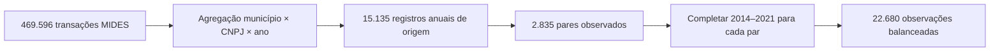
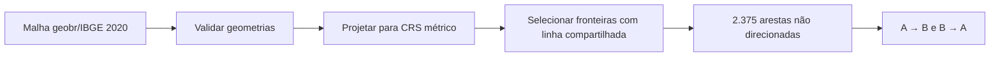
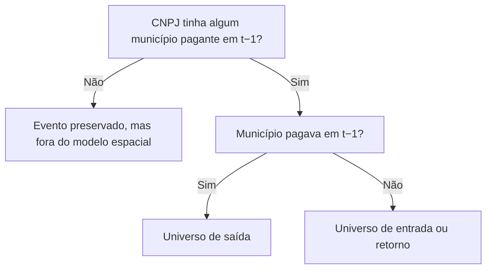
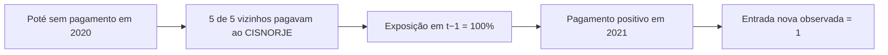

# Guia Para Entender E Explicar O Modelo De Movimentos Com Indicadores Espaciais

**Projeto:** Consórcios MG: Dados e Território

**Escopo:** Minas Gerais, 2014–2021

**Objetivo deste guia:** permitir explicar, com segurança, o que foi feito, como foi feito, quais resultados foram encontrados e quais conclusões ainda não podem ser tiradas.

---

## 1. Explicação Em Um Minuto

O estudo verifica se a configuração territorial dos pagamentos no ano anterior está associada ao início, retorno ou interrupção de pagamentos no ano seguinte.

Para cada combinação `município × CNPJ × ano`, observamos se houve valor positivo no MIDES. Depois calculamos quantos municípios vizinhos pagavam ao mesmo CNPJ no ano anterior. Com regressões logísticas, comparamos centenas de milhares de oportunidades de entrada e milhares de oportunidades de saída.

O resultado principal é:

- maior proporção de vizinhos com pagamento ao mesmo CNPJ está associada a mais entradas e retornos no ano seguinte;
- maior integração territorial está associada a menos interrupções de pagamento;
- a associação é forte e estável a regras alternativas de valor;
- isso **não prova adesão jurídica nem causalidade**.

> **Frase central:** o modelo explica movimentos financeiros observados no MIDES, não atos jurídicos de entrada ou saída de consórcios.

---

## 2. A Pergunta De Pesquisa

A pergunta é:

> A presença de municípios vizinhos com pagamento ao mesmo CNPJ em `t−1` está associada ao início, retorno ou interrupção de pagamento do município focal em `t`?

Exemplo intuitivo:

1. em 2020, um município ainda não pagava ao CNPJ de um consórcio;
2. vários de seus vizinhos já pagavam;
3. em 2021, o município começa a pagar;
4. o modelo compara esse caso com outros municípios que poderiam começar a pagar, mas não começaram.

A pergunta inversa também é testada:

> Um município que paga, mas está territorialmente isolado dos demais pagantes, tem maior chance de deixar de pagar no ano seguinte?

---

## 3. O Que As Palavras Significam

| Expressão | Significado neste estudo | O que não significa necessariamente |
|---|---|---|
| Presente | Pagamento MIDES positivo ao CNPJ naquele ano | Filiação jurídica confirmada |
| Entrada nova observada | Primeiro pagamento positivo do par na janela 2014–2021 | Adesão jurídica naquele ano |
| Retorno observado | Novo pagamento depois de pelo menos um ano sem pagamento | Readmissão formal |
| Permanência observada | Pagamento positivo em dois anos consecutivos | Continuidade jurídica comprovada |
| Saída observada | Ausência de pagamento depois de um ano positivo | Desligamento ou extinção |
| Par | Combinação única `município × CNPJ` | Um consórcio inteiro |
| Exposição | Uma oportunidade anual de ocorrer entrada ou saída | Um município único |

O mesmo par pode produzir várias exposições. Se Viçosa pagou ao CNPJ Alfa em 2018, 2019 e 2020, há oportunidades distintas de permanência ou saída em cada passagem anual.

> Nos scripts existe o nome técnico `membros_consorcio_t_1`. A interpretação correta é **número de municípios com pagamento ao CNPJ em `t−1`**, e não membros jurídicos confirmados.

---

## 4. De Onde Vieram Os Dados

### 4.1 Seleção dos CNPJs

O processo começou com **1.194 CNPJs do Cadastro IPEA de consórcios**. Esse cadastro delimitou quais credores seriam procurados no MIDES.

### 4.2 Consulta MIDES

Os pagamentos foram consultados na tabela `world_wb_mides.pagamento`, acessada pelo pacote Base dos Dados/BigQuery, com dois filtros:

```text
município pagador localizado em MG
E
CNPJ do credor pertencente aos 1.194 CNPJs do Cadastro IPEA
```

Resultado da consulta:

| Indicador | Resultado |
|---|---:|
| Linhas transacionais | 469.596 |
| CNPJs com pagamento de municípios mineiros | 161 |
| Período | 2014–2021 |

Portanto, os 161 CNPJs não representam todos os consórcios existentes. Eles são o subconjunto do cadastro encontrado nos pagamentos MIDES realizados por municípios de Minas Gerais.

Os valores anuais foram construídos com `valor_final`. O campo `indicador_restos_pagar` separou pagamento corrente de restos a pagar. O campo `valor_liquido_recebido` foi baixado na consulta original, mas não é a medida financeira usada neste painel.

### 4.3 Componentes usados no modelo

| Componente | Uso |
|---|---|
| MIDES | Valores e presença anual por município e CNPJ |
| Lookup municipal | Padronização do código IBGE e nome do município |
| Malha geobr/IBGE 2020 | Construção das fronteiras municipais |
| Cadastro IPEA | Seleção anterior dos CNPJs pesquisados no MIDES |

### 4.4 O que não entra como explicação no modelo atual

- MUNIC;
- SICONFI;
- CNM;
- classificação por política pública;
- população, renda ou PIB;
- capacidade fiscal;
- partido ou mandato municipal;
- região de saúde ou bacia hidrográfica;
- distância à sede do consórcio.

Esses elementos podem ser incorporados em versões futuras, mas não explicam os resultados atuais.

---

## 5. Como O Painel Anual Foi Construído

### Etapa 1 — agregação

As transações MIDES foram agregadas por:

$$
\text{município} \times \text{CNPJ} \times \text{ano}
$$

Para cada linha anual:

$$
\text{valor total} = \text{valor corrente} + \text{restos a pagar}
$$

Também foram preservados o número de transações, o indicador de pagamento corrente e o nome declarado do credor.

### Etapa 2 — pares observados

Foram identificados **2.835 pares município–CNPJ** que apareceram ao menos uma vez no MIDES.

### Etapa 3 — balanceamento dos anos

Cada par recebeu uma linha para os oito anos:

$$
2.835 \text{ pares} \times 8 \text{ anos} = 22.680 \text{ observações}
$$

Quando não existia registro em determinado ano, foi criada uma linha com valor zero. O balanceamento permite distinguir ausência, entrada, permanência, saída e retorno.



---

## 6. Regra De Presença E Movimentos

### 6.1 Regra principal

$$
Presente_{i,c,t} =
\begin{cases}
1, & \text{se } valor\_total_{i,c,t} > 0 \\
0, & \text{caso contrário}
\end{cases}
$$

Onde:

- $i$ é o município;
- $c$ é o CNPJ;
- $t$ é o ano.

### 6.2 Classificação temporal

| Situação | Sequência simplificada | Evento em `t` |
|---|---|---|
| Primeiro ano da janela com pagamento | 2014: `1` | Base inicial |
| Nunca havia pago e passa a pagar | `0 → 1` | Entrada nova observada |
| Pagava e continua pagando | `1 → 1` | Permanência observada |
| Pagava e deixa de pagar | `1 → 0` | Saída observada |
| Já pagou, ficou ausente e volta | `1 → 0 → 1` | Retorno observado |
| Continua sem pagar | `0 → 0` | Ausência |

2014 não é tratado como entrada porque não há 2013 para comparação.

### 6.3 Recorrência

$$
n_{\text{transições}} = n_{\text{entradas e retornos}} + n_{\text{saídas}}
$$

Um par é recorrente quando possui duas ou mais transições. Foram encontrados **673 pares recorrentes**.

### 6.4 Sensibilidades

Os modelos principais de proporção para entrada/retorno e saída foram reestimados com quatro regras:

| Regra | Presença anual |
|---|---|
| Principal | `valor_total > 0` |
| Sem restos isolados | `valor_corrente > 0` |
| Piso de R$ 100 | `valor_total >= 100` |
| Piso de R$ 1.000 | `valor_total >= 1.000` |

Essas alternativas testam se restos a pagar ou valores residuais criam artificialmente a associação.

---

## 7. Como A Vizinhança Foi Construída

A malha municipal completa de 2020 foi obtida pelo `geobr`, com origem no IBGE, e transformada para um sistema métrico.

Dois municípios são considerados vizinhos somente quando compartilham uma **linha de fronteira com comprimento positivo**. Um contato apenas pelo canto não conta.

A regra topológica utilizada foi:

```text
DE-9IM: F***1****
```

Resultado:

- 853 municípios com pelo menos um vizinho;
- 2.375 fronteiras não direcionadas;
- cada fronteira foi convertida em duas direções para calcular os indicadores de cada município.



---

## 8. Indicadores Espaciais

Suponha que o município focal tenha cinco vizinhos e que dois pagavam ao mesmo CNPJ no ano anterior.

$$
n_{\text{vizinhos}} = 5
$$

$$
n_{\text{vizinhos pagantes}} = 2
$$

$$
n_{\text{vizinhos não pagantes}} = 5 - 2 = 3
$$

$$
p_{t-1} = \frac{2}{5} = 0{,}40 = 40\%
$$

### Quatro indicadores principais

| Indicador | Definição correta |
|---|---|
| Proporção de vizinhos no mesmo CNPJ | Parcela dos vizinhos que pagava ao CNPJ em `t−1` |
| Candidato externo adjacente | Não pagava em `t−1`, mas tinha ao menos um vizinho pagante |
| Participante isolado | Pagava em `t−1`, mas nenhum vizinho pagava ao mesmo CNPJ |
| Participante na borda | Pagava em `t−1` e tinha pelo menos um vizinho que não pagava |

Também foram calculados números de vizinhos e comprimentos de divisa. Eles permanecem na base técnica, mas não entram simultaneamente no modelo principal para evitar redundância.

### Por que usar `t−1`?

Para explicar um evento em 2021, utilizamos a configuração territorial de 2020:

$$
\text{exposição espacial em 2020} \longrightarrow \text{evento em 2021}
$$

Isso evita usar uma informação que já contém o próprio resultado.

---

## 9. Universos De Risco

Não devemos misturar todas as linhas. Cada modelo precisa conter apenas observações que poderiam experimentar o evento.

### 9.1 Risco de saída

Para poder deixar de pagar em `t`, o par precisava pagar em `t−1`.

$$
Y^{saída}_{i,c,t} =
\begin{cases}
1, & Presente_{i,c,t-1}=1 \text{ e } Presente_{i,c,t}=0 \\
0, & Presente_{i,c,t-1}=1 \text{ e } Presente_{i,c,t}=1
\end{cases}
$$

| Universo | Exposições | Eventos | Taxa |
|---|---:|---:|---:|
| Saída | 12.842 | 966 | 7,52% |

### 9.2 Risco de entrada ou retorno

Para cada CNPJ com pelo menos um município pagante em `t−1`:

1. combinamos o CNPJ com os 853 municípios de Minas Gerais;
2. retiramos os que já pagavam em `t−1`;
3. observamos quem passa a pagar em `t`;
4. calculamos sua exposição aos vizinhos pagantes em `t−1`.

$$
Y^{entrada}_{i,c,t} =
\begin{cases}
1, & Presente_{i,c,t-1}=0 \text{ e } Presente_{i,c,t}=1 \\
0, & Presente_{i,c,t-1}=0 \text{ e } Presente_{i,c,t}=0
\end{cases}
$$

| Universo | Exposições | Eventos | Taxa |
|---|---:|---:|---:|
| Entrada ou retorno | 742.916 | 1.395 | 0,188% |
| Entrada nova | 741.040 | 990 | 0,134% |
| Retorno | 1.876 | 405 | 21,6% |

### 9.3 Eventos fora do modelo espacial

O painel registrou 1.813 entradas ou retornos. Destes, 418 ocorreram quando o CNPJ inteiro não tinha município pagante em `t−1`:

| Motivo | Eventos |
|---|---:|
| Primeiro aparecimento do CNPJ na janela | 387 |
| Reaparecimento depois de um ano sem qualquer pagante | 31 |
| **Total fora do modelo espacial** | **418** |

Sem território observado no ano anterior, não existe exposição interna do CNPJ a medir.

$$
1.395 \text{ modelados} + 418 \text{ documentados fora} = 1.813
$$



---

## 10. O Modelo Estatístico

Foi utilizada regressão logística porque o resultado é binário: ocorreu ou não ocorreu.

> Este é um modelo logístico **com indicadores construídos espacialmente**. Ele ainda não é um modelo econométrico espacial de autocorrelação, como SAR ou CAR.

### Especificação principal

$$
\operatorname{logit}\left[P(Y_{i,c,t}=1)\right] =
\beta_0 +
\beta_1 p_{i,c,t-1} +
\beta_2 \log(1+M_{c,t-1}) +
\beta_3 V_i +
\gamma_t
$$

Onde:

| Símbolo | Significado |
|---|---|
| $Y_{i,c,t}$ | Entrada, retorno ou saída observada |
| $p_{i,c,t-1}$ | Proporção de vizinhos com pagamento ao CNPJ em `t−1` |
| $M_{c,t-1}$ | Número de municípios pagantes ao CNPJ em `t−1` |
| $V_i$ | Número total de vizinhos do município |
| $\gamma_t$ | Efeitos fixos de ano |

Em linguagem de código:

```text
evento em t ~ proporção de vizinhos pagantes em t−1
              + log(1 + pagantes do CNPJ em t−1)
              + total de vizinhos do município
              + efeitos fixos de ano
```

### Por que entram os controles?

- **Tamanho anterior do CNPJ:** CNPJs com muitos municípios pagantes possuem mais oportunidades de expansão e permanência.
- **Total de vizinhos:** municípios com muitos vizinhos têm mais oportunidades de contato territorial.
- **Ano:** absorve choques gerais compartilhados, como mudanças econômicas, administrativas ou de cobertura.

### Erros-padrão

As observações se repetem por município e por CNPJ. Por isso, os erros-padrão foram agrupados nas duas dimensões:

```text
cluster 1: município
cluster 2: CNPJ
```

O agrupamento altera a incerteza e os intervalos de confiança, não os coeficientes estimados.

### Hipótese funcional importante

O modelo principal trata a proporção como linear na escala logit. Assim, supõe o mesmo multiplicador de odds para cada acréscimo de 10 pontos percentuais. O gradiente descritivo apoia a direção dessa relação, mas versões futuras devem testar categorias ou splines.

---

## 11. Como Interpretar Odds E Odds Ratio

### Odds

Se a probabilidade é $p$:

$$
odds = \frac{p}{1-p}
$$

Se $p=20\%$:

$$
odds = \frac{0{,}20}{0{,}80} = 0{,}25
$$

### Odds ratio

O odds ratio compara duas odds:

$$
OR = \frac{odds_{exposto}}{odds_{referência}}
$$

| OR | Leitura |
|---:|---|
| 1 | Sem diferença nas odds |
| Maior que 1 | Odds maiores |
| Menor que 1 | Odds menores |

O efeito da proporção foi apresentado para **10 pontos percentuais**:

$$
OR_{+10\,\mathrm{p.p.}} = e^{0{,}1\beta_1}
$$

### Exemplo: OR = 2,22

Mantidos os controles constantes, passar de 20% para 30% de vizinhos pagantes multiplica as odds estimadas de entrada ou retorno por 2,22.

Isso não significa aumentar a probabilidade em 122 pontos percentuais.

Se a probabilidade inicial fosse 1%:

$$
odds_0 = \frac{0{,}01}{0{,}99} = 0{,}0101
$$

$$
odds_1 = 2{,}22 \times 0{,}0101 = 0{,}0224
$$

$$
p_1 = \frac{0{,}0224}{1+0{,}0224} \approx 2{,}19\%
$$

Esse exemplo é ilustrativo. A mudança real em probabilidade depende do ponto inicial e dos demais controles.

---

## 12. Resultados

### 12.1 Resultados ajustados

| Modelo | OR | IC 95% | Leitura correta |
|---|---:|---:|---|
| Entrada ou retorno: +10 p.p. | 2,22 | 2,11–2,34 | Odds aproximadamente 2,2 vezes maiores |
| Entrada nova: +10 p.p. | 2,20 | 2,09–2,31 | Associação muito forte no primeiro pagamento observado |
| Retorno: +10 p.p. | 1,26 | 1,17–1,35 | Associação positiva, mas menor |
| Saída: +10 p.p. | 0,79 | 0,76–0,83 | Redução aproximada de 21% nas odds de saída |
| Candidato externo adjacente | 130,17 | 94,34–179,61 | Contraste extremo com o grande universo sem vizinho pagante |
| Participante isolado | 3,98 | 2,90–5,46 | Odds de saída quase quatro vezes maiores |
| Participante na borda | 2,97 | 1,91–4,61 | Odds maiores que no grupo totalmente cercado por pagantes |

### 12.2 Gradiente descritivo

| Proporção de vizinhos pagantes | Taxa de entrada/retorno | Taxa de saída |
|---|---:|---:|
| 0% | 0,05% | 24,39% |
| Até 20% | 2,35% | 13,70% |
| 20–40% | 4,87% | 9,22% |
| 40–60% | 11,33% | 7,41% |
| 60–80% | 17,94% | 4,92% |
| Acima de 80% | 29,33% | 3,05% |

O padrão é monotônico: conforme cresce a integração territorial, entradas aumentam e saídas diminuem.

### 12.3 Por que o OR de adjacência é tão alto?

| Grupo | Exposições | Eventos | Taxa |
|---|---:|---:|---:|
| Sem vizinho pagante | 724.512 | 335 | 0,046% |
| Com vizinho pagante | 18.404 | 1.060 | 5,76% |

O risco bruto é aproximadamente 125 vezes maior. O odds ratio bruto é próximo de 132, e o OR ajustado é 130,17.

O contraste é elevado porque o grupo sem vizinho contém centenas de milhares de combinações município–CNPJ, inclusive municípios muito distantes do território observado. A adjacência também representa proximidade funcional, institucional e regional; não deve ser interpretada como causa isolada.

### 12.4 Robustez da regra de presença

| Regra | OR entrada +10 p.p. | OR saída +10 p.p. |
|---|---:|---:|
| Total positivo | 2,22 | 0,79 |
| Somente corrente positivo | 2,23 | 0,80 |
| Total mínimo de R$ 100 | 2,22 | 0,79 |
| Total mínimo de R$ 1.000 | 2,24 | 0,80 |

Os resultados praticamente não mudam. Isso reduz a preocupação de que restos a pagar ou valores pequenos sejam os únicos responsáveis pelo padrão.

---

## 13. Exemplo Real: Poté × CISNORJE × 2021

**CNPJ:** 13.220.150/0001-52

**Resultado observado:** primeiro pagamento do par em 2021

**Valor corrente:** R$ 27.210,15

**Restos a pagar:** R$ 0

### Sequência do par

| Ano | 2014 | 2015 | 2016 | 2017 | 2018 | 2019 | 2020 | 2021 |
|---|---:|---:|---:|---:|---:|---:|---:|---:|
| Pagamento positivo | Não | Não | Não | Não | Não | Não | Não | Sim |

Como 2021 é o primeiro ano positivo, o evento é `entrada_nova_observada`.

### Vizinhança em 2020

Poté possui cinco vizinhos. Todos já pagavam ao CISNORJE em 2020:

| Vizinho | Pagava em 2020? |
|---|---|
| Franciscópolis | Sim |
| Itambacuri | Sim |
| Ladainha | Sim |
| Malacacheta | Sim |
| Teófilo Otoni | Sim |

Logo:

$$
p_{2020} = \frac{5}{5} = 1 = 100\%
$$

O CISNORJE possuía 60 municípios pagantes em 2020. A linha de Poté que entra no modelo é:

| Ano `t` | Resultado | Pagantes do CNPJ em `t−1` | Vizinhos | Vizinhos pagantes | Proporção |
|---:|---|---:|---:|---:|---:|
| 2021 | `entrada_nova = 1` | 60 | 5 | 5 | 1,00 |



Esse caso é compatível com expansão territorial, mas sozinho não prova que os vizinhos causaram o pagamento. O coeficiente é estimado pela comparação de Poté com todas as demais exposições elegíveis.

---

## 14. O Que Foi Validado

- nenhuma duplicata nas chaves dos universos;
- 22.680 linhas, 2.835 pares, 853 municípios, 161 CNPJs e oito anos;
- nenhum valor negativo e nenhuma perda financeira na materialização;
- todos os 853 municípios possuem ao menos um vizinho;
- as 966 saídas foram integralmente recompostas;
- 1.395 eventos modelados mais 418 fora do risco recompõem os 1.813 movimentos;
- 500 exposições espaciais foram recalculadas independentemente, sem divergência;
- os modelos convergiram;
- os sinais permaneceram nas quatro regras de presença.

Alertas encontrados:

| Alerta | Resultado |
|---|---:|
| Presenças somente por restos a pagar | 252 |
| Entradas/retornos somente por restos | 62 |
| Valores positivos abaixo de R$ 100 | 13 |
| Valores positivos abaixo de R$ 1.000 | 184 |
| Raízes com vários CNPJs observados | 5 |
| Transições nessas raízes | 180 |
| Possíveis trocas internas de CNPJ | 25 |
| CNPJs com múltiplas grafias no MIDES | 150 de 161 |

---

## 15. Limitações Que Precisam Ser Ditas

1. **Pagamento não é vínculo jurídico.** Ausência pode representar atraso, erro, contrato sem desembolso ou mudança contábil.
2. **Matriz e filial continuam separadas.** Trocas internas podem criar movimentos artificiais.
3. **O universo de entrada é muito amplo.** Todos os municípios mineiros são candidatos para cada CNPJ ativo, inclusive municípios distantes.
4. **Faltam controles substantivos.** População, capacidade fiscal, política, setor e regiões institucionais podem explicar parte da associação.
5. **Não há controle espacial residual.** Erros agrupados por município e CNPJ não equivalem a modelar autocorrelação espacial.
6. **A relação contínua impõe linearidade no logit.** Categorias e splines ainda devem ser testadas.
7. **Há censura temporal.** 2014 não revela o passado e 2021 não permite observar retornos posteriores.
8. **Entrada é evento raro.** A taxa geral é 0,188%; OR elevado não significa probabilidade elevada para todos.
9. **O modelo é associativo, não preditivo.** Ainda não há PR-AUC, calibração, validação temporal ou teste fora da amostra.
10. **O modelo não é causal.** Proximidade pode representar fatores regionais, fiscais, políticos e institucionais não observados.

---

## 16. Perguntas Prováveis E Respostas

### “Vocês estão medindo entrada formal no consórcio?”

Não. Medimos o primeiro pagamento positivo observado na janela MIDES. A linguagem formal é “entrada financeira observada”.

### “Por que usar o CNPJ e não o nome?”

Porque 150 dos 161 CNPJs aparecem com mais de uma grafia no MIDES. O nome é campo de exibição e auditoria; a chave é o CNPJ.

Na rotina atual, o nome de exibição é derivado do próprio MIDES. A adoção do nome jurídico canônico do cadastro ainda é um refinamento possível.

### “Por que o cadastro IPEA importa?”

Porque os 1.194 CNPJs do cadastro foram usados para filtrar os credores pesquisados no MIDES. O modelo não procura qualquer fornecedor municipal.

### “Por que usar o ano anterior?”

Para que a exposição territorial exista antes do evento. Usar o mesmo ano incorporaria o resultado à variável explicativa.

### “Por que comparar com todos os municípios de MG?”

Para criar um grupo com exposição zero e identificar quem poderia começar a pagar. É uma escolha ampla e exploratória; análises futuras devem testar universos mais plausíveis por distância, região ou setor.

### “OR 2,22 significa que a probabilidade dobrou?”

Não necessariamente. Significa que as odds foram multiplicadas por 2,22. A mudança em probabilidade depende da probabilidade inicial.

### “OR 130 significa que fronteira causa entrada?”

Não. O contraste é muito alto porque a entrada quase nunca ocorre no enorme grupo sem vizinho pagante. Adjacência também resume proximidade regional e institucional não observada.

### “O resultado é estatisticamente significativo?”

Os intervalos de confiança não cruzam 1 nas especificações apresentadas. Isso indica precisão estatística dentro do modelo, mas não elimina viés de variável omitida nem prova causalidade.

### “O modelo prevê quem vai entrar?”

Ainda não. O objetivo atual é associação. Não foram feitos treino/teste, PR-AUC, calibração ou validação fora da amostra.

### “O que os testes de R$ 100 e R$ 1.000 provam?”

Mostram que pagamentos muito pequenos e restos isolados não parecem ser os únicos responsáveis pela associação. Eles não resolvem outras limitações.

### “É realmente um modelo espacial?”

Ele usa variáveis espaciais de vizinhança em uma regressão logística. Ainda não modela diretamente dependência espacial dos resíduos.

### “Qual é o próximo avanço metodológico?”

Adicionar controles municipais e setoriais, testar universos territoriais alternativos, resolver matriz/filial, avaliar não linearidade e estimar probabilidades ajustadas.

---

## 17. Roteiro Para Explicar Em Cinco Minutos

1. **Problema:** queremos saber se a estrutura territorial anterior está associada aos movimentos financeiros posteriores.
2. **Cuidado:** MIDES observa pagamentos, não adesões jurídicas.
3. **Dados:** 1.194 CNPJs do cadastro foram pesquisados; 161 apareceram em pagamentos de MG entre 2014 e 2021.
4. **Unidade:** município × CNPJ × ano; 2.835 pares balanceados em 22.680 linhas.
5. **Espaço:** malha IBGE/geobr com 2.375 fronteiras; medimos a proporção de vizinhos pagantes em `t−1`.
6. **Risco:** não pagantes entram no universo de entrada; pagantes entram no universo de saída.
7. **Modelo:** regressão logística com tamanho do CNPJ, total de vizinhos e efeitos de ano; erros agrupados por município e CNPJ.
8. **Resultado:** +10 p.p. de vizinhos pagantes está associado a OR 2,22 para entrada/retorno e OR 0,79 para saída.
9. **Robustez:** os resultados permanecem ao retirar restos isolados e pagamentos pequenos.
10. **Conclusão:** associação territorial forte e monotônica, mas ainda não causal.

---

## 18. Decisões Para Alinhar Na Reunião

- Aprovar a expressão “movimento financeiro observado” como padrão.
- Decidir se matriz e filiais devem ser consolidadas antes da próxima estimação.
- Definir os primeiros controles: população, capacidade fiscal, política pública e ciclo municipal.
- Decidir se o universo de entrada deve permanecer estadual ou ser restringido por distância/região.
- Aprovar o teste de não linearidade por faixas ou splines.
- Definir se a próxima entrega será explicativa ou também preditiva.

---

## 19. Arquivos Que Sustentam O Guia

| Arquivo | Papel |
|---|---|
| [`scripts/01_baixar_mides_mg.R`](../scripts/01_baixar_mides_mg.R) | Consulta MIDES filtrada pelos CNPJs do cadastro |
| [`scripts/02_painel_participacao.R`](../scripts/02_painel_participacao.R) | Agregação anual dos pagamentos |
| [`01_materializar_movimentos_mides.R`](../analises/movimentos_espaciais/01_materializar_movimentos_mides.R) | Painel balanceado e movimentos |
| [`02_features_espaciais_fronteira.R`](../analises/movimentos_espaciais/02_features_espaciais_fronteira.R) | Vizinhança e indicadores espaciais |
| [`05_modelar_riscos_entrada_saida.R`](../analises/movimentos_espaciais/05_modelar_riscos_entrada_saida.R) | Universos de risco e regressões |
| [`06_validar_modelos_risco.R`](../analises/movimentos_espaciais/tests/06_validar_modelos_risco.R) | Validações automatizadas |
| [`METODOLOGIA_MODELOS_RISCO.md`](../analises/movimentos_espaciais/METODOLOGIA_MODELOS_RISCO.md) | Metodologia técnica resumida |
| [`RESULTADOS_MODELOS_RISCO.md`](../analises/movimentos_espaciais/RESULTADOS_MODELOS_RISCO.md) | Resultados consolidados |

---

## 20. Conclusão Que Pode Ser Defendida

> Existe uma associação espacial forte, monotônica e robusta entre a configuração territorial anterior dos pagamentos e os movimentos financeiros posteriores observados no MIDES. Municípios com maior proporção de vizinhos que pagavam ao mesmo CNPJ apresentam odds maiores de iniciar ou retomar pagamentos e odds menores de interrompê-los no ano seguinte.

E a ressalva obrigatória:

> O resultado é compatível com processos de difusão ou integração territorial, mas não demonstra adesão jurídica nem causalidade. A próxima etapa deve incorporar controles substantivos, resolver matriz/filial e testar universos territoriais e formas funcionais alternativas.
